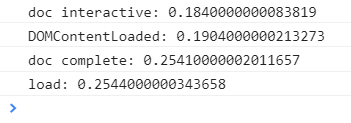
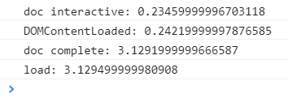
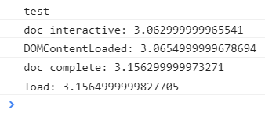
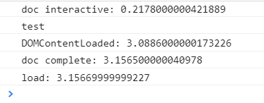
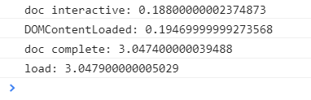

> `window.onload` 和 `DOMContentLoaded` 有什么区别?

作为一个常见的面试题, 这个问题可以说已经讨论烂了吧. 大概 99% 的人都会告诉我说, `window.onload` 要等所有资源都加载完才触发, 而 `DOMContentLoaded` 只需要在 DOM 树构建完就可以触发.

那么, **`DOMContentLoaded` 真的是在 DOM 树构建完成时触发吗?** 很难去考究它们的来源, 不过即使是通过肉眼也能看出 `DOMContentLoaded` 触发的时候页面上其他资源(比如图片)可能还没加载完, 而 `window.onload` 触发的时候, 页面是肯定已经完全渲染好了的. 从这个角度来说, 做出这样的推论也没什么毛病, 是很符合观察所得的.

而这一结论也一直记在我脑海未曾怀疑过. 今天无意中翻笔记, 发现以前记了个 `document.readyState`, 配合 `document.onreadystatechange` 事件使用. emmm...既然这样, 那就抽点时间把它们几个整理下写篇博客好了, 于是有了现在这篇.

让我们先来看看 `document.readyState` 吧.

作为一个属性, 它有三个值

* `loading` 毫无疑问, 表示 HTML 文档还在加载中
* `interactive` 字面意思可交互, 描述此值是表示当文档完成加载并且已经被解析, 但是其他资源比如图片, CSS 和 iframe 仍在加载(The document has finished loading and the document has been parsed but sub-resources such as images, stylesheets and frames are still loading.)
* `complete` 文档以及所有其他资源都完成加载, 关于这个值, 有人说在 Android 上是 `loaded`, 有待验证

再让我们看看 `DOMContentLoaded` 的说明.

> The DOMContentLoaded event is fired when the initial HTML document has been completely loaded and parsed, without waiting for stylesheets, images, and subframes to finish loading.

`DOMContentLoaded` 事件在 HTML 文档完全加载并解析之后触发, 不需要等待 CSS 图片和 iframe 加载完成.

而 `load` 事件的描述.

> The load event is fired when a resource and its dependent resources have finished loading.

那么问题来了, **`document.readyState` 的 `interactive` 和 `DOMContentLoaded` 有什么区别? `complete` 和 `load` 又有什么区别?**

MDN 上有如下一段代码.

```javascript
// alternative to DOMContentLoaded
document.onreadystatechange = function () {
    if (document.readyState === "interactive") {
        initApplication();
    }
}
```

说 `interactive` 可以用 `DOMContentLoaded` 替代, 真的是这样吗?

还是看 [demo](https://github.com/ta7sudan/front-end-demo/blob/master/js/script-loading/demo0.html) 吧.

```html
<!DOCTYPE html>
<html lang="en">
<head>
	<meta charset="UTF-8">
	<meta name="viewport" content="width=device-width, initial-scale=1.0">
	<meta http-equiv="X-UA-Compatible" content="ie=edge">
	<title>Document</title>
	<script>
		window.addEventListener('DOMContentLoaded', function (e) {
			console.log(`DOMContentLoaded: ${performance.now()/1000}`);
		});
		window.addEventListener('load', function (e) {
			console.log(`load: ${performance.now()/1000}`);
		});
		document.addEventListener('readystatechange', function (e) {
			if (document.readyState === 'interactive') {
				console.log(`doc interactive: ${performance.now()/1000}`);
			} else if (document.readyState === 'complete') {
				console.log(`doc complete: ${performance.now()/1000}`);
			}
		});
	</script>
</head>
<body>
	<div class="main">test</div>
	<!--  -->
	<!-- <script src="http://127.0.0.1:3000/js0-delay-3000"></script> -->
	<!-- <script src="http://127.0.0.1:3000/js0-delay-3000" defer></script> -->
	<!-- <link rel="stylesheet" href="http://127.0.0.1:3000/css-delay-3000" type="text/css"> -->
</body>
</html>
```

里面我们有四个被注释掉的资源, 其中每个资源都有 3s 的加载延迟. 接着我们分别测试每个资源出现的情况.

**没有外部资源**



页面立即渲染, 可以看到 `interactive` 最先, 其次是 `DOMContentLoaded`, 再次是 `complete`, 最后是 `load`.


**延迟 3s 的 ``**



页面文字立即渲染, 图片延迟 3s 渲染. 顺序依然一样, 不过 `interactive` 和 `DOMContentLoaded` 最先执行, 3s 后 `complete` 和 `load` 依次执行, 也符合我们的认知.


**延迟 3s 的 `<script>`**



文字立即渲染. 所有事件都延迟了 3s 才触发, 因为 `<script>` 是阻塞 DOM 树构建的, 从这个角度来看, `interactive` 和 `DOMContentLoaded` 都是在 DOM 树构建之后触发的.


**延迟 3s defer 的 `<script>`**



文字立即渲染. 不过这就很诡异了, `interactive` 没有延迟就触发了, 而 `DOMContentLoaded` 却等待脚本 3s 后加载完成并且执行完之后才触发. 讲道理 defer 的 `<script>` 可是不阻塞 DOM 树构建的(实测也不阻塞), 如果说 `DOMContentLoaded` 是在 DOM 树构建完就触发, 那应该和 `interactive` 一致. 所以是为什么呢? 

具体过程比较复杂, 可以参考[标准文档](https://www.w3.org/TR/html5/syntax.html#the-end). 大概流程是, 先修改文档状态为 `interactive`, 然后看 HTML 解析完后有没有要执行的脚本, 如果有, 则先执行这些脚本, 直到没有要执行的脚本, 再触发 `DOMContentLoaded`. 简而言之是规范如此, 当然, 这里只是个不严谨的简化版, 实际流程不完全是这样.

另一方面其实关于 defer 的描述也提到了, defer 的脚本会在 `DOMContentLoaded` 之前被执行.

> This Boolean attribute is set to indicate to a browser that the script is meant to be executed after the document has been parsed, but before firing `DOMContentLoaded`.

至于为什么是这样? 个人理解是, 我们先区分 HTML 解析完成和 DOM 树构建完成两个概念, `interactive` 应该是 HTML 解析完立即触发, `DOMContentLoaded` 则是 DOM 树构建完立即触发, 之所以要等 defer 的脚本执行完才触发 `DOMContentLoaded` 是因为 defer 的脚本也可能修改 DOM, 等它们执行完后说明 DOM 构建完成了. 当然这个结论可能有误, 标准文档里也肯定有完整的解释, 只不过太长了我也没仔细看...

*补充: 实际测试 `interactive` 的时候 DOM 树也构建完了*


**延迟 3s 的 CSS**



页面延迟 3s 后渲染, 但是 `interactive` 和 `DOMContentLoaded` 在渲染之前已经触发. 这也符合我们认知.


回到之前的几个问题

* `DOMContentLoaded` 真的是在 DOM 树构建完成时触发吗? 
* `document.readyState` 的 `interactive` 和 `DOMContentLoaded` 有什么区别? 
* `complete` 和 `load` 又有什么区别?

对于第一个问题和第二个问题, `interactive` 在 HTML 解析完之后立即触发(但是实际测试 DOM 树也构建完了), `DOMContentLoaded` 所有 `<script>` 执行完之后并且也是在 DOM 树构建完后立即触发.

对于第三个问题则是简单的 `complete` 在 `load` 之前被触发, 它们都是在所有资源加载完之后触发.

它们之间的先后顺序是

1. `interactive`
2. `DOMContentLoaded`
3. `complete`
4. `load`

其实这些问题去看看 Chromium 源码之类的应该也很好解释, 然而菜鸡如我并不能看懂...不过好在标准文档也有详细说明.

关于 `interactive` 的时候 DOM 树是否构建完成, 我们可以构造一个不严谨的 demo.

```html
<!DOCTYPE html>
<html lang="en">
<head>
	<meta charset="UTF-8">
	<meta name="viewport" content="width=device-width, initial-scale=1.0">
	<meta http-equiv="X-UA-Compatible" content="ie=edge">
	<title>Document</title>
	<script>
		document.addEventListener('readystatechange', function (e) {
			if (document.readyState == 'interactive') {
				var target = document.getElementsByClassName('target')[0];
				console.log(target);
			}
		});
	</script>
</head>
<body>
    <!-- many elements -->
	<div class="target">target</div>
</body>
</html>
```

最终得到的结果是可以正确获取到元素而不是 `undefined`. 基本上可以反映此时 DOM 树已经构建完成. 参考 [demo](https://github.com/ta7sudan/front-end-demo/blob/master/js/script-loading/demo1.html).


#### 参考资料

* https://developer.mozilla.org/en-US/docs/Web/Events/DOMContentLoaded
* https://developer.mozilla.org/en-US/docs/Web/API/GlobalEventHandlers/onload
* https://developer.mozilla.org/en-US/docs/Web/Events/readystatechange
* https://developer.mozilla.org/en-US/docs/Web/API/Document/readyState
* https://www.w3.org/TR/html5/fullindex.html#eventdef-global-readystatechange
* https://www.w3.org/TR/html5/syntax.html#the-end
* https://www.w3.org/TR/html5/semantics-scripting.html#script-processing-model
* https://stackoverflow.com/questions/3665561/document-readystate-of-interactive-vs-ondomcontentloaded
* https://developer.mozilla.org/en-US/docs/Web/HTML/Element/script