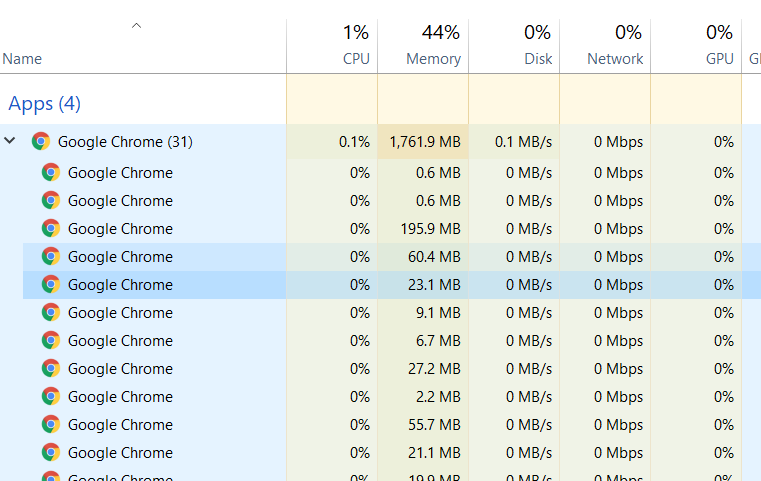
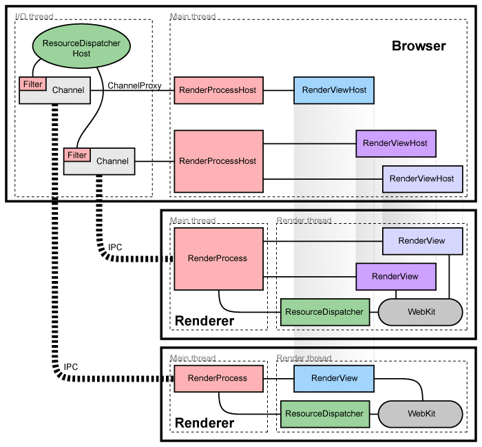
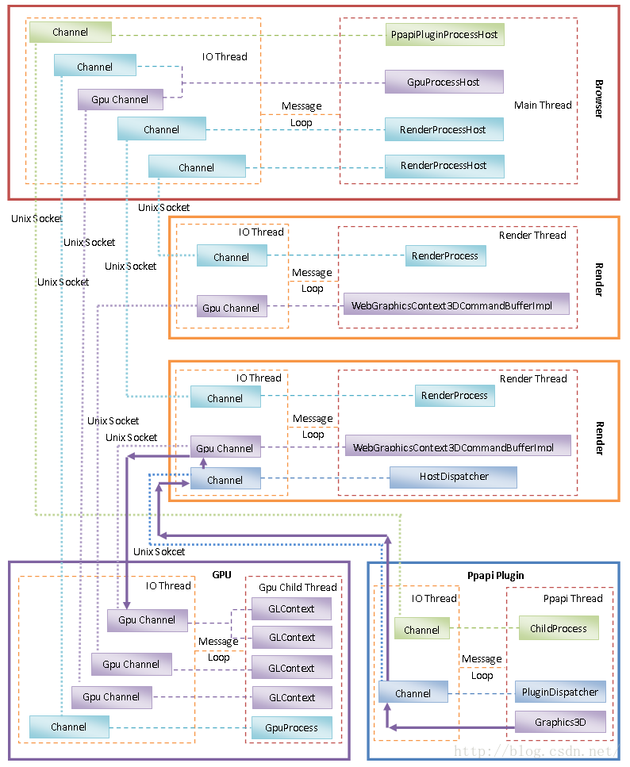
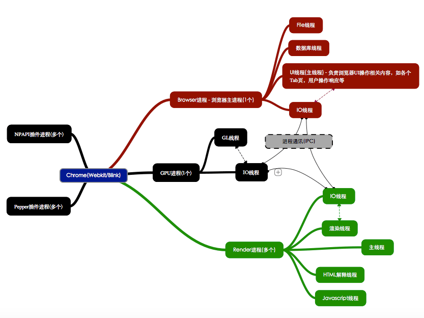

这个话题太 TM 大了, 涉及的底层知识也很多, 有些也和不同浏览器的实现有关, 所以我并不觉得能深入或者说写好这么一个话题. 而由于基础知识的薄弱(缅怀一下我死去的 CS 基础...), 里面的内容正确性也无法进行验证, 只能综合其他博客, 基于自己的理解来阐述, 所以肯定会有很多内容有待修正, 这里的内容就权当笔记吧..

先推荐一些学习资料吧.

1. https://www.chromium.org/developers/design-documents

   这是 Chromium 项目的设计文档, 包含了几乎有关现代浏览器的方方面面, 这个文档有个社区维护的[中文翻译版](https://github.com/ahangchen/Chromium_doc_zh), 不过可能会有些滞后.

2. https://blog.csdn.net/Luoshengyang/article/list/3

   老罗的 Chromium 系列, 非常硬核, 从源码层面剖析了 Chromium 的方方面面.

3. https://developers.google.com/web/fundamentals/performance/critical-rendering-path/constructing-the-object-model

   Google 的 Web 开发基础系列, 里面内容非常棒.

作为一个前端狗, 我也只会从中挑一些对工作有帮助的(我能看懂的, 误)内容来写.

*前置知识点: 进程, 线程, Socket*

*注: 因为参考的都是关于 Chromium 的文档, 所以以下提到的浏览器默认指 Chromium/Chrome.*

#### 多进程架构

在日常的浏览网页的过程中, 打开任务管理器, 我们会发现 Chrome 启动了很多进程.

这里我们主要是了解浏览器有哪些进程? 它们都是做什么的? 为什么要有这么多进程?

##### 浏览器有哪些进程? 它们都是做什么的?

浏览器主要包含四类进程: Browser 进程, Render 进程, GPU 进程和 Plugin 进程. 一个浏览器实例只有一个 Browser 进程, 一个 GPU 进程, 多个 Render 进程和多个 Plugin 进程.

* Browser 进程, 只有一个, 主要负责合成浏览器的 UI, 包括标题栏地址栏, 管理各个页面(Tab)和插件等进程的创建和销毁, 管理资源下载, 可以简单地理解为, 除了视口的渲染, 其他的都是它来管了, 它挂了那浏览器就真的挂了.
* Render 进程(也有写作 Renderer, 叫渲染器), 一般来讲, 一个 Tab 就对应一个 Render 进程, 由 Browser 进程启动. 我们也可以设置启动参数让相同域名的 Tab 运行在同一个 Render 进程中, 特殊架构下, Browser 进程可以兼作 GPU 进程和 Render 进程(没有独立 GPU). Render 进程主要负责页面的渲染, 脚本执行和事件的处理(我们熟悉的 Blink/Webkit 和 V8 都是工作在这里的, 存疑).
* GPU 进程, 只有一个, 主要负责 GPU 相关的操作, 例如 Render 进程通过 GPU 进程离屏渲染网页，Browser 进程也是通过 GPU 进程将离屏渲染好的网页显示在屏幕上, 由 Browser 进程启动.
* Plugin 进程, 注意区分浏览器扩展(Extension)和浏览器插件(Plugin), 浏览器扩展工作在浏览器层面, 用来扩展浏览器功能(比如 OneTab), 浏览器插件工作在网页层面, 用来扩展网页功能(比如 Flash). 这里说的是浏览器插件(说实话我是不怎么区分...). 插件主要有两类, NPAPI 和 PPAPI. NPAPI 是 FF 家的, Chrome 这里也兼容, 不过早在几年前 Chrome 就说要放弃对 NPAPI 的支持, 所以它已经是时代的眼泪了, 我们这里只关心 PPAPI 的插件. 同一类 Plugin 的实例都运行在同一个进程, 不同 Plugin 是不同的进程, 所以不管是不同 Tab 的同类 Plugin 还是同一个 Tab 的多个同类 Plugin, 它们都是一个进程. 仅当使用 Plugin 时才由 Browser 启动进程.

##### 为什么要有多进程?

Chromium 的官方介绍已经解释得很清楚了.

> 构建一个从不会挂起或崩溃的渲染引擎几乎是不可能的, 构建一个完全安全的渲染引擎也是几乎不可能的.
>
> 在某种程度上, Web 浏览器当前状态就像一个与过去的多任务操作系统合作的单独的用户. 正如在一个这样的操作系统中的错误程序会让整个系统挂掉, 所以一个错误的 Web 页面也可以让一个现代浏览器挂掉. 仅仅需要一个浏览器或插件的 bug, 就能让整个浏览器和所有正在运行的标签页停止运行.
>
> 现代操作系统更加鲁棒, 因为他们把应用程序分成了彼此隔离的独立线程. 一个程序中的 crash 通常不会影响其他程序或整个操作系统, 每个用户对用户数据的访问也是有限制的.
>
> ...
>
> 我们为浏览器的标签页使用独立的进程, 以此保护整个应用程序免受渲染引擎中的 bug 和故障的伤害. 我们也会限制每个渲染引擎进程的相互访问, 以及他们与系统其他部分的访问. 某些程度上, 这为 Web 浏览提供了内存保护, 为操作系统提供了访问控制.

多进程的优势:

* 避免一个页面崩溃导致整个浏览器崩溃
* 避免插件崩溃导致整个浏览器崩溃
* 充分利用多核 CPU
* 隔离资源, 提高安全性

简单来说, 采用多进程的架构是为了浏览器更稳定更安全.

##### 进程间通信(IPC)

这些进程之间并不是孤立的, 而是相互协作. 比如 Render 进程需要通过 Browser 进程获取 CSS 等资源,  Browser 进程和 Render 进程都需要通过 GPU 进程来渲染 UI. 不同进程之间需要协作就必然涉及到进程间通信, Chromium 官方给了这样一个图帮助理解 Browser 进程和 Render 进程之间的通信.

> ### 管理渲染进程
>
> 每个 Render 进程有一个全局的 RenderProcess 对象, 管理它与 Browser 进程之间的通信, 维护全局的状态. 浏览器为每个 Render 进程维护一个对应的 RenderViewHost, 用来管理浏览器状态, 并与 Render 进程通信. 浏览器(应该指 Browser 进程)与 Renderer 使用 [Chromium's IPC system](https://github.com/ahangchen/Chromium_doc_zh/blob/master/zh/General_Architecture/Inter-process_Communication.md) 进行通信. 
>
> ### 管理view
>
> 每个 Render 进程有一个以上的 RenderView 对象, 由 RenderProcess 管理(它与标签页的内容相关). 对应的 RenderProcessHost 维护一个与 Renderer 中每个 view 相关的 RenderViewHost. 每个 view 被赋予一个 view ID, 以区分同一个 Renderer 中的不同 view. 这些 ID 在每个 Renderer 内是唯一的, 但在浏览器中不是, 所以区分一个 view 需要一个 RenderProcessHost 和一个 view ID(二元组, 就像标识 Socket 的一端需要 IP 和端口号).
>
> 浏览器与一个包含内容的特定标签页之间的通信是通过这些 RenderViewHost 对象来完成的, 它们知道如何通过他们的 RenderProcessHost 向 RenderProcess 和 RenderView 送消息.
>
> ### 组件与接口
>
> 在 Render 进程中:
>
> - *RenderProcess* 处理与 Browser 进程中对应的 *RenderProcessHost* 的通信. 每个 Render 进程有唯一一个 RenderProcess 对象. 这是所有 Browser-Renderer 之间通信的方式.
> - RenderView 对象与它在 Browser 进程中对应的 RenderViewHost 和我们的 webkit 嵌入层通信(通过 RenderProcess). 这个对象代表了一个网页在标签页或一个弹出窗口的内容.
>
> 在 Browser 进程中:
>
> - Browser 对象代表了顶级浏览器窗口
> - RenderProcessHost 对象代表了 Browser 进程端的一条 Browser-Renderer IPC连接. 每个 Render 进程对应了 Browser 进程里的一个 RenderProcessHost 对象.
> - RenderViewHost 对象封装了与远端 RenderView 的通信, RenderWidgetHost 处理输入并在浏览器中为 RenderWidget 进行绘制.
>
> 想要得到更多关于这种嵌入是如何工作的详细信息, 可以查看 [How Chromium displays web pages design document](https://github.com/ahangchen/Chromium_doc_zh/blob/master/zh/Start_Here_Background_Reading/How_Chromium_displays_web_pages_design_document).
>
> ### 共享 Render 进程
>
> 通常, 每个新的 window 或标签页是在一个新进程里打开的. 浏览器会生成一个新的进程, 然后指导它去创建一个 *RenderView*.
>
> 有时候, 有这样一种必要或希望在标签页或窗口间共享 Render 进程. 一个 web 应用程序会在期望同步交流时, 打开一个新的窗口, 比如, 在 javascript 里使用 window.open. 这种情况下, 当我们创建一个新的 window 或标签页时, 我们需要重用打开这个 window 的进程. 我们也有一些策略来把新的标签页分配的已有的进程(如果总的进程数太大的话, 或者如果用户已经为这个域名打开了一个进程). 这些策略在 [Process Models](https://github.com/ahangchen/Chromium_doc_zh/blob/master/zh/General_Architecture/Process_Models.md) 里也有阐述.

这个翻译不是我翻的, 感觉很多地方不是很通顺...稍稍修改了下. 简单来说, 就是 RenderProcess 和 RenderProcessHost 分别在 Render 进程和 Browser 进程处理 IPC, 它们俩就只负责 IPC. 每个 Render 进程通常有一个 RenderView, 也就是代表我们的页面, 但是也可以有多个, 比如 `window.open()` 打开同源的新 Tab, 虽然是多个 Tab, 它们对应了多个 RenderView, 但是它们属于同一个 Render 进程. Browser 进程侧也有 RenderViewHost 与一个 RenderView 对应(一一对应), Browser 进程通过 RenderViewHost 来操作 RenderView, RenderViewHost 再通过 RenderProcessHost 来和 Render 进程进而和对应的 RenderView 通信, 所以 Browser 进程并不直接操作 RenderProcessHost 来进行通信.

不过话说回来, 这幅图是不是哪里搞错了, 把 Render 进程中的 Main thread 和 Render thread 分开了, Main thread 去做 IO 操作了? 之后官方的另一幅图里它们又是同一个线程了, 而 IO 有单独的 IO 线程. 个人倾向于 Main thread 就是 Render thread, 而 IO 有单独的 IO 线程, 当然也可能 Main thread 就是做 IO 的.

还是回到进程间通信, 个人还是比较喜欢下面两幅图, 感觉更加通俗易懂.

分别来自 [Chromium多进程架构简要介绍和学习计划](https://blog.csdn.net/luoshengyang/article/details/47364477) 和 [图解浏览器渲染过程 - 基于Webkit/Blink内核Chrome浏览器](https://github.com/abcrun/abcrun.github.com/issues/17).

图中都表明了这几类进程中都有一个 IO 线程来负责与其他线程进行通信, 执行 IPC. 官方的图中没有具体说明 IPC 是通过何种方式实现的, 老罗的博客中提到是基于 Socket, 那应该是通过 Socket 实现的吧.

其中, Browser 进程和其他进程之间都可以直接通过一个 Channel 来进行通信, 但是其他进程之间, 比如 Render 和 GPU 进程之间, Render 和 Plugin 进程之间, 需要通过 Browser 进程才能建立 Channel, 之后才能直接通信(Render 进程之所以要通过 Browser 进程间接地与 GPU 进程建立 GPU 通道，是因为 GPU 进程是由 Browser 进程启动的, Render 进程对它一无所知. 所以这事听起来怎么有点像是 NAT 穿透...), 不过 Plugin 和 GPU 之间是通过 Render 建立 Channel.

总之就是, 浏览器几类进程之间都是通过一个 IO 线程进行通信的.

关于进程通信的细节可以参考

* https://www.chromium.org/developers/design-documents/inter-process-communication
* https://blog.csdn.net/luoshengyang/article/details/47822689

#### 多线程架构

之前我们已经接触到了这几个进程中的线程, 至少每个进程都有一个 IO 线程用于 IPC. 事实上, Chromium 的每个进程也包含多个线程.

##### 为什么要有多线程?

如果说多进程是为了稳定安全, 多线程则是为了让用户体验更加流畅. 

> Chromium is a very multithreaded product. We try to keep the UI as responsive as possible, and this means not blocking the UI thread with any blocking I/O or other expensive operations. Our approach is to use message passing as the way of communicating between threads. We discourage locking and threadsafe objects. Instead, objects live on only one thread, we pass messages between threads for communication, and we use callback interfaces (implemented by message passing) for most cross-thread requests.

为了让 UI 尽可能快速响应, 意味着任何阻塞 IO 或其他昂贵的操作都不能阻塞 UI 线程. 我们使用消息传递的方式实现线程之间的通信, 而不鼓励使用锁和线程安全的对象. 相反, 对象仅存在于单个线程中, 我们在线程之间使用消息进行通信, 并且对于大多数跨线程的请求, 我们使用回调接口(通过消息传递实现).

听起来像是和 Android 的消息处理机制差不多, 即线程从一个队列中不停地获取任务并执行它.

##### 有哪些线程?

对于每一个 Chrome 进程, 都有

* 一个主线程
  * 对于 Browser 进程: 负责更新 UI
  * 对于 Render 进程: 负责大部分 blink 的工作
* 一个 IO 线程
  * 对于 Browser 进程: 处理 IPC 和网络请求
  * 对于 Render 进程: 处理 IPC
* 一些用于特殊目的的线程
* 一个用于常规目的的线程池

好吧, 作为一个前端狗其实我并不想去关心那么多...我想我只需要知道进程之间 IPC, 线程之间消息循环就够了...

关于线程通信的细节可以参考

* https://chromium.googlesource.com/chromium/src/+/master/docs/threading_and_tasks.md
* https://blog.csdn.net/luoshengyang/article/details/46747797
* https://blog.csdn.net/luoshengyang/article/details/46855395

还是让我们把目光缩小一点, 放在 Render 进程和 Browser 进程中来.

#### TODO

其实这篇文章最终的落脚点还是希望把目光转向 Blink/Webkit 和 V8 上来, 试图去理清楚 Render 进程和 Webkit 以及 V8 之间的关系, 但是市面上的文章似乎都没怎么提, 奈何自己水平有限并不能从 Chromium 的源码中理清楚这些.

按照官方文档的说法是 Render 进程中就两个线程, 一个主线程一个 Render 线程, 主线程负责 IPC, Render 线程负责调 Webkit. 但是又有很多中文博客讲整个浏览器有

* GUI 线程
* JS 线程
* 事件触发线程
* 定时器线程
* 异步 HTTP 请求线程
* 合成线程

但是以上这些内容并没有找到可靠的英文出处, 也没有人是自己读过源码的, 都是互相引用, 以至于感觉还是有些存疑. 

就个人理解而言, JS 毫无疑问会跑一个线程, 自然是由 V8 来完成. 然而 V8 作为一个虚拟机, 它要管理 GC, 有自己的内存, 那它应该要是一个进程才是. 至于是一个 V8 的进程还是多个就不得而知了. 另一方面是, 既然 V8 有自己的进程, 那几乎每篇讲浏览器渲染的文章都只告诉你浏览器有四类进程, 却没提过 V8, 也是诡异, 可能我理解错了. 不过目前我还是倾向于 V8 有单独一个进程.

至于 HTTP 请求, 毫无疑问 Browser 进程应当有一个 IO 线程负责这事, 所以应该就是 Browser 进程的 IO 线程了.

而 Render 和 Webkit, 根据官方文档的说法, 那 Webkit 应该是工作在 Render 进程的 Render 线程了.

根据之后的知识点, HTML Parser 和 CSS Parser 可以并行地解析 HTML 和 CSS, 那想来至少也是分别工作在两个线程了. 所以 HTML CSS 和 JS 的解析就应该不在 Render 进程中(因为 Render 就只有两个线程), 这样的话, 猜测 JS 的解析还是由 V8 的进程完成, HTML 和 CSS 的解析可能在 Browser 进程也可能有自己的进程. 这样的话, Webkit(在 Render 进程的 Render 线程中)就应该是通过 IPC 从其他进程拿到这些结果再进行渲染.

而事件触发和定时器, 也显然会有两个线程, 但是在哪呢, 不知道...

GUI 线程, 到底是个啥, 是否存在, 以及属于哪个进程, 也是不清楚, 也许就是指 Render 线程也说不定.

合成线程, 同样也不知道是啥, 是否存在.

最后只能是猜测:

* V8 有单独的进程
* Blink/Webkit 工作在 Render 线程
* HTML Parser/CSS Parser 有自己的线程且不在 Render 进程中
* 事件触发和定时器也应该有自己的线程, 但是不知道在哪

以上内容的可靠性基本没有...还是等我学好 C++ 和操作系统再来填坑吧.

以下内容为新增:

* [Chromium 官方文档](https://www.chromium.org/developers/design-documents/gpu-accelerated-compositing-in-chrome)说明了什么是合成线程, 不过在浏览器多进程架构那篇里面并没有提到

#### 参考资料

* https://www.chromium.org/developers/design-documents
* https://github.com/ahangchen/Chromium_doc_zh
* https://www.chromium.org/developers/design-documents/multi-process-architecture
* https://www.chromium.org/developers/design-documents/inter-process-communication
* https://www.chromium.org/developers/design-documents/displaying-a-web-page-in-chrome
* https://www.chromium.org/developers/design-documents/process-models
* https://chromium.googlesource.com/chromium/src/+/master/docs/threading_and_tasks.md
* https://blog.csdn.net/luoshengyang/article/details/47364477
* https://blog.csdn.net/luoshengyang/article/details/46855395
* https://blog.csdn.net/luoshengyang/article/details/46747797
* https://blog.csdn.net/luoshengyang/article/details/47433765
* https://blog.csdn.net/luoshengyang/article/details/47822689
* https://blog.csdn.net/luoshengyang/article/details/48123761
* https://blog.csdn.net/luoshengyang/article/details/48417255
* https://github.com/abcrun/abcrun.github.com/issues/17
* https://zhuanlan.zhihu.com/p/30534023
* https://juejin.im/post/5a6547d0f265da3e283a1df7
* https://docs.google.com/spreadsheets/d/1ErClfUEnwiVRUg9DZC5BqUTI7T_T4agpLqUmYR1yfdc/edit#gid=0
* https://www.chromium.org/developers/design-documents/gpu-accelerated-compositing-in-chrome