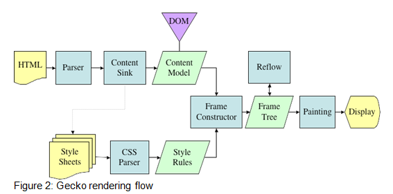

终于又回到了我们熟悉的 HTML 和 CSS 环节. 这篇主要是讲 DOM 和 CSSOM 的构建, DOM 大家已经很熟悉了, CSSOM 其实和 DOM 类似, 当然后面也会有更详细的说明.

这篇主要是关注 Render 进程中发生的事情, 但也不完全是这样(比如资源下载等操作就不由 Render 进程完成), 更准确地说应该是自顶向下地俯视整个浏览器渲染的过程. 开局也还是老套的, 几乎每篇关于浏览器渲染的文章都会有的图.

Webkit 的渲染流程.


Gecko 的渲染流程.



这些图已经有很久了, 可能随着浏览器的更新有些内容已经不再适用, 但总的来说, 还是有它的参考意义的(其实是我没找到有新浏览器渲染流程的图...). 

从图中可以看到, 不论是 Chrome 还是 Firefox, 它们的大体流程上是相似的. 都经历了这么几个步骤:

* 解析 HTML -> 构建 DOM 树
* 解析 CSS -> 构建 Style Rules
* 将 DOM 树和 Style Rules 生成 Render Tree/Frame Tree
* 绘制(Painting)页面
* 显示


让我们忽略那些并不能理解的词汇, 把目光放到熟悉的 HTML 和 CSS 上来. 可以看到, 在渲染之前, 需要先处理 HTML 和 CSS, 并且它们(几乎)是并行处理的. 并且处理它们的过程都是类似的--都是将内容解析进而生成某个特定的数据结构.


#### 构建 DOM 树

尽管从接触前端一开始就有了 DOM 树的概念, 但你让我说出个具体来, 即使是现在, 我也很难给它一个准确的定义. 所以这里还是引用 [MDN 的定义](https://developer.mozilla.org/en-US/docs/Web/API/Document_Object_Model)吧.

> The **Document Object Model (DOM)** connects web pages to scripts or programming languages. Usually that means JavaScript, but modelling HTML, SVG, or XML documents as objects is not part of the JavaScript language. The DOM model represents a document with a logical tree. Each branch of the tree ends in a node, and each node contains objects. DOM methods allow programmatic access to the tree; with them you can change the document's structure, style or content. Nodes can have event handlers attached to them. Once an event is triggered, the event handlers get executed.

个人的理解是, DOM 既是一组接口, 是用于操作 HTML, SVG 和 XML 的接口. 同时 DOM 也是客观存在的树状的数据结构, 当然, 数据结构和接口本来就不是矛盾的定义, 数据结构本身暴露了接口供我们使用. 作为前端开发者, 我们关心的是接口的意义, 作为理解浏览器渲染过程的一部分, 我们关心的是数据结构的意义.

总之, 这里我们说的 DOM 就是一个树状的数据结构. 当然, 你也可以说, 扯了这么长一段废话, 说了一个我早就知道的概念 :).

好了, 整个 DOM 构建的过程理解起来其实并不复杂, 一幅图足以说明, 这里引用 Google 官方的图.


1. **转换:** 浏览器从磁盘或网络读取 HTML 的原始字节, 并根据文件的指定编码(eg. UTF-8)将它们转换成各个字符. 当然事实上我们不太关心这层的细节.
2. **Tokenizing:** 浏览器将 HTML 字符串转换成各种词法单元(Token)
3. **词法分析:** 将 Token 转换成各种对象(为什么我觉得这步应该算语法分析...)
4. **DOM 构建:** 将之前生成的对象根据 HTML 标签之间的关系组合成树状数据结构

整个过程和编译原理中学到的编译过程类似(大部分一样), 最终整个流程输出的就是 DOM 树了.

值得注意的一些细节:

* Chrome 中, DOM 树最大深度是 512 层(https://zhuanlan.zhihu.com/p/24911872)
* Chrome 中, 自定义标签默认是一个行内元素(https://zhuanlan.zhihu.com/p/24911872)
* 获取一个 HTMLCollection 对象是不会遍历 DOM 的, 使用HTMLCollection(比如访问 HTMLCollection 的 length)则会遍历 DOM (深度优先)(https://zhuanlan.zhihu.com/p/24911872)
* 强调一下 DOM 树的遍历是深度优先的
* 如果不写 `<!DOCType html>` (比如 `<!DOCType svg>`)会使浏览器采用怪异模式, 采用 HTML4 的 DOCType 则使浏览器采用有限怪异模式. 怪异模式会模拟IE, 同时 CSS 解析会比较宽松, 例如数字单位可以省略, 而有限怪异模式和标准模式的唯一区别在于在于对 inline 元素的行高处理不一样. 怪异模式下 `<input> ` `<textarea>` 的 `box-sizing` 是 border-box(难道普通模式不是?). 怪异模式的 `<body>` 默认高度是视口高度(标准下是内容高度). 怪异模式和有限怪异模式下, 图片底部不留白(不对齐到 baseline)(https://zhuanlan.zhihu.com/p/24911872)
* 浏览器并不会等 HTML/CSS 下载完再去构建 DOM 和 CSSOM, 而可能是一边下载一边解析一边构建
* 整个过程并非只执行一次, 显然, 当 JS 改变 DOM 结构之后, DOM 树也需要改变
* DOM 树构建完之后触发 `DOMContentLoaded` 事件(存疑)


#### 构建 CSSOM 树

之前我们已经提到过 CSSOM, 也没具体解释什么是 CSSOM. CSSOM 即 CSS 对象模型(CSS Object Model), 和 DOM 一样, 它也是一个树状数据结构, 并且暴露了一些 API 供我们操作 CSS, 比如我们常用的 DOM 元素的 `style` 属性, `offsetWidth`, `clientWidth`, `getBoundingClientRect()` 以及各种动画事件等等, 都是在 CSSOM 中定义的. 具体可以参考 [MDN](https://developer.mozilla.org/en-US/docs/Web/API/CSS_Object_Model). 这里我们还是关注它作为数据结构的方面.

和构建 DOM 树类似, 构建 CSSOM 树也是经历了这么一个过程.


最终我们得到这样一个数据结构.


##### CSSOM 为什么要是树状结构?

> CSSOM 为何具有树结构？为页面上的任何对象计算最后一组样式时，浏览器都会先从适用于该节点的最通用规则开始（例如，如果该节点是 body 元素的子项，则应用所有 body 样式），然后通过应用更具体的规则（即规则“向下级联”）以递归方式优化计算的样式。

构建 CSSOM 的其他一些细节:

* 加载 CSS 是异步的, 不影响 DOM 树的构建, 只是在 CSS 计算好之前 DOM 并不会显示出来(白屏阶段), 即不阻塞 DOM 构建, 但是阻塞页面渲染. 所以 CSS base64 化并不是很好(https://zhuanlan.zhihu.com/p/25380611)
* 用 16 位数字的颜色性能比 rgb 函数好一点, eg `#fff` `rgb(255, 255, 255)`, 原因是 CSS 在 tokenize 的时候 rgb 的值是函数类型的, 需要再计算一次(https://zhuanlan.zhihu.com/p/25380611)
* CSS 选择器的解析和匹配是从右往左的
* 由于 CSS 选择器命中判断的机制, 不建议选择器写太长, 最好不超过三层, (https://zhuanlan.zhihu.com/p/25380611)
* 对于 DOM 中每个 node, 浏览器将选择器依次按照 id class 伪元素 标签进行比较判断, 所以用 id 和 class 选择器快一些是有道理的(https://zhuanlan.zhihu.com/p/25380611)
* 写 CSS 属性的先后顺序对于性能是没什么影响的
* id 本身就是唯一的, 写选择器的时候不需要指定 tagName 又指定 id, 这样性能反而差(eg. `p#wtf`)


##### 为什么 CSS 选择器是从右向左匹配?

简单来讲, 从右向左匹配, 一开始就是先查找最具体的元素, 有利于快速缩小查找范围, 因为大量不匹配的路径都会在第一次比较时被过滤掉了. 考虑这样一个例子

```html
<div>
  <div>
    <p>hello</p>
    <section>world</section>
    <div>
      <p>test</p>
    </div>
  </div>
</div>
```

```css
div div section {
    color: red;
}
```

如果是从右向左匹配, 我们可以在第一次遍历就确定 `<section>` 可能符合条件, 再通过 `<section>` 向上比较最终确定唯一一个 `<section>` 就是匹配选择器的元素.

如果是从左向右匹配, 第一次遍历我们只能确定 3 个 `<div>` 可能符合条件, 之后再分别遍历它们的子树还剩下 2 个 `<div>`, 对于中间的 `<div>` 还要遍历到最深处的 `<p>` 才会发现不匹配, 显然这样成本更高.

既然提到了 CSS 是从右向左匹配的, 那不妨再考虑一个问题.

```css
h1+p~section {
    color: red;
}
```

这个样式会匹配下面的 A 还是 B 呢?

```html
<p>sth</p>
<h1>sth</h1>
<section>A</section>
```

```html
<h1>sth</h1>
<p>sth</p>
<section>B</section>
```

或者换句话说, 假如括号代表优先结合的话, 选择器 `h1+p~section` 的意义是 `(h1+p)~section` 还是 `h1+(p~section)` ?

可以测试一下 :)


#### The end

这里我一直在回避这里面这些操作分别是在哪个进程的哪个线程中完成的? 它们又是怎样协作的? 这些问题, 不是我不想去讨论它们, 实在是能力有限并不能看懂源码...So.

另一方面也在回避的问题是 JS 的解析与执行在整个浏览器渲染过程中有什么影响? 这个内容放在之后的话题讨论.

最后, 我已经知道了浏览器大概是怎样构建 DOM 树, 怎样构建 CSSOM 树, 可是这有什么用? 或者说它们有什么用? 我想知道的是浏览器是如何渲染页面的.

所以接下来的话题就是渲染了.


#### 参考资料

* https://developer.mozilla.org/en-US/docs/Web/API/Document_Object_Model
* https://developer.mozilla.org/en-US/docs/Web/API/Document_Object_Model/Introduction
* https://developers.google.com/web/fundamentals/performance/critical-rendering-path/constructing-the-object-model
* https://zhuanlan.zhihu.com/p/24911872
* https://blog.csdn.net/luoshengyang/article/details/50558942
* https://zhuanlan.zhihu.com/p/25380611
* https://developer.mozilla.org/en-US/docs/Web/API/CSS_Object_Model
* https://juejin.im/entry/5a123c55f265da432240cc90
* https://docs.google.com/presentation/d/1Iko1oIYb-VHwOOFU3rBPUcOO_9lAd3NutYluATgzV_0/view#slide=id.g36fd527aec_8_99


