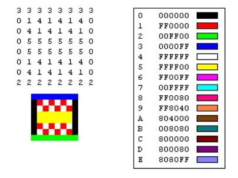

在了解渲染树的构建之前, 我们先来了解一下计算机是如何将画面"画"到显示器上的.

#### 几个关键词

##### 刷新率

在装机的时候我们经常会关注显示器的一个参数, 就是刷新率. 那什么是刷新率? 古老的 CRT 显示器通过电子枪发射电子束到显像管, 逐行扫描完整屏为扫描一帧, 也就是刷新了一次. 我们看到的画面就是这样一帧一帧画出来的. 对于 CRT 来说, 刷新率自然是每秒刷新的次数了. 而现在的 LCD 显示器呢, 理论上讲 LCD 不需要像 CRT 那样刷新亮点, 那为什么要有刷新率呢? 其实我也不懂...照理对于 LCD 静态画面应该是不需要刷新的, 不过我们平时总不可能看着一个画面不动, 那 LCD 应该也是要刷新的. 另外也有大佬说 LCD 也是从上往下逐行刷新的(可能多个区域同时逐行扫描, 对单个区域来说还是逐行的). 总之, 显示器会按照自己的刷新频率/刷新率一直不停地重绘着(对于动态画面这么理解应该没毛病?). 比如 60Hz 刷新率的显示器, 那我们能看到的画面最多就是每秒 60 张了.

##### 帧缓冲器

显示器需要不停地重绘, 那显示器绘制的画面从哪里来呢? 答案是帧缓冲器, 帧缓冲器应该是一个抽象的概念, 可以是你的内存区域, 也可以是显存, 用来存放一帧图像的所有信息(每个像素的色彩之类). 显示器每次刷新就从帧缓冲器中取一帧渲染出来.

##### 位图

我们知道了帧缓冲器是一块内存区域, 那这块内存中存的又是什么? 或者说一帧是如何表示的? 我们知道图片由像素组成, 每个像素的颜色又可以由三原色表示, 拿我们最熟悉的 RGB 来表示的话, 那自然是三个字节表示一个像素, 每种颜色都是 256 阶占 8bit. 于是我们可以用这种方式来表示整张图片. 当然我们也可以不这么做, 比如可以 R4G4B4A4, 每种颜色 4bit, 还有一个 alpha 通道占 4bit, 这样只需要两字节. 但是不管怎么说, 我们都是用几个字节来表示一个像素, 最终表示整张图片, 我们把这样的数据结构叫做位图.

##### 纹理

简单理解成 GPU 中的位图就好. 所以最终, 我们的帧缓冲器中存储的就是位图这样的结构了.

##### 帧率 FPS

玩游戏的时候我们经常能看到游戏中显示当前的帧率, 配置高的机器可以看到 100+ 的 fps. 这又是什么呢? 不是明明 60Hz 的显示器每秒只有 60 帧吗? 这里的帧率应该是指显卡每秒输出的帧的数量. 但是显示器的刷新时间是固定的, 显卡输出帧的时间呢? 显然不是, 不然怎么会出现有些游戏帧率高, 而有些游戏帧率低呢? 这里帧率当然是会随着计算量不同而不同的. 所以**显示器的刷新时间是固定的, 显卡输出每一帧的时间是不固定/均匀的**.

##### 卡顿和画面撕裂

于是我们的显卡和显示器构成了一个生产者和消费者, 显卡每秒都在生成图像放到帧缓冲器, 显示器每秒都在从帧缓冲器中取图像绘制到屏幕上来. 理想状态下, 一个 60Hz 的显示器只需要显卡的帧率为 60fps 就好. 所以也会有人说显示器渣的话显卡再好也没用. 但这只是理想状态.

理想状态下(假设显示器每秒刷新一次, 显卡每秒输出一帧):

|          | 1s     | 2s     | 3s     |
| -------- | ------ | ------ | ------ |
| 显示器   | 下一张 | 下一张 | 下一张 |
| 帧缓冲器 | 第一张 | 第二张 | 第三张 |
| 显卡     | 第一张 | 第二张 | 第三张 |

实际情况下(假设显示器 1Hz, 显卡 1fps)

|          | 1s     | 2s           | 2.5s           | 3s     |
| -------- | ------ | ------------ | -------------- | ------ |
| 显示器   | 下一张 | 下一张       |                | 下一张 |
| 帧缓冲器 | 第一张 | 第一张       | 第三张         | 第四张 |
| 显卡     | 第一张 | 第二张还没好 | 第二张, 第三张 | 第四张 |

可以看到, 即使显示器刷新率和显卡帧率保持一致, 但是由于显示器的刷新时间是均匀的, 而显卡输出帧的速率并不均匀, 最终导致了 2s 到 3s 时跳帧卡顿.

而更多的实际情况是, 显示器刷新率小于显卡输出帧率, 或者显示器刷新率大于显卡输出帧率.

显示器刷新率小于显卡输出帧率时, 还记得我们说显示器不是一次把整个图像绘制出来, 而是逐行绘制的, 这意味着这个绘制操作不是原子的. 而另一方面显卡在一个刷新周期之间输出了多帧画面的话, 则之前的帧会被丢弃. 这种时候可能出现这种情况: 

1. 0.9s 时, 显卡输出第一帧
2. 1s 时, 显示器读到第一帧, 但是还没读完, 只读了上半部分, 显示器逐行绘制了第一帧上半部分
3. 1.5s 时, 显卡输出第二帧, 覆盖掉了帧缓冲器中的第一帧(第一帧被丢弃), 显示器读到第二帧下半部分, 于是显示器绘制了第二帧的下半部分

最终看起来就是第一帧的上半部分和第二帧的下半部分拼在一起, 表现为画面撕裂.

显示器刷新率大于显卡输出帧率时, 可能是这样: 显示器第一次从帧缓冲器中取图像, 成功获取第一帧并渲染. 显示器第二次从帧缓冲器中取图像, 显卡还未生成第二帧, 于是显示器继续取第一帧渲染, 显示器第三次刷新, 显卡生成了第二帧. 最终表现是显示器刷新了三次, 渲染了两次第一帧和一次第二帧, 于是卡顿. 当然这里并没有丢帧, 只是两帧之间的时间间隔长了些, 但是丢帧也可能导致卡顿, 就像我们之前的例子那样从第一帧跳到了第四帧.

总结, 刷新率大于帧率时可能会画面撕裂, 刷新率小于帧率时可能会卡顿, 而即使它们保持一致, 也会因为显卡输出速率不均匀而导致丢帧, 反正最终都是生产消费的速率不匹配的锅. 当然, 最好还是帧率大于刷新率好一些.

##### 垂直同步

其实垂直同步跟我们浏览器渲染没啥关系, 不过既然看了也顺便记录下. 游戏中我们常常可以看到垂直同步这样的设置, 大佬们也会告诉你, 开了这个不会有画面撕裂, 但是操作会有延迟. So, 为什么呢? 之前我们说, 画面撕裂基本上是显卡帧率大于显示器刷新率. 那这就好办了, 只要显示器告诉显卡, 你可以渲染下一帧了, 显卡才去渲染下一帧就好了. 于是情况变成了显卡在每渲染一帧前都会等待垂直同步信号, 显示器完成一次刷新, 发出垂直同步信号, 显卡才会渲染下一帧.

但是这显然也会有问题, 比如等到信号才开始渲染下一帧, 可能下一帧计算量较大, 耗时较久, 那也会卡顿. 另一方面也制约了高端显卡的发挥. 于是垂直同步只能解决画面撕裂, 但是不能解决卡顿, 还有一定副作用.

所以显卡厂商们又推出了 G-Sync 和 Free-Sync 技术, 不过这个就不做讨论了.

#### 浏览器和 GPU

#### TODO

为什么之前不是通过 GPU 加速渲染?

为什么要有图层而不是像游戏那样整个屏幕渲染?

切片

光栅化

顶点着色

为什么 rAF 比 setTimeout 好?

为什么说 DOM 操作慢?

#### 参考资料

* https://zh.wikipedia.org/wiki/%E5%B8%A7%E7%BC%93%E5%86%B2%E5%99%A8
* https://baike.baidu.com/item/%E5%B8%A7%E7%BC%93%E5%AD%98
* https://baike.baidu.com/item/%E5%88%B7%E6%96%B0%E7%8E%87
* https://www.zhihu.com/question/266094493/answer/307156647
* https://www.zhihu.com/question/48273439
* https://www.jianshu.com/p/df185adcee6a
* https://www.zhihu.com/question/267136068/answer/320026369
* https://www.zhihu.com/question/21081976
* https://blog.csdn.net/jaccen2012/article/details/51177684