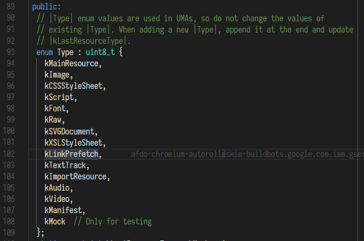
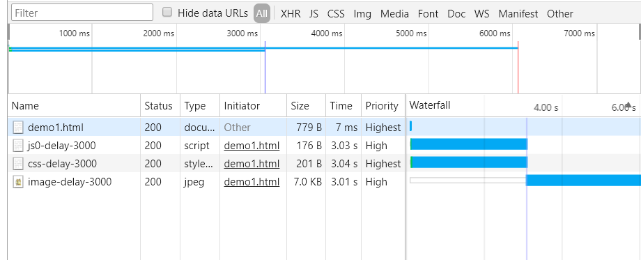

*注: 本文假设已经基本了解浏览器渲染过程以及  preload prefetch, 比如 DOM 树构建, CSSOM 构建, 渲染树构建等, 另外以下内容均不涉及 HTTP/2.*

在开始之前我们先区分几个关键词:

* **资源的加载**: 本文中指资源从开始下载到下载完成的过程

* **资源的使用**: 本文中指类似 JS 的执行, CSS 的计算, CSSOM 的构建这样的过程

* **阻塞 DOM 树构建**: 如字面意义, 阻塞 DOM 树构建

* **HTML 的解析**: 其实个人觉得应当把 HTML 解析, DOM 树构建, 浏览器渲染, 三个东西区分开来, 顺序是先 HTML 解析, 再 DOM 树构建, 再浏览器渲染, 讨论 JS 的阻塞, 应当是指 JS 的下载与执行阻塞 DOM 树构建. JS 的下载执行和这三者的关系可以预测的只有 DOM 树构建, 而 HTML 的解析和 JS 的下载执行之间的相对顺序不可预测, 见后文的预测加载机制, 如果已知 JS 下载与执行会导致阻塞(我就不说阻塞什么), 又知 JS 和其他资源可以并行执行, 如果是阻塞 HTML 解析, 这会推导出矛盾的结论, 所以 JS 的下载和执行不会阻塞 HTML 解析. 而 JS 的下载执行和渲染之间的关系, 阻塞是肯定阻塞的, 因为阻塞了 DOM 树构建, 然而一些相对顺序则并不可预测, 而取决于具体浏览器的实现, 考虑如下例子.

  ```javascript
  	<div>1</div>
  	<script>console.log(document.getElementsByTagName('div')[0].textContent);alert(2)</script>
  	<div>3</div>
  	<script>alert(4)</script>
  	<div>5</div>
  ```

  在 Chrome 下会发现控制台输出的结果是符合预期的, 而页面渲染的结果是不符合预期的, 即先 `alert(2)`, 再显示 1, 再 `alert(4)`, 再显示 35, 所以这块的顺序是不可预测的.

* **阻塞渲染**: 通常指阻塞渲染树构建, 或阻塞页面最终渲染

* **阻塞字体渲染**: 通常是页面已经渲染出来, 只是字体还未渲染出来的阶段. 前置知识点: 构建渲染树之前会延迟字体请求, 可能导致文本渲染延迟, 原因是浏览器必须先构建渲染树, 然后才能知道需要哪些字体资源来渲染文本, 并且在获取字体资源之前, 可能阻塞浏览器渲染文本. 而在页面渲染出来时, 字体还未下载完成, 则浏览器会用接近的本地字体渲染出隐形的文本, 等字体下载好再替换字体并上色. 具体可以参考 [这篇](https://developers.google.com/web/fundamentals/performance/optimizing-content-efficiency/webfont-optimization) 和 [这篇](https://developers.google.com/web/updates/2016/02/font-display)

  

接下来我们先来思考几个问题:

* 什么时候资源会被阻止下载?
* 浏览器下载资源的优先级是怎样的?
* 浏览器对同一域名最多同时下载多少资源? 多个域名呢?
* 下载 JS 会阻塞之后的资源下载吗?
* JS 为什么会阻塞 DOM 树构建?
* 是 JS 的加载就开始阻塞 DOM 树的构建还是 JS 的执行开始阻塞 DOM 树构建?
* JS 的加载与执行是否会阻塞 CSSOM 的构建?

为了解决这些问题, 我们先从浏览器的源码开始.


#### 资源的分类

*注: 代码基于 Chromium 68.0.3397*

从 [chromium/third_party/blink/renderer/platform/loader/fetch/resource.h](https://cs.chromium.org/chromium/src/third_party/blink/renderer/platform/loader/fetch/resource.h?type=cs&q=kMainResource&l=94) 可以看到, 浏览器将资源分为了以下几类



对应关系大致是

| Type            | 类型                                   |
| --------------- | -------------------------------------- |
| kMainResource   | HTML(包括 `<iframe>` 的和表单提交跳转) |
| kImage          | 图片                                   |
| kCSSStyleSheet  | CSS                                    |
| kScript         | JS                                     |
| kFont           | 字体                                   |
| kRaw            | XHR, fetch                             |
| kSVGDocument    | SVG                                    |
| kXSLStyleSheet  | XSL                                    |
| kLinkPrefetch   | `<link rel="prefetch">` 预获取的资源   |
| kTextTrack      | 字幕文件                               |
| kImportResource | 不知道...                              |
| kAudio          | 音频文件                               |
| kVideo          | 视频文件                               |
| kManifest       | Manifest 文件                          |
| kMock           | 测试使用                               |


#### 阻止资源下载的原因

从 [chromium/third_party/blink/renderer/platform/loader/fetch/resource_request.h](https://cs.chromium.org/chromium/src/third_party/blink/renderer/platform/loader/fetch/resource_request.h?type=cs&q=ResourceRequestBlockedReason&l=55) 可以看到, 阻止资源下载的原因有以下几种


在 [chromium/third_party/blink/renderer/core/loader/base_fetch_context.cc](https://cs.chromium.org/chromium/src/third_party/blink/renderer/core/loader/base_fetch_context.cc?type=cs&q=CanRequestInternal&l=57) 中的 CanRequestInternal 有具体的判断逻辑, 不过有点长, 也并不能完全看懂...就挑几个简单的写下好了.

| Reason             | 原因                                        |
| ------------------ | ------------------------------------------- |
| kCSP               | 因 CSP 策略被阻止                           |
| kMixedContent      | 因混合内容被阻止                            |
| kOrigin            | 不是同源策略!!!                             |
| kInspector         | 因 Devtools 拦截被阻止                      |
| kSubresourceFilter | 不知道...                                   |
| kOther             | 不知道...                                   |
| kContentType       | 似乎只有一种情况, 就是 CSS 的 MIME 设置不对 |
| kNone              | 不阻止                                      |

需要提到的是混合内容, 混合内容分为 optionally-blockable 和 blockable, 其中音频, 视频, favicon, 图片资源属于 optionally-blockable, 其他都是 blockable 的. optionally-blockable 的资源在一些情况下(没设置 CSP 的情况下)是可以被加载的, 因为它们危险性比较低, 被篡改的话最多引起页面显示不正常, 而像 JS 这种被篡改那就相当于攻击者能控制整个页面, 所以它是 blockable 的. 图片里面 `` 的 `srcset` 也是 blockable 的. 关于混合内容的具体细节也可以参考 [W3C](https://www.w3.org/TR/mixed-content/).

另外 kOrigin 不是因为同源策略而阻止下载的, 同源策略的限制是可以发出请求的, 而**这里所有的情况都是无法发出请求的**. 那 kOrigin 是什么? 据说是给 SVG 用的, 具体参考[这里](https://zhuanlan.zhihu.com/p/30558018).

那么这里可以解答什么时候资源会被阻止下载这个问题了.


#### 资源的优先级

在 [chromium/third_party/blink/renderer/platform/loader/fetch/resource_fetcher.cc](https://cs.chromium.org/chromium/src/third_party/blink/renderer/platform/loader/fetch/resource_fetcher.cc?type=cs&q=TypeToPriority&l=120) 中, 可以看到浏览器根据资源类型分出了以下优先级.


可以看到, 浏览器对优先级和资源类型有如下关系:

| kPriority | kType                                        | Priority  | Type                    |
| --------- | -------------------------------------------- | --------- | ----------------------- |
| kVeryHigh | kMainResource/kCSSStyleSheet/kFont           | Very High | HTML/CSS/Font           |
| kHigh     | kXSLStyleSheet/kRaw/kImportResource/kScript  | High      | XHR/fetch/JS            |
| kMedium   | kManifest/kMock                              | Medium    | Manifest                |
| kLow      | kImage/kTextTrack/kAudio/kVideo/kSVGDocument | Low       | 图片/音频/视频/字幕/SVG |
| kVeryLow  | kLinkPrefetch                                | Very Low  | prefetch 的资源         |

但是这不是最终的样子!!! 浏览器还会根据情况进行调整. 在 [chromium/third_party/blink/renderer/platform/loader/fetch/resource_fetcher.cc](https://cs.chromium.org/chromium/src/third_party/blink/renderer/platform/loader/fetch/resource_fetcher.cc?type=cs&q=ComputeLoadPriority&l=173) 的 ComputeLoadPriority 函数中


可以看到, 可见的图片优先级被提升至 High(怎么样算可见的图片? 抱歉我也没找到...根据最后注释猜测是出现在视口中的图片).

```c++
// Visible resources (images in practice) get a boost to High priority.
if (visibility == ResourcePriority::kVisible)
  priority = ResourceLoadPriority::kHigh;
```

接着 preload 的字体优先级被降低到 High.

```c++
// A preloaded font should not take precedence over critical CSS or
// parser-blocking scripts.
if (type == Resource::kFont && is_link_preload)
  priority = ResourceLoadPriority::kHigh;
```

说 preload 的字体不应该优先于关键 CSS 和阻塞 parser 的 JS. 个人理解关键 CSS 应该指正在用来构建 CSSOM 的 CSS, 阻塞 parser 的 JS 就是非 async/defer 的 JS 吧. 所以**如果加载的资源过多, 对字体用 preload 的话可能导致负优化**, 毕竟原本字体的优先级是 Very High. 

接下来是

```c++
if (FetchParameters::kIdleLoad == defer_option) {
  priority = ResourceLoadPriority::kVeryLow;
}
```

我们注意到有个 defer_option, 它是 FetchParameters::DeferOption 类型的, 它是一个枚举类型, 有 kNoDefer, kLazyLoad, kIdleLoad 几个值, 参考 [chromium/third_party/blink/renderer/platform/loader/fetch/fetch_parameters.h](https://cs.chromium.org/chromium/src/third_party/blink/renderer/platform/loader/fetch/fetch_parameters.h?type=cs&l=58), kNoDefer 应该就是正常情况下的资源了(这个没仔细看).

kLazyLoad 的资源有哪些呢? async 和 defer 的 `<script>` 的脚本都是 kLazyLoad 的, 媒体查询不匹配的 CSS (通过 `<link>` 上面的媒体查询)也是 kLazyLoad 的(补充: 通过 JS 创建的 `<link>` 引入的 CSS 是异步加载的, 但是资源优先级是 High). 

那 kIdleLoad 是什么? 看了下应该是通过 `document.write()` 动态插入的资源(不限于脚本). 所以这里如果是通过 `document.write()` 添加的资源, 优先级会被降为 Very Low, 所以即便之前是其他优先级的资源, 到这里还是可能变成 Very Low.

接下来是 JS 脚本

```c++
else if (type == Resource::kScript) {
  // Special handling for scripts.
  // Default/Parser-Blocking/Preload early in document: High (set in
  // typeToPriority)
  // Async/Defer: Low Priority (applies to both preload and parser-inserted)
  // Preload late in document: Medium
  if (FetchParameters::kLazyLoad == defer_option) {
    priority = ResourceLoadPriority::kLow;
  } else if (speculative_preload_type ==
                 FetchParameters::SpeculativePreloadType::kInDocument &&
             image_fetched_) {
    // Speculative preload is used as a signal for scripts at the bottom of
    // the document.
    priority = ResourceLoadPriority::kMedium;
  }
} 
```

如果是 kLazyLoad 的脚本, 也即 async/defer 的脚本, 优先级会降为 Low. 在首屏渲染的 HTML 中且在页面较后的脚本(即不是通过 JS 插入的)的优先级是 Medium, 什么是页面较后? 注意这个 image_fetched, 之前忘了提.

```c++
// Resources before the first image are considered "early" in the document and
// resources after the first image are "late" in the document.  Important to
// note that this is based on when the preload scanner discovers a resource
// for the most part so the main parser may not have reached the image element
// yet.
if (type == Resource::kImage && !is_link_preload)
  image_fetched_ = true;
```

注释里说, 第一张非 preload 图片之前的资源被视为页面较前的资源, 第一张非 preload 图片之后的资源被视为页面较后的资源.

而 speculative_preload_type 是什么呢? 这里有说明.

> 在早期浏览器，script资源是阻塞加载的，当页面遇到一个script，那么要等这个script下载和执行完了，才会继续解析剩下的DOM结构，也就是说script是串行加载的，并且会堵塞页面其它资源的加载，这样会导致页面整体的加载速度很慢，所以早在2008年的时候浏览器出了一个推测加载(speculative preload)策略，即遇到script的时候，DOM会停止构建，但是会继续去搜索页面需要加载的资源，如看下后续的html有没有img/script标签，先进行预加载，而不用等到构建DOM的时候才去加载。这样大大提高了页面整体的加载速度。

那 SpeculativePreloadType::kInDocument 又是什么? 在 [chromium/third_party/blink/renderer/platform/loader/fetch/fetch_parameters.h](https://cs.chromium.org/chromium/src/third_party/blink/renderer/platform/loader/fetch/fetch_parameters.h?type=cs&l=61) 中


定义了三种预测加载类型, 没有预测加载的资源, 在首屏 HTML 中的资源, 通过 `document.write()` 插入的资源. 所以最后是在首屏渲染的 HTML 中且在页面较后的脚本优先级会被调整为 Medium.

多说一点, 关于浏览器的预测加载机制, 没找到太多资料, 也没仔细看(并不能看懂)源码, 但是这东西又确实有点用, 所以之后会更具体讨论预测加载机制.

再然后

```c++
else if (FetchParameters::kLazyLoad == defer_option) {
  priority = ResourceLoadPriority::kVeryLow;
} 
```

如果不是脚本, 同时又是 kLazyLoad 的资源, 比如媒体查询不匹配的 CSS, 则优先级是 Very Low.

之后的不知道是啥...

最后

```c++
// A manually set priority acts as a floor. This is used to ensure that
// synchronous requests are always given the highest possible priority, as
// well as to ensure that there isn't priority churn if images move in and out
// of the viewport, or are displayed more than once, both in and out of the
// viewport.
return std::max(Context().ModifyPriorityForExperiments(priority),
                resource_request.Priority());
```

这里设置了同步请求优先级为最高, 并确保图像移入和移出视口或者不止一次显示图像时不会丢失优先级, 无论图片是否进入视口.

这就完了吗? 不不不, 最终这些优先级(资源加载优先级)会被转为网络优先级, 网络优先级才是我们下载资源时的优先级. 在 [chromium/content/renderer/loader/web_url_loader_impl.cc](https://cs.chromium.org/chromium/src/content/renderer/loader/web_url_loader_impl.cc?type=cs&q=Net::Highest&l=162) 的 ConvertWebKitPriorityToNetPriority 函数中


将资源加载优先级转换成了网络优先级. 有人会说, 之前明明是 ResourceLoadPriority, 这里是 WebURLRequest::Priority, 因为它们其实是一个东西.


于是最终, 我们可以列一个表(以下提到的资源默认都不是 preload prefetch `document.write()` 插入的, JS 默认没有 async/defer, 不是 ES6 moudle)

| ResourceLoadPriority | Net Priority | Type                                                         |
| -------------------- | ------------ | ------------------------------------------------------------ |
| kVeryHigh            | HIGHEST      | HTML/CSS/Font/同步 XHR                                       |
| kHigh                | MEDIUM       | XHR/fetch/JS/在视口中的图片/preload 的字体/preload 的 async/defer 的 JS /其他未特别说明的 preload 的资源[注 0] |
| kMedium              | LOW          | Manifest/在首屏 HTML 中且在页面较后的 JS                     |
| kLow                 | LOWEST       | 图片/音频/视频/字幕/SVG/ async/defer 的 JS/动态创建的 JS(后续补充) |
| kVeryLow             | IDLE         | prefetch 的资源/`document.write()` 插入的资源/媒体查询不匹配的 CSS |

可以看到这两个优先级之间还是一一对应的, 但是保不准以后会改是吧.

另外所有资源的网络优先级默认值是 IDLE, 因为 ResourceRequest 实例化的时候默认值是 IDLE, 参考 [chromium/services/network/public/cpp/resource_request.h](https://cs.chromium.org/chromium/src/services/network/public/cpp/resource_request.h?type=cs&q=ResourceRequest&l=91), 每个请求都有一个 ResourceRequest 对象与之对应. 经过转换后如上表, 都不匹配的话是 LOW.

这里我们解决了浏览器下载资源的优先级是怎样的这一问题.

*注 0: 其他未特别说明的 preload 的资源的网络优先级是 MEDIUM, 这一点在源码中没能找到, 不过[规范中](https://w3c.github.io/preload/#x2.link-type-preload)提到了它是 high-priority 的(preload is a mandatory and high-priority fetch for a resource that is necessary for the current navigation.), 应该是指资源优先级, 对应等到网络优先级就是 MEDIUM, 下面有一张别人总结的表, 也可以参考*


*后续补充: preload/prefetch 还会根据 `as` 属性来调整资源的优先级*

*再补充下 preload, 虽然看上去 preload 有很多特例, 但是其实可以一句话概括 preload, 就是 preload 会把所有资源的优先级(无论是否 async/defer)都拉到 High(不加 `as`), 对应网络优先级也就是 MEDIUM, 对于大部分类型的资源, preload 都有提升优先级的作用, 加了 `as` 的话会有些不同, 具体参考 [prefetch,preload和preconnect](../html/prefetch,preload和preconnect.md).*


#### 资源的下载

有了资源的优先级, 就可以开始下载资源了, 然而下载资源的时候还会遇到一些限制...在 [chromium/services/network/resource_scheduler.cc](https://cs.chromium.org/chromium/src/services/network/resource_scheduler.cc?type=cs&q=ShouldStartRequest&l=795) 的 ShouldStartRequest 中, 是下载资源的调度算法, 函数有点长, 也不怎么能看懂...不过好在有注释直接看注释好了.


翻译下就是

浏览器会根据五个属性来给请求分类:

1. 不可延迟(Non-delayable)的请求:
   * 同步请求
   * 非 HTTP/HTTPS 请求
2. 请求 request-priority-capable 的服务器(的请求), 不知道是什么...
3. 高优先级请求(网络优先级>=LOW 的请求)
4. 阻塞布局(Layout-blocking)的请求(网络优先级>LOW 且在渲染器(renderer, Render 进程)渲染 `<body>` 之前就发起的请求)
5. 低优先级(Low priority)请求(应该是网络优先级 <LOW 的请求)

根据以上五点, 浏览器对请求做如下处理:

* 不可延迟的请求, 高优先级的请求, request-priority-capable 的请求会立即发出
* 低优先级的请求是可延迟(delayable)的(应该翻译成低优先级的请求是要排队的)
* 当有 kInFlightNonDelayableRequestCountPerClientThreshold 个阻塞布局的请求正在加载时, 或 `<body>` 还未被渲染时, 限制 in flight 的可延迟请求的数量为 kMaxNumDelayableWhileLayoutBlockingPerClient
* 如果没有高优先级或阻塞布局的请求 in flight, 则开始发起可延迟请求
* 每个客户端处于 in flight 中的可延迟请求不超过 10 个
* 指定主机的可延迟请求不超过 6 个

这里解释下几个概念:

* 什么叫做可延迟的, 可延迟的其实就是要排队的, 对应 Devtools 中 queueing 的请求, 可延迟的意思不是可以延迟也可以不延迟, 而是必须(除了第三条规则的情况)排在 in flight 请求后面, 即使没有超出并行请求的限制也要排队. 不过也并不是有 queueing 时间就是在排队, 因为所有请求网络优先级默认 IDLE, 在经过计算后才是实际的优先级, 所以每个请求多少都会有一些 queueing 时间, 但是较长的 queueing 时间通常都是在排队.
* 不可延迟的请求自然是不需要排队, 但是高优先级的请求也可以不用排队
* kInFlightNonDelayableRequestCountPerClientThreshold 和 kMaxNumDelayableWhileLayoutBlockingPerClient 的值都是 1.
* 客户端应该是指页面. 主机应该指域名.
* in flight 可以理解为正在处理, 正在处理的请求可以是阻塞布局的请求, 常规请求和可延迟的请求中的一种或几种.

所以翻译成人话就是

* 非 HTTP(S) 请求/HTML/CSS/Font/同步 XHR/XHR/fetch/JS/在视口中的图片/preload 的字体/preload 的 async/defer 的 JS /其他未特别说明的 preload 的资源/Manifest/在首屏 HTML 中且在页面较后的 JS 等请求会立即发出, 不用排队等待
* 图片/音频/视频/字幕/SVG/ async/defer 的 JS /动态创建的 JS /prefetch 的资源/`document.write()` 插入的资源/媒体查询不匹配的 CSS 是要排在满足前一条规则的请求之后的
* 当`<body>` 还未渲染时就有一个 [HTML/CSS/Font/同步 XHR/XHR/fetch/JS/在视口中的图片/preload 的字体/preload 的 async/defer 的 JS /其他未特别说明的 preload 的资源]的请求的话, 则最多只能有一个[图片/音频/视频/字幕/SVG/ async/defer 的 JS /动态创建的 JS / prefetch 的资源/`document.write()` 插入的资源/媒体查询不匹配的 CSS] 可以是正在处理的, 或者说可以被立即发出而不用排队等待
* 如果没有正在处理的 [HTML/CSS/Font/同步 XHR/XHR/fetch/JS/在视口中的图片/preload 的字体/preload 的 async/defer 的 JS /其他未特别说明的 preload 的资源/Manifest/在首屏 HTML 中且在页面较后的 JS] 请求或 `<body>` 未渲染时的 [HTML/CSS/Font/同步 XHR/XHR/fetch/JS/在视口中的图片/preload 的字体/preload 的 async/defer 的 JS /其他未特别说明的 preload 的资源] 请求的话, 则开始发起 [图片/音频/视频/字幕/SVG/ async/defer 的 JS /动态创建的 JS / prefetch 的资源/`document.write()` 插入的资源/媒体查询不匹配的 CSS] 的请求
* 每个页面处于正在处理中的请求不超过 10 个
* 每个主机的请求不超过 6 个

*注: 以上内容有待修正!!!*

还是直接总结下别人的结论吧...

* 同一个页面最多并行 10 个请求(TCP), 同一个域名最多并行 6 个请求(TCP)
* 所有资源按照优先级去挤这 10 个坑, 同一域名的资源按照优先级去挤 6 个坑, 至于到底哪个的影响更大(比如 20 个资源, 按照优先级前 10 个属于 A 域名, 后 10 个属于 B 域名, 那到底是只有 6 个 A 域名资源并行下载, 还是有 6 个 A 4 个 B 的资源 10 个并行下载呢), 有待测试, 猜测是后者.
* 上面两条结论有误!! 实测一个页面 n 个域名最多可以并行 n*6 个请求, 不过上面两条对于单个域名又好像说得通, 原因暂时不清楚

总的来说还是得根据资源的网络优先级来决定, 不过细节会有些变化, 对于我们来说还是记住优先级就好, 这里的内容不是那么必要.

[这里](https://zhuanlan.zhihu.com/p/30558018)也有个很具体的实际例子.

最后, 这里解决了浏览器对同一域名最多同时下载多少资源以及多个域名时最多同时下载多少资源的问题.

再梳理下之前到这里整个流程.


#### 浏览器的预测加载

首先**我们不应当假设浏览器会进行预测加载某个资源, 毕竟不同浏览器的实现可能不一样**. 因为没有找到相关规范或具体的源码实现, 下面就只能通过几个 demo 来说明, 可能有不全面的地方. 以下内容都是基于 Chrome 66.

回到我们最开始的几个问题之一, JS 的下载与执行会阻塞之后的资源下载吗?

首先 HTML 本身作为一种资源, 那我们当然可以看看, JS 的下载是否会阻塞 HTML 的下载, 换句话说, 考虑一个很大的 HTML 文档, 在页面起始处有一个很大的 JS, 是要等 HTML 下载完才开始下载 JS 还是 JS 的下载或执行会阻塞 HTML 的下载, 等 JS 执行完 HTML 才能下载完呢?

我们把 HTML 设置成 3s 下载完, 同样 JS 也是 3s 下载完. 我们可以看到


HTML 的下载和 JS 的下载是同时进行的, 也就是说, **浏览器是一边下载 HTML 一边解析 HTML, 并且 HTML 的下载和 JS 以及其他资源的下载可以是并行的**. 参考 [demo](https://github.com/ta7sudan/front-end-demo/blob/master/js/browser-loading/resources/demo.html.html)

现在我们再加一些图片, 看看 JS 的下载与执行是否会阻塞其他资源的下载.

```html
<!DOCTYPE html>
<html lang="en">
<head>
	<meta charset="UTF-8">
	<meta name="viewport" content="width=device-width, initial-scale=1.0">
	<meta http-equiv="X-UA-Compatible" content="ie=edge">
	<title>Document</title>
	<script src="http://127.0.0.1:3000/js0-delay-3000"></script>
	<link rel="stylesheet" href="http://127.0.0.1:3000/css-delay-3000" type="text/css">
</head>
<body>
	
	<div class="main"></div>
</body>
</html>
```


可以看到, **JS 的下载和执行没有阻塞后面的图片下载**. [demo](https://github.com/ta7sudan/front-end-demo/blob/master/js/browser-loading/demo0.html)

那我们是不是就可以说 JS 的下载与执行不会阻塞后面的资源下载呢? 再来看一个例子, 我们增加一个 CSS.

```html
<!DOCTYPE html>
<html lang="en">
<head>
	<meta charset="UTF-8">
	<meta name="viewport" content="width=device-width, initial-scale=1.0">
	<meta http-equiv="X-UA-Compatible" content="ie=edge">
	<title>Document</title>
	<script src="http://127.0.0.1:3000/js0-delay-3000"></script>
	<link rel="stylesheet" href="http://127.0.0.1:3000/css-delay-3000" type="text/css">
</head>
<body>
	
	<div class="main"></div>
</body>
</html>
```



可以看到, 这次图片的下载被阻塞了, 另外即使交换 JS 和 CSS 的位置也依然阻塞图片下载. 而且从这个例子中可以发现, 图片的(资源)优先级一开始是 Low, 等 CSS 下载好之后, 图片的优先级才变成了 High, 这说明**浏览器一开始并不能确认图片是否在视口中, 而至少需要等 CSSOM 构建完成才能知道图片是否在视口中, 并且 CSSOM 需要等 CSS 下载完才能构建完成(但是是否是一边下载 CSS 一边构建 CSSOM 呢?)**.  [demo](https://github.com/ta7sudan/front-end-demo/blob/master/js/browser-loading/demo1.html)

那难道是 CSS 阻塞了图片的下载? 为了验证一下, 我们再看下面的例子.

```html
<!DOCTYPE html>
<html lang="en">
<head>
	<meta charset="UTF-8">
	<meta name="viewport" content="width=device-width, initial-scale=1.0">
	<meta http-equiv="X-UA-Compatible" content="ie=edge">
	<title>Document</title>
	<link rel="stylesheet" href="http://127.0.0.1:3000/css-delay-3000" type="text/css">
</head>
<body>
	
	<div class="main"></div>
</body>
</html>
```


显然也不是, **CSS 和图片也是并行下载的**. 另外这里的图片优先级也并不总是 High, 有时候是 Low, 原因是可能存在图片比 CSS 早一点点下载完成于是图片优先级是 Low, 如果 CSS 早一点下载完成, 则图片的优先级是 High, 因为已经可以确认图片是在视口中. [demo](https://github.com/ta7sudan/front-end-demo/blob/master/js/browser-loading/demo2.html)

但是我们还是不知道什么情况下图片的下载会被阻塞. 再看看只有 JS 和 CSS 的情况.

```html
<!DOCTYPE html>
<html lang="en">
<head>
	<meta charset="UTF-8">
	<meta name="viewport" content="width=device-width, initial-scale=1.0">
	<meta http-equiv="X-UA-Compatible" content="ie=edge">
	<title>Document</title>
	<script src="http://127.0.0.1:3000/js0-delay-3000"></script>
	<link rel="stylesheet" href="http://127.0.0.1:3000/css-delay-3000" type="text/css">
</head>
<body>
	<div class="main"></div>
</body>
</html>
```


**JS 的下载与执行也不阻塞 CSS 的下载**. [demo](https://github.com/ta7sudan/front-end-demo/blob/master/js/browser-loading/demo3.html)

那假如我们把 JS 设置为延迟 4s 呢?

```html
<!DOCTYPE html>
<html lang="en">
<head>
	<meta charset="UTF-8">
	<meta name="viewport" content="width=device-width, initial-scale=1.0">
	<meta http-equiv="X-UA-Compatible" content="ie=edge">
	<title>Document</title>
	<script src="http://127.0.0.1:3000/js1-delay-4000"></script>
	<link rel="stylesheet" href="http://127.0.0.1:3000/css-delay-3000" type="text/css">
</head>
<body>
	
	<div class="main"></div>
</body>
</html>
```


我们发现**图片是跟着 CSS 之后开始下载的**. [demo](https://github.com/ta7sudan/front-end-demo/blob/master/js/browser-loading/demo4.html)

最后再看几个例子, 以下例子中元素顺序按从左往右对应从上往下.

##### js1 no defer no async delay 4s / js0 no defer no async delay 3s


**两个 JS 是并行下载的**. [demo](https://github.com/ta7sudan/front-end-demo/blob/master/js/browser-loading/demo5.html)


##### js1 defer delay 4s / js0 defer delay 3s 或 js1 async delay 4s / js0 async delay 3s


**两个 JS 是并行下载的**. [demo](https://github.com/ta7sudan/front-end-demo/blob/master/js/browser-loading/demo6.html)


##### js1 no defer no async delay 4s / js0 no defer no async delay 3s / css delay 3s


**JS 和 CSS 都是并行下载的**. [demo](https://github.com/ta7sudan/front-end-demo/blob/master/js/browser-loading/demo7.html)


##### js1 defer delay 4s / js0 defer delay 3s / js2 defer delay 3s / css delay 3s


我们注意到, 这里和图片的表现类似, 两个 JS 都跟着 CSS 之后, 但是还有一个 JS 和 CSS 并行加载了. 为什么是一个 JS 可以和 CSS 并行加载? 我好像想起了什么. 仔细看看它们和图片的共同点, 它们的优先级都是 Low. [demo](https://github.com/ta7sudan/front-end-demo/blob/master/js/browser-loading/demo8.html) 马萨卡! 为什么这些图片和 defer 的 JS 都排在 CSS 之后? 是因为它们都是低优先级的请求, 是可延迟(必须排队)的请求! 为什么 js1 和 CSS 是并行下载的? 是因为 js1 虽然是可延迟的, 但是它满足第三条规则, `<body>` 未渲染时, 有一个正在处理的 CSS, 则最多可以有一个可延迟请求, 于是 js1 可以和 CSS 并行下载.

总结:

* **浏览器是一边下载 HTML 一边解析 HTML, 并且 HTML 的下载和 JS 以及其他资源的下载可以是并行的**
* **浏览器一开始并不能确认图片是否在视口中, 而至少需要等 CSSOM 构建完成才能知道图片是否在视口中, 并且 CSSOM 需要等 CSS 下载完才能构建完成**
* **理论上说, 浏览器的预测加载可以使所有类型的资源并行下载, 但是这些资源之间还是可能出现阻塞, 原因是这些资源必须满足我们之前的网络优先级以及浏览器的调度算法**
* **资源的优先级不是一直不变的, 而是可能会因为一些情况发生变化, 但是对于已经发出的请求, 优先级的改变并没有什么影响(毕竟没有优先级变低的情况, 也不可能把已经发出的请求中断吧)**
* **我们不应当假设浏览器会进行预测加载某个资源, 毕竟不同浏览器的实现可能不一样, 对于那些希望并行下载或者提前下载的资源, 我们还是应当加上 preload(不过我很怀疑没有预测加载的浏览器会支持 preload)**

对于之前的问题, 下载 JS 会阻塞之后的资源下载吗? 答案是不会, 早期浏览器会, 但是现代浏览器都不会了, 下载 JS 和下载之后的资源可以并行, 但是需要满足浏览器调度算法.


#### TODO

为什么 JS 加载与执行要阻塞 DOM 树构建?

为什么 CSS 加载与 CSSOM 的构建不阻塞 DOM 树构建?

为什么 CSS 要阻塞渲染?

为什么 JS 的加载与执行会阻塞 CSSOM 的构建? 为什么 CSSOM 的构建也会阻塞 JS 的执行?

async defer 对 JS 执行优先级的影响

从 JS 无法获取之后的 DOM 内容可以反推出 JS 是在加载的时候就阻塞 DOM 构建的


#### 参考资料

* https://developers.google.com/web/fundamentals/performance/optimizing-content-efficiency/webfont-optimization
* https://developers.google.com/web/updates/2016/02/font-display
* https://zhuanlan.zhihu.com/p/30558018
* https://juejin.im/post/5a4ed917f265da3e317df515
* https://www.w3.org/TR/mixed-content/
* https://juejin.im/post/58e8acf10ce46300585a7a42
* https://w3c.github.io/preload/#x2.link-type-preload
* https://html.spec.whatwg.org/multipage/parsing.html#the-end


* https://zhuanlan.zhihu.com/p/30558018
* https://zhuanlan.zhihu.com/p/25718817
* https://juejin.im/entry/59c3a866f265da066e17382b
* https://juejin.im/post/59c60691518825396f4f71a1
* https://www.zhihu.com/question/61309490
* https://developers.google.com/web/fundamentals/performance/get-started
* https://www.w3.org/TR/html5/syntax.html#the-end
* https://stackoverflow.com/questions/3665561/document-readystate-of-interactive-vs-ondomcontentloaded
* https://developer.mozilla.org/en-US/docs/Web/HTML/Element/script