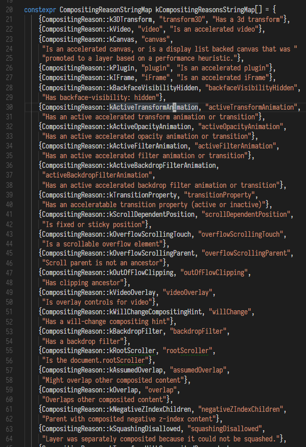
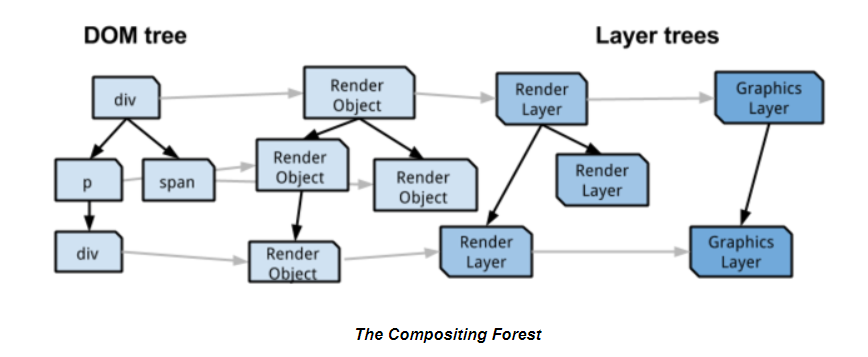

### GPU Accelerated Compositing in Chrome

*注: 因为 [Slimming Paint](https://www.chromium.org/blink/slimming-paint)的缘故, 关于这部分的代码正在发生改变, 并且未来可能发生很大的改变. 注意下文中一些类名也已经改变(eg. RenderObject 变成了 LayoutObject, RenderLayer 变成了  PaintLayer).*

*译注: 就目前(2018.5.4)而言, 这里的内容已经发生了很大的改变, 不过对于学习浏览器渲染过程仍然有参考意义. 另外下文中的硬件基本指代 GPU, 硬件合成 -> GPU 合成. 对于已经变更的名称(RenderObject -> LayoutObject 等)还是按照原文翻译.*

##### 概要

本文说明了一些相关背景以及 Chrome 中的硬件加速合成的具体实现.

##### 简介: 为什么使用硬件合成(GPU 合成)?

传统中, 浏览器完全依赖 CPU 来渲染 Web 页面的内容. 然而现在, 即使是最小型的设备, 功能强大的 GPU 也已经是它们不可或缺的一部分. 人们开始将注意力放在寻找更有效地利用这个底层硬件(GPU)的方法上来, 以便获得更好的性能和节能. 使用 GPU 来合成 Web 页面的内容可以获得显著的速度提升.

硬件合成有以下三个优点:

1. 在涉及大量像素的绘制与合成操作时, 在 GPU  上合成页面图层(page layers)比在 CPU 上合成的效率高得多(不论是速度还是功耗). GPU 是专门为这类工作而设计的.
2. 对于已经在 GPU 中的内容(如加速视频, Canvas2D, 或 WebGL), 不需要昂贵的回读(readbacks, 数据传输的开销).
3. 通过 CPU 和 GPU 之间的并行化, 它们可以同时进行操作, 以创建一个高效的[图形渲染管线(graphics pipeline)](http://gad.qq.com/article/detail/26926).

最后, 在我们开始之前, 有一个重要的声明: 在过去几年中, Chrome 的图形堆栈(graphics stack)已经发生了很大的变化. 本文将着重介绍编写时最先进的架构, 而不是所有平台上的通用架构. 有关启用哪些功能的细节, 请参阅 [GPU architecture roadmap](https://dev.chromium.org/developers/design-documents/gpu-accelerated-compositing-in-chrome/gpu-architecture-roadmap). 不在开发中的代码路径将仅在最低限度覆盖(不知道怎么翻译...).

#### 第一部分: Blink 渲染基础

Blink 渲染引擎的源码非常庞大, 复杂, 资料甚少. 为了理解 GPU 加速在 Chrome 中是如何工作的, 很重要的一点是, 首先要理解 Blink 如何渲染页面的基本构建块(basic building blocks).

##### Nodes 和 DOM 树

在 Blink 中, Web 页面的内容在内部被存储为一个由很多个 Node 对象组成的树状结构, 被称为 DOM 树. 页面闪每个 HTML 元素以及元素之间的文本(匿名块级/行内元素?)都有一个 Node 对象与之对应. DOM 树中最顶级的 Node 总是 Document Node.

##### 从 Node 到 RenderObject

DOM 树中每个可见的 Node 都有一个 RenderObject 与之对应. RenderObject 被存储在另一个树状结构中, 被称为渲染树(Render Tree). 一个 RenderObject 知道如何将 Node 的内容绘制到显示设备上. 它通过对图形上下文(GraphicsContext)发出必要的绘图调用来实现这一操作. 图形上下文复杂将像素写入位图(bitmap), 位图最终会显示在屏幕上. 在 Chrome 中, 图形上下文封装了 Skia, 我们的 2D 绘图库.

传统上, 大部分对图形上下文的调用都会称为对 SkCanvas 或 SkPlatformCanvas 的调用, 即立即绘制到软件位图(software bitmap)中(参考[这个文档](https://www.chromium.org/developers/design-documents/graphics-and-skia)获取更多关于 Chrome 如何使用 Skia 的信息). 但是为了将绘制工作从主线程中移除(本文少会会详细介绍), 现在这些(调用)命令将被先记录到一个 SkPicture 中(而不是立即绘制到位图). SkPicture 是一个序列化的数据结构, 它可以拦截调用命令并在之后重新执行这些命令, 类似一个 [display list](https://en.wikipedia.org/wiki/Display_list).

##### 从 RenderObject 到 RenderLayer

每一个 RenderObject 都直接或间接地通过一个祖先 RenderObject 与一个 RenderLayer 对应(即可能多个 RenderObject 对应一个 RenderLayer).

一个 RenderLayer 下的 RenderObject 们通常共享相同的坐标系(例如受同一个 CSS transform 的影响, 有点类似一个包含块或者层叠上下文, 事实上就是一个层叠上下文). RenderLayer 的存在, 使得页面元素可以按照正确的顺序合成, 进而使得可以正确地显示重叠内容和半透明元素等. 有许多情况会触发为特定的 RenderObject 创建一个新的 RenderLayer, 这些情况被定义在 RenderBoxModelObject::requiresLayer() (现在已经不在这里了, 在 LayoutBoxModelObject::LayerTypeRequired()), 并且被一些派生类重写. 为 RenderObject 创建 RenderLayer 的一般情况:

1. 它是页面的根元素
2. 它有显式的 CSS 定位属性(relative, absolute 或者 transform)
3. 它有透明度
4. 它有 `overflow`, alpha mash, reflection(??)
5. 它有 CSS 滤镜
6. 上下文为 WebGL 的 Canvas 或 2D 硬件加速的 Canvas(FF 和 Chrome 现在应该默认开启硬件加速, 据说 Chrome 对 256x256 以下的 Canvas 不做硬件加速, 如果没有, 也可以通过 `translateZ(0)` 给 Canvas 开启)
7. `<video>` 元素

*译注: 其实这块内容随着前端技术变化已经不止这些了, 不过大体上可以理解为 RenderLayer 即是层叠上下文, 所以创建层叠上下文的条件通常也适用于创建 RenderLayer*

注意 RenderObject 和 RenderLayer 之间不是一一对应的. 一个特定的 RenderObject 只和它自己创建的 RenderLayer 有关联, 或者和第一个具有自己的 RenderLayer 的祖先 RenderObject 的 RenderLayer  有关联.

RenderLayer 们也构成一个树状结构. 根节点的 RenderLayer 和页面根元素对应, 视觉上, 每个节点的后代都是父层中的层(像层叠上下文那样). 每个 RenderLayer 的子节点(子树的所有节点)都保存在两个有序的升序列表中. negZOrderList 列表中包含具有负 Z 坐标的子节点(它们低于当前层), posZOrderList 列表中包含具有正 Z 坐标的子节点(它们高于当前层).

##### 从 RenderLayer 到 GraphicsLayer

为了利用合成器(compositor), 一些(但不是全部) RenderLayer 被认为是合成层(compositing layer), 这些 RenderLayer 具有自己的 backing surface(可以理解为有背面的 RenderLayer 即是合成层). 如果 RenderLayer 是合成层, 则它具有自己的 GraphicsLayer, 否则使用它第一个具有 GraphicsLayer 的祖先 RenderLayer 的 GraphicsLayer. 这有点像 RenderObject 和 RenderLayer 之间的关系.

每个 GraphicsLayer 都有一个图形上下文(GraphicsContext)供相关的 RenderLayer 绘制(即 RenderLayer 调用 GraphicsContext 绘图). 合成器在后续的合成操作中最终负责将 GraphicsContext 输出的位图合并到一起, 变成一个屏幕图像.

尽管理论上每个 RenderLayer 都可以把自己绘制到一个单独的 backing surface 中去, 但实际上, 这可能非常浪费内存(尤其是显存). 在目前的 Blink 实现中, 下列情况的 RenderLayer 具有它自己的合成层(可以参考 [Chromium 源码](chromium/third_party/blink/renderer/platform/graphics/compositing_reasons.cc)):

*注: 以下它指代 RenderLayer, 这意味着先决条件是元素必须是一个 RenderLayer.*

1. 它有 3D 的 `transform` 或 `perspective`
2. 它是硬件加速解码的 `<video>`
3. 它是硬件加速的 `<canvas>` 或 3D 上下文(WebGL)的 `<canvas>`
4. 它是硬件加速的插件(比如 flash)
5. 它为 `opacity` 或 `transform` 创建了 animation 动画
6. 它使用了硬件加速的 `filter`
7. 它的一个子孙 RenderLayer 是一个合成层
8. 它的一个比它 Z 轴低的兄弟 RenderLayer 具有合成层(换句话说它盖在一个合成层之上)

*译注: GraphicsLayer 可以看作是后文中的位图, 纹理, 传给 GPU 的图层, Devtools 中 Layers 显示的图层, 另外这部分内容也不再只有这一点了, 具体可以看源码, 以下列举部分常见情况*

1. 它有 3D 的 `transform` 或 `perspective`
2. 它是硬件加速解码的 `<video>`
3. 它是硬件加速的 `<canvas>` 或 3D 上下文(WebGL)的 `<canvas>`
4. 它是硬件加速的插件(比如 flash)
5. 它是一个硬件加速的 `<iframe>` (比如 `<iframe>` 中有合成层)
6. 它(所属的元素)有 `backface-visibility: hidden`
7. 它为 `opacity` 或 `transform` 或 `filter` 或 `backdrop-filter` 创建了 animation 或 transition 动画(只会在动画过程中为其创建合成层, 动画开始之前或结束后都不会有合成层)
8. 它有 `fixed` 或 `sticky` 定位(实测好像并没有, 据说和屏幕 DPI 有关)
9. 它的 `will-change` 是 `opacity` `transform` `top` `bottom` `left` `right`, 其中 `top` 等必须在有非 `static` 定位的情况下才会创建合成层
10. ...

其实还有很多情况, 比如重叠因素, 具体可以在 Devtools 中看到创建合成层的原因, 再针对性进行优化. 也可以参考 Chromium 源码.

##### 层压缩

所有的规则都有例外. 就像之前提到的, 就内存和其他资源而言, 创建 GraphicsLayer 的成本可能很高(例如某些关键操作的 CPU 时间复杂度和 GraphicsLayer 树的大小成正比). 当一个 RenderLayer 叠在一个有自己 backing surface 的 RenderLayer 时, 可能导致创建许多额外的 GraphicsLayer, 这代价很昂贵.

我们把创建合成层的自身原因(比如它自身有 3D transform)称为直接原因. 为了防止其他一些 RenderLayer 叠在因直接原因创建的合成层智商而导致"图层爆炸"(即因为其他原因创建了许多额外的图层), Blink 将多个 RenderLayer 与具有直接原因的 RenderLayer 重叠, 并将他们压缩成一个后备存储(即把多个因为同样原因创建的额外图层压缩成一个). 这阻止了因为层叠导致的"图层爆炸". 更多关于层压缩的细节可以参考[这里](https://docs.google.com/presentation/d/1WOhbWLkhMyo4vZUaHq-FO-mt0B2sejXw-lMwohD5iUo/edit#slide=id.g2a8a2080a_088)和[这里](https://docs.google.com/presentation/d/1dDE5u76ZBIKmsqkWi2apx3BqV8HOcNf4xxBdyNywZR8/edit#slide=id.p)

##### 从 GraphicsLayer 到 WebLayer 到 CC Layer 

在我们开始讨论合成器的实现之前, 还需要再添加几层抽象. GraphicsLayer 的内容可以通过一个或多个 WebLayer 来表示. 这部分不是很重要就不翻译了...

##### 把它们放在一起: The Compositing Forest

总结, 在概念上有四个平行的树结构, 它们对于渲染来说有不同的意义:

* DOM 树, 是我们的基本模型
* RenderObject 树, 同 DOM 树的可见节点是一一对应的, RenderObject 知道如何绘制它们对应的 DOM 节点
* RenderLayer 树, 由 RenderLayer 组成, 一个 RenderLayer 对应到 RenderObject 树中的一个 RenderObject, 该映射是多对一的(多个 RenderObject 对应到一个 RenderLayer), 因为每个 RenderObject 都与自己的 RenderLayer 或者第一个祖先的 RenderLayer 对应. RenderLayer 树保留了层之间的 Z 轴顺序
* GraphicsLayer 树, 由 GraphicsLayer 组成, GraphicsLayer 和 RenderLayer 的关系是一对多的

Chrome compositor layer(CC layer) 中具有 Web Layer, Web Layer 实现了 GraphicsLayer. 最终合成器通过操作这些 CC layer 来进行合成操作.(看起来 CC Layer 是 GraphicsLayer 的具体实现)

在这篇文档中, 图层是指一个 CC layer, 但是在其他地方, 当人们说图层时, 他们可能指的是上述任何结构.

#### 第二部分: 合成器

##### TODO

#### 术语表

* **位图(bitmap)**: 内存或显存中一段像素值的缓冲区
* **纹理(texture)**: GPU 中表示 3D 模型的位图(但不是一定要用来表示 3D 模型, 个人理解和普通位图也没差)
* **texture quad**: 用于简单的四边形模型的纹理, 比如矩形
* **invalidation**
* **painting**: 用我们的术语来说, 就是 RenderObject 调用 GraphicsContext API 来可视化它们自身的渲染阶段
* **rasterization**
* **合成(compositing)**: 用我们的术语来说, 就是将 RenderLayer 的纹理组合成最终屏幕上的图片(内存/显存/帧缓冲器中的图片)的渲染阶段
* **drawing**: 用我们的术语来说, 就是将最终的图片绘制到屏幕上的渲染阶段
* **backbuffer**
* **frontbuffer**
* **swapbuffer**
* **Frame Buffer Object**: OpenGL 术语, 
* **damage**
* **retained mode**
* **immediate mode**
* **context virtualization**

*译注: 这里重点说下 painting, compositing, drawing, 简单理解 painting 就是渲染单个元素的阶段, 输出的是一块块渲染好的 RenderLayer 或者理解为层叠上下文的位图, compositing 就是把这些渲染好的 RenderLayer 拼成整屏的图片, drawing 则是从帧缓冲器中将图片绘制到屏幕的阶段*

#### 参考资料

* https://www.chromium.org/developers/design-documents/gpu-accelerated-compositing-in-chrome
* https://sinaad.github.io/xfe/2016/05/10/gpu-accelerated-compositing-in-chrome/
* http://gad.qq.com/article/detail/26926
* https://blog.csdn.net/shenzi/article/details/5417488
* https://stackoverflow.com/questions/22635658/how-to-enable-accelerated-hardware-in-javascript-for-canvas
* http://taobaofed.org/blog/2016/04/25/performance-composite/
* https://docs.google.com/presentation/d/1WOhbWLkhMyo4vZUaHq-FO-mt0B2sejXw-lMwohD5iUo/edit#slide=id.g2a8a2080a_088
* https://docs.google.com/presentation/d/1dDE5u76ZBIKmsqkWi2apx3BqV8HOcNf4xxBdyNywZR8/edit#slide=id.p
* chromium/third_party/blink/renderer/core/layout/layout_box_model_object.h
* chromium/third_party/blink/renderer/platform/graphics/compositing_reasons.h
* chromium/third_party/blink/renderer/platform/graphics/compositing_reasons.cc
* chromium/third_party/blink/renderer/core/layout/layout_object.h
* chromium/third_party/blink/renderer/core/paint/paint_layer.h
* chromium/third_party/blink/renderer/platform/graphics/graphics_layer.h
* chromium/third_party/blink/renderer/platform/graphics/graphics_context.h