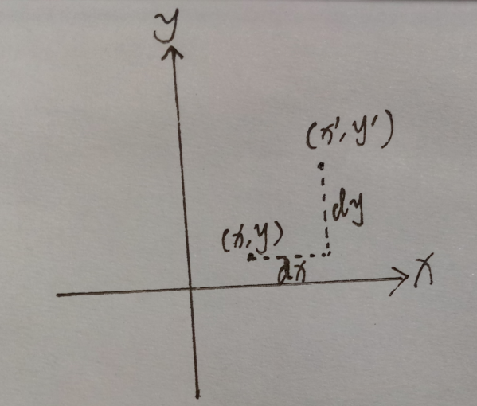
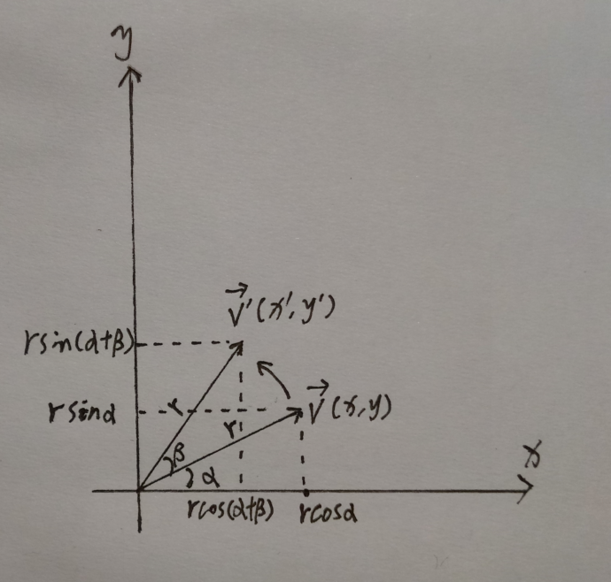
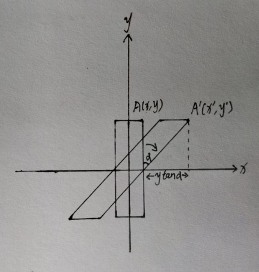
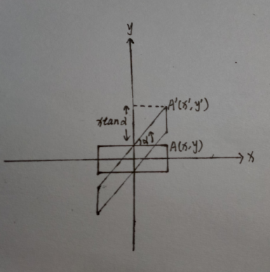
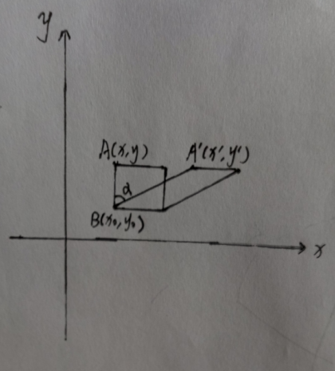
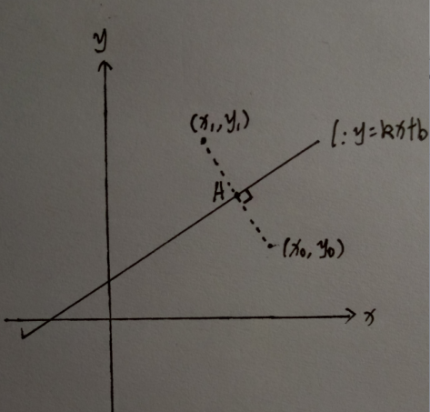

图形学和数学都比较渣的我其实并没有信心写好关于动画的内容, 只能是根据自己的理解浅显地写点内容了.

### 2D 图形变换

#### 平移(translate)

假如我们有一个点 (x, y), 向上平移了 dx 的距离, 向右平移了 dy 的距离, 新的坐标为 (x', y').

则

$$x' = x +dx$$

$$y' = y + dy$$

这样我们可以把对 (x, y) 应用平移变换写成这样一个矩阵运算

$$\begin{bmatrix}1 & 0 & dx \\ 0 & 1 & dy \\ 0 & 0 & 1\end{bmatrix} \begin{bmatrix}x \\ y \\ 1 \end{bmatrix} = \begin{bmatrix}x + dx \\ y + dy \\ 1 \end{bmatrix}$$

其中

$$T = \begin{bmatrix}1 & 0 & dx \\ 0 & 1 & dy \\ 0 & 0 & 1\end{bmatrix}$$

即是二维坐标系的平移变换矩阵.

#### 缩放(scale)

如果我们希望把一个向量 $\vec v (x, y)$ 缩放 k 倍到 $\vec v (kx, ky)$. 我们可以把对 $\vec v (x, y)$ 应用缩放写成这样一个矩阵运算

$$\begin{bmatrix}k & 0 \\ 0 & k\end{bmatrix} \begin{bmatrix}x \\ y\end{bmatrix} = \begin{bmatrix}kx \\ ky\end{bmatrix}$$

不过为了和平移变换统一成一种形式, 我们可以把缩放变换的矩阵写成

$$S = \begin{bmatrix}k & 0 & 0 \\ 0 & k & 0 \\ 0 & 0 & 1\end{bmatrix}$$

#### 旋转(rotate)

如果我们希望把一个向量 $\vec v (x, y)$ 旋转 $\beta$ 的角度到 $\vec v' (x', y')$, 如图

易知

$$x' = r cos(\alpha + \beta) = r cos\alpha cos\beta - r sin\alpha sin\beta = x cos\beta - y sin\beta$$

$$y' = r sin(\alpha+\beta) = r sin\alpha cos\beta + r cos\alpha sin\beta = y cos\beta + x sin\beta$$

于是旋转变换的矩阵运算是

$$\begin{bmatrix}cos\beta & -sin\beta \\ sin\beta & cos\beta\end{bmatrix} \begin{bmatrix}x \\ y\end{bmatrix} =  \begin{bmatrix}x cos\beta - y sin\beta \\ y cos\beta + x sin\beta\end{bmatrix}$$

同样, 我们可以把旋转变换矩阵统一成三阶

$$R = \begin{bmatrix}cos\beta & -sin\beta & 0 \\ sin\beta & cos\beta & 0 \\ 0 & 0 & 1\end{bmatrix}$$

同理, 绕任意一点(旋转中心) $(x_0, y_0)$ 旋转 $\beta$ 角度

$$x' =x_0 + r cos(\alpha + \beta) =x_0 + r cos\alpha cos\beta - r sin\alpha sin\beta = x_0 + (x - x_0) cos\beta - (y - y_0) sin\beta$$

$$y' = y_0 + r sin(\alpha+\beta) = y_0 + r sin\alpha cos\beta + r cos\alpha sin\beta = y_0 + (y - y_0) cos\beta + (x - x_0) sin\beta$$

所以此时

$$R = \begin{bmatrix}cos\beta & -sin\beta & x_0-x_0 cos\beta + y_0sin\beta \\ sin\beta & cos\beta & y_0 - x_0 sin\beta - y_0 cos\beta \\ 0 & 0 & 1\end{bmatrix}$$

等价于先对图形进行了旋转, 再对图形进行平移.

#### 错切(skew)

错切变换稍稍麻烦一点, 简单来讲就是图形绕某一点倾斜. 像下面这样的水平方向倾斜, 我们称为水平错切.

可以看到, 错切右两个特点, 一个是错切变换后图形的面积不变, 一个是图形上每个点的 y 坐标不变(对于水平错切而言). 对于水平错切中, 图形中任意一点变换后的坐标是

$$x' = x + y tan\alpha$$

$$y' = y$$

于是水平错切的矩阵运算是

$$\begin{bmatrix}1 & tan\alpha \\ 0 & 1\end{bmatrix} \begin{bmatrix}x \\ y\end{bmatrix} = \begin{bmatrix}x + tan\alpha \\ y\end{bmatrix}$$

垂直错切也类似

图形中任意一点变换后的坐标是

$$x' = x$$

$$y' = y + x tan\alpha$$

垂直错切的矩阵运算是

$$\begin{bmatrix}1 & 0 \\ tan\alpha & 1\end{bmatrix} \begin{bmatrix}x \\ y\end{bmatrix} = \begin{bmatrix}x \\ y + x tan\alpha \end{bmatrix}$$

当然, 我们也可以同时对水平方向倾斜 $\alpha$ 的角度, 对垂直方向倾斜 $\beta$ 的角度, 于是我们的错切变换矩阵是

$$Tr = \begin{bmatrix}1 & tan\alpha & 0 \\ tan\beta & 1 & 0 \\ 0 & 0 & 1\end{bmatrix}$$

当然, 有人会讲, 你这里旋转中心刚好是原点, 那其他情况呢? 比如

现在旋转中心是 B 点. 本质上讲, 改变旋转中心就是平移. 显然

$$x' = x + (y - y_0)\cdot tan\alpha = x + y tan\alpha - y_0 tan\alpha$$

$$y' = y$$

所以改变旋转中心为 $(x_0, y_0)$ 的话就是

$$\begin{bmatrix}1 & tan\alpha & -y_0 tan\alpha \\ tan\beta & 1 & -x_0 tan\beta \\ 0 & 0 & 1\end{bmatrix} \begin{bmatrix}x \\ y \\ 1\end{bmatrix} = \begin{bmatrix}x + y tan\alpha - y_0 tan\alpha \\ y + x tan\beta - x_0tan\beta \\ 1\end{bmatrix}$$

所以其实我们相对于先对图形进行了错切变换, 然后改变旋转中心相当于对图形进行了平移.

#### 对称

对称比较简单, 考虑一个点 $M(x_0, y_0)$ 关于直线 $l: y = kx +b, k \not= 0$ 对称. 求对称点 $N(x_1, y_1)$.

易知直线 $MN$ 为 $y = -\frac{1}{k}x + y_0 + \frac{1}{k}x_0$   A 点坐标为 $(\frac{x_1 + x_0}{2}, \frac{y_1 + y_0}{2})$, 代入 $y = kx + b$ 得

$$\frac{y_1 + y_0}{2} = k(\frac{x_1 + x_0}{2}) + b$$

代入 $y = -\frac{1}{k}x + y_0 + \frac{1}{k}x_0$ 得

$$\frac{y_1+y_0}{2} = -\frac{1}{k}(\frac{x_1+x_0}{2}) + y_0 + \frac{1}{k}x_0$$

两式解得

$$x_1 =  \frac{-k^2+1}{k^2+1}x_0 + \frac{2k}{k^2+1}y_0 - \frac{2kb}{k^2+1}$$

$$y_1 = \frac{2k}{k^2+1}x_0 + \frac{k^2-1}{k^2+1}y_0 + \frac{2b}{k^2+1}$$

所以对某一点 $(x, y)$ 应用关于 $y = kx + b, k\not=0$ 的对称变换为

$$\begin{bmatrix}\frac{-k^2+1}{k^2+1} & \frac{2k}{k^2+1} & \frac{-2kb}{k^2+1} \\ \frac{2k}{k^2+1} & \frac{k^2-1}{k^2+1} & \frac{2b}{k^2+1} \\ 0 & 0 & 1\end{bmatrix} \begin{bmatrix}x \\ y \\ 1\end{bmatrix} = \begin{bmatrix}\frac{-k^2+1}{k^2+1}x + \frac{2k}{k^2+1}y - \frac{2kb}{k^2+1} \\ \frac{2k}{k^2+1}x + \frac{k^2-1}{k^2+1}y + \frac{2b}{k^2+1} \\ 1\end{bmatrix}$$

而上面的变换也可以分解成先对点平移 -b 的距离, 再相对于 $y = kx, k\not=0$ 对称, 再平移 b 的距离, 即

$$\begin{bmatrix}1 & 0 & 0 \\ 0 & 1 & b \\ 0 & 0 & 1\end{bmatrix} \begin{bmatrix}\frac{-k^2+1}{k^2+1} & \frac{2k}{k^2+1} & 0 \\ \frac{2k}{k^2+1} & \frac{k^2-1}{k^2+1} & 0 \\ 0 & 0 & 1\end{bmatrix} \begin{bmatrix}1 & 0 & 0 \\ 0 & 1 & -b \\ 0 & 0 & 1\end{bmatrix} \begin{bmatrix}x \\ y \\ 1\end{bmatrix} = \begin{bmatrix}\frac{-k^2+1}{k^2+1}x + \frac{2k}{k^2+1}y - \frac{2kb}{k^2+1} \\ \frac{2k}{k^2+1}x + \frac{k^2-1}{k^2+1}y + \frac{2b}{k^2+1} \\ 1\end{bmatrix}$$

是等价的, 中间的矩阵即相对于 $y = kx, k\not=0$ 对称的变换矩阵.

所以关于 $y = kx+b, k\not=0$ 的对称变换矩阵为

$$A = \begin{bmatrix}\frac{-k^2+1}{k^2+1} & \frac{2k}{k^2+1} & \frac{-2kb}{k^2+1} \\ \frac{2k}{k^2+1} & \frac{k^2-1}{k^2+1} & \frac{2b}{k^2+1} \\ 0 & 0 & 1\end{bmatrix}$$

而关于 x 轴对称的话, 显然 $y' = -y$, 变换矩阵为

$$\begin{bmatrix}1 & 0 & 0 \\ 0 & -1 & 0 \\ 0 & 0 & 1\end{bmatrix}$$

关于 y 轴对称的话, $x' = -x$, 变换矩阵为

$$\begin{bmatrix}-1 & 0 & 0 \\ 0 & 1 & 0 \\ 0 & 0 & 1\end{bmatrix}$$

### 3D 图形变换

和 2D 基本类似, 只不过矩阵增加一个维度.

#### 平移

$$T = \begin{bmatrix}1 & 0 & 0 & dx \\ 0 & 1 & 0 & dy \\ 0 & 0 & 1 & dz \\ 0 & 0 & 0 & 1\end{bmatrix}$$

#### 缩放

$$S = \begin{bmatrix}k & 0 & 0 & 0 \\ 0 & k & 0 & 0 \\ 0 & 0 & k & 0 \\ 0 & 0 & 0 & 1\end{bmatrix}$$

#### 旋转

##### 绕 x 轴旋转

$$R_x = \begin{bmatrix}1 & 0 & 0 & 0 \\ 0 & cos\beta & -sin\beta & 0 \\ 0 & sin\beta & cos\beta & 0 \\ 0 & 0 & 0 & 1\end{bmatrix}$$

##### 绕 y 轴旋转

$$R_y = \begin{bmatrix}cos\beta & 0 & -sin\beta & 0 \\ 0 & 1 & 0 & 0 \\ sin\beta & 0 & cos\beta & 0 \\ 0 & 0 & 0 & 1\end{bmatrix}$$

##### 绕 z 轴旋转

$$R_z = \begin{bmatrix}cos\beta & -sin\beta & 0 & 0 \\ sin\beta  & cos\beta & 0 & 0 \\ 0& 0 & 1 & 0 \\ 0 & 0 & 0 & 1\end{bmatrix}$$

需要注意的是, 绕 y 轴旋转, 因为 x z 轴构成了一个左手坐标系, 所以两个 sin 的位置刚好相反.

##### 绕任意轴旋转

这个推导比较麻烦...好吧, 其实我也不会, 不过还是抄一个放这里. 考虑一个轴的单位向量 (x, y, z), 绕该轴旋转了 $\theta$ 角度. 变换矩阵为

$$R = \begin{bmatrix}1+(1-cos\theta)(x^2-1) & zsin\theta+xy(1-cos\theta) & -ysin\theta+xz(1-cos\theta) & 0\\ -zsin\theta+xy(1-cos\theta) & 1+(1-cos\theta)(y^2-1) & xsin\theta+yz(1-cos\theta) & 0\\ ysin\theta+xz(1-cos\theta) & -xsin\theta+yz(1-cos\theta) & 1+(1-cos\theta)(z^2-1) & 0 \\ 0 & 0 & 0 & 1\end{bmatrix}$$

#### 错切

3D 里面有这东西嘛...

#### 对称

关于点对称? 关于直线对称? 关于面对称? ...

好了, 数学水平有限, 就到这里吧...

#### 参考资料

* https://zh.wikipedia.org/wiki/%E9%BD%90%E6%AC%A1%E5%9D%90%E6%A0%87
* https://www.zhihu.com/question/19816504
* https://zh.wikipedia.org/wiki/%E6%97%8B%E8%BD%AC%E7%9F%A9%E9%98%B5
* https://blog.csdn.net/a396901990/article/details/44905791
* https://blog.csdn.net/shenziheng1/article/details/51227962
* https://www.zhihu.com/question/20666664/answer/157400568
* https://www.cnblogs.com/AirGuanZ/p/6365702.html
* https://www.cnblogs.com/graphics/archive/2012/07/25/2582119.html
* http://www.qiujiawei.com/linear-algebra-12/