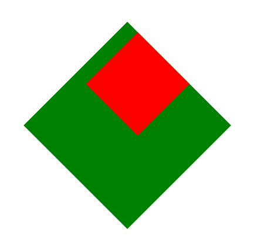

有了前一节的基础, 下面我们看一下怎么在 CSS 中使用这些图形变换吧. 主要是通过下面这些属性了.

* `transform-box`
* `transform-origin`
* `transform`
* `transform-style`
* `perspective`
* `perspective-origin`
* `backface-visibility`


#### 可变换元素(transformable element)

> A transformable element is an element in one of these categories:
>
> - an element whose layout is governed by the CSS box model which is either a [block-level](https://www.w3.org/TR/CSS2/visuren.html#block-level) or [atomic inline-level element](https://www.w3.org/TR/CSS2/visuren.html#x13), or whose [display](https://drafts.csswg.org/css-display-3/#propdef-display) property computes to [table-row](https://drafts.csswg.org/css-display-3/#valdef-display-table-row), [table-row-group](https://drafts.csswg.org/css-display-3/#valdef-display-table-row-group), [table-header-group](https://drafts.csswg.org/css-display-3/#valdef-display-table-header-group), [table-footer-group](https://drafts.csswg.org/css-display-3/#valdef-display-table-footer-group), [table-cell](https://drafts.csswg.org/css-display-3/#valdef-display-table-cell), or [table-caption](https://drafts.csswg.org/css-display-3/#valdef-display-table-caption) [[CSS2\]](https://drafts.csswg.org/css-transforms-1/#biblio-css2)
> - an element in the SVG namespace and not governed by the CSS box model which has the attributes [transform](https://www.w3.org/TR/SVG11/coords.html#TransformAttribute), `patternTransform` or `gradientTransform`

简单来讲就是计算值为 `display: block;` `display: inline-block;` 以及 `display` 与表格相关的值的元素都是可变换元素. 当然, 还有一些 SVG 相关的.


#### transform-box

在对图形进行变换的时候, 我们总是会需要确定一个参考系, 并且还可能遇到一些百分比的单位, 这些百分比通常都是相对于某个盒子而言. 参考系和这个盒子就是由 `transform-box` 确定的. 属性作用于可变换元素, 有三个值:

* `border-box` 默认值
* `fill-box` 给 SVG 用的
* `view-box` 给 SVG 用的

即默认坐标系原点位于 border-box 左上角, 这个坐标系也叫本地坐标系(local coordinate system), 关于本地坐标系可以参考 [本地坐标系和transform-box](./本地坐标系和transform-box.md).


#### transform-origin

在上一节我们已经提到过旋转中心了, 旋转或者错切都和旋转中心有关, 旋转中心的位置就由该属性确定.

属性可以有三个分量, 分别是 x 轴, y 轴, z 轴的坐标, 可以用大部分长度单位, 也可以是百分比, 百分比相对于 `transform-box` 确定的矩形区域. x 和 y 轴还可以是 `top` `bottom` `left` `right` `center` 这样的关键字, z 轴不可以是百分比, 也没有关键字. eg.

```css
transform-origin: 10px;
transform-origin: 10px 10px;
transform-origin: 20% 20%;
transform-origin: top left;
transform-origin: 10px 20px 30px;
```

默认值是 `transform-origin: 50% 50%;`.

以下内容可以暂时跳过先看后面的.

当然我们也知道旋转中心不一定是坐标原点, 我们可以绕坐标系中任意一点旋转. 对于图形绕某一点 $(x_0, y_0)$ 旋转 $\beta$ 角度, 我们也知道旋转矩阵是

$$R = \begin{bmatrix}cos\beta & -sin\beta & x_0-x_0 cos\beta + y_0sin\beta \\ sin\beta & cos\beta & y_0 - x_0 sin\beta - y_0 cos\beta \\ 0 & 0 & 1\end{bmatrix}$$

这里我们考虑这样一个图形

```html
<div class="main">
	<div class="cube"></div>
</div>
```

```css
.main {
	width: 200px;
	height: 200px;
	border: 1px solid #000;
	margin: 100px;
}
.cube {
	width: 100px;
	height: 100px;
	background: #ffd8a8;
}
```


现在我们希望把它旋转 45 度. 于是我们写成

```css
.c0 {
	transform: rotate(45deg);
}
```


很好很完美. 但是用到了两个属性, 不够装逼, 我们还是希望发挥一下矩阵的作用的. 既然我们已经知道了旋转中心默认是 50% 50%, 也就是 $(50, 50)$, 又知道了旋转角度是 45 度, 那直接代入到矩阵就好了. 于是我们可以写成

$$R = \begin{bmatrix}cos\frac{\pi}{4} & -sin\frac{\pi}{4} & 50-50 cos\frac{\pi}{4} + 50sin\frac{\pi}{4} \\ sin\frac{\pi}{4} & cos\frac{\pi}{4} & 50 - 50 sin\frac{\pi}{4} - 50 cos\frac{\pi}{4} \\ 0 & 0 & 1\end{bmatrix}$$

```css
.c1 {
	transform: matrix(0.707107, 0.707107, -0.707107, 0.707107, 50, -20.710678);
}
```


嗯? 说好的原地旋转 45 度呢? 这他妈的是什么鬼? 接着我们发现如果我们去掉矩阵中的平移分量

```css
.c2 {
	transform: matrix(0.707107, 0.707107, -0.707107, 0.707107, 0, 0);
}
```

结果又如我们期望的那样原地旋转 45 度了.


所以真相只有一个, 那就是矩阵的坐标系并不是以本地坐标系为参考系的, 而是有一个隐藏的坐标系, 坐标原点位于本地坐标系的 50% 50% 处.


就是虚线标注的这个坐标系了. 你可能会说, 好了, 我懂了,  `transform-origin` 确定了一个新的坐标系. 不不不, 并不是这样. 旋转中心是旋转中心, 坐标原点是坐标原点, 旋转中心可能是坐标原点也可能不是.

我们再考虑一个情况, 我们希望这个方块绕本地坐标系 $(0, 0)$ 处旋转 45 度.

```css
.c3 {
	transform: rotate(45deg);
	transform-origin: 0 0;
}
```


嗯, 也符合预期, 不过还是用到了两个属性, 太 low, 我们继续换成矩阵形式. 现在我们已知旋转角是 45 度, 旋转中心是 $(0, 0)$, 不过旋转中心的坐标是相对于本地坐标系的, 而不是矩阵所用的那个隐藏坐标系, 所以这里我们需要把旋转中心的坐标转换到新的坐标系, 也就是 $(-50, -50)$. 于是旋转矩阵为

$$R = \begin{bmatrix}cos\frac{\pi}{4} & -sin\frac{\pi}{4} & -50+50 cos\frac{\pi}{4} - 50sin\frac{\pi}{4} \\ sin\frac{\pi}{4} & cos\frac{\pi}{4} & -50 + 50 sin\frac{\pi}{4} + 50 cos\frac{\pi}{4} \\ 0 & 0 & 1\end{bmatrix}$$

```css
.c4 {
	transform: matrix(0.707107, 0.707107, -0.707107, 0.707107, -50, 20.710678);
}
```


这样就对了.

其实这里主要是为了说明 `transform` 的各个变换函数, 包括 `matrix()`, 它们的坐标系并不是本地坐标系(border-box 左上角为原点), 而是以本地坐标系中 50% 50% 也就是图形的中心为原点的坐标系. 并且 `transform-origin` 只是用来确定旋转中心在本地坐标系中的位置, 不是确定这个隐藏坐标系的原点位置. 为了方便起见, 后文把这个隐藏坐标系称为**变换坐标系**好了.

另外用矩阵只是为了引出这个问题, 也并不是说用矩阵逼格就高, 在合适的场景用合适的方法才是好的, 毕竟很多时候直接用变换函数比用矩阵来得更加简洁方便.

[示例代码](https://github.com/ta7sudan/front-end-demo/blob/master/css/transform/demo0.html)


#### transform

这个属性其实我们已经很熟悉了, 就是指定对元素应用哪种图形变换. 作用于可变换元素, 这也是为什么它对 `display: inline;` 的元素不起作用的原因. 对于一个设置了 `transform` 非 `none` 的元素, 它会创建一个层叠上下文, 并且为定位元素创建包含块. 基本语法

```
TRANSFORM ::= "none" | <TRANSFORM-LIST>
TRANSFORM-LIST ::= <TRANSFORM-FUNCTION>{ TRANSFORM-FUNCTION}
TRANSFORM-FUNCTION ::= "matrix()" | "translate()" | "translateX()" | "translateY()" | "scale()" | "scaleX()" | "scaleY()" | "rotate()" | "skew()" | "skewX()" | "skewY()" | "matrix3d()" | "translate3d()" | "translateZ()" | "scale3d()" | "scaleZ()" | "rotate3d()" | "rotateX()" | "rotateY()" | "rotateZ()" | "perspective()"
```

注意, `transform` 不改变元素原有的大小, 比如缩小一个元素, 边上的元素并不会跟着挤过来, 放大一个元素, 边上的元素也不会被挤开. 尽管如此, 还是建议给 `transform` 的元素单独设置图层, 通过脱离文档流的形式隔离开, 避免在做动画的过程中出现可能的抖动.

另外如果需要通过 JS 操作 `transform`, 建议加上浏览器前缀:

* Opera: OTransform
* Webkit: webkitTransform
* IE/Edge: msTransform
* FF: MozTransform


##### translate() / translate3d() / translateX() / translateY() / translateZ()

平移变换, 其中 Z 轴的变换不支持百分比单位

```css
transform: translate(15px, 15px);
transform: translate(-50%, -50%);
transform: translateX(15px);
transform: translateX(-50%);
transform: translateY(15px);
transform: translateY(-50%);
transform: translate3d(15px, 15px, 15px);
transform: translate3d(20%, 20%, 15px);
```


##### rotate() / rotate3d() / rotateX() / rotateY() / rotateZ()

旋转变换

```css
transform: rotate(30deg); // 2D 旋转 30 度
transform: rotate3d(1, 1, 1, 30deg); // 3D 旋转, 绕向量 (1, 1, 1) 旋转 30 度, 向量确定了旋转轴, 通常向量应当是单位向量, 如果不是的话, 浏览器也会处理成单位向量
transform: rotateX(30deg); // 3D 旋转, 绕 X 轴旋转 30 度
transform: rotateY(30deg); // 3D 旋转, 绕 Y 轴旋转 30 度
transform: rotateZ(30deg); // 3D 旋转, 绕 Z 轴旋转 30 度
```

需要注意的是, **每个元素的本地坐标系是以包含块的 DOM 的坐标系为参考系的**. 考虑这样一个情况.

```html
<div class="parent">
  <div class="child"></div>
</div>
```

```css
.parent {
  width: 200px;
  height: 200px;
  background: green;
  transform: rotate(45deg);
}

.child {
  width: 100px;
  height: 100px;
  background: red;
  transform: translate(20px);
}
```



子元素并没有水平方向平移, 而是沿着父元素的 X 轴方向平移了, 说明子元素的坐标轴跟着旋转了. 的确, 这是很显然的事情. 在 3D 变换的时候, 子元素的 Z 轴方向可能也会发生改变, 导致 Z 轴正方向并不是屏幕外面而是向内, 由近大远小可能导致一些与期望不符的结果, 所以这一点需要被考虑进去.


##### scale() / scale3d() / scaleX() / scaleY() / scaleZ()

缩放变换

```css
transform: scale(2, 1.5); // X 方向放大 2 倍, Y 方向放大 1.5 倍
transform: scale(2); // 等同于 scaleX(2)
transform: scaleX(2);
transform: scaleY(2);
transform: scaleZ(2);
transform: scale(2, 2, 2);
```

同样地, 对包含块进行缩放相对于缩放了包含块的 DOM 坐标系, 从而也会影响到子元素的本地坐标系和变换坐标系, 比如对包含块放大 2 倍, 会导致子元素平移 1 个单位看上去像平移了 2 个单位.


##### skew() / skewX() / skewY()

错切变换

```css
transform: skewX(30deg); // 水平错切 30 度
transform: skewY(30deg); // 垂直错切 30 度
transform: skew(30deg); // 等同于 skewX(30deg)
transform: skewY(30deg, 30deg);
```

同样, 也会对子元素变换坐标系产生影响.


##### matrix() / matrix3d()

又是我们熟悉的矩阵了. 矩阵中的值都是不带单位的, 默认单位 px.

```css
transform: matrix(10, 20, 30, 40, 50, 60);
```

等同于

$$\begin{bmatrix}10 & 30 & 50 \\ 20 & 40 & 60 \\ 0 & 0 & 1\end{bmatrix}$$

```css
transform: matrix3d(1, 2, 3, 4, 5, 6, 7, 8, 9, 10, 11, 12, 13, 14, 15, 16);
```

等同于

$$\begin{bmatrix}1 & 5 & 9 & 13 \\ 2 & 6 & 10 & 14 \\ 3 & 7 & 11 & 15 \\ 4 & 8 & 12 & 16\end{bmatrix}$$

等等, 按照我们之前接触过的变换来讲, 最后一行应该是没什么卵用的, 只需要 12 个参数即可, 为什么这里有 16 个参数? 因为还有几个变换我也不怎么会...有空再补上吧.


##### perspective()

透视变换, 这个留给等会 `perspective` 一起讲吧.

```css
transform: perspective(50px);
```


我们已经提到了很多个坐标系, 这里梳理一下它们的关系, 在没有任何变换时, 元素的位置由包含块的 DOM 坐标系确定, 也即包含块的 DOM 坐标系确定了元素的本地坐标系, 而元素的本地坐标系又确定了元素的变换坐标系, 元素应用 `transform` 是以变换坐标系为参考系的. 元素应用了变换的话会改变元素的 DOM 坐标系.

由矩阵乘法不满足交换律可知, 对 `transform` 应用各种变换的顺序不同, 其结果也不同.


#### perspective

之前我们已经提到透视变换, 既然是一种变换, 那它自然也可以通过一个矩阵乘法来完成. 我们就简单地知道有个透视变换的矩阵就好...那什么是透视变换?

我们先来考虑一个例子

```html
<div class="parent">
	<div class="child"></div>
	<div class="child"></div>
	<div class="child"></div>
	<div class="child"></div>
	<div class="child"></div>
	<div class="child"></div>
	<div class="child"></div>
	<div class="child"></div>
	<div class="child"></div>
</div>
```

```css
.parent {
	width: 300px;
	height: 300px;
	margin: 100px;
	background: #ef8b2c;
	border: 3px solid #666;
	border-radius: 5px;
	display: flex;
	justify-content: space-around;
	align-content: space-around;
	flex-wrap: wrap;
}

.child {
	width: 80px;
	height: 50px;
	border: 2px solid #666;
	border-radius: 5px;
	background: #7aaa1f;
}
```


我们原始的图形是这个样子的, 现在我们把它绕 X 轴旋转 45 度.

```css
.no-perspective-rotate {
	transform: rotateX(45deg);
}
```


可以看到, 图形的宽没变, 高度被压缩了. emmm...怎么说呢, 看上去好像没问题, 又好像有点问题. 问题就是, 绕 X 轴旋转了 45 度的话, 说明图形顶边离我们更远了, 图形底边离我们更近了, 按照近大远小的原则, 图形应该是个梯形才是. 但这里还是个矩形. So, 为什么呢?

这就是因为图形默认是没做透视变换的. 首先, 其实我们看到的实际图形都是原图形在某个平面上的投影. 在透视变换下, 我们看到的是一个[透视投影](https://zh.wikipedia.org/wiki/%E9%80%8F%E8%A7%86%E6%8A%95%E5%BD%B1). 在没有透视变换的情况下, 我们看到的实际图形更像是一个[正交投影](https://zh.wikipedia.org/wiki/%E4%B8%89%E7%BB%B4%E6%8A%95%E5%BD%B1). 正交投影就像是我们以前学过的三视图了, 这里就像是我们对图形绕 X 轴旋转了 45 度, 然后把它投影到一个与我们视线垂直的平面上, 我们看到的就是这个平面上图形的投影. 这也是为什么它依然是个矩形而不是梯形的原因.

那我们简单讲下透视变换. 似乎不同的平台对透视变换的实现都不太一样? 个人理解有些会把 near Z plane 和 far Z plane 之外的内容都切掉看不见, 不过 CSS 的处理并不是这样. 不过既然讨论的是 CSS 中的透视, 这里我们还是以 W3C 中的例子来说吧. 简单来说, **应用了透视变换后, 我们看到的图形都会满足近大远小, 没有应用透视变换, 那就是正交投影**.


在 CSS 中, 透视变换就像是这样, 我们把蓝色的圆所在的平面叫做绘制平面(Drawing Surface), 平面所在的参考系也是我们的变换坐标系. 实线的圆是我们的原图形, 默认情况下原图形当然是在 z=0 平面上的, 这里为了演示把原图形往 Z 轴正方向平移了 z 的距离得到一个原像, 也就是虚线的圆. 但是最终我们观察到的实际图形, 也就是我们的原像在绘制平面上的投影, 即是蓝色的圆. 于是经过透视变换后, 原图形的大小被缩放了, 缩放的比例是 $\frac{d}{d-z}$. 显然, z 为正的时候会被放大, z 为负的时候会被缩小. 所以我们看到的透视投影就是近大远小的了.

接下来我们还是回到 `perspective` 属性和 `perspective()` 函数.

`perspective` 属性作用于可变换元素, 根据 MDN 的描述, `perspective` 和 `perspective()` 都是控制人眼/照相机到变换坐标系 z=0 平面的距离. 对于 z > 0 的元素显得更大, z < 0 的元素显得更小. 

对于 z 大于 `perspective` 值的元素, 即它们在人眼的背后, 所以这些元素不会被绘制出来, 相当于你看不见它们. 

对于 `perspective` 不为 0 或 none 的元素来说, 它会创建一个层叠上下文, 以及被提升为包含块.

用法嘛, 当然是很简单的.

```css
transfrom: perspective(500px);
perspective: 500px;
```

但是扯了这么多, 说到底我们关心的难道不是它们到底有什么区别嘛?

本质上说, 它们都是 `matrix3d()` 的语法糖(废话). 毫无疑问, 对一个元素应用 `perspective()` 相当于乘上了一个透视变换矩阵. 这点来说, `perspective()` 的作用已经很明确了. 那 `perspective` 呢? 根据 W3C 文档

> The [perspective matrix](https://drafts.csswg.org/css-transforms-2/#perspective-matrix) is computed as follows:
>
> 1. Start with the identity matrix.
> 2. Translate by the computed X and Y values of [perspective-origin](https://drafts.csswg.org/css-transforms-2/#propdef-perspective-origin)
> 3. Multiply by the matrix that would be obtained from the [perspective()](https://drafts.csswg.org/css-transforms-2/#funcdef-perspective) transform function, where the length is provided by the value of the [perspective](https://drafts.csswg.org/css-transforms-2/#propdef-perspective) property
> 4. Translate by the negated computed X and Y values of [perspective-origin](https://drafts.csswg.org/css-transforms-2/#propdef-perspective-origin)

我们可以知道, 本质上它们也是一样的, 设置 `perspective` 会得到一个透视变换矩阵, 这个矩阵的计算方式是先根据 `perspective-origin` 进行平移, 再乘上一个 `perspective()` 的矩阵, 再根据 `perspective-origin` 平移回来. 关于 `perspective-origin` 具体参考后文.

所以准确说, `perspective()` 是一个基本的透视变换矩阵, 默认透视中心在图形正中心, `perspective-origin` 确定了透视中心. `perspective()` 和 `perspective-origin` 可以得到一个完整的相对于某个透视中心进行透视变换的矩阵(perspective matrix), 而 `perspective` 和 `perspective-origin` 也能得到这个完整的透视变换矩阵, 只不过 `perspective()` 在矩阵乘法中的顺序可以由你自己决定, 而 `perspective` 得到的透视变换矩阵总是被最后乘上去, 这也是导致它们表现不同的直接原因.

具体我们可以看几个例子. 还是之前的图形, 只不过我们把父元素绕 X 轴旋转了 45 度的同时给了 500px 的透视距离

```css
.perspective-property-rotate {
	perspective: 500px;
	transform: rotateX(45deg);
}
```


可以看到, 实际效果和正交投影一样. 而下面的例子中, 我们先对父元素进行绕 X 轴旋转 45 度, 再做透视

```css
.perspective-func-rotate0 {
	transform: rotateX(45deg) perspective(500px);
}
```


表现还是一样.

而假如先做透视, 再将 `div.parent` 旋转

```css
.perspective-func-rotate1 {
	transform: perspective(500px) rotateX(45deg);
}
```


终于, 我们想要的近大远小的效果出来了.

我们再看看给 `div.parent` 套一层, 对外层做透视, 对 `div.parent` 做旋转

```html
<div class="container container-perspective-porperty">
	<div class="parent rotate">
		<div class="child"></div>
		<div class="child"></div>
		<div class="child"></div>
		<div class="child"></div>
		<div class="child"></div>
		<div class="child"></div>
		<div class="child"></div>
		<div class="child"></div>
		<div class="child"></div>
	</div>
</div>
```

```css
.container {
	margin: 100px;
	display: inline-block;
}
.container > .parent {
	margin: 0;
}
.container-perspective-porperty {
	perspective: 500px;
}
```


和上一个例子是一样的.

再看看假如 `div.container` 是 `perspective()` 呢?

```css
.container-perspective-func {
	transform: perspective(500px);
}
```


有耐心的可以对比上面几个例子自己得出结论, 没耐心的直接看结论吧.

1. 实际效果来讲, 可以简单地认为 `perspective` 作用于父元素, 但是不会对父元素的渲染产生影响, 而是对子元素的渲染产生影响, 而 `perspective()` 对元素本身的渲染产生影响

2. ```css
   // 对于元素自身
   .elem {
       perspective: npx;
       transform: func0() func1() ... funcn();
   }
   // 等价于
   .elem {
       transform: func0() func1() ... funcn() perspective(npx);
   }
   // 等价于
   .elem {
       transform: func0() func1() ... funcn();
   }
   ```

3. ```css
   // 对于父子关系的元素
   .child {
       transform: perspective(npx) func0() ... funcn();
   }
   // 等价于
   .parent {
       perspective: npx;
   }
   .child {
       transform: func0() ... funcn();
   }
   ```

4. ```css
   // 对于只有 perspective() 的父元素
   .parent {
       transform: perspective(npx);
   }
   .child {
       transform: func0() ... funcn();
   }
   // 等价于父元素没有变换
   .child {
       transform: func0() ... funcn();
   }
   ```

5. 以上的等价于只是方便记忆, 不保证数学意义上的传递性...

6. 子元素和父元素都有变换的情况下, 相当于子元素先投影到父元素, 父元素再投影到绘制平面, 对于子元素而言, 相当于进行了多次投影

[示例代码](https://github.com/ta7sudan/front-end-demo/blob/master/css/transform/demo1.html)


#### perspective-origin

作用于可变换元素, 之前我们也简单地提到了 `perspective-origin` 是用来设置透视中心的, 那什么是透视中心?


默认情况下, `perspective-origin` 的值是 `50% 50%`, 和 `transform-origin` 一样, 相对于本地坐标系. 取值也和 `transform-origin` 一样. eg

```css
perspective-origin: 50% 50%;
perspective-origin: top left;
```

`perspective-origin` 和 `perspective` 一起确定了人眼的位置. 而具体到它产生的影响, 是对投影进行平移.


#### transform-style

作用于可变换元素, 控制一个元素的子元素是放置在 3D 空间中还是放置在元素的平面中. 通常是作用在一个父元素, 然后给子元素 3D 变换. 属性有两个值

* `flat` 默认值, 子元素放置在元素平面中
* `preserve-3d` 子元素放置在 3D 空间中

具体的效果还是看 demo.

默认还是这样


现在我们把子元素绕 X 轴旋转 45 度


子元素高度变小了, 没毛病. 接着我们给父元素

```css
.p0 {
	transform-style: preserve-3d;
}
```


看上去就像子元素一半埋在父元素下面了. 不过通常我们还是把它配合 `perspective` 一起用, 这样看起来更立体一点.

```css
.p1 {
	transform-style: preserve-3d;
	perspective: 500px;
}
```


这样看起来就真实许多了.

[示例代码](https://github.com/ta7sudan/front-end-demo/blob/master/css/transform/demo2.html)


#### backface-visibility

作用于可变换元素, 用来控制一个经过图形变换后的元素的背面是否可见. 属性有两个值.

* `visible` 默认值, 背面可见
* `hidden` 背面不可见

背面是指包括 `background` `border` `outline` 以及子元素等内容在内.


这里我们把一个元素绕 Y 轴旋转了 180 度, 可以看见默认情况下文字完全翻转了, 但可以看见翻转后的文字. 而下面的元素同样绕 Y 轴旋转了 180 度, 因为设置了 `backface-visibility: hidden;` 所以完全看不见了.

[示例代码](https://github.com/ta7sudan/front-end-demo/blob/master/css/transform/demo3.html)


#### 参考资料

* https://drafts.csswg.org/css-transforms/#transform-box
* https://drafts.csswg.org/css-transforms-1/#local-coordinate-system
* https://drafts.csswg.org/css-transforms-1/#transformable-element
* https://developer.mozilla.org/en-US/docs/Web/CSS/transform-box
* https://developer.mozilla.org/en-US/docs/Web/CSS/transform-origin
* https://developer.mozilla.org/en-US/docs/Web/CSS/transform
* https://developer.mozilla.org/en-US/docs/Web/CSS/transform-function
* https://drafts.csswg.org/css-transforms-2/#perspective
* https://zh.wikipedia.org/wiki/%E4%B8%89%E7%BB%B4%E6%8A%95%E5%BD%B1
* https://zh.wikipedia.org/wiki/%E9%80%8F%E8%A7%86%E6%8A%95%E5%BD%B1
* https://stackoverflow.com/questions/25910933/what-is-the-difference-between-perspective-and-transforms-perspective-propertie

