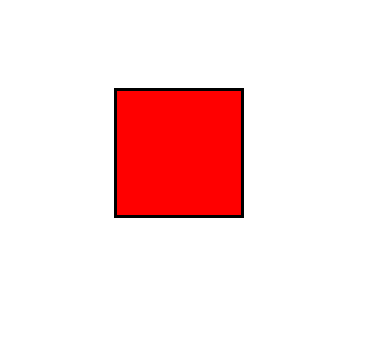
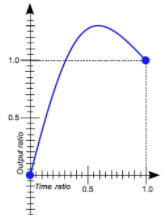
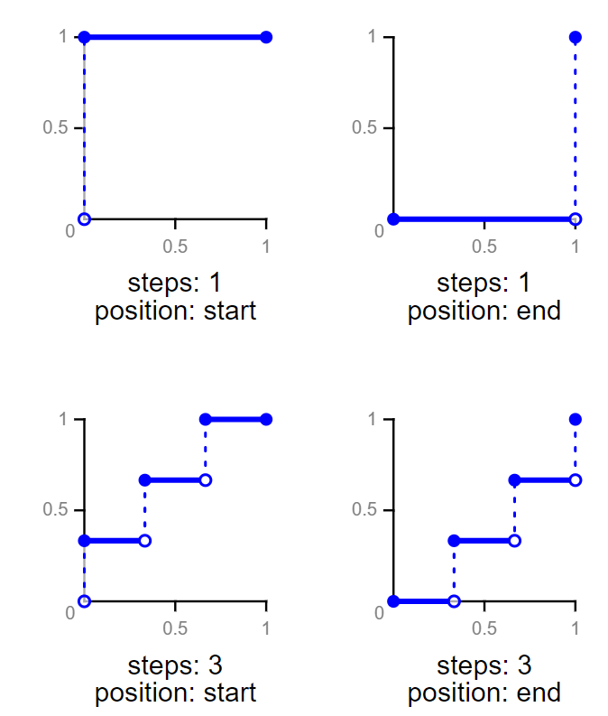
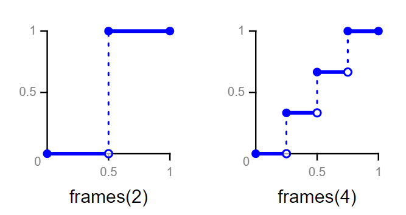

*注: 本文假定读者已经了解贝塞尔曲线*

之前一直在讲图形变换, 却没有讲怎么让图形动起来, 现在终于从虐人的数学中解脱出来了, 也来到我们的主题, 动画. 这一小节主要是讲 transition 动画. 什么是 transition 动画?

我们先来考虑一个最简单的情况, 就是一个图形从一个状态变成了另一个状态. 就像这样



吧唧, 一下就变过去了. 这也算是动画吧...虽然有点挫, 但是起码动起来了不是. 起码我们已经知道一点, 动画就是通过改变元素的一些属性来完成的. 剩下我们需要做的只是让动画看起来更自然一点.

当一个元素的 **CSS 属性改变**的时候, transition 动画就提供了这样一种方式让我们**控制属性变化的速度**, 而不是让属性立即生效. 关键字 CSS 属性改变和控制属性变化的速度.

让我们来看一个简单的例子, 里面的属性具体怎么使用先不管, 后面会慢慢介绍.

```html
<div class="cube"></div>
```

```css
.cube {
  width: 100px;
  height: 100px;
  border: 2px solid #555;
  margin: 100px;
  background: #fc3;
    
  transition: transform 1s ease;
}

.cube:hover {
  transform: translateX(100px);
}
```


这里我们给了 `div.cube` 一个 hover 效果, 标识了方块的 `transform` 从一个值改变到了另一个值, 然后 `transition` 指定了发生变化的属性是 `transform`, 动画的持续时间是 1s, 属性随时间变化的函数是 ease 即淡入淡出. 于是当我们鼠标移到方块上, 方块就慢慢平移到目标位置了, 当鼠标离开, 方块又回到原有位置. transition 动画的基本使用方式就是这样, 是不是很简单?

总结一下基本套路:

1. 给出元素某个属性的两个状态

2. `transition` 指定发生改变的属性

3. `transition` 指定动画持续的时间

4. `transition` 指定属性随时间变化的函数

5. 改变属性(可以用 js 操作 CSS 改变属性, 也可以通过改变 class 来改变属性, 我们需要的只是改变属性而不限制使用什么方式)

   关键点是 transition 动画必须通过改变属性来触发, 可以是用户行为(比如 hover)导致的改变, 也可以是开发人员自己改变的(比如通过 js), 这总是一个被动的过程.

事实上, `transition` 是以下属性的缩写.


#### transition-property

作用于所有元素, 包括 `::before` `::after` 伪元素. 指定要应用 transition 动画的属性, 或者说指定会发生改变的属性. 事实上并不是所有属性都可以用 transition 动画, 具体哪些属性可以用, 可以参考 https://developer.mozilla.org/en-US/docs/Web/CSS/CSS_animated_properties

属性有以下值

* `all` 默认值, 所有发生变化的属性
* `none` 没有任何属性会被应用 transition 动画
* 属性名

eg.

```css
transition-property: all;
transition-property: width, height, transform, background;
```

可以指定多个属性.


#### transition-duration

作用于所有元素, 包括 `::before` `::after` 伪元素. 指定 transition 动画持续的时间. 默认 0s. eg.

```css
transition-duration: 10s;
transition-duration: 100ms;
transition-duration: 10s, 20s;
```

同样, 可以有多个, 相对于为不同的属性定义不同的持续时间, 逗号分隔, 和 `transition-property` 一一对应.


#### transition-delay

作用于所有元素, 包括 `::before` `::after` 伪元素. 指定 transition 动画延迟生效的时间, 即允许我们在属性发生改变的时候不立即开始动画, 而是延迟一定时间才开始动画. eg.

```css
transition-delay: 2s;
transition-delay: 2s, 3s;
```

同样, 也可以有多个, 对应多个属性.


#### transition-timing-function

作用于所有元素, 包括 `::before` `::after` 伪元素. 指定属性随时间变化的函数. 具体什么是属性随时间变化的函数. 可以参考下面这个图.



我们把属性值从状态 0 到状态 1 看作一个 [0, 1] 的连续区间, 把 transition 动画的持续时间(不包含 `transition-delay`)也看作一个 [0, 1] 的连续区间. 横坐标是时间, 纵坐标是属性值. 属性值在 [0, 1] 的时间范围内随时间变化的函数即是 `transition-timing-function` 定义的函数.

属性的 BNF:

```
TIMING_FUNCTION ::= 'linear' | <CUBIC_BEZIER_TIMING_FUNCTION> | <STEP_TIMING_FUNCTION> | <FRAMES_TIMING_FUNCTION>
CUBIC_BEZIER_TIMING_FUNCTION ::= 'ease' | 'ease-in' | 'ease-out' | 'ease-in-out' | 'cubic-bezier()'
STEP_TIMING_FUNCTION ::= 'step-start' | 'step-end' | 'steps()'
FRAMES_TIMING_FUNCTION ::= 'frames()'
```

其中几个关键字

* `linear` 线性的, 即 $y = x$ 
* `ease` / `ease-in` / `ease-out` / `ease-in-out` 都是几个特定的贝塞尔曲线的简写, 提供了淡入淡出之类的效果, `ease` 是属性的默认值

eg.

```css
transition-timing-function: cubic-bezier(1, 2, 3, 4); // 一阶贝塞尔曲线, 参数是两个控制点的坐标
transition-timing-function: step-start;
transition-timing-function: step-end;
transition-timing-function: steps(5, end);
transition-timing-function: steps(6, start);
transition-timing-function: frames(3);
```

这里重点说下 `STEP_TIMING_FUNCTION` 和 `FRAMES_TIMING_FUNCTION`.

大部分时候我们用的都是连续的曲线, 即属性随时间的变化是连续的, 但假如我们希望属性随时间变化是不连续的的话, 就可以用到这两个函数了.

对于 `STEP_TIMING_FUNCTION`, 它的图像是这样.



比如 `steps(4, start)` 意味着将 `transition-duration` 的时间分成 4 份, 在每份时间开始的时候属性发生改变, 即一共改变四次. 而 `steps(4, end)` 则是在每份时间的最后属性才发生改变.

```html
<div class="cube c0"></div>
```

```css
.cube {
	width: 100px;
	height: 100px;
	border: 2px solid #555;
	background: #fc3;
	margin: 100px;
}

.c0 {
	transition: all 2s steps(4, start) 3s;
}
.c0:hover {
	transform: translateX(150px);
}
```


可以看到, 方块的移动过程并不是连续的, 而是一步一步. 对于 `step-start` 和 `step-end`, 分别等价于 `steps(1, start)` 和 `steps(1, end)`.

因为函数总是在 `transition-duration` 定义的区间内, 所以 `step-start` 也是在 `transition-delay` 之后属性才发生改变.


`FRAMES_TIMING_FUNCTION` 和 `STEP_TIMING_FUNCTION`  类似, 也是不连续的. 函数图像为



不过目前好像还没有什么浏览器支持这个函数.

[示例代码](https://github.com/ta7sudan/front-end-demo/blob/master/css/transition/demo0.html)

需要注意的是, 像 `display: none;` 或者插入/删除 DOM 是不算属性变化的, 所以不会触发 transition 动画.


#### Transition Event

很多时候我们还希望能在 transition 动画开始或结束的时候做些什么, 浏览器也提供了这样的 API.

##### transitionrun

在 `transition-delay` 之前触发, 即在触发动画但动画还未开始执行的时候触发.


##### transitionstart

在 `transition-duration` 开始时触发, 也即在 `transition-delay` 结束时触发.


##### transitionend

在 `transition-duration` 结束时触发.


##### transitioncancel

需要注意的是, `transitionend` 不一定会触发, 比如动画执行到一半又变回去, 或者动画执行到一半元素被移出 DOM 或 `display: none;`. 此时触发 `transitioncancel`.


目前(2018.04.09) Chrome 和 Safari 还不支持 `transitionrun` 和 `transitionstart`, 这两个只有 FF 和 IE 10+ 支持. 只有 FF 支持 `transitioncancel`. 不过 `transitionend` 主要浏览器都支持. 即便是 `transitionend` 也建议加上浏览器前缀:

* FF: transitionend
* IE/Edge: transitionend
* Opera: oTransitionEnd
* Webkit: webkitTransitionEnd

事件对象继承自 [TransitionEvent](https://developer.mozilla.org/en-US/docs/Web/API/TransitionEvent), 除了其他事件都有的属性, 还有三个需要注意的属性.

* `propertyName` transition 中发生变化的属性名
* `elapsedTime` 动画执行的事件, 从 `transition-duration` 开始
* `pseudoElement` 如果发生动画的是伪元素, 可以通过它拿到这个伪元素


[示例代码](https://github.com/ta7sudan/front-end-demo/blob/master/css/transition/demo1.html)


#### 参考资料

* https://developer.mozilla.org/en-US/docs/Web/CSS/CSS_Transitions/Using_CSS_transitions
* https://developer.mozilla.org/en-US/docs/Web/CSS/transition-property
* https://developer.mozilla.org/en-US/docs/Web/CSS/transition-duration
* https://developer.mozilla.org/en-US/docs/Web/CSS/transition-timing-function
* https://developer.mozilla.org/en-US/docs/Web/CSS/transition-delay
* https://developer.mozilla.org/en-US/docs/Web/CSS/CSS_animated_properties
* https://developer.mozilla.org/en-US/docs/Web/API/TransitionEvent
* https://developer.mozilla.org/en-US/docs/Web/Events/transitionstart
* https://developer.mozilla.org/en-US/docs/Web/Events/transitionrun
* https://developer.mozilla.org/en-US/docs/Web/Events/transitionend
* https://developer.mozilla.org/en-US/docs/Web/Events/transitioncancel
* https://drafts.csswg.org/css-transitions/#transition-timing-function-property
* https://drafts.csswg.org/css-timing-1/#typedef-step-timing-function
* https://drafts.csswg.org/css-timing-1/#step-timing-function
* https://drafts.csswg.org/css-timing-1/#typedef-frames-timing-function
* https://drafts.csswg.org/css-timing-1/#frames-timing-functions

