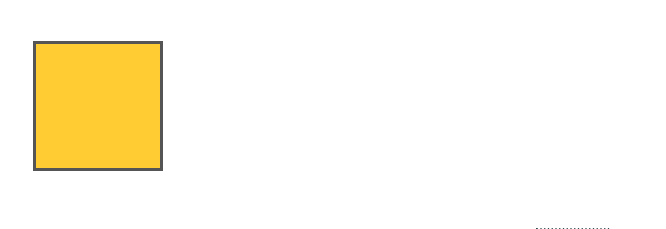
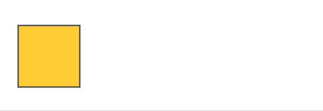
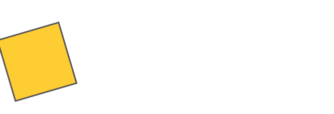
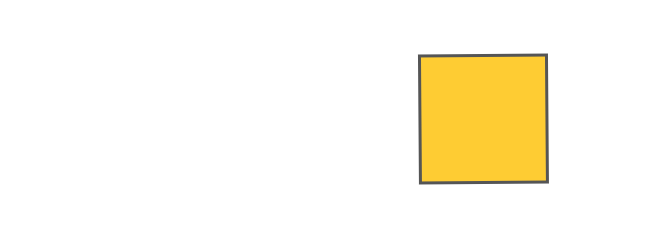
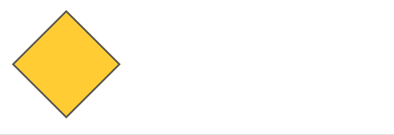
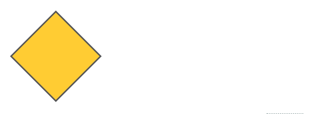
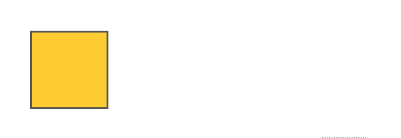
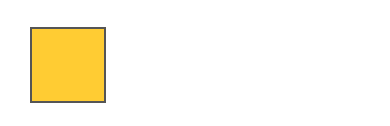
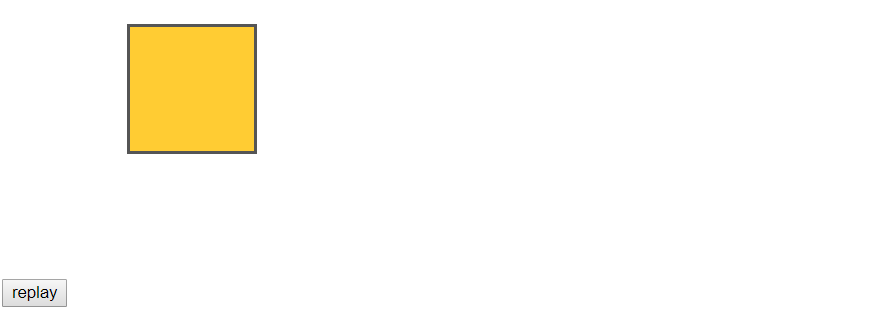

之前我们已经了解了 transition 动画, 当然很快也会发现它好像有点不太够用. 比如它总是被动的, 只能由用户触发或者由 JS 不停地触发(这显然很蠢), 如果我们希望动画能在一开始就自动执行并且一直不停地跑下去, 显然 transition 无法完成. 另一方面是 transition 总是两个状态, 从一个状态到另一个状态, 如果我们希望动画能从状态 0 到状态 1 到状态 2 ... 这对于 transition 来说也很困难.

为了解决这些问题, 于是我们有了 animation 动画. 同样地, 我们还是先从 demo 开始, 忽略那些不认识的属性.

```html
<div class="cube c0"></div>
```

```css
.cube {
	width: 100px;
	height: 100px;
	background: #fc3;
	border: 2px solid #555;
	margin: 100px;
}
.c0 {
	animation: a0 3s cubic-bezier(0.24, -0.87, 0.34, 1.68);
}

@keyframes a0 {
	0% {
		transform: translate3d(0, 0, 0);
	}
	50% {
		transform: translate3d(150px, 0, 0) rotate(90deg);
	}
	100% {
		transform: translate3d(300px, 0, 0) rotate(-90deg);
	}
}
```



这里我们定义了一个名为 a0 的 `@keyframes`, 即帧动画, 里面包含了三个状态, 0% 时刻的状态, 50% 时刻的状态和 100% 时刻的状态. 然后我们通过 `animation` 属性为元素应用了这个帧动画, 并且设置了动画持续时间为 3s, 属性随时间变化的函数是一个贝塞尔曲线. 整个过程就完成了.

总结下基本套路:

1. 先定义一个包含动画过程中不同状态的 `@keyframes`
2. 为元素指定要应用的 `@keyframes`
3. 为元素指定动画的持续时间
4. 为元素指定属性随时间变化的函数

和 `transition` 有些类似.


#### @keyframes

`@keyframes` 比较简单, 只需要定义一个名字和一些状态. 名字可以包含 a-z 0-9 - 和下划线, 首字符只能是下划线或字母. 你可以在 `@keyframes` 里定义(理论上)任意个时间点来标识一个状态, 用百分比的形式, 也可以用 `from` `to` 这样的关键字. eg.

```css
@keyframes {
    from {
        ...
    }
    tp {
        ...
    }
}
```

相当于 0% 和 100%.

为了保证浏览器兼容性, 也介绍下 `@keyframes` 的浏览器前缀

* `@-webkit-keyframes`
* `@-moz-keyframes`
* `@-o-keyframes`


#### animation

`animation` 和 `transition` 一样, 是许多属性的缩写, 作用于所有元素, 包括 `::before` 和 `::after` 伪元素.

浏览器前缀:

* `-webkit-animation`
* `-moz-animation`
* `-o-animation`


#### animation-name

类似 `transition-property`, 指定要使用的 `@keyframes` 的名字. eg.

```css
animation-name: a0;
animation-name: a0, a1;
```

你可以为一个元素指定多个 `@keyframes`.


#### animation-duration

类似 `transition-duration`, 为 animation 动画指定持续时间. eg.

```css
animation-duration: 2s;
animation-duration: 2s, 3s;
```

同样, 可以为多个 `@keyframes` 指定时间, 如果省略后面的时间, 则默认多个 `@keyframes` 使用相同的时间.


#### animation-timing-function

类似 `transition-timing-function`, 为 animation 动画指定属性随时间变化的函数, 只不过 transition 是一个属性随时间变化, 而 `@keyframes` 是一组属性随时间变化. 它们的取值也一样. eg.

```css
animation-timing-function: ease;
animation-timing-function: ease, steps(3, end);
```

同样, 可以为多个 `@keyframes` 指定函数, 如果省略后面的函数, 则默认多个 `@keyframes` 使用相同的函数.


#### animation-delay

类似 `transition-delay`, 为 animation 动画指定延迟时间. 取值也和 `transition-delay` 一样. eg.

```css
animation-delay: 2s;
animation-delay: 2s, 3s;
```

同样, 可以为多个 `@keyframes` 指定延迟时间.


除此之外, animation 还多出几个属性.

#### animation-iteration-count

控制动画重复的次数. 默认一次, 即动画执行完就停止. eg.

```css
animation-iteration-count: 2;
animation-iteration-count: infinite; // 重复无限次
animation-iteration-count: 2, 3;
```

同样, 可以为多个 `@keyframes` 指定重复次数.

[示例代码](https://github.com/ta7sudan/front-end-demo/blob/master/css/animation/demo1.html)


#### animation-direction

控制动画的方向. 到底什么是动画的方向, 可以之后看几个例子. 属性有以下值.

* `normal` 默认值, 即随着时间从 0 变化到 1, 属性也从 0 变化到 1
* `reverse` 反向, 即随着时间从 0 变化到 1, 属性也从 1 变化到 0
* `alternate` 在只有一次动画的情况下和 `normal` 一样, 在多次动画时, 表现为正向往返, 即 0 - 1 - 0 - 1...
* `alternate-reverse` 在只有一次动画的情况下和 `reverse` 一样, 在多次动画时, 表现为反向往返, 即 1 - 0 - 1 ...

`normal`


`reverse`



`alternate` & `infinite`



`alternate-reverse` & `infinite`



[示例代码](https://github.com/ta7sudan/front-end-demo/blob/master/css/animation/demo2.html)


#### animation-fill-mode

控制动画执行前和执行后的样式. 什么意思呢? 首先, 我们把动画分成几个阶段, 未执行(在 `animation-delay` 之前), 执行前(在 `animation-delay` 期间), 执行中(在 `animation-duration` 期间), 执行后(在 `animation-duration` 之后).

现在我们考虑这样一个例子.

```html
<div class="cube c0"></div>
```

```css
.cube {
	width: 100px;
	height: 100px;
	background: #fc3;
	border: 2px solid #555;
	margin: 100px;
	transform: rotate(45deg);
}
.c0 {
	animation: a0 3s cubic-bezier(0.24, -0.87, 0.34, 1.68) 2s;
}
@keyframes a0 {
	0% {
		transform: translate3d(0, 0, 0);
	}
	50% {
		transform: translate3d(150px, 0, 0) rotate(90deg);
	}
	100% {
		transform: translate3d(300px, 0, 0) rotate(-90deg);
	}
}
```



可以看到, 默认情况下, 在执行前是初始状态(旋转 45 度), 在执行的第一帧是 0%, 在执行的最后一帧是 100%, 执行后停在了初始状态.

假如我们希望最后它停在 100% 的状态. 那我们可以设置 `animation-fill-mode: forwards;`

属性有以下值:

* `none` 默认值, 执行前-初始状态, 第一帧 - 0%, 最后一帧 - 100%, 执行后 - 初始状态

* `forwards` 控制执行后的状态, 执行前还是初始状态. 受 `animation-direnction` `animation-iteration-count` 影响

  | animation-direction | animation-iteration-count | 执行后的位置 |
  | ------------------- | ------------------------- | ------------ |
  | `normal`            | 奇数或偶数                | 100%         |
  | `reverse`           | 奇数或偶数                | 0%           |
  | `alternate`         | 偶数                      | 0%           |
  | `alternate`         | 奇数                      | 100%         |
  | `alternate-reverse` | 偶数                      | 100%         |
  | `alternate-reverse` | 奇数                      | 0%           |

* `backwards` 控制执行前的状态, 执行后还是初始状态. 受 `animation-direnction` 影响

  | animation-direction              | 执行前的位置 |
  | -------------------------------- | ------------ |
  | `normal` 或 `alternate`          | 0%           |
  | `reverse` 或 `alternate-reverse` | 100%         |

* `both` 相当于同时设置了 `forwards` 和 `backwards`, 即执行前由 `backwards` 决定, 执行后由 `forwards` 决定

  ​

`forwards`



`backwards`



`both`



同样也可以给多个 `@keyframes` 设置.

[示例代码](https://github.com/ta7sudan/front-end-demo/blob/master/css/animation/demo3.html)


#### animation-play-state

控制动画是否暂停, 两个值.

* `running` 默认值
* `paused` 暂停动画

属性比较简单, 大多数时候用来给 JS 控制动画暂停. 同样也可以给多个 `@keyframes` 设置.

最后, 需要注意的是, `animation` 和 `transition` 不一样的是, **当元素插入 DOM 或者添加新的 animation 动画或 `display` 显示出来也会触发动画**.


#### Animation Event

和 `animation` 有关的事件主要有下面几个:

* `animationstart` 在 `animation-delay` 之后触发
* `animationiteration` 在 `animation-duration` 期间不停地触发, 每一轮动画触发一次, `animation-iteration-count` 大于 1 才会触发
* `animationend` 在 `animation-duration` 之后触发, 注意必须是动画完成之后, 如果动画取消(比如元素移除 DOM 或不可见)则不触发
* `animationcancel` 在 `animation-name` 改变, 或者移除(比如通过修改 class) `animation` 时触发, 目前只有 FF 支持

事件对象继承自 [AnimationEvent](https://developer.mozilla.org/en-US/docs/Web/API/AnimationEvent), 具有以下属性

* `animationName` animation 的名字
* `elapsedTime` 动画执行的时间, 单位秒, 从 `transition-duration` 开始
* `pseudoElement` 如果发生动画的是伪元素, 可以通过它拿到这个伪元素

[示例代码](https://github.com/ta7sudan/front-end-demo/blob/master/css/animation/demo4.html)


#### 重新执行动画

假如我们希望在动画停止之后, 重新执行动画, 或者在动画执行到一半, 又让动画从头开始执行, 这种情况要怎么处理?

之前我们已经提到过, 增加新的动画也会触发动画, 意味着我们可以通过添加 class 的方式来触发动画. 关于这个问题, MDN 也给出了一个小技巧, 这里我稍作修改.

```html
<div class="cube c0"></div>
<button id="btn">replay</button>
```

```css
.cube {
	width: 100px;
	height: 100px;
	background: #fc3;
	border: 2px solid #555;
	margin: 100px;
}
.c0 {
	animation: a0 3s cubic-bezier(0.24, -0.87, 0.34, 1.68);
}
@keyframes a0 {
	0% {
		transform: translate3d(0, 0, 0);
	}
	50% {
		transform: translate3d(150px, 0, 0) rotate(90deg);
	}
	100% {
		transform: translate3d(300px, 0, 0) rotate(-90deg);
	}
}
```

```javascript
function getPlay(elem, animationClass) {
	return function (e) {
		var classNames = elem.className.split(/\s+/), index;
		if (~(index = classNames.indexOf(animationClass))) {
			classNames.splice(index, 1);
			elem.className = classNames.join(' ');
			requestAnimationFrame(function (time) {
				requestAnimationFrame(function (time) {
					elem.className = elem.className + ' ' + animationClass;
				});
			});
		}
	};
}
window.onload = function () {
	var btn = document.getElementById('btn');
	btn.addEventListener('click', getPlay(document.getElementsByClassName('cube')[0], 'c0'));
};
```



这里简单解释下为什么需要两个 rAF, 熟悉 rAF 的话应该不需要多解释了. 因为修改了 class 之后, 为了确保样式重新计算, 我们需要等修改后的 class 被应用至少一帧. 但是修改 class 可能和第一个 rAF 的 callback 处于同一帧周期内(rAF 的 callback 总是在下一次 repaint 之前被执行), 这样的话新的样式还未生效就又被改回来了. 可能有人会问修改 DOM/class 不是同步的吗? 那改完以后就应该已经应用新的样式了. 的确, 修改 DOM 是同步的, 但是计算/应用样式不一定是同步的. 所以这里需要两个 rAF 确保修改 class 的样式被应用一次.

> To be sure that the styles are recalculated, we use [`window.requestAnimationFrame()`](https://developer.mozilla.org/en-US/docs/Web/API/Window/requestAnimationFrame), specifying a callback. Our callback gets executed just before the next repaint of the document. The problem for us is that because it's before the repaint, the style recomputation hasn't actually happened yet! So...

[示例代码](https://github.com/ta7sudan/front-end-demo/blob/master/css/animation/demo5.html)


#### 检测浏览器对 animation 的支持以及动态添加 animation 动画

这里直接贴 MDN 的代码吧, 实际使用的时候肯定还得修改下, 只是了解个大概思路.

```javascript
var animation = false,
    animationstring = 'animation',
    keyframeprefix = '',
    domPrefixes = 'Webkit Moz O ms Khtml'.split(' '),
    pfx  = '',
    elem = document.createElement('div');

if( elem.style.animationName !== undefined ) { animation = true; }    

if( animation === false ) {
  for( var i = 0; i < domPrefixes.length; i++ ) {
    if( elem.style[ domPrefixes[i] + 'AnimationName' ] !== undefined ) {
      pfx = domPrefixes[ i ];
      animationstring = pfx + 'Animation';
      keyframeprefix = '-' + pfx.toLowerCase() + '-';
      animation = true;
      break;
    }
  }
}
```

```javascript
if( animation === false ) {

  // animate in JavaScript fallback

} else {
  elem.style[ animationstring ] = 'rotate 1s linear infinite';

  var keyframes = '@' + keyframeprefix + 'keyframes rotate { '+
                    'from {' + keyframeprefix + 'transform:rotate( 0deg ) }'+
                    'to {' + keyframeprefix + 'transform:rotate( 360deg ) }'+
                  '}';

  if( document.styleSheets && document.styleSheets.length ) {

      document.styleSheets[0].insertRule( keyframes, 0 );

  } else {

    var s = document.createElement( 'style' );
    s.innerHTML = keyframes;
    document.getElementsByTagName( 'head' )[ 0 ].appendChild( s );

  }
  
}
```


#### 参考资料

* https://developer.mozilla.org/en-US/docs/Web/CSS/CSS_Animations/Using_CSS_animations
* https://developer.mozilla.org/en-US/docs/Web/CSS/CSS_Animations/Detecting_CSS_animation_support
* https://developer.mozilla.org/en-US/docs/Web/CSS/CSS_Animations/Tips
* https://developer.mozilla.org/en-US/docs/Web/CSS/animation
* https://developer.mozilla.org/en-US/docs/Web/API/AnimationEvent