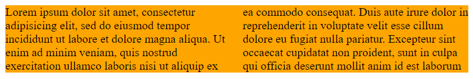

这里我们说的多列布局不是说如何实现多列布局, 毕竟实现多列布局的方式有很多也都不难, 而是说和多列相关的属性.

什么是和多列相关的属性? 有以下这些:

* `column-count` 控制一共有多少列(但不是一定会保证有这么多列)
* `column-width` 控制每列的最小宽度.
* `columns` 前两个的缩写
* `column-gap` 控制多列之间的间隔距离
* `column-fill` 控制是否平衡每列的高度
* `column-span` 控制某个元素是否跨越多列
* `column-rule-color` 控制分割线的颜色
* `column-rule-style` 控制分割线的样式
* `column-rule-width` 控制分割线的宽度
* `column-rule` 前三个的缩写
* `break-before` 浏览器支持度不高
* `break-inside` 浏览器支持度不高
* `break-after` 浏览器支持度不高
* `orphans` 给打印设备用的
* `widows` 给打印设备用的

这么多, 不过都比较简单. 接下来通过例子一个个讲吧.


#### column-count

要定义一个多列布局很简单, 只需要 `column-count` 或者 `column-width` 这个属性就行.

作用于块级盒子(除了 `display: table;` 的元素), 属性值默认 `auto`, 也可以是整数. 控制一共有多少列(但不是一定会保证有这么多列, 具体原因见后文).

一个简单的 demo.

```html
	<div class="c c0">Lorem ipsum dolor sit amet, consectetur adipisicing elit, 
sed do eiusmod tempor incididunt ut labore et dolore magna aliqua. Ut enim ad minim veniam, 
quis nostrud exercitation ullamco laboris nisi ut aliquip ex ea commodo consequat. 
Duis aute irure dolor in reprehenderit in voluptate velit esse cillum dolore eu fugiat 
nulla pariatur. Excepteur sint occaecat cupidatat non proident, sunt in culpa 
qui officia deserunt mollit anim id est laborum</div>
```

```css
.c {
	background: orange;
	margin-bottom: 50px;
}
.c0 {
	column-count: 2;
}
```



可以看到, 原本一整块的文本变成了两列. 这就是 `column-count` 的作用了.

默认情况下, 浏览器会让每列尽可能地宽.


#### column-width

作用于块级盒子(除了 `display: table;` 的元素), 默认值 `auto`, 也可以是其他长度单位的值(但是没有百分比宽度). 控制每列的最小宽度.

一个 demo.

```html
	<div class="c c1">Lorem ipsum dolor sit amet, consectetur adipisicing elit, 
sed do eiusmod tempor incididunt ut labore et dolore magna aliqua. Ut enim ad minim veniam, 
quis nostrud exercitation ullamco laboris nisi ut aliquip ex ea commodo consequat. 
Duis aute irure dolor in reprehenderit in voluptate velit esse cillum dolore eu fugiat 
nulla pariatur. Excepteur sint occaecat cupidatat non proident, sunt in culpa 
qui officia deserunt mollit anim id est laborum</div>
```

```css
.c {
	background: orange;
	margin-bottom: 50px;
}
.c1 {
	column-width: 100px;
}
```


在没有指定 `column-count` 时, 浏览器会尽可能多地放下更多的列, 即每列都是最小宽度. 可以看到, `column-count` 和 `count-width` 都能创建一个多列布局.

假如同时指定了 `column-count` 和 `column-width`, 浏览器也会尽可能让每列更宽. 但是如果每列的最小宽度之和已经大于包含块的宽度, 则不保证 `column-count` 的列数.

```html
	<div class="c c2">Lorem ipsum dolor sit amet, consectetur adipisicing elit, 
sed do eiusmod tempor incididunt ut labore et dolore magna aliqua. Ut enim ad minim veniam, 
quis nostrud exercitation ullamco laboris nisi ut aliquip ex ea commodo consequat. 
Duis aute irure dolor in reprehenderit in voluptate velit esse cillum dolore eu fugiat 
nulla pariatur. Excepteur sint occaecat cupidatat non proident, sunt in culpa 
qui officia deserunt mollit anim id est laborum</div>
```

```css
.c {
	background: orange;
	margin-bottom: 50px;
}
.c2 {
	column-count: 2;;
	column-width: 200px;
}
```


可以看到, 当包含块变小后, 原本两列变成了只有一列, 意味着优先保证最小列宽而不是列数.


#### column-gap

作用于形成多列布局的元素, 对非多列布局的元素无效. 控制多列之间的间隔距离, 默认值 `normal`(由浏览器的实现决定, 不过通常是 1em), 支持各种单位, 比如 px, 百分比. 百分比相对于多列元素(比如 `column-count` 作用的元素)的 content-box 的宽度, 不过目前好像没有浏览器支持百分比的值.

eg.

```html
	<div class="c c3">Lorem ipsum dolor sit amet, consectetur adipisicing elit, 
sed do eiusmod tempor incididunt ut labore et dolore magna aliqua. Ut enim ad minim veniam, 
quis nostrud exercitation ullamco laboris nisi ut aliquip ex ea commodo consequat. 
Duis aute irure dolor in reprehenderit in voluptate velit esse cillum dolore eu fugiat 
nulla pariatur. Excepteur sint occaecat cupidatat non proident, sunt in culpa 
qui officia deserunt mollit anim id est laborum</div>
```

```css
.c {
	background: orange;
	margin-bottom: 50px;
}
.c3 {
	column-count: 2;;
	column-gap: 100px;
	column-width: 200px;
}
```


可以看到, 两列之间的间隔明显宽了许多.


#### column-fill

作用于多列元素, 控制是否平衡每列的高度.

有以下值:

* `balance` 默认值, 平衡每列的高度使得所有列尽可能等高
* `auto` 按顺序(从左往右)填充每列, 每列尽可能高
* `balance-all` 用于其他设备的, 对于 web 浏览器等同于 `balance`

需要注意的是这个属性和 `height` / `max-height` 是有关系的, 因为没有限制包含块的高度的话, 那尽可能高就无从谈起, 此时 `auto` 和 `balance` 的表现是一样的.

`balance`


可以看到, 两列高度是基本上一样的.


`auto`


由于包含块的高度足够在一列中放下所有内容, 因此就没有了第二列, 而右边原本一列的空间留出了空白. 尽管这里 `column-count` 被设置成了 2. 可见, 此时也不保证 `column-count` 的列数.


#### column-span

作用于多列元素中的正常流的块级元素(in flow block-level elements), 控制某个元素是否跨越多列, 有以下值:

* `none` 默认值, 不跨越多列
* `all` 跨越所有列

具体还是看例子.

```html
<div class="c c6">
  <h2>My Very Special Columns</h2>
  <p>This is a bunch of text split into three columns
     using the CSS `columns` property. The text
     is equally distributed over the columns.</p>
</div class="c c6">
```

```css
.c {
	background: orange;
	margin-bottom: 50px;
}
.c6 {
	column-count: 3;
}
.c6 > h2 {
	column-span: all;
}
```


`none`


默认是这样子, 内容分成了三列, `<h2>` 占了一列.


`all`


由于这里 `<h2>` 设置了 `column-span: all`, 意味着 `<h2>` 跨越了所有列不参与到分列, 而其他内容依旧被分成三列.


#### column-rule

是 `column-rule-width` `column-rule-color` `column-rule-style` 的缩写

作用于多列元素, 控制列之间的分割线的样式, 类似 `border`, 默认是没有分割线.

```html
	<div class="c c7">Lorem Vipsum dolor sit amet, consectetur adipisicing elit, 
sed do eiusmod tempor incididunt ut labore et dolore magna aliqua. Ut enim ad minim veniam, 
quis nostrud exercitation ullamco laboris nisi ut aliquip ex ea commodo consequat. 
Duis aute irure dolor in reprehenderit in voluptate velit esse cillum dolore eu fugiat 
nulla pariatur. Excepteur sint occaecat cupidatat non proident, sunt in culpa 
qui officia deserunt mollit anim id est laborum</div>
```

```css
.c {
	background: orange;
	margin-bottom: 50px;
}
.c7 {
	column-count: 2;;
	column-width: 200px;
	column-rule: 1px solid #000;
}
```


它的取值也和 `border` 一样.


以上内容的[源码](https://github.com/ta7sudan/front-end-demo/blob/master/css/columns/demo0.html)


#### 参考资料

* https://developer.mozilla.org/en-US/docs/Web/CSS/CSS_Columns/Using_multi-column_layouts
* https://developer.mozilla.org/en-US/docs/Web/CSS/column-count
* https://developer.mozilla.org/en-US/docs/Web/CSS/column-width
* https://developer.mozilla.org/en-US/docs/Web/CSS/column-gap
* https://developer.mozilla.org/en-US/docs/Web/CSS/column-fill
* https://developer.mozilla.org/en-US/docs/Web/CSS/column-rule
* https://developer.mozilla.org/en-US/docs/Web/CSS/column-span