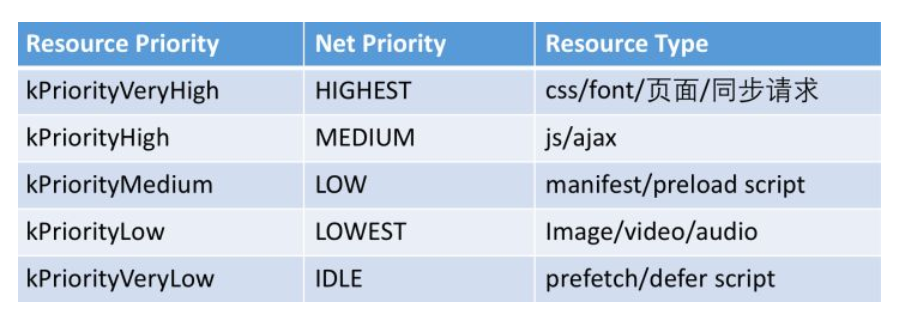

这个话题太 TM 大了, 涉及的底层知识也很多, 有些也和不同浏览器的实现有关, 所以我并不觉得能深入或者说写好这么一个话题. 其实这篇也不该被划分到 CSS 下的, 这里的内容就权当笔记吧.

* clientWidth 是除去 border 和滚动条的宽度, offsetWidth 是算上 border 和滚动条的宽度, 同理 height(https://zhuanlan.zhihu.com/p/25445527)

* getComputedStyle 和获取 clientWidht 等不是一定会触发重排(https://zhuanlan.zhihu.com/p/25445527)

* CSP 策略的执行(https://zhuanlan.zhihu.com/p/30558018)

* 资源加载的优先级, 页面, CSS 同步 ajax 和字体这几个优先级最高, 然后是 script, ajax, 然后是图片音视频, 最后是 prefetch 的资源和 defer 的 script(https://zhuanlan.zhihu.com/p/30558018)

  

* css/js是不可推迟的，而图片、preload的js为可推迟加载

* 同时加载的delayable资源同一个域只能有 6 个，同一个client即同一个页面最多只能有10个，否则要进行排队, 即大部分时候同一个域只能加载 6 个资源, 这篇文章写的实在是非常好, 建议多看几遍(https://zhuanlan.zhihu.com/p/30558018)

* 每个页面都有Renderer线程负责渲染页面，而浏览器有IO线程，用来负责请求资源等。为什么IO线程不是放在每个页面里面而是放在浏览器框架呢？因为这样的好处是如果两个页面请求了相同资源的话，如果有缓存的话就能避免重复请求了。

* 删除 DOM 中的元素也不会解绑元素的事件, 这点高程也提过(https://fed.renren.com/2017/02/05/browser-event/)

* 

* 级元素后的换行不会被转换成一个空格. 块级元素内的开头空白字符将会被忽略. (https://zhuanlan.zhihu.com/p/25445527)​

#### 参考资料

* https://zhuanlan.zhihu.com/p/24911872
* https://zhuanlan.zhihu.com/p/25380611
* https://zhuanlan.zhihu.com/p/25445527
* https://zhuanlan.zhihu.com/p/30558018
* https://fed.renren.com/2017/02/05/browser-event
* https://zhuanlan.zhihu.com/p/25166666
* https://juejin.im/entry/590801780ce46300617c89b8
* https://segmentfault.com/a/1190000008015671
* https://juejin.im/entry/599fcad45188252445326ca9