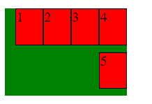
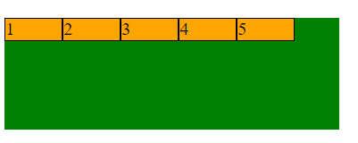
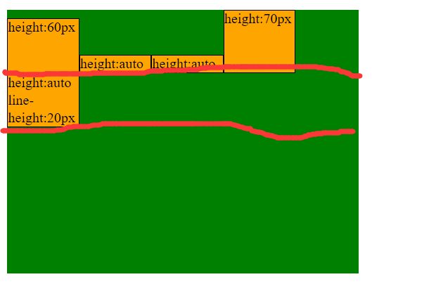

给文章起名真是个很累人的事情, 想起名叫深入理解 XXX 或是 XXX 详解这样的, 又觉得自己太菜, 市面上已经有很多这方面的资料, 写得也比我通俗易懂, 那我写的这东西怎么好意思叫深入理解呢. 不过为了方便自己查阅, 终究还是要把别人的东西转化成自己的. 既然是说查阅, 那为什么不直接把优秀的文章添加到收藏夹呢? 的确这样方便许多, 但是一方面是 Web 上的东西, 其实很容易丢失的, 说不定哪天作者不维护自己的博客了, 说不定哪天地址变了, 说不定作者心理状况发生变化一气之下把之前的东西全删了...另一方面是我向来不惮以最坏的恶意去揣测你国的修墙工人们, 也许哪天你收藏的外文资料就再也无法访问了. 说到底身为仓鼠玩家的我还真是没安全感啊, 所以才得费神费力写这些东西.

废话扯了这么多, 还是看看重要的内容吧. 为了方便说明, 我们先了解一些术语.


#### flex 模型

关于这个, 我还是直接贴 MDN 的内容好了, 自己写的不会比这更好了. 

当元素表现为 flex 框时，它们沿着两个轴来布局：


* **主轴(main axis)** 是沿着 flex 元素(flex item)放置的方向延伸的轴(比如页面上的横向的行, 纵向的列). 该轴的起始位置和结束位置被称为 **main start** 和 **main end**. 即主轴是元素排列方向所在的直线, 也是由 `flex-direction` 确定的方向所在的直线.
* **交叉轴(cross axis)** 是垂直于 flex 元素放置方向的轴. 该轴的起始位置和结束位置被称为 **cross start** 和 **cross end**. 即与主轴垂直的直线.
* 设置了 `display: flex;` 的元素被称为 **flex 容器(flex container)**.
* 在 flex 容器中表现为弹性的盒子的元素被称为 **flex 项(flex item)**.
* flex item 的大小: 我自己发明的...指 flex item 在主轴方向上, 根据规则(规则参考之后的 `flex-basis`)计算得到的值, 不包含 `padding` `border` `margin`
* 弹性空间: 我自己发明的...指 flex 容器的大小(主轴或交叉轴方向上的 `width` 或 `height`)减去所有 flex item 对应的轴方向上的 `padding` `border` `margin` 所剩下的空间, 即 flex 容器在某个轴方向上可以支配的空间, 因为 flex item 的 `padding` `border` `margin` 是没有弹性的, 即不会被压缩或者拉伸
* 剩余空间: 指在主轴或交叉轴方向上, 弹性空间的大小减去所有 flex item 的大小之和剩下的空间, 正数.
* 溢出空间: 我自己发明的...指所有 flex item 大小之和减去主轴弹性空间的大小, 也即负的剩余空间的绝对值.

So, 要使用 flex 布局首先要创建一个 flex 容器, 创建一个 flex 容器只需要 `display: flex;` 或者 `display: inline-flex;` 就行.

需要注意的是: **flex 容器中的 float 元素的计算值是 none, 也即 float 无效, 也会被作为 flex item. 而 absolute/ fixed 定位的元素不会被作为 flex item. 另外 flex 容器会创建 BFC, 意味着 flex item 不会和 flex 容器发生外边距折叠.**


#### 与 flex 相关的 CSS 属性

* `flex` 是 `flex-grow` `flex-shrink` `flex-basis` 的缩写
* `flex-direction` 控制 flex item 在 flex 容器中按哪个轴排列以及排列的方向
* `flex-basis` 设置 flex item 的在主轴方向上初始的 content-box 的大小(除非用 `box-sizing` 改变它)
* `flex-flow` 是 `flex-direction` `flex-wrap` 的缩写
* `flex-wrap` 控制当 flex 容器一行/列放不下所有 flex item 时是否换行, 默认不换行, 而是尽可能压缩 flex item 使得它们不会溢出 flex 容器
* `flex-grow` 控制 flex item 分配主轴剩余空间的权重
* `flex-shrink` 控制 flex item 分配溢出空间的权重
* `justify-content` 控制每一行的 flex item 在主轴上的对齐方式
* `align-items` 控制 flex item 在**所处行的交叉轴方向上**的对齐方式
* `align-content` 是控制多行在交叉轴上的对齐方式, 仅当交叉轴有多行/列的时候生效
* `align-self` 控制某个 flex item 在所在行内的交叉轴方向上的对齐方式, 它会覆盖掉 `align-items` 的值
* `order` 调整 flex item 的排列顺序

接下来会一个一个介绍这些属性.


#### flex-direction

作用于 flex 容器, 该属性控制 flex item 在 flex 容器中按哪个轴排列以及排列的方向, 比如沿主轴从左向右排列. 属性有四个值:

* `row` 默认值, 沿主轴从 main start 到 main end 排列
* `row-reverse` 沿主轴从 main end 到 main start 排列
* `column` 沿交叉轴从 cross start 到 cross end 排列
* `column-reverse` 沿交叉轴从 cross end 到 cross start 排列


需要注意的是, `row` `row-reverse` 这两个值还会受到 flex 容器的 `dir` 属性(HTML 属性)的影响, 即交换 main start 和 main end 的位置. 经过测试也会受到 `direction` 的影响.

`row` 的效果


`row-reverse` 的效果


`column` 的效果, 注意默认对齐到交叉轴的 start 处, 具体参考 `align-item`


`column-reverse` 的效果


`dir` 为 rtl / `direction: rtl` 且 `flex-direction: row;` 时的效果, 注意区分它和 `row-reverse` 的情况, 这里里面的文字也会受到影响.


`dir` 为 rtl / `direction: rtl` 且 `flex-direction: column;` 时的效果, 会发现还是作用于水平方向, 并没有让 `column` 变得像 `column-reverse`.


`flex-direction` 的所有 demo 的[源码](https://github.com/ta7sudan/front-end-demo/blob/master/css/flex/demo0.html)


#### flex-basis

作用于 flex item, 用来设置 flex item 的在主轴方向上**初始的** content-box 的大小(除非用 `box-sizing` 改变它), 如果 `flex-direction` 确定了主轴是水平方向则是 `width` 的大小, 否则是 `height` 的大小. 为什么说是初始的? 因为指定了 `flex-basis` 并不意味着最终 flex item 的 content-box 就是这么大, 而是可能会根据后面提到的规则改变.

属性可以取以下值:

* `<width>`, 即常见单位的大小, eg. 50px, 50%等
* `auto` 由 `width` `min-width` `height` `min-height` 决定
* `content` 目前(2018.2.12)还没有浏览器支持(好吧其实有个 edge 支持)

我们先考虑下百分比的单位吧

```html
<div class="main">
	<div class="child">child</div>
</div>
```

```css
.main {
	width: 100px;
	height: 150px;
	padding: 20px;
	margin: 20px;
	border: 10px solid #000;
	background: green;
	display: flex;
}
.child {
	flex-basis: 50%;
	height: 50%;
	background: red;
}
```


可以看到, **百分比单位相对于 flex 容器的主轴方向的 content-box 的大小**.


我们再考虑下 flex 容器足够大(即 flex item 不会溢出)的情况

假如我们不指定 flex item `width` 和 `flex-basis`


没毛病, 根据 flex item 的内容确定它的宽度, 文字尽可能地不换行(aaa bbb ccc 没有换行).

假如我们指定 flex item 的 `width` 但不指定 `flex-basis`, `flex-basis` 为 auto.


假如我们不指定 flex item 的 `width` 但指定了 `flex-basis`


可以看到, 只有 `flex-basis` 和只有 `width` 的效果是一样的.

假如我们指定 flex item 的 `width` 也指定了 `flex-basis` 和 `min-width`, 且它们之间互有大小(A > B 或 B > A)


结果是

* div1 取了 `flex-basis`
* div2 取了 `flex-basis`
* div3 取了 `min-width`
* div4 取了 `flex-basis`

所以, **当内容不超过 `width` `min-width` `flex-basis` 时, 优先取 `min-width` 和 `flex-basis` 中最大的, 否则取`width`**.

那假如内容超过 `width` 和`flex-basis` 呢?


我们先看后面两个, 不论 `width` 和 `flex-basis` 谁大, 都是取 `flex-basis`. 再看前四个

* 由第一个和第四个可以看出, 只有 `width` 的时候取 `width` 大小
* 由第二个和第五个可以看出, 只有 `flex-basis` 时, 当 `flex-basis` 大于最大的 inline-box 时, 取 `flex-basis`, 当 `flex-basis` 小于最大的 inline-box 时, 取最大的 inline-box 宽度
* 由三六七可知,  当最大的 inline-box 大于 `width` 和 `flex-basis` 时, 取两者中最大的大小


结论: **当 `width` `flex-basis` `min-width` 都是默认值时, flex item 在主轴方向上的 content-box 大小由内容的宽高决定, 内容会尽可能地宽(不论 `flex-direction` 的方向是什么), 当 `width` `flex-basis` `min-width` 有一个或多个不为默认值时, 优先取 `flex-basis` `min-width` 中最大的, 其次取 `width`, 唯一的特例是当内容的最大 inline-box 宽度大于 `flex-basis` 和 `width` 时, 取两者中最大的大小. 对于主轴是交叉轴的情况, width 替换成 height.**

其实我觉得这个结论蛮不靠谱的, 毕竟只是个实验性的结论, 也可能会遗漏一些细节, 真正靠谱的还是得去看[标准文档](https://drafts.csswg.org/css-flexbox-1/).

既然叫弹性盒子, 那弹性在哪里呢? 我们来简单地考虑一下当所有 flex item 的大小之和大于弹性空间, 那 flex item 会溢出容器吗?

我们来考虑仅有 `width` `flex-basis` `min-width` 三种情况


可以看到, 当 flex 宽度之和大于主轴弹性空间时, `width` 和 `flex-basis` 都被压缩了, 但是 `padding` `margin` 没有被压缩,  只有 `min-width` 的情况溢出了容器.

结论: **当 flex item 的大小之和超过主轴弹性空间的大小时, 只设置了 `width` 或 `flex-basis` 的 flex item 的大小会被压缩(压缩是指压缩 content-box, 而不压缩 padding- box, border-box 和 margin-box), 使得 flex item 尽可能地不溢出 flex 容器(不保证不溢出容器, 当所有 flex item 内容的最大 inline-box 宽度之和大于容器时会溢出), 设置了 `min-width` 的元素不会被压缩, 此时 flex item 可能会溢出容器.**

关于溢出的一些细节可以参考 `flex-wrap`

那再思考一下如果 flex item 宽度不一样, 且 flex item 大小之和大于主轴弹性空间, 那溢出的空间要如何分配? 或者说, 每个 flex item 需要压缩多少? 参考 `flex-shrink`.

`flex-basis` 的所有 demo 的[源码](https://github.com/ta7sudan/front-end-demo/blob/master/css/flex/demo1.html)


#### flex-wrap

作用于 flex 容器, 控制当 flex 容器一行/列放不下所有 flex item 时是否换行, 默认不换行, 而是尽可能压缩 flex item 使得它们不会溢出 flex 容器. 有以下值:

* `nowrap` 默认值, 不换行, 尽可能压缩 flex item 使得它们不会溢出 flex 容器, 当无法压缩时(`min-width` 或 flex item 中最大的 inline-box 大小大于 flex item 的大小时)才溢出. 负的溢出空间根据 `flex-shrink` 分配到每个 flex item 的 content-box 上.
* `wrap` flex item 的大小之和大于主轴弹性空间时换行, 即 flex item 按照从主轴的 start 到 end, 从交叉轴的 start 到 end 排列. 比如 `flex-direction: row;`, 此时先从左(主轴 start)往右(主轴 end)排列, 再从上(交叉轴 start)往下(交叉轴 end)换行, 会确保 flex item 的大小不被压缩, 即不换行是尽可能压缩 flex item 使它们不溢出 flex 容器, 换行是尽可能不压缩 flex item 保持 flex item 的大小并且使它们不溢出 flex 容器.
* `wrap-reverse` 类似 `wrap`, 但是 flex item 按照从主轴的 start 到 end, 从交叉轴的 end 到 start 排列. 比如 `flex-direction: row;`, 此时先从左(主轴 start)往右(主轴 end)排列, 再从下(交叉轴 end)往上(交叉轴 start)换行, 会确保 flex item 的大小不被压缩.

注意, 以上属性都受到 `flex-direction` 的影响, 即可能交换 start 和 end.

`flex-wrap: nowrap;`


可以看到, 原本 30x30 的方块被压缩成了长方形.


`flex-wrap: wrap`


每个方块依然保持的原有大小, 但是产生了换行.


`flex-wrap: wrap-reverse`


同样是换行, 但是换行是从下往上(交叉轴 end 到 start).


`flex-wrap` 的所有 demo 的[源码](https://github.com/ta7sudan/front-end-demo/blob/master/css/flex/demo2.html)


#### flex-grow

作用于 flex item, 控制 flex item 分配主轴剩余空间的权重. 注意是分配主轴剩余空间, 不是分配 flex 容器的所有空间. 剩余空间是弹性空间减去所有 flex item 的大小(未压缩)剩下的空间. 默认值 0. 分配是指把剩余空间分配给 flex item 的 content-box, 比如原本一个 flex item 的大小是 50px(宽), 现在横向的剩余空间是 50px, 在 `flex-grow` 作用下, 这 50px 的剩余空间分配给了这个 flex item, 于是 flex item 的 content-box 变成 50px + 50px = 100px(宽).

```html
<div class="container">
	<div class="item">grow 1</div>
	<div class="item">grow 2</div>
</div>
```

```css
.container {
	width: 300px;
	height: 100px;
	background: green;
	display: flex;
}
.item {
	background: red;
	width: 100px;
	height: 50px;
	border: 1px solid #000;
}
.item:nth-child(1) {
	flex-grow: 1;
}
.item:nth-child(2) {
	flex-grow: 2;
}
```


可以看到, 1 和 2 两个 `<div>` 的宽度并不是 1:2 的关系, 而是比较接近, 因为分割的是主轴的剩余空间. 这里弹性空间是 300px(flex 容器宽度) - 1px(border 宽度) x 4 = 296px, 剩余空间是 296px - 100px(flex item 的大小) x 2 = 96px, 于是第一个 flex item 分配的剩余空间是 96px x 1 / (1 + 2) = 32px, 两个 flex item 的大小分别是 132px 和 164px.

假如希望按比例分配主轴弹性空间, 可以这样写

```css
.item1 {
    flex-basis: 0;
    flex-grow: 1;
}
.item2 {
    flex-basis: 0;
    flex-grow: 2;
}
```


那假如有 `max-width` 又会有什么影响?

```html
<div class="container">
	<div class="child cld0">child 1</div>
	<div class="child">child 1</div>
</div>
```

```css
.container {
	width: 300px;
	height: 100px;
	background: green;
	margin-bottom: 20px;
	display: flex;
}
.child {
	border: 1px solid #000;
	flex-basis: 0;
	flex-grow: 1;
	height: 50px;
	background: red;
}
.cld0 {
	max-width: 50px;
}
```


这里原本 child1 和 child2 的大小应该是 100px 和 200px, 但是因为 child1 有 `max-width: 50px;` 于是 child2 占据了"原本不属于"它的那部分剩余空间.

所以 `max-width` 的优先级大于 `flex-grow`.

`flex-grow` 的所有 demo 的[源码](https://github.com/ta7sudan/front-end-demo/blob/master/css/flex/demo3.html)


#### flex-shrink

作用于 flex item, 控制 flex item 分配溢出空间的权重, 默认值是 1. 即默认按比例分配溢出空间, 按比例是指按照 flex item 的大小的比例.

关于这个属性, 我们还是直接看一个例子吧

```html
<div class="container">
	<div class="item i0">1</div>
	<div class="item i1">2</div>
	<div class="item i2">3</div>
	<div class="item i3">4</div>
</div>
```

```css
.container {
	/* width: 500px; */
	width: 1000px;
	height: 100px;
	background: green;
	display: flex;
	margin-bottom: 20px;
}

.item {
	height: 50px;
	border: 10px solid #000;
	background: red;
}

.i0 {
	flex-basis: 80px;
}
.i1 {
	flex-basis: 180px;
}
.i2 {
	flex-basis: 280px;
}
.i3 {
	flex-basis: 380px;
}
```


可以看到, flex 容器宽 1000px, flex item 的 border-box 分别是 100px, 200px, 300px, 400px, 它们的 content-box 分别是 80px, 180px, 280px, 380px, 整个 flex 容器的主轴弹性空间是 920px, 也即是 flex item 的大小之和.

现在我们把 flex 容器的宽度调整到 500px.


可以看到, 第一个 flex item 的 content-box 宽度是 36.525px. 这他妈的到底是怎么压缩的?


现在 flex item 的 content-box 的宽度分别为 36.525px, 82.175px, 127.825px, 173.475px.

OK, 我们现在来算一下. flex 容器从 1000px 变成 500px, 意味着主轴弹性空间减少了 500px, 或者说主轴的剩余空间是 -500px 溢出空间是 500px, `flex-shrink` 就是控制这 -500px 如何分配的. 我们之前说了, 是按照 flex item 的大小的比例. 所以第一个 flex item 领到的溢出空间是 -500x80/920=-43.478, 所以第一个 flex item 的 content-box 的实际宽度是 80-43.478=36.521, 大约和 36.525 差不多, 考虑到一些精度问题, 就是这个值了. 同理第二个 flex item 领到的溢出空间是 -500x180/920=-97.82, 所以第二个 flex item 的 content-box 宽度是 180-97.82=82.173, 符合预期. 其他的也是如此.

那假如设置了值又是怎么计算?

```html
<div class="container">
	<div class="item i4">1</div>
	<div class="item i5">2</div>
	<div class="item i6">3</div>
	<div class="item i7">4</div>
</div>
```

```css
.container {
	/* width: 500px; */
	width: 1000px;
	height: 100px;
	background: green;
	display: flex;
	margin-bottom: 20px;
}

.item {
	height: 50px;
	border: 10px solid #000;
	background: red;
}
.i4 {
	flex-basis: 100px;
	border: none;
}
.i5 {
	flex-basis: 200px;
	border: none;
}
.i6 {
	flex-basis: 300px;
	border: none;
}
.i7 {
	flex-basis: 400px;
	flex-shrink: 2;
	border: none;
}
```

同样还是把 flex 容器宽度从 1000px 减少到 500px, 并且第四个 flex item 设置了 `flex-shrink: 2;`.


flex item 的大小原本是 100px, 200px, 300px, 400px, 压缩后的实际大小是 64.287px, 128.575px, 192.863px, 114.287px. 这他妈的又是什么?

我们说 `flex-shrink` 是一个权重, 这个权重默认是 1, 其实刚刚我们省略了一点步骤.

假如没给第四个 flex item 设置 `flex-shrink: 2;`, 则它分配的溢出空间是 -500x4x1/(1x1+2x1+3x1+4x1)=-200, 其中 1 即是  `flex-shrink` 的值. 所以现在第四个 flex item 领到的溢出空间应该是 -500x4x2/(1x1+2x1+3x1+4x2)=-285.714, 它的实际宽度是 400-285.714=114.286, 符合预期.

给个公式, 令 O 为溢出空间的大小, Oi 为第 i 个 flex item 分配到的溢出空间, Wi 为该 flex item 的大小, Si 为该 flex item 的 `flex-shrink` 的值, 共 n 个 flex item.

$$O_i=O \cdot \frac{W_i \cdot S_i}{\sum_{j=0}^n W_j \cdot S_j}$$

flex item 的实际大小 = flex item 的大小 - Oi


再来看看 `min-width` 作用下的 `flex-shrink` 是什么样子.

```html
<div class="container">
	<div class="item i8">1</div>
	<div class="item i9">2</div>
	<div class="item i10">3</div>
	<div class="item i11">4</div>
</div>
```

```css
.container {
	/* width: 500px; */
	width: 1000px;
	height: 100px;
	background: green;
	display: flex;
	margin-bottom: 20px;
}

.item {
	height: 50px;
	border: 10px solid #000;
	background: red;
}
.i8 {
	flex-basis: 100px;
	border: none;
}
.i9 {
	flex-basis: 200px;
	border: none;
}
.i10 {
	flex-basis: 300px;
	border: none;
}
.i11 {
	flex-basis: 400px;
	min-width: 200px;
	flex-shrink: 2;
	border: none;
}
```


可以看到, 原本根据公式计算可知 `div.i11` 的宽度应该是 114.286px, 但因为 `min-width` 的缘故, 宽度只压缩到 200px, 而其他 flex item 依然按比例压缩.

所以如果令 M 是 flex item 的 `min-width` 的宽度, flex item 的宽度应该是 $max(M, O_i)$.

`flex-shrink` 的所有 demo 的[源码](https://github.com/ta7sudan/front-end-demo/blob/master/css/flex/demo4.html)


#### justify-content

作用于 flex 容器, 控制每一行的 flex item 在主轴上的对齐方式, 或者说如何分配主轴方向的空白空间. 和 `flex-grow` 不同的是, `flex-grow` 把主轴的剩余空间分配到 flex item 的 content-box, 会使得 flex item 的 content-box 变大, 空白空间减小. 而 `justify-content` 是决定空白空间如何放置, flex item 的 content-box 不会变大, 主轴的剩余空间也不会变小, 所以这里用空白空间这个词稍作区分.

属性有以下值:

*  `flex-start` 默认值, flex item 紧贴主轴 start 边缘排列
* `flex-end` flex item 紧贴主轴 end 边缘排列
* `center` 所有 flex item 排列在主轴中间
* `space-between` flex item 从主轴 start 依次排列到 end, 中间用空白填充, 即 flex item 之间的空白是 start 和 end 处空白的两倍
* `space-around` 空白空间均分到每个 flex item 两边
* `start` 适用于 grid
* `end` 同上
* `space-evenly` 类似 `space-around` 不过所有空白距离相等, 浏览器支持度不高
* `left` 不建议使用, 建议用 `flex-start` / `flex-end`
* `right` 同上
* `baseline` / `first baseline` / `last baseline` 浏览器支持度不高
* `stretch` 浏览器支持度不高
* `safe `浏览器支持度不高
* `unsafe `浏览器支持度不高

虽然这么多值, 但其实经常用到的就是前五个, 其他的浏览器支持度都不高, 不过 `space-evenly` 是个以后可能比较常用的.

这个属性比较简单, 直接看截图例子吧.

`flex-start`


`flex-end`


`flex-end` 换行时



可以看到, 每一行的 flex item 都是对齐到主轴的 end 处.


`center`


`center` 换行时


同样, 每一行的 flex item 都是居中.


`space-between`


`space-between` 换行时


`space-around`


`space-around` 换行时


`space-evenly`


`space-evenly` 换行时


但是以上的换行, 第二行和第一行之间都有些空白是怎么回事? 参考 `align-content`.

`justify-content` 的所有 demo 的[源码](https://github.com/ta7sudan/front-end-demo/blob/master/css/flex/demo5.html)


#### align-items

作用于 flex 容器, 控制 flex item 在**所处行的交叉轴方向上**的对齐方式, 可以理解为某一行的交叉轴方向上的 `justify-content`.

属性有以下值:

* `stretch` 默认值, 交叉轴方向上拉伸 flex item 使其占满整个交叉轴方向
* `flex-start` 该行的每个 flex item 交叉轴方向的 start 对齐到该行交叉轴方向上的 start 处
* `flex-end` 该行的每个 flex item 交叉轴方向的 end 对齐到该行交叉轴方向上的 end 处
* `center` flex item 的中央对齐到交叉轴中央
* `baseline` flex item 的文字基线对齐到所在行的文字基线
* `normal` 浏览器支持度不高
* `start` 适用于 grid
* `end` 同上
* `self-start` 浏览器支持度不高
* `self-end` 浏览器支持度不高
* `first baseline` / `last baseline` 浏览器支持度不高
* `safe ` 浏览器支持度不高
* `unsafe` 浏览器支持度不高

和 `justify-content` 类似, 主要也就前五个值的浏览器支持度比较好.

再看几个例子.

`stretch`


可以看到, flex item 纵向被拉伸到和 flex 容器一样高, 填满了 flex 容器.


`stretch` 受 `height` / `max-height` 影响


尽管设置了 `align-items: stretch`, 但是 flex item 因为受 `height` 影响没有填满交叉轴的剩余空间.


换行情况下的 `stretch`


看起来也没毛病, 两行 flex item 的高度相等, 均分了 flex 容器的高度. 真的是均分了 flex 容器的高度吗?


换行, 且部分 flex item 固定了高度时的 `stretch`


WTF, 这是什么? 我们可以看到, 第一个 flex item 的高度是 60px, 第四个元素的高度是 70px. 那到底为什么是表现成这样?

我们引入一个行的概念(根据 `flex-direction` 也可能是列), 这里有两行, 每行有个行高(不是 `line-height`). 行高由 `align-content` 决定, 具体规则参考后面, 这里第一行的行高初始是 70px, 即根据最高的 flex item 决定, 第二行的初始行高是第五个元素内容的高度 d. 那么这里交叉轴的剩余空间即是 b - d, 也就是 flex 容器的 content-box 高度减去垂直方向上最大的 `border` `padding` `margin` 再减去所有行高之和.

一句话结论, **交叉轴的剩余空间会被均分到每行, `stretch` 将拉伸 flex item 的 content-box (不会拉伸 border, padding, margin 使它们变得更宽)使其占满整行, 并且拉伸受 `height` / `max-height` 的限制.** 于是第一行的行高从原本的 70px 增加了 e 的长度, 第二行从原本 d 的高度增加了 c 的长度, 所以实际上这里有 b - d = c + e = 2c = 2e, c = e. 于是第二三个 flex item 被拉伸到占满整行高度, 同理第五个元素也是如此.

其实结论的第一句(交叉轴的剩余空间会被均分到每行)并不是 `align-items` 的作用, 而是 `align-content` 的作用, 所以关于 `stretch` 的结论最准确的表述是

**`stretch` 将拉伸 flex item 的 content-box (不会拉伸 border, padding, margin 使它们变得更宽)使其占满整行, 并且拉伸受 `height` / `max-height` 的限制.**

更多细节参考 `align-content`.


`flex-start`



所有 flex item 顶部对齐紧贴交叉轴 start(flex 容器顶部), 没毛病.


换行时的 `flex-start`


1 2 3 4 顶部对齐紧贴交叉轴 start, 不过 5 和 1 中间怎么隔开那么一段? 参考 `align-content`.


`flex-end`


所有 flex item 底部对齐紧贴交叉轴 end(flex 容器底部), 没毛病.


换行时的 `flex-end`


注意 `flex-wrap` 是从左往右从上往下换行, 所以只有 5 的底部对齐到 flex 容器底部. 至于为什么 5 和 1 之间有空白, 参考 `align-content`.


`center`


所有 flex item 对齐到交叉轴中央.


换行时的 `center`


注意这里并不是两行作为整体依然是对齐到交叉轴中央, 而是每行的 flex item 中央对齐到该行交叉轴的中央. 不过这里不是很容易看出来这点, 所以还是参考 `align-content`.


`baseline`


文字基线对齐.


换行时的 `baseline`


每一行都是对齐到该行的基线处.

可以看到, 除了 `stretch` 会拉伸 flex item, 其他的都不会, 都是根据 `height` 或者内容来决定 flex item 高度.

`align-items` 的所有 demo 的[源码](https://github.com/ta7sudan/front-end-demo/blob/master/css/flex/demo6.html)


#### align-content

作用于 flex 容器, 仅当交叉轴有多行/列的时候生效. 和 `align-items` 的区别是, `align-items` 是控制单行种 flex item 在交叉轴上的对齐方式, 它控制的对象是一行中的 flex item, 影响的是每一行中 flex item 在该行的交叉轴方向上的对齐方式. `align-content` 是控制多行在交叉轴上的对齐方式, 它控制的对象是行, 影响的是每一行在 flex 容器的交叉轴方向上的对齐方式.

属性有以下值:

* `stretch` 默认值, 把交叉轴方向的剩余空间平均分配到每行的行高, 即会使得行高变高
* `flex-start` 所有行作为整体对齐到交叉轴 start 处, 每行紧贴前一行
* `flex-end` 所有行作为整体对齐到交叉轴 end 处, 每行紧贴前一行
* `center` 所有行作为整体的中央对齐到交叉轴中央处, 每行紧贴前一行
* `space-between` 第一行紧贴交叉轴 start 边缘, 最后一行紧贴交叉轴 end 边缘, 每行之间用均等的空白填充
* `space-around` 空白空间平均分配到每行的两边, 不增加行高
* `space-evenly` 类似 `space-around` 不过所有空白距离相等, 浏览器支持度不高
* `start` 适用于 grid
* `end` 同上
* `left 浏览器支持度不高`
* `right 浏览器支持度不高`
* `baseline` / `first baseline` / `last baseline` 浏览器支持度不高
* `safe 浏览器支持度不高`
* `unsafe` 浏览器支持度不高


同样, 也只有前七个值比较重要. 还是看例子. 下面的粗红线表明每行的分界线.

`align-items: flex-start;` 和 `align-content: flex-start;`


先看作为整体的两行, 它紧贴 flex 容器交叉轴的 start 处, 而不像之前的两行之间存在空白, 这是 `align-content` 的作用, 其中第一行的行高 70px, 由第四个 flex item 撑起. 再单独看每一行, flex item 都紧贴在所在行的顶部, 即交叉轴方向的 start 处, 这是 `align-items` 的作用. 所以第五个 flex item 其实是紧贴第四个 flex item 底部, 于是和第一个 flex item 中间留有空白.


`align-items: flex-end;` 和 `align-content: flex-start;`



同样作为整体的两行紧贴交叉轴 start 处, 但是单独看每一行, flex item 都紧贴交叉轴的 end 处, 这是 `align-item: flex-end;` 的作用.


`align-items: flex-start;` 和 `align-content: flex-end;`


有了上面两个例子, 这个就很好理解了. 整体对齐到交叉轴 end, 行内 flex item 对齐到交叉轴 start.


`align-items: flex-start;` 和 `align-content: center;`


同样, 这里整体的中央对齐到交叉轴的中央. 每行内 flex item 对齐到行内交叉轴的 start.


`align-items: flex-start;` 和 `align-content: space-between;`


这里均分空白空间填充到每行之间, 行内 flex item 对齐到行内交叉轴的 start.


`align-items: flex-start;` 和 `align-content: space-around;`


这里均分空白空间包围到每行两边, 可以看到红框的高度都是一样的, 行内 flex item 对齐到行内交叉轴的 start.


`align-items: flex-start;` 和 `align-content: space-evenly;`


这里所有的空白大小都是均等的, 行内 flex item 对齐到行内交叉轴的 start.


`align-items: flex-start;` 和 `align-content: stretch;`


这里交叉轴的剩余空间被平均分配到两行, 意味着行高增加了, 即两行分别增加了 A B 两块, A B 的大小是相等的. 红线表明了每行的范围. 当然, 这里并不能看出来, 因为 `align-items` 是 flex-start 而不是 stretch. 这也是为什么之前的例子中两行之间会有很大一块空白的原因.


`align-items: stretch;` 和 `align-content: stretch;`


从这里可以很明显看出来, 行高增加了, 因为原本 `height: auto;` 的 flex item 因为 `align-items: stretch;` 的缘故被拉伸到和行高一样.

可以看到, 只有 `stretch` 会增加行高, 其他的值都不会增加行高, 即 `stretch` 会把交叉轴的剩余空间平均分配给每行, 使得每行的行高增加, 其他时候, 行高由该行内最高的 flex item 的 margin-box 决定(即 `border` `padding` `margin` 都会使行高增大). 如果只有一行, 那行高是整个交叉轴的大小.

另外注意, 两行之间的 flex item 的margin 不发生折叠(就好像每行都有一个 BFC一样).

`align-content` 的所有 demo 的[源码](https://github.com/ta7sudan/front-end-demo/blob/master/css/flex/demo7.html)


#### align-self

作用于 flex item, 控制某个 flex item 在所在行内的交叉轴方向上的对齐方式, 它会覆盖掉 `align-items` 的值. 它和 `align-items` 的区别是, `align-items` 控制的是一行中所有的 flex item 在行内交叉轴方向上的对齐方式, 而 `align-self` 是控制单个 flex item 在行内交叉轴方向上的对齐方式, 即它可以使得某个 flex item 和其他的 flex item 的对齐方式不一样.

属性有以下值:

* `auto` 默认值, 跟随 `align-items` 的值
* `flex-start` 该 flex item 交叉轴方向的 start 对齐到该行交叉轴方向上的 start 处
* `flex-end` 该 flex item 交叉轴方向的 end 对齐到该行交叉轴方向上的 end 处
* `center` 该 flex item 的中央对齐到交叉轴中央
* `stretch` 交叉轴方向上拉伸该 flex item 使其占满整个交叉轴方向
* `baseline` 该 flex item 的文字基线对齐到所在行的文字基线, 浏览器支持度不高
* `normal` 浏览器支持度不高
* `self-start` 浏览器支持度不高
* `self-end` 浏览器支持度不高
* `first baseline` / `last baseline` 浏览器支持度不高
* `safe` 浏览器支持度不高
* `unsafe` 浏览器支持度不高

同样, 只有前六个值比较重要. 以下例子都是 `align-items: flex-start;`, 我们主要改变第三个块的`align-self`

`auto`


可以看到, 因为 flex 容器是 `align-item: flex-start;` 所以第三个块相当于 `align-self: flex-start;`, 即对齐到顶部(该行的交叉轴 start).


`flex-end`


尽管 flex 容器是 `align-items: flex-start;`, 其他块都对齐到顶部, 但第三个块在 `align-self: flex-end;` 的作用下对齐到底部(该行交叉轴 end).


`center`


对齐到中央, 没什么好说的.


`baseline`


<p stlye="text-decoration=line-through">尽管设置成了 `align-self: baseline;`, 但是第三个块的 baseline 并没有对齐到第四个块的 baseline, 因为该行的 baseline 并不是第四个块的 baseline, 所以它看起来的表现和 `align-self: flex-start;` 一样. 那么该行的 baseline 在哪里? 参考文字排版相关的内容.</p>

以上都是我口胡的, 这个属性现在还没有浏览器支持.


`stretch`


拉伸了第三个块使其高度和行高一致.

`align-self` 的所有 demo 的[源码](https://github.com/ta7sudan/front-end-demo/blob/master/css/flex/demo8.html)


#### order

作用于 flex item, 默认值 0, 用来调整 flex item 的排列顺序, 这个过于简单了, 就不多说了...其他参考资料看一眼就会.

不过有一点需要注意, `order` 对元素之间的层叠关系是有影响的.


#### 参考资料

* https://developer.mozilla.org/en-US/docs/Learn/CSS/CSS_layout/Flexbox
* https://developer.mozilla.org/en-US/docs/Web/CSS/align-content
* https://developer.mozilla.org/en-US/docs/Web/CSS/align-items
* https://developer.mozilla.org/en-US/docs/Web/CSS/align-self
* https://developer.mozilla.org/en-US/docs/Web/CSS/flex-basis
* https://developer.mozilla.org/en-US/docs/Web/CSS/flex-direction
* https://developer.mozilla.org/en-US/docs/Web/CSS/flex-flow
* https://developer.mozilla.org/en-US/docs/Web/CSS/flex-grow
* https://developer.mozilla.org/en-US/docs/Web/CSS/flex-shrink
* https://developer.mozilla.org/en-US/docs/Web/CSS/flex-wrap
* https://developer.mozilla.org/en-US/docs/Web/CSS/justify-content
* https://developer.mozilla.org/en-US/docs/Web/CSS/order


* https://drafts.csswg.org/css-flexbox-1/
* https://tympanus.net/codrops/css_reference/flexbox/
* https://zhuanlan.zhihu.com/p/25303493
* https://juejin.im/post/591d74ad128fe1005cfc21cd