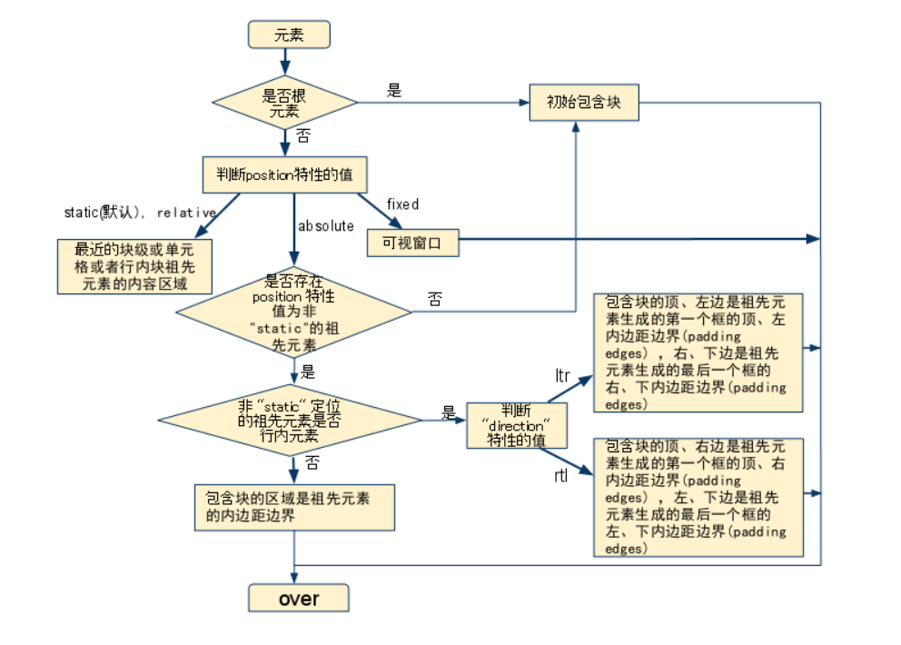

*声明: 本文内容主要翻译自相关资料. 感谢 (@Chris Coyier)[https://codepen.io/chriscoyier/] 对我理解 table 样式带来的帮助*

首先我们来看几个例子. 我们给整个页面的背景设置了 #ccc, 给容器 `div.main` 设置了白色背景以及 400px 的宽度, 让我们看得更加清晰.

```css
body {
	background: #ccc;
}
.main {
	width: 400px;
	margin: auto;
	background: #fff;
}
table, td {
	border: 1px solid #000;
}
```


#### 0x00

```html
<div class="main">
	<table>
		<tr>
			<td>左边的内容</td>
			<td>右边的内容</td>
		</tr>
	</table>
	<table>
		<tr>
			<td>左边的内容左边的内容</td>
			<td>右边的内容右边的内容</td>
		</tr>
	</table>
</div>
```

在[这个例子](https://github.com/ta7sudan/front-end-demo/blob/master/css/table/demo0.html)中, 第一个表格和第二个表格都很普通, 我们没有对它设置任何样式. 看上去也没什么毛病是不是? 不过等等, 为什么单元格中的文字换行了? 我们猜猜, 可能是浏览器对 `<td>` 有个默认宽度. 不过好像也不对, 如果是这样的话, 第二个 `<table>` 应该每个单元格都有三行内容了.


#### 0x01

```html
<div class="main">
	<table>
		<tr>
			<td>左边的内容左边的内容多 一个 x</td>
			<td>右边的内容右边的内容多一个字</td>
		</tr>
	</table>
	<table>
		<tr>
			<td>左边的内容少</td>
			<td>右边的内容比左边多很多很多很多很多很多很多</td>
		</tr>
	</table>
</div>
```


在[这个例子](https://github.com/ta7sudan/front-end-demo/blob/master/css/table/demo1.html)中, 依然是两个很普通的表格, 第一个左边的内容和右边的内容并不相同, 不过巧合的是两边的 `<td>` 是一样宽的, 当然这可能只是一个巧合. 那么第二个表格中, 左边的内容比右边的内容少, 所以右边比左边宽很多, 看上去也没毛病. 不过你知道右边比左边宽多少吗? 或者浏览器根据字数的比例来分配两边的宽度吗? 好像也不是.


#### 0x02

```html
<div class="main">
	<table class="tb0">
		<tr>
			<td>左边的内容少</td>
			<td>右边的内容比左边多很多很多很多很多很多很多</td>
		</tr>
	</table>
	<table class="tb1">
		<tr>
			<td>左边的内容少</td>
			<td>右边的内容比左边多很多很多很多很多很多很多</td>
		</tr>
	</table>
	<table class="tb2">
		<tr>
			<td>左边的内容少</td>
			<td>右边的内容比左边多很多很多很多很多很多很多</td>
		</tr>
	</table>
	<div class="para">
		<p>段落段落段落段落段落段落段落段落段落段落段落段落段落段落段落段落段落段落段落段落段落段落段落段落段落段落段落段落段落段落段落段落</p>
	</div>
</div>
```

```css
.tb0 td {
	width: 50%;
}

.tb1 td {
	width: 1000px;
}

.tb2 td:nth-child(1) {
	width: 1000px;
}

.tb2 td:nth-child(2) {
	width: 2000px;
}

.para p {
	width: 1000px;
}
```

在[这个例子](https://github.com/ta7sudan/front-end-demo/blob/master/css/table/demo2.html)中, 为了解决上面的问题, 我们可以给 `<td>` 设置 50% 的宽度, 如 `table.tb0`. 很好, 符合我们的预期. 

那我们给 `<td>` 设置 `width: 1000px` (如 `table.tb1`)又会怎样? 我猜它会溢出 `div.main`. 不过事实是, 它和 `table.tb0` 的效果是一样的, 表格没有溢出父元素, 并且每个单元格按比例均分了表格的空间.

再看看 `table.tb2`, 同样表格没有溢出父元素, 并且每个单元格按比例均分了表格的空间.

而作为对照, 我们给 `div.para` 的 `<p>` 设置了 `width: 1000px`, 它溢出了...WTF...


#### 0x03

```html
<div class="main">
	<table class="tb0">
		<tr>
			<td>左边的内容</td>
			<td>右边的内容有个很长的图片 </td>
		</tr>
	</table>
	<table class="tb1">
		<tr>
			<td>左边的内容左边的内容</td>
			<td>右边的内容右边的内容右边的内容右边的内容</td>
		</tr>
	</table>
	<table class="tb2">
		<tr>
			<td>左边的内容</td>
			<td>
				<pre>
					function wtf() {
						console.log('WTF'); 
					}
				</pre>
			</td>
		</tr>
	</table>
</div>
```

```css
.tb0, .tb1, .tb2 {
	overflow: hidden;
}

.tb0 td, .tb1 td, .tb2 td {
	overflow: hidden;
}

.tb1 {
	white-space: nowrap;
}
```

再看看[这个例子](https://github.com/ta7sudan/front-end-demo/blob/master/css/table/demo3.html), 我们给 `<td>` 里面放了张很大的图片, 或者让文字不换行, 或者放一段代码块, 并且给 `<table>` `<td>` 都加上了 `overflow: hidden;`, 然而它们导致 `<table>` 溢出父元素了. 那什么时候 `<table>` 会溢出父元素, 什么时候不会溢出? 我也不知道...


#### 总结

`<table>` 以及相关元素的默认行为总是显得有些诡异, 给它们设置 CSS 样式也往往不符合预期. 所以建议在没有 `table-layout: fixed` 的情况下

* 不要试图给 `<td>` 设置宽度
* 不要试图给 `<table>` `<td>` 设置 `overflow: hidden;`

这些都可能不符合你的预期. 下一篇会说明什么是 `table-layout` 以及如何解决.


####  参考资料

* https://developer.mozilla.org/en-US/docs/Learn/CSS/Styling_boxes/Styling_tables
* https://css-tricks.com/fixing-tables-long-strings/
* https://codepen.io/chriscoyier/pen/lAqrG/