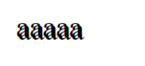
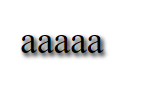
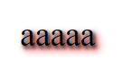
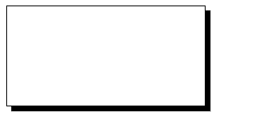
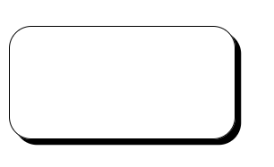
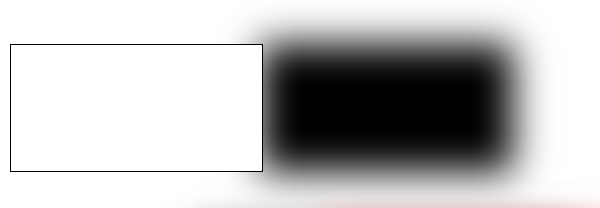
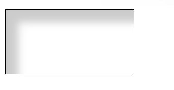

#### text-shadow

基本语法

```
text-shadow: offset-x offset-y [blur-radius] color[, offset-x offset-y [blur-radius], ...]
```

一个 x 方向偏移, 一个 y 方向偏移, 一个可选的模糊半径, 一个颜色, 为一组文字阴影. 可以有多组, 逗号分隔, 从左往右 z-index 依次减小.


最简单的情况

```css
.text-shadow-0 {
	text-shadow: 2px 2px #000;
}
```



带模糊半径

```css
.text-shadow-1 {
  text-shadow: 2px 2px 5px #000;
}
```



多个阴影

```css
.text-shadow-2 {
	text-shadow: 2px 2px 5px #000, 4px 4px 10px #f00;
}
```



参考 [demo](https://github.com/ta7sudan/front-end-demo/blob/master/shadow/demo0.html)


#### box-shadow

基本语法

```
box-shadow: [inset] offset-x offset-y [blur-radius] [spread-radius] color[[inset] offset-x offset-y [blur-radius] [spread-radius] color ...]
```

一个关键字 inset 表明是否是内阴影, 一个 x 方向偏移, 一个 y 方向偏移, 一个可选的模糊半径, 一个可选的扩散半径, 一个颜色, 为一组阴影. 可以有多组, 逗号分隔, 从左往右 z-index 依次减小. 需要注意的是阴影的形状与盒子的形状一致, 即盒子有 border-radius 则阴影也有.


最简单的情况

```css
.box-shadow-0 {
	box-shadow: 5px 5px #000;
}
```



带 border-radius

```css
.box-shadow-1 {
	border-radius: 20px;
	box-shadow: 5px 5px #000;
}
```




模糊半径

```css
.box-shadow-2 {
	box-shadow: 200px 0px 50px #000;
}
```




扩散半径及多组阴影

```css
.box-shadow-3 {
	box-shadow: 200px 0px 50px 50px #000, 300px 0px 50px 50px #f00;
}
```


内阴影

```css
.box-shadow-4 {
	box-shadow: inset 20px 20px 20px rgba(0, 0, 0, 0.2);
}
```




内阴影和外阴影

```css
.box-shadow-5 {
	box-shadow: inset 20px 20px 20px rgba(0, 0, 0, 0.2), 200px 0px 50px #000;
}
```


参考 [demo](https://github.com/ta7sudan/front-end-demo/blob/master/shadow/demo1.html)