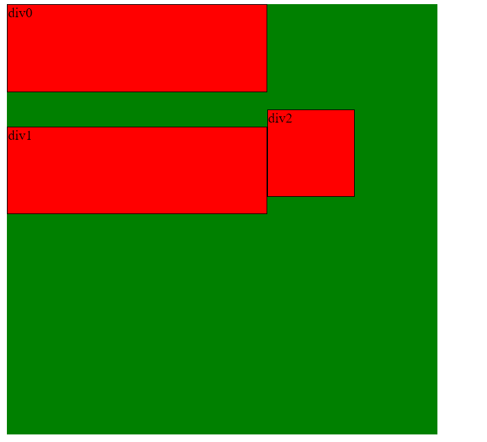
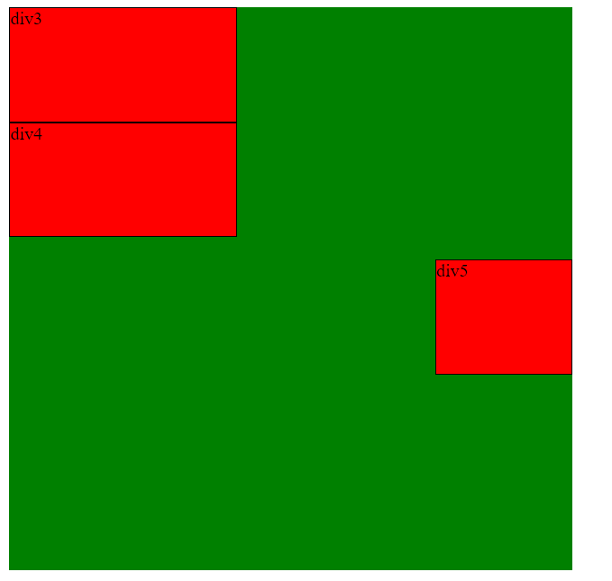
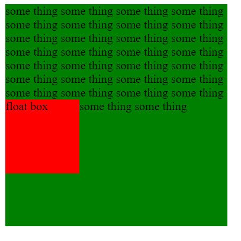
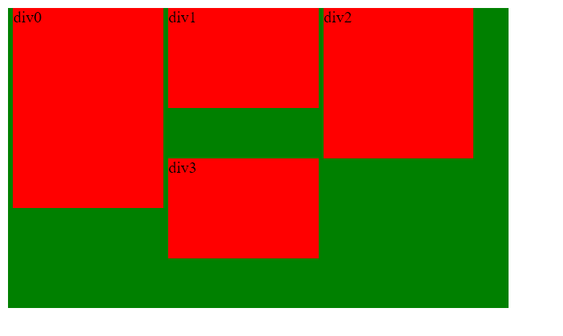
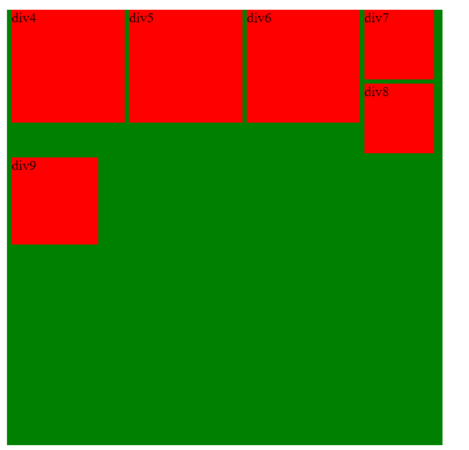
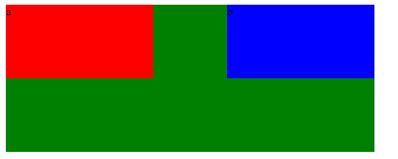
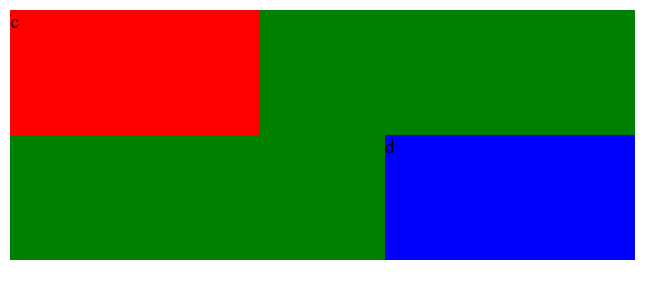

使用 float 意味着使用块布局(block layout), 它可能会修改 `display` 的计算值, 即一个原本 `display: inline;` 的元素, 在使用 float 之后, 实际上相当于 `display: block;`, 具体的对应关系, 可以参考下表:

| **display**        | **computed value**       |
| ------------------ | ------------------------ |
| inline             | block                    |
| inline-block       | block                    |
| inline-table       | table                    |
| table-row          | block                    |
| table-row-group    | block                    |
| table-column       | block                    |
| table-column-group | block                    |
| table-cell         | block                    |
| table-caption      | block                    |
| table-header-group | block                    |
| table-footer-group | block                    |
| flex               | flex, 并且 float 无效        |
| inline-flex        | inline-flex, 并且 float 无效 |
| 其他                 | 不改变                      |

注意如果通过 js 修改 float 的话, 在 FF34 或者 IE8 及以下时, 是 `element.style.cssFloat` 和 `element.style.styleFloat`, 因为 float 在 js 中是保留字.


#### 浮动的规则

先引用一下 CSS 权威指南中的浮动规则:

>1. 浮动元素的左外边界不能超过其包含块的左内边界,  同理右边.
>2. 浮动元素的左外边界必须是源文档中之前出现的左浮动元素的右外边界, 除非后出现的浮动元素的顶端在先出现的浮动元素的底端下面, 同理右边.
>3. 左浮动元素的右外边界不会在其右边右浮动元素的左外边界的右边. 一个右浮动元素的左外边界不会在其左边任何左浮动元素的右外边界的左边.
>4. 一个浮动元素的顶端不能比其父元素的内顶端更高. 如果一个浮动元素在两个合并外边距之间, 放置这个浮动元素时就好像在两个元素之间有一个块级父元素.
>5. 浮动元素的顶端不能比之前所有浮动元素或者块级元素的顶端更高.
>6. 如果源文档中一个浮动元素之前出现另一个元素, 浮动元素的顶端不能比包含该元素所生成框的任何行框的顶端更高.
>7. 左浮动元素的左边有另一个浮动元素, 前者的右外边界不能在其包含块的右边界的右边.
>8. 浮动元素必须尽可能高地放置.
>9. 左浮动元素必须向左尽可能远, 右浮动元素必须向右尽可能远. 位置越高, 就会向右或向左浮动得越远.

其实这也是 W3C 标准文档中的浮动规则, 不过读起来有点绕口(且翻译有些许问题, 比如规则 4 应该是包含块而非父元素), 我还是希望用自己的方式重新理解一遍. 在这之前, 明确几个基本概念:

* margin-box
* 内容区(content-box)
* 浮动元素不在正常文档流(Normal flow)中
* BFC
* 包含块
* 匿名块级元素(Anonymous block box)
* 行框(line box)
* 以下提及的"先", "前", "后"等词汇均指 DOM 树中的顺序

另外, **以上规则的优先级根据序号从小到大依次降低, 即第一条优先第二条, 依次类推.**


#### 关于规则 1 的解释

首先浮动元素创建了一个 BFC, 所以浮动元素的定位也是说它的 margin-box 的定位. 其次, 由包含块的定义可知, 浮动元素的包含块是最近的块级祖先元素的内容区, 大部分时候是其父元素的内容区, 所以这条规则即浮动元素的 margin-box 的顶部不超过其父元素内容区顶部, 同理左右方向. 这里不包括 `position: absolute;` 的浮动元素, 因为判定包含块时, absolute 的优先级高于 float. **浮动元素的 margin-box 相对于其包含块元素的内容区定位.**

所以规则 1 限制了**左浮动元素不会从左边溢出包含块, 右浮动元素不会从右边溢出包含块(假如一个浮动元素宽度超过了包含块宽度, 左浮动元素的右边界可以溢出包含块的右边界, 同理右浮动)**

另外规则 1 中浮动元素的左外边界是指浮动元素 margin-box 的左边界, 包含块的左内边界是指包含块元素内容区左边界. 之后的外边界也均是这个意思.

参考 [demo](https://github.com/ta7sudan/front-end-demo/blob/master/css/float/demo0.html)


#### 关于规则 2 的解释

规则 2 其实是说, 当存在多个同方向的浮动元素时, **如果包含块的横向空间足够放下, 则它们紧紧贴在一起, 不重叠不覆盖, 且 DOM 顺序中前面的元素更左(或更右); 如果包含块的横向空间不够放下, 则后面的元素会被挤到前面相邻浮动元素的下方.** 被挤到下方意味着下方元素的 margin-box 顶部不高于上方元素 margin-box 的底部. 具体再参考规则 8 9 的解释. 规则 2 确保了同方向浮动时, 多个浮动元素不会重叠或覆盖, 其实这一点根据 BFC 的性质也可以得到.

所以规则 2 中浮动元素的顶端是指浮动元素 margin-box 上边界, 同理底端是指浮动元素 margin-box 下边界. 之后的顶端, 底端也均是这个意思.

参考 [demo](https://github.com/ta7sudan/front-end-demo/blob/master/css/float/demo1.html)


#### 关于规则 3 的解释

如果说规则 2 是定义了多个同方向浮动元素的行为, 那规则 3 就是定义了多个不同方向的浮动元素的行为. 即**如果有多个不同方向的浮动元素, 且包含块的横向空间不足以放下所有浮动元素, 则后面的元素会被挤到前面相邻浮动元素的下方.** 被挤到下方意味着下方元素的 margin-box 顶部不高于上方元素 margin-box 的底部. 具体再参考规则 8 9 的解释.

参考 [demo](https://github.com/ta7sudan/front-end-demo/blob/master/css/float/demo2.html)


#### 关于规则 4 的解释

前半句其实和规则 1 本质上一样, 即浮动元素 margin-box 顶部不会超过其包含块顶部. 后半句其实是 BFC 的性质, 即 A B 两个同级元素发生外边距合并, 如果往 A B 之间插入一个浮动元素 C, C 的位置在 A B 之间, 且之前的外边距不会再合并, A C 之间也不发生外边距合并, B C 之间也不发生外边距合并.


#### 关于规则 5 的解释

规则 5 比较简单, 正如它的字面意思, 即浮动元素 margin-box 顶部不会比它前面的浮动元素 margin-box 或块级元素的??的顶部.

考虑 [demo](https://github.com/ta7sudan/front-end-demo/blob/master/css/float/demo3.html) 中的第一种情况

```html
<div class="main">
	<div class="div0">div0</div>
	<div class="div1">div1</div>
	<div class="div2">div2</div>
</div>
```

```css
.main {
	width: 500px;
	height: 500px;
	background: green;
	margin-bottom: 20px;
}

.main div {
	border: 1px solid #000;
	background: red;
}

.div0 {
	width: 300px;
	height: 100px;
	margin-bottom: 20px;
	float: left;
}

.div1 {
	width: 300px;
	height: 100px;
	margin-top: 20px;
	float: left;
}

.div2 {
	width: 100px;
	height: 100px;
	float: left;
}
```



可以看到, 尽管 div0 右边还有很大的空间, 但是 div2 顶部依然不会高于 div1 的 margin-box 顶部.

因为我没有想出如何构造一个块级元素的情况, 姑且看下面这种情况吧, 参考 [demo](https://github.com/ta7sudan/front-end-demo/blob/master/css/float/demo3.html) 中第二种情况.

```html
<div class="main">
	<div class="div3">div3</div>
	<div class="div4">div4</div>
	<div class="div5">div5</div>
</div>
```

```css
.div3 {
	width: 200px;
	height: 100px;
}

.div4 {
	width: 200px;
	height: 100px;
	margin-bottom: 20px;
}

.div5 {
	width: 120px;
	height: 100px;
			
	float: right;
}
```



可以看到, 尽管 div3 和 div4 右边有很多的空间, 但是 div5 依然不会浮动上去, 而 div5 的 margin-box 顶部甚至都没有超过 div4 的 margin-box 底部. 说好的不超过块级元素的顶部呢, 虽然不知道是块级元素 margin-box 顶部还是 padding-box 顶部或者其他顶部, 但你这连块级元素 margin-box 底部都没有超过啊. 个人理解是因为 div5 是浮动元素, 创建了一个 BFC, 由 BFC 的性质可知一定不会与正常流中的元素(margin-box)发生重叠, 而规则 5 限制了 div5 不能超过 div4 的顶部, 因为 BFC 的关系又不能与 div4 重叠, 所以 div5 在div4 的 margin-box 底部.


#### 关于规则 6 的解释

考虑这样一个 [demo](https://github.com/ta7sudan/front-end-demo/blob/master/css/float/demo4.html)

```html
<div class="main">
	<span>some thing</span> <span>some thing</span> <span>some thing</span> <span>some thing</span> <span>some thing</span>
	<span>some thing</span> <span>some thing</span> <span>some thing</span> <span>some thing</span> <span>some thing</span>
	<span>some thing</span> <span>some thing</span> <span>some thing</span> <span>some thing</span> <span>some thing</span>
	<span>some thing</span> <span>some thing</span> <span>some thing</span> <span>some thing</span> <span>some thing</span>
	<span>some thing</span> <span>some thing</span> <span>some thing</span> <span>some thing</span> <span>some thing</span>
	<span>some thing</span> <span>some thing</span> <span>some thing</span> <span>some thing</span> <span>some thing</span>
	<div class="float">float box</div>
</div>
```

```css
.main {
	width: 300px;
	height: 300px;
	background: green;
}

.float {
	width: 100px;
	height: 100px;
	background: red;

	float: left;
}
```



可以看到, 浮动元素的顶部和最后一行的顶部对齐了. 浮动元素前面有行内元素 `<span>`, 根据规则 6, 浮动元素的顶端不能比 `<span>` 所在的行框顶端更高, 所以只往上浮动了一行的高度. 

可能你已经注意到, 在之前的例子中, 浮动元素对它前面的块级元素都是没有影响的, 相当于浮动元素对其前面的块级元素来说是透明的, 即它前面的块级元素似乎不知道后面有个浮动元素一样. 根据匿名块级元素的定义, 这里的 `<span>` 是否应该生成一个匿名块级元素呢? 如果是的话, 那作为块级元素, 是不是也应该不受浮动元素的影响? 如果是这样, 那这个例子中, 前面的 `<span>` 会被包裹在一个匿名块级元素中, 而浮动元素应该出现在所有文字的下面才是, 但是其实并没有. 那要怎么解释呢?

个人理解是, 因为浮动元素是不在正常文档流中的, 所以这些 `<span>` "不知道"存在这么一个块级元素, 也就没必要为它们创建匿名块级元素, 而这种情况要怎么约束浮动的行为? 这就是规则 6 的意义了.


#### 关于规则 7 的解释

类似规则 1, 限制了有多个同方向的浮动元素时, 如果横向空间至少可以放下两个元素, 则这两个元素在水平方向上一定不会溢出包含块(即既不溢出包含块左边界, 也不溢出包含块右边界). 

或者换句话说, **有多个同方向的浮动元素时, 如果浏览器不能确保横向空间能放下多个浮动元素且不溢出包含块的话, 那就只放一个浮动元素**. 其实这句话的逆否命题就是有多个同方向的浮动元素时, 如果横向空间放下了至少两个浮动元素, 则说明浏览器可以确保横向空间能放下多个元素且不溢出包含块. 也就是本段第一句一样的意思. 

注意规则 7 和规则 1 并不矛盾, 规则 7 也没有限制说浮动元素不能在水平方向上溢出包含块, 只是限制了如果水平方向放了多个同方向的浮动元素时, 则水平方向上它们不能溢出包含块. 考虑一个宽度大于包含块的左浮动元素, 根据规则 1 它的右边界会溢出包含块的右边界, 假如它后面还有左浮动元素, 根据规则 7, 后面的左浮动元素被挤到它的下方. 再考虑两个宽度都小于包含块宽度的左浮动元素, 横向空间放不下这两个元素, 根据规则 7 后面的元素会被挤到下方, 而不会强行放下两个元素导致溢出包含块. 这也是规则 7 表述的意思.

同时这个规则隐含的另一个意思是, 如果横向空间放不下多个同方向的浮动元素, 后面的元素会被挤到下方, 而不是溢出包含块. 挤到下方的解释参考规则 8 和规则 9.


#### 关于规则 8 和规则 9 的解释

首先, 规则 8 说的是浮动元素必须尽可能靠上放, 规则 9 说的是左浮动的元素必须尽可能靠左放, 同理右浮动. 另一个关键的是记住规则 8 的优先级大于规则 9, 即如果元素可以往左也可以往上放, 那优先往上放. OK, 有了这两点认识, 我们来看一个 [demo](https://github.com/ta7sudan/front-end-demo/blob/master/css/float/demo5.html).

```html
<div class="main0">
	<div class="div0">div0</div>
	<div class="div1">div1</div>
	<div class="div2">div2</div>
	<div class="div3">div3</div>
</div>
```

```css
.main0 {
	width: 500px;
	height: 300px;
	background: green;
}

.main0 div {
	width: 150px;
	background: red;
	margin-left: 5px;

	float: left;
}

.div0 {
	height: 200px;
}

.div1 {
	height: 100px;
}

.div2 {
	height: 150px;
}

.div3 {
	height: 100px;
}
```



可以看到 div3 不是在 div0 的下方, 而是在 div1 的下方. 怎么解释呢? 

首先根据规则 2, 当横向空间放不下所有浮动元素的时候, 后面的元素(也就是 div3)会被挤到前面的相邻的浮动元素的下方, 即 div3 的顶部不会超过 div2 的底部. 但是不超过也意味着 div3 可以放到 div0 的下面, 也可以放到 div2 的下面, 那到底是哪个呢?

再根据规则 8, 要把 div3 尽可能高地放置. 所以 div3 顶部应该紧贴 div2 底部.

再根据规则 9, 要把 div3 尽可能往左放, 所以 div3 的左边紧贴 div0 的右边.

所以最终的表现是 div3 既不在 div0 的下面, 也不在 div2 的下面, 而且也没有紧贴 div1 的底部, 而是留出空白对齐 div2 的底部.

再来看第二个例子, 代码就不贴了, 在之前的 [demo](https://github.com/ta7sudan/front-end-demo/blob/master/css/float/demo5.html) 中有.



可以看到 div8 在规则 2 的作用下被挤到了 div7 的下方, 同时在规则 8 的作用下没有出现在 div4 的下方, 而是紧贴 div7 底部. 而 div9 在规则 2 的作用下顶部对齐了 div8 的顶部, 在规则 9 的作用下紧贴包含块的左边.


#### 其他的推论

已知

* 浮动元素不在正常流中
* 根据规则 1 和规则 7, 浮动元素可能溢出包含块

所以

* **浮动元素无法撑起包含块的高度, 且可能溢出包含块.**
* **浮动元素后面的元素会向上移动到紧贴前面的正常流中的元素, 并且浮动元素后面的元素的 margin-box 可能会和浮动元素重叠.**

另外观察这些 demo, 可以发现

* **浮动元素大部分时候都是对它后面的元素产生影响, 而很少(除了规则 6)对之前的元素产生影响. 如果一个元素是正常流中的块级元素, 它后面有一个浮动元素, 那这个浮动元素对它来说是透明的, 即似乎不存在, 它也不知道后面的元素是否是浮动, 浮动元素也不会影响它的布局.**

还有就是

* **浮动元素的包含块是其最近的块级祖先元素的内容区, 大部分时候是它的父元素的内容区, 什么时候不是它的父元素呢? 当浮动元素是行内元素且嵌套在多个行内元素中时.**


#### 关于 clear

`clear` 属性指定了一个元素是否可以放在它**之前的**浮动元素的旁边. 注意是**之前**, 也就意味着 `clear` 只根据之前的浮动元素来决定当前元素的位置, 而不会考虑之后的元素是否浮动.

来看一个 [demo](https://github.com/ta7sudan/front-end-demo/blob/master/css/float/demo6.html)

```html
<div class="main">
	<div class="a">a</div>
	<div class="b">b</div>
</div>
```

```css
.main {
	width: 500px;
	height: 200px;
	margin-bottom: 20px;
	background: green;
}
		
.a {
	width: 200px;
	height: 100px;
	background: red;
	float: left;

	clear: right;
}

.b {
	width: 200px;
	height: 100px;
	background: blue;
	float: right;
}
```



可以看到, 给 `div.a` 设置了 `clear: right;` 并没有卵用, 因为 `clear` 只会根据 `div.a` 之前的元素来调整布局.

而下面这个例子中

```html
<div class="main">
	<div class="c">c</div>
	<div class="d">d</div>
</div>
```

```css
.main {
	width: 500px;
	height: 200px;
	margin-bottom: 20px;
	background: green;
}
.c {
	width: 200px;
	height: 100px;
	background: red;
	float: left;
}

.d {
	width: 200px;
	height: 100px;
	background: blue;
	float: right;

	clear: left;
}
```



给 `div.d` 设置 `clear: left;` 是有效的, 因为 `div.d` 前面有 `div.c` 这样一个浮动元素.

换句话说, `clear` 只改变元素自身的位置, 而不改变它前面或后面的浮动元素的位置.

另外, `clear` 只适用于处于同一块格式化上下文内的元素, 即它不会根据其他 BFC 内的浮动元素来进行定位.


#### 其他问题

考虑 `float` 和 `position: absolute;` 都会使一个元素脱离正常流, 从而使得父元素的高度无法被撑起, 那为什么给父元素创建 BFC 后, `float` 可以撑起父元素高度而 `position: absolute;` 不可以呢?

简单来讲, 规范如此. 这里直接引用下[这个问题](https://segmentfault.com/q/1010000000686154)的回答好了.

> W3C标准的算法里,float可能参与父级高度计算，但position:absolute;始终不参与父级计算。就是这样设计的，没辙：
>
> [W3C CSS2.1 10.6.3](https://www.w3.org/TR/CSS21/visudet.html#normal-block)规定了未创建BFC的非替换块级元素的高度计算规则：
>
> > This section also applies to block-level non-replaced elements in normal flow when 'overflow' does not compute to 'visible' but has been propagated to the viewport.
> >
> > If ['margin-top'](https://www.w3.org/TR/CSS21/box.html#propdef-margin-top), or ['margin-bottom'](https://www.w3.org/TR/CSS21/box.html#propdef-margin-bottom) are 'auto', their used value is 0. If ['height'](https://www.w3.org/TR/CSS21/visudet.html#propdef-height) is 'auto', the height depends on whether the element has any block-level children and whether it has padding or borders:
> >
> > The element's height is the distance from its top content edge to the first applicable of the following:
> >
> > 1. the bottom edge of the last line box, if the box establishes a inline formatting context with one or more lines
> > 2. the bottom edge of the bottom (possibly collapsed) margin of its last in-flow child, if the child's bottom margin does not collapse with the element's bottom margin
> > 3. the bottom border edge of the last in-flow child whose top margin doesn't collapse with the element's bottom margin
> > 4. zero, otherwise
>
> 如上述分点，分项1定义了line-box撑高容器，分项2和3定义了常规流块级元素撑高容器（margin折叠与否的两种情况），否则为0。
>
> [W3C CSS2.1 10.6.7](https://www.w3.org/TR/CSS21/visudet.html#root-height)规定了创建了BFC的元素（block formatting context roots）的高度计算规则：
>
> > If it only has inline-level children, the height is the distance between the top of the topmost line box and the bottom of the bottommost line box.
> >
> > If it has block-level children, the height is the distance between the top margin-edge of the topmost block-level child box and the bottom margin-edge of the bottommost block-level child box.
> >
> > Absolutely positioned children are ignored, and relatively positioned boxes are considered without their offset. Note that the child box may be an [anonymous block box.](https://www.w3.org/TR/CSS21/visuren.html#anonymous-block-level)
> >
> > In addition, if the element has any floating descendants whose bottom margin edge is below the element's bottom content edge, then the height is increased to include those edges. Only floats that participate in this block formatting context are taken into account, e.g., floats inside absolutely positioned descendants or other floats are not.
>
> 这里规则大致跟上方一样，不同点在于margin不再折叠和float高度参与计算。
>
> 总之呢，在“撑高父容器圈”里面没有绝对定位元素的地位。


#### 参考资料

* https://developer.mozilla.org/en-US/docs/Web/CSS/float
* https://www.w3.org/TR/CSS21/visuren.html#floats
* https://segmentfault.com/a/1190000005925592
* https://developer.mozilla.org/en-US/docs/Web/CSS/clear
* https://segmentfault.com/q/1010000000686154