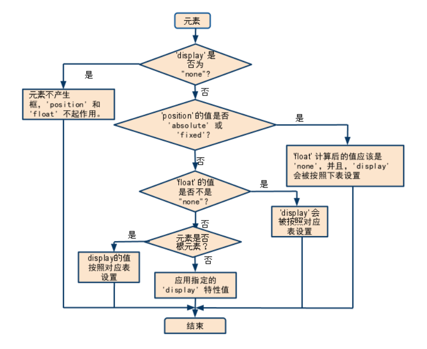
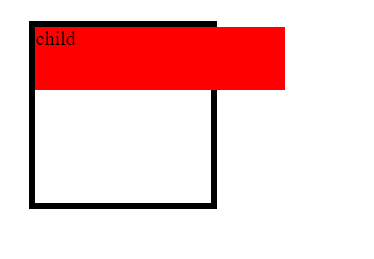

对于定位已经很熟悉了, 故不想再具体写相关内容了, 这篇只记录一些平时没太注意的细节供自己查阅.


#### display, position 和 float 之间的关系



图中的下表请参考 [复习float](./复习float.md)

可以看出, absolute 和 fixed 的优先级最高, 在这两种定位下, float 将会失效.


#### 只有 absolute 而没有 top 等属性的情况

对于一个元素, 只设置 `position: absolute;` 而不设置 `top` 等, 此时元素的位置和之前在正常流中一样, 只不过后面的元素会因为该元素不在正常流中而占据该元素的位置导致重叠.


#### transform 对 fixed 的影响

都知道 fixed 定位是相对于初始包含块的, 但是有个特例是当某个祖先元素有任意非 none 的 transform 属性时, 该祖先元素的 padding-box 将作为 fixed 定位的包含块. 事实上, 带有非 none 的 transform, perspective, filter 属性的元素的 padding-box 都将作为 fixed 定位的子元素的包含块. 或者说, **fixed 定位的元素的包含块是初始包含块或最近的带有非 none 的 transform, perspective, filter 属性的祖先元素的 padding-box.**

[W3C](https://www.w3.org/TR/css-transforms-1/#transform-rendering) 文档中的描述:

> For elements whose layout is governed by the CSS box model, any value other than none for the transform also causes the element to become a containing block, and the object acts as a containing block for fixed positioned descendants.

[MDN](https://developer.mozilla.org/en-US/docs/Web/CSS/position) 的描述:

> When an ancestor has the `transform`, `perspective`, or `filter` property set to something other than `none`, that ancestor is used as the container instead of the viewport (see [CSS Transforms Spec](https://www.w3.org/TR/css-transforms-1/#transform-rendering))

其实这几个属性不仅仅对 fixed 定位有影响, 对 absolute 同样也有影响

> If the `position` property is `absolute` or `fixed`, the containing block may also be formed by the edge of the padding box of the nearest ancestor element that has the following:
>
> * A `transform` or `perspective` value other than none
> * A `will-change` value of `transform` or `perspective`
> * A `filter` value other than `none` or a `will-change` value of `filter` (only works on Firefox).

即如果一共元素的定位方式是 absolute 或者 fixed, 则它们的包含块是以下元素的 padding-box:

* `transform` 或 `perspective` 属性不为 none 的元素
* `will-change` 的值是 `transform` 或 `perspective` 的元素
* `filter` 的值不为 none 的元素或 `will-change` 的值为 `filter` 的元素(这个仅限于 FF)

简而言之, fixed 和 absolute 定位的元素的包含块是带有非 none 值的 `transform` `perspective` 和 `filter` 元素的 padding-box, 否则是初始包含块/最近的非 static 定位的祖先元素的 padding-box. 可以看出这三个属性的优先级更高.

eg.

```html
<div class="container">
  <div class="child">child</div>
</div>
```

```css
.container {
  width: 100px;
  height: 100px;
  border: 5px solid #000;
  padding: 20px;
  margin: 20px;
  transform: translate(0px, 0px);
}

.child {
  width: 200px;
  height: 50px;
  background: red;
  position: absolute;
  top: 0;
  left: 0;
}
```



可以看到, 尽管 `div.container` 的定位方式是 static, 但 `div.child` 仍然相对于它的 padding-box 定位, 而不是相对于初始包含块定位.


#### absolute/fixed 和 overflow 的关系

如果一个元素 A 具有 `overflow` 属性(非默认值), 且包含 absolute/fixed 定位的子元素 B, 如果 A 不是 B 的包含块, 则 B 依然会溢出 A.

eg.

```html
<div class="container">
  <div class="child">child</div>
</div>
```

```css
.container {
  width: 100px;
  height: 100px;
  border: 5px solid #000;
  padding: 20px;
  margin: 20px;
  overflow: hidden;
  /* transform: translate(0px, 0px); */
}

.child {
  width: 200px;
  height: 50px;
  background: red;
  position: absolute;
  top: 0;
  left: 0;
}
```

可以对比是否有 `transform` 的情况, 当存在 `transform` 将 `div.container` 提升为包含块的时候, `div.child` 不会溢出, 否则会溢出.


#### 参考资料

* http://www.w3help.org/zh-cn/kb/009/
* https://www.w3.org/TR/css-transforms-1/#transform-rendering
* https://developer.mozilla.org/en-US/docs/Web/CSS/position
* https://developer.mozilla.org/en-US/docs/Web/CSS/All_About_The_Containing_Block
* http://www.zhangxinxu.com/wordpress/2015/05/css3-transform-affect/