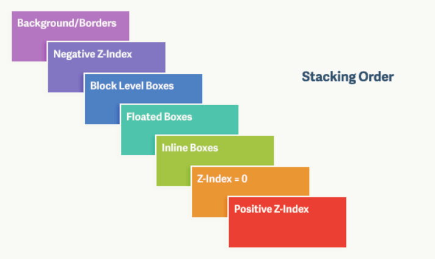

#### 层叠上下文

根据 MDN 的定义:

> 层叠上下文是HTML元素的三维概念，这些HTML元素在一条假想的相对于面向（电脑屏幕的）视窗或者网页的用户的z轴上延伸，HTML元素依据其自身属性按照优先级顺序占用层叠上下文的空间。

比较抽象, 怎么理解呢? 简单来说, 就把层叠上下文当作一个图层好了, 页面由很多个这样的图层叠加. 如果一个元素形成了一个层叠上下文, 那它的子元素就都在这个层叠上下文(图层)中. 元素的 `z-index` 也只由当元素们都处于同一个层叠上下文中才有比较的意义.

层叠上下文中的子元素们可以堆叠, 层叠上下文之间也可以堆叠, 虽然生成层叠上下文的元素的子元素也可以生成新的层叠上下文, 但是每个层叠上下文对外相对其他层叠上下文来说, 总是一个整体, 即不论子元素是否生成层叠上下文, 该层叠上下文对外都只有一层.

##### 创建层叠上下文的方式

文档中的层叠上下文由满足以下任意一个条件的元素形成:

* 根元素
* `z-index` 不为 auto 的绝对/相对定位
* fixed 定位或 sticky 定位的元素
* 一个 `z-index` 不为 auto 的 flexbox(`display: flex` / `display: inline-flex`) 的子元素, 即 flex item
* 一个 `opacity` 小于 1 的元素
* 一个 `mix-blend-mode` 不为 normal 的元素
* 以下属性不为 none 的元素
  * `transform`
  * `filter`
  * `perspective`
  * `clip-path`
  * `mask` / `mask-image` / `mask-border`
* `isolation` 为 isolate 的元素
* `-webkit-overflow-scrolling` 为 touch 的元素
* `will-change` 中指定了任意 CSS 属性的元素(实测并不是, 而是 `transform` `opacity` 等值才会创建)

值得注意的是 `float` 和 `z-index: auto` 的 absolute/relative 的元素是没有创建层叠上下文的.

#### z-index

关于 `z-index` 其实没太多好说的, 只要记住它的默认值是 auto, 并且只作用于定位元素(非 static 定位).

#### 层叠关系

其实一句话就可以概括(注: 大于是指 z 轴距离人眼更近)

* 非层叠上下文的元素之间: static < float < `z-index:auto` 的 relative = `z-index:auto` 的 absolute
* 层叠上下文的元素之间: 根据 `z-index` 和 DOM 顺序决定
* 非层叠上下文的元素和层叠上下文的元素之间: 层叠上下文的元素 > 非层叠上下文的元素

总结就是:

static 定位的元素 < float 的元素 < `z-index:auto` 且 relative 的元素 = `z-index:auto` 且 absolute 的元素 < 其他`z-index: auto` 的层叠上下文 < `z-index` 不为 auto 的层叠上下文.

这里我假设存在 `z-index: auto` 的层叠上下文, 但其实应该是不存在的.

根据 [这篇](https://segmentfault.com/a/1190000002783265) 的说法, 通过 `opacity` 等非定位方式(非 static 定位的方式)创建的层叠上下文, 都会被视为一个 `z-index: 0` 的定位元素(非 static 定位的元素).

关于 `opacity` 的[描述](https://www.w3.org/TR/css-color-3/#transparency):

> If an element with opacity less than 1 is not positioned, then it is painted on the same layer, within its parent stacking context, as positioned elements with stack level 0.

关于 `transform` 的[描述](https://www.w3.org/TR/css-transforms-1/#transform-rendering):

> For elements whose layout is governed by the CSS box model, any value other than none for the transform results in the creation of a stacking context. Implementations must paint the layer it creates, within its parent stacking context, at the same stacking order that would be used if it were a positioned element with ‘z-index: 0’. 

如果把 `background` 考虑进来, 层叠关系可以参考以下这个不是很严谨的图:

即一个元素的 `background/border` < 负 `z-index` 的元素 < 块级子元素 < float 的子元素 < 行内元素 < `z-index: 0` 的元素 < 正 `z-index` 的元素.

建议只参考它的 `background` 和负 `z-index` 的关系好了.

#### 参考资料

* https://developer.mozilla.org/en-US/docs/Web/CSS/CSS_Positioning/Understanding_z_index/The_stacking_context
* https://developer.mozilla.org/en-US/docs/Web/CSS/CSS_Positioning/Understanding_z_index/Stacking_without_z-index
* https://developer.mozilla.org/en-US/docs/Web/CSS/CSS_Positioning/Understanding_z_index/Stacking_and_float
* https://developer.mozilla.org/en-US/docs/Web/CSS/CSS_Positioning/Understanding_z_index/Adding_z-index
* https://developer.mozilla.org/en-US/docs/Web/CSS/CSS_Positioning/Understanding_z_index/Stacking_context_example_1
* https://developer.mozilla.org/en-US/docs/Web/CSS/CSS_Positioning/Understanding_z_index/Stacking_context_example_2
* https://developer.mozilla.org/en-US/docs/Web/CSS/CSS_Positioning/Understanding_z_index/Stacking_context_example_3
* https://segmentfault.com/a/1190000002783265
* https://webdesign.tutsplus.com/zh-hans/articles/what-you-may-not-know-about-the-z-index-property--webdesign-16892
* http://www.zhangxinxu.com/wordpress/2016/01/understand-css-stacking-context-order-z-index/
* http://web.jobbole.com/92121/
* https://zhuanlan.zhihu.com/p/33984503

