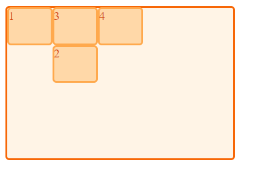
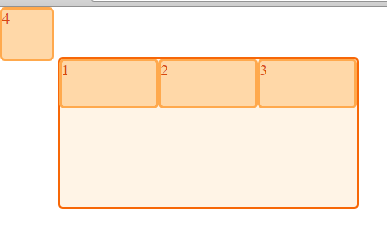

注意, 因为 grid 标准还在修订中, 以下内容可能会随着标准的改变而过时(比如据说之后的标准可能会将 `grid-row-gap` 和 `grid-column-gap` 改为 `row-gap` 和 `column-gap`, 以便与 `column` 布局统一), 当然我也会尽量及时修正. 以下内容写于 2018/2/27.

本文中提到的 content-box 均是在未改变 `box-sizing` 的情况下适用.

关于 grid 的应用场景, 或者说比其他布局有什么优势? 在有既要按水平方向进行对齐, 同时又要保证垂直方向的对齐时, 可以使用 grid 布局.

关于 grid 的建议是, 如果面向的用户是最新的浏览器, 那基本可以用于生产环境, 否则不建议用于生产环境.


在介绍 gird 布局之前我们先来看几幅图


整个最大的整块矩形块我们称作**网格容器(grid container)**, 也是我们的布局容器, 即容器里面的元素都按照网格进行布局. 图中的虚线我们称为**网格线(grid line)**, 网格线是一个布局时的参考线, 并不会被实际渲染出来. 网格线带有一个属性, 那就是编号, 即每个网格线都是有自己的序号的.


像这样, 无论水平方向还是垂直方向的网格线都有自己的编号. 编号是网格线固有的属性, 无需开发者自己定义, 默认从 1 开始, 从上往下依次递增, 从左往右依次递增(但也不一定, 还与[书写模式](https://developer.mozilla.org/en-US/docs/Web/CSS/writing-mode)有关). 网格线可以有自己的名字, 名字由开发者定义, 具体参考后文.

网格容器被网格线分隔成了 3x3 个单元格, 每个单元格我们称为**网格单元(grid item)**. 网格线也把网格容器分成了三行三列, 这里行和列我们都称为**网格轨道(grid track)**. 其中深色的矩形块 One, Two, Three, Four 我们称为**网格项目(grid item)**. 

那网格单元和网格项目有什么区别? 答案是网格单元不是一个元素, 只是元素定位的参考系, 是一个逻辑概念, 不会被渲染到页面. 网格项目是我们实际渲染的元素, 网格项目根据网格单元进行定位, 网格项目可以占据一个网格单元, 也可以占据多个网格单元, 像下面这样.


可以看到, 这里的 One, Two 等矩形块都是网格项目, 这才是实际渲染出来的样子, 它们根据网格单元进行定位, 有些占据一个网格单元, 有些占据多个网格单元, 多个网格项目也可能重叠占据同一个网格单元.


但是网格项目不仅仅可以根据网格单元进行定位, 还可以根据网格区域进行定位. 我们可以从一片连续的网格单元中取出一个矩形, 如红框所示. 我们可以把这四个网格单元定义成一个**网格区域(grid area)**, 然后让一个网格项目占据一块网格区域(目前只支持矩形的网格区域, 还不支持 L 型的网格区域).

有人可能已经注意到, 第三幅图中的网格项目之间有些空白间隔, 我们把这些间隔叫做**网格间距(gutter)**. 那网格间距是否占用网格轨道的宽度呢? 下图可以更清楚的表明这点.


可以看到, 蓝色的是网格单元, 网格单元所处的地方是网格轨道, 而网格间距并没有占用网格轨道的空间.

OK, 通过以上几幅图, 我们大概可以知道, 网格容器, 网格轨道, 网格线, 网格单元, 网格区域, 网格间距都是逻辑概念, 是网格容器内部元素定位的参考系, 它们(除了网格容器和网格间距)不会被实际渲染出来, 而网格项目则是网格容器内部实际存在的元素, 会被渲染出来.

整个 grid 布局的过程就像是在一个事先定义的网格里面铺地砖, 我们把网格项目铺在网格单元上, 一个网格项目可以占据一个或多个网格单元(为了便于理解, 这里我们先用占据这个词, 但准确说并不是网格项目占据网格单元, 而是指定网格项目的定位区域一个或多个网格单元. 之后的内容中会更详细地解释这点), 网格项目之间也可以重叠. 所以使用 grid 布局的基本套路就是: 先定义网格容器, 再定义网格单元, 然后指定网格项目怎么个"铺"法.

需要注意的是, 我们说的定位是指网格项目的 margin-box 摆放在网格单元/网格区域之中, 网格单元/网格区域就像一个 BFC 那样, 使得网格项目的外边距不和其他网格项目的外边距发生折叠.


这个图中清晰地表明了一个网格项目的 margin-box 位于一个网格区域(三个网格单元)之中.


#### 几个术语

接着我们来了解一些术语, 其中有些前面我们已经提到过, 不过这里给出一些更具体的定义.

* **网格容器(grid container)**, `display: grid;` 或 `display: inline-grid;` 的元素, 整个网格系统都在网格容器的 content-box 中, 而网格容器对外(其他元素)依然是块级元素或者行内元素. 这个元素的所有正常流中的直系子元素(包括匿名盒子)都将成为**网格项目(grid item)** (W3C: Each in-flow child of a grid container becomes a grid item). `display: grid;` 会创建一个[GFC(grid formatting context)](https://drafts.csswg.org/css-grid/#grid-formatting-context), 类似 BFC 的东西.
* **网格线(grid line)**是网格容器的水平或垂直分界线. 网格线存在于列或行的任意一侧. 它们可以通过数字索引(从1开始)来引用或者通过开发者自定义的名字来引用. 作为元素定位时的参考系, 是一个逻辑意义上的实体, 不会被渲染.
* **网格轨道(grid track)**是任意两条相邻网格线之间的空间, 即一行或者一列, 之后简称轨道/行/列. 作为元素定位时的参考系, 是一个逻辑意义上的实体, 不会被渲染.
* **网格单元(grid cell)**是行和列相交的空间, 是 grid 布局的最小单元. 作为元素定位时的参考系, 是一个逻辑意义上的实体, 不会被渲染.
* **网格区域(grid area)**是一块逻辑意义上的空间, 它包含了一个或多个相邻的网格单元, 由某四条网格线围成. 网格区域可以通过名字定义, 也可以通过网格线定义. 作为元素定位时的参考系, 是一个逻辑意义上的实体, 不会被渲染.
* **显式网格(explicit grid)和隐式网格(implicit grid)**, 通过 `grid-template-columns` 和 `grid-template-rows` 创建出来的轨道, 我们称它们属于显示网格. 但是这些轨道不一定能容纳所有的网格项目, 浏览器根据网格项目的数量计算出来需要更多的轨道, 就会自动生成新的轨道, 这些自动生成的轨道我们称它们属于隐式网格.
* **网格间距(gutter)**通过 `grid-row-gap` 和 `grid-column-gap` (但是现在 W3C 标准中已经修改为通过 `row-gap`, `column-gap` 来定义了. 没错, 就是那个列布局中也会用到的 `column-gap`)定义相邻轨道之间的空白空间. 是一个额外的不占用轨道空间的空白. 对于跨越多个网格单元的网格项目, 不仅仅占据单元格的空间, 也占据其中的网格间距的空间. 网格间距只会在显示网格中出现.
* **剩余空间**是我自己发明的词, 即网格容器某方向上的大小(content-box 的 width)减去该方向上所有的网格间距之和剩下的空间, 也即所有行/列的宽度之和.


接下来也会通过具体例子进一步说明这些名词.


#### 新单位 fr 和 repeat(), minmax() 函数

在看具体例子之前先了解下随着 grid 布局一同出现的新单位 fr 以及两个新函数 repeat(), minmax(). 这里只简单地介绍这些内容, 之后会有更具体的说明.

##### fr

fr 其实就是分配剩余空间的权重, 熟悉 `flex-grow` 的话可以很容易 get 到这一点.


可以看到, 我们有一个网格容器, 容器有网格间距, 其中有三个网格项目, 它们的宽度都是 1fr, 所以它们均分了剩余空间.


而 2fr 的话则是这样, 它的工作机制就像 `flex-grow` 那样.


##### repeat()

`repeat()` 函数可以简单地理解为宏展开, 就像 Sass 中的 mixin 那样, 举个例子

```css
grid-template-columns: repeat(3, 1fr);
grid-template-columns: repeat(3, 1fr 2fr);
```

相当于

```css
grid-template-columns: 1fr 1fr 1fr;
grid-template-columns: 1fr 2fr 1fr 2fr 1fr 2fr;
```

即 `repeat(3, 1fr) / repeat(3, 1fr 2fr)` 展开成了 `1fr 1fr 1fr / 1fr 2fr 1fr 2fr 1fr 2fr`, . 当然, 这里只是简单地这么理解, 之后还有更具体的说明.


##### minmax()

`minmax()` 用来指定一个轨道的宽度值, 比如你可以指定一个轨道宽固定为 200px, 你也可以指定一个轨道宽度为 `minmax(200px, 1fr)`, 这样的话, 轨道宽度是弹性的, 最小为 200px, 最大为 1fr.


#### 使用 grid 布局

使用 grid 布局的一般套路可以总结为:

**定义网格容器 -- 划分网格单元 -- 根据网格单元定义网格项目**

来看一个例子

```html
<div class="main m0">
	<div class="item">1</div>
	<div class="item">2</div>
	<div class="item">3</div>
	<div class="item">4</div>
</div>
```

```css
.main {
	width: 300px;
	background: #fff4e6;
	border: 2px solid #f76707;
	border-radius: 5px;
	margin-bottom: 50px;
	display: grid;
}

.item {
	color: #d9480f;
	background: #ffd8a8;
	border: 2px solid #ffa94d;
	border-radius: 5px;
}
.m0 {
	grid-template-columns: 1fr 1fr 1fr;
	grid-template-rows: 50px 100px;
}
```


我们先定义了一个网格容器, 然后 `grid-template-columns: 1fr 1fr 1fr;` 定义了三列, 每列宽为 1fr, `grid-template-rows: 50px 100px;` 定义了两行, 其中第一行为 50px 高, 第二行为 100px 高. 网格项目默认被放入一个网格单元中, 按照从左往右从上往下排列, 于是得到如图效果. 其中 `grid-template-columns: 1fr 1fr 1fr;` 也可以写成 `grid-template-columns: repeat(3, 1fr);`.


##### 显式网格和隐式网格

在上面的例子中, 我们通过 `grid-template-columns` 和 `grid-template-rows` 把网格容器划分成了 2x3 个网格单元, 假如我们只指定一行的话又是怎样?

```css
.m1 {
	grid-template-columns: 1fr 1fr 1fr;
	grid-template-rows: 50px;
}
```


可以看到, 尽管我们没有指定两行, 但是网格容器依然被划分成了 2x3 个网格单元, 其中第一行的所有网格单元是我们通过 `grid-template-columns` 和 `grid-template-rows` 手动创建的, 我们把这种手动创建(即宽高都是由开发者定义的)的行和列产生的网格单元称为**显式网格(explicit grid)**, 第二行是浏览器根据网格项目的个数计算自动生成的, 我们把这种由浏览器自动生成的网格单元为**隐式网格(implicit grid)**.

我们指定了第一行为 50px 高度, 但是第二行因为是自动生成的, 所以高度默认由浏览器根据内容决定. 那是不是我们就没办法指定隐式网格的大小了? 也不是, 我们可以通过 `grid-auto-columns` 和 `grid-auto-rows` 来指定隐式网格的大小.

```css
.m2 {
	grid-template-columns: 1fr 1fr 1fr;
	grid-template-rows: 50px;
	grid-auto-rows: 100px;
}
```


可以看到, 第二行又变回了 100px 高.

既然可以自动生成行, 那什么时候自动生成列? 我们可以通过 `grid-auto-flow` 来改变网格项目的排列方向.

```css
.m3 {
	grid-template-columns: 1fr;
	grid-template-rows: repeat(3, 50px);
	grid-auto-flow: column;
}
```


这里我们指定了三行, 但是只指定了一列, 但是在 `grid-auto-flow` 的作用下, 原本先从左往右, 再从上往下排列的网格项目变成了先从上往下, 再从左往右排列, 于是第二列属于隐式网格.

到这里, 最基本的 grid 布局方式就比较清楚了, 不过如果 grid 布局仅仅是这些内容, 那前面我也就不用废话这么多了.

以上代码见 [demo](https://github.com/ta7sudan/front-end-demo/blob/master/css/grid/demo0.html).


#### 基于网格线的定位

我们之前说了, grid 布局的一般套路是定义网格容器 -- 划分网格单元 -- 根据网格单元定义网格项目, `display: grid;` 完成了定义网格容器这步. 通过 `grid-template-columns` `grid-template-rows` `grid-auto-columns` `grid-auto-rows` 定义了 mxn 个网格单元, 完成了划分网格单元这步. 但是我们并没有根据网格单元定义网格项目, 网格项目是浏览器按照特定顺序自动填充到每个网格单元中的, 那要怎么完成这一步呢?

最简单的是通过网格线, 还记得之前提到过, 网格线是有自己的编号的, 也可以有自己的名字, 接下来我们通过编号和名字来完成这最后一步.

```html
<div class="main m0">
	<div class="item">1</div>
	<div class="item">2</div>
	<div class="item">3</div>
	<div class="item">4</div>
</div>
```

```css
.m0 {
	grid-template-columns: repeat(5, 1fr);
	grid-template-rows: repeat(4, 50px);
}
.m0 > .item:nth-child(2) {
	grid-row-start: 2;
	grid-row-end: 4;
	grid-column-start: 2;
	grid-column-end: 4;
}
```


我们定义了 4x5 个网格单元, 从调试工具可以很清楚地看到, 第二个网格项目占据了 2x2 个网格单元, 所以看起来比其他几个网格项目大了不少. 而这里, 其实就是我们通过网格线指定了第二个网格项目的范围, `grid-row-start` 指定了网格项目的水平方向的起始边是水平方向编号为 2 的网格线, `grid-row-end` 指定了水平方向结束边是水平方向编号为 4 的网格线, `grid-column-start` 指定了垂直方向起始边是垂直方向编号为 2 的网格线, `grid-column-end` 指定了垂直方向结束边是垂直方向编号为 4 的网格线, 于是第二个网格项目的范围就是 row2, row4, col2, col4 这四条网格线围成范围, 这样一个网格项目就可以占据多个网格单元.

可能已经有人注意到 3 和 4 被放到了 2 的上面, 不禁会问 3 和 4 是按照什么规则放的? 这个问题留给之后解释.

对于这个例子, 我们还可以以缩写的形式, 通过 `grid-row` `grid-column` 或者 `grid-area` 来完成.

```css
.m1 {
	grid-template-columns: repeat(5, 1fr);
	grid-template-rows: repeat(4, 50px);
}
.m1 > .item:nth-child(2) {
	grid-row: 2/4;
	grid-column: 2/4;
}
```

或者

```css
.m2 {
	grid-template-columns: repeat(5, 1fr);
	grid-template-rows: repeat(4, 50px);
}
.m2 > .item:nth-child(2) {
	grid-area: 2/2/4/4;
}
```

其中 `grid-area` 的顺序是 `grid-row-start` `grid-column-start` `grid-row-end` `grid-column-end`.


我们还可以省略 `grid-column-end` 和 `grid-row-end`, 这样的话浏览器默认将它们设置成比 start 编号大 1 的网格线, 即只占一个轨道.

```css
.m1 {
	grid-template-columns: repeat(5, 1fr);
	grid-template-rows: repeat(4, 50px);
}
.m1 > .item:nth-child(2) {
	grid-row-start: 2;
	grid-column-start: 2;
}
```



可以看到, 第二个网格项目只占了一个网格单元.


以上这些网格线相关的属性还可以是负值, 表示倒数第 n 条网格线. eg.

```css
.m4 {
	grid-template-columns: repeat(5, 1fr);
	grid-template-rows: repeat(4, 50px);
}
.m4 > .item:nth-child(2) {
	grid-area: -1/2/4/-1;
}
```


这里 -1 表示倒数第一条网格线, 所以第二个网格项目是 row5, col2, row4, col6 这四条网格线围成的区域.


##### 命名的网格线

前面我们还说了, 网格线除了有自己的编号, 还可以有自己的名字, 不过编号是浏览器定义的, 而名字是开发者自己定义的. 那怎么定义名字呢? 也很简单, 在定义网格单元的时候可以顺便定义网格线的名字.

```html
<div class="main m5">
	<div class="item">1</div>
</div>
```

```css
.m5 {
	grid-template-columns: [first-start] 1fr [first-end second-start] 1fr [second-end third-start] 1fr [third-end];
	grid-template-rows: [first-start] 50px [first-end second-start] 50px [second-end third-start] 50px [third-end];
}
.m5 > .item {
	grid-area: second-start/second-start/second-end/second-end;
}
```


这里我们定义了 3x3 个网格单元, 有 3 列, 每列 1fr 的宽度, 1fr 定义了列宽, 两边的 [] 的内容则是轨道两边网格线的名字, 并且一个网格线可以有不止一个名字, 多个名字用空格分隔, 并且不同方向的网格线可以使用相同的名字, 如垂直方向和水平方向都有名为 first-start 的网格线. 之后我们通过名字而不是编号, 指定了网格项目占据的范围.


##### 相同名字的网格线

不仅不同方向的网格线可以使用相同的名字, 其实相同方向的网格线也可以使用相同的名字.

```css
.m6 {
	grid-template-columns: [col-start] 1fr [col-start] 1fr [col-start] 1fr [col-start];
	grid-template-rows: [row-start] 50px [row-start] 50px [row-start] 50px [row-start];
}
.m6 > .item {
	grid-area: 1/col-start/span 2/col-start 2;
}
```


这里我们的列网格线都叫做 col-start, 行网格线都叫做 row-start, 那浏览器要怎么区分它们? 答案就是 col-start 2 这样的值, 表示第二条名为 col-start 的网格线, 也就是编号 2 的网格线. 而如果只写 col-start 不加编号的话则默认是第一条 col-start 的网格线.

这里还有个 span 2, 意思是 start 编号加 2 的网格线, 也就是 1+2=3, 编号 3 的网格线. 所以这里 `grid-area: 1/col-start/span 2/col-start 2;` 等价于 `grid-area: 1/1/3/2;`. 对于只指定了结束网格线, 而起始网格线用 span 的话.

```css
grid-column-end: 5;
grid-column-start: span 2;
```

这里的 `grid-column-start` 应该是 5-2=3, 而不是 5+2=7 了.

以上代码见 [demo](https://github.com/ta7sudan/front-end-demo/blob/master/css/grid/demo1.html).


#### 基于网格区域的定位

之前我们已经知道什么是网格区域, 也接触到了 `grid-area`, 你会说, 很简单嘛, `grid-area` 就是一个缩写而已, 指定了四条网格线围成的区域. 不过如果仅仅认为 `grid-area` 只有这样的功能, 那实在是有点 naive 了.

我们知道网格线可以有通过名字来引用, 其实网格区域也可以通过名字引用.

```html
<div class="main m0">
	<div class="item header">1</div>
	<div class="item sidebar">2</div>
	<div class="item content">3</div>
	<div class="item footer">4</div>
</div>
```

```css
.m0 {
	grid-template-columns: repeat(9, 1fr);
	grid-auto-rows: minmax(100px, auto);
	grid-template-areas: 
	"hd hd hd hd hd hd hd hd hd"
	"sd sd sd main main main main main main"
	"ft ft ft ft ft ft ft ft ft";
}
.m0 > .header {
	grid-area: hd;
}
.m0 > .footer {
	grid-area: ft;
}
.m0 > .content {
	grid-area: main;
}
.m0 > .sidebar {
	grid-area: sd;
}
```

我们先定义了 9 列, 然后没有固定行数, 而是指定了隐式网格的行高最小为 100px, 最大由浏览器自动处理. 接着我们使用了一个 `grid-template-areas` 的属性, 属性有三个字符串, 映射到三行, 每个字符串中有 hd 这样的内容, 空格分隔, hd 表示的是一个网格区域的名字, 每个 hd 对应一个网格单元, 即指定了这个网格单元属于 hd 这个区域, `grid-template-areas` 其实就定义了一个 3x9 的网格系统.

接着我们定义了四个类 `.header` `.footer` `.content` `.sidebar`, 并且通过 `grid-area` 指定了每个类占据的区域.


于是我们通过区域的名字指定了网格项目的范围.

注意到其实这里 `grid-template-areas` 已经完成了划分网格单元这一操作, 但是它划分的网格单元都是属于隐式网格, 因为它没有指定网格单元的宽高(一个网格单元的宽高都由开发者指定的话才属于显式网格), 所以为了好看点我们还是需要 `grid-template-columns` 和 `grid-auto-rows`.

另外我们发现, 我们需要在 `grid-template-areas` 手写一个矩阵, 并且每个分量都必须是一个网格区域的名字, 这会导致网格项目刚好占满所有网格单元. 那假如我们希望留出一些网格单元作为空白的话怎么办? 就像这样.


我们可以这么写

```css
.m1 {
	grid-template-columns: repeat(9, 1fr);
	grid-auto-rows: minmax(100px, auto);
	grid-template-areas: 
	"hd hd hd hd hd hd hd hd hd"
	"sd sd sd main main main main main main"
	". . . ft ft ft ft ft ft";
}
.m1 > .header {
	grid-area: hd;
}
.m1 > .footer {
	grid-area: ft;
}
.m1 > .content {
	grid-area: main;
}
.m1 > .sidebar {
	grid-area: sd;
}
```

我们用 . 替代了原本是网格区域名字的地方, 表示这里的网格单元不属于任何网格区域, 留出空白.

需要注意的是命名的网格区域还是有它的局限, 那就是无法指定两个网格项目重叠, 如果需要网格项目重叠, 还是需要通过网格线来实现.


##### 命名网格线定义的命名网格区域

之前我们的 demo 中, 命名一个网格线都是用 xxx-start, xxx-end 这样的名字, 是不是一定要用 - 连接一个 start 或者 end 呢? 其实也不是, 名字是可以随便起的, 不过按照这种方式起名的话有一个好处, 就是浏览器会自动帮你定义一个 xxx 的网格区域.

举个例子.

```html
<div class="main m2">
	<div class="item content">content</div>
</div>
```

```css
.m2 {
	grid-template-columns: [main-start] 1fr [content-start] 1fr [content-end] 1fr [main-end];
	grid-template-rows: [main-start] 50px [content-start] 50px [content-end] 50px [main-end];
}
.content {
	grid-area: content;
}
```


可以看到, 尽管这里我们并没有定义一个名为 content 的网格区域, 但是当我们指定 `.content` 的网格区域为 content 时它被放在了中间, 表明确实存在这么个网格区域, 这个命名的网格区域就是浏览器根据命名的网格线自动创建的. 当以 xxx-start 和 xxx-end 命名网格线时, 如果刚好围成了一个矩形, 则浏览器为这个矩形创建一个名为 xxx 的网格区域.


##### 命名网格区域定义的命名网格线

同样的, 浏览器也会为一个命名的网格区域自动创建命名的网格线.

```css
.m3 {
	grid-template-columns: repeat(9, 1fr);
	grid-auto-rows: minmax(100px, auto);
	grid-template-areas: 
	"hd hd hd hd hd hd hd hd hd"
	"sd sd sd main main main main main main"
	"ft ft ft ft ft ft ft ft ft";
}
.m3 > .header {
	grid-row: hd-start/hd-end;
	grid-column: hd-start/hd-end;
}
.m3 > .sidebar {
	grid-row: sd-start/sd-end;
	grid-column: sd-start/sd-end;
}
.m3 > .content {
	grid-row: main-start/main-end;
	grid-column: main-start/main-end;
}
.m3 > .footer {
	grid-row: ft-start/ft-end;
	grid-column: ft-start/ft-end;
}
```


尽管这里我们没有定义命名网格线, 但是定义了命名的网格区域, 浏览器自动为这些网格区域生成了对应的命名网格线, 也是以 xxx-start, xxx-end 这样的形式, 于是我们可以直接通过这些名字引用这些网格线.

以上代码见 [demo](https://github.com/ta7sudan/front-end-demo/blob/master/css/grid/demo2.html).


#### 网格间距

网格间距比较简单, 只需要通过 `grid-row-gap` `grid-column-gap` 来指定即可.

```html
<div class="main m0">
	<div class="item">1</div>
	<div class="item">2</div>
	<div class="item">3</div>
	<div class="item">4</div>
</div>
```

```css
.m0 {
	grid-template-columns: repeat(4, 1fr);
	grid-template-rows: repeat(4, 50px);
	grid-row-gap: 10px;
	grid-column-gap: 20px;
}
.m0 > .item:nth-child(1) {
	grid-area: 1/1/3/3;
}
```


这里我们通过 `grid-row-gap` `grid-column-gap` 指定了行之间的间距为 10px, 列之间的间距为 20px.
需要注意的是, 网格间距并不会导致网格线数量增加.

以上代码见 [demo](https://github.com/ta7sudan/front-end-demo/blob/master/css/grid/demo3.html).


#### Grid 中的自动定位

之前我们已经注意到, 有些网格项目尽管我们没指定它们占据的区域, 但是它们还是会自动按照某种规则进行排列. 现在我们就来讨论这个规则是怎样运作的.

```html
<div class="main m0">
	<div class="item">1</div>
	<div class="item">2</div>
	<div class="item">3</div>
	<div class="item">4</div>
	<div class="item">5</div>
	<div class="item">6</div>
	<div class="item">7</div>
	<div class="item">8</div>
	<div class="item">9</div>
	<div class="item">10</div>
	<div class="item">11</div>
	<div class="item">12</div>
</div>
```

```css
.m0 {
	grid-template-columns: repeat(4, 1fr);
	grid-auto-rows: 50px;
}
.m0 > .item:nth-child(2) {
	grid-area: 2/3/4;
}
.m0 > .item:nth-child(5) {
	grid-area: 1/1/3/3;
}
```

我们定义了一个 4 列的网格容器, 其中第二个网格项目占据 row2, row4, col3, col4 围成的区域, 第五个网格项目占据 row1, row3, col1, col3 围成的区域. 之后其他元素按照先从左往右, 再从上往下的顺序进行排列. 如图所示.


再考虑这种情况.

```css
.m1 {
	grid-template-columns: repeat(4, 1fr);
	grid-auto-rows: 50px;
}
.m1 > .item:nth-child(2) {
	grid-area: 2/3/4;
}
.m1 > .item:nth-child(5) {
	grid-area: 1/1/3/3;
}
.m1 > .item:nth-child(1) {
	grid-column-end: span 2;
	grid-row-end: span 2;
}
.m1 > .item:nth-child(9) {
	grid-column-end: span 2;
	grid-row-end: span 2;
}
```

依然是 4 列, 12 个网格项目, 其中 2 和 5 的定位没变, 1 和 9 没有指定起始网格线, 只指定了结束网格线, 意味着 1 和 9 要占据 2x2 个网格单元, 但是具体位置由浏览器自动定位. 如图.


我们把通过网格线或网格区域指定了位置的网格项目称为定位的网格项目, 把没有指定位置而是依靠浏览器自动定位的网格项目称为无定位的网格项目. 设定位的网格项目的集合为 A, 无定位的网格项目的集合为 B, B[i] 的大小为 B[i].x, B[i].y, 总行数为 m, 总列数为 n, 所有网格单元的集合 C 为 mxn 的矩阵, 自动定位的算法可以用伪代码表述为这样

```
for(i = 0; A不为空; ++i) {
    将A[i]放到对应位置
}
for(j = 0; j < m; ++j) {
    for(k = 0; k < n; ++k) {
        if(B不为空) {
            for(p = 0; p < B[0].x; ++p) {
                for(q = 0; q < B[0].y; ++q) {
                    if(c[j+p][k+q]被占据) {
                        break 2;
                    }
                }
            }
            if(p == B[0].x && q == B[0].y) {
            	cur = B.unshift();
            	把cur放到C[j][k]到C[j+p][k+q]的矩形中
            }
        } else {
            break 2;
        }
    }
}
```

即先逐行扫描, 找到一个空余的网格单元, 再从集合 B 中取一个无定位的网格项目, 看是否能够放下, 不能的话就找下一个空余网格单元, 重复此操作.

所以在这种情况下, 3 没有在 2 的上面, 而是和 2 相邻, 2 和 3 上面留出了空白.

当然我们也可以把这些空白填上, 只需要通过 `grid-auto-flow: dense;` 即可, 没错, 就是之前我们见到的那个改变自动定位流向的 `grid-auto-flow`.

```css
.m2 {
	grid-template-columns: repeat(4, 1fr);
	grid-auto-rows: 50px;
	grid-auto-flow: dense;
}
.m2 > .item:nth-child(2) {
	grid-area: 2/3/4;
}
.m2 > .item:nth-child(5) {
	grid-area: 1/1/3/3;
}
.m2 > .item:nth-child(1) {
	grid-column-end: span 2;
	grid-row-end: span 2;
}
.m2 > .item:nth-child(9) {
	grid-column-end: span 2;
	grid-row-end: span 2;
}
```


可以看到, 现在 3, 4, 6 把之前 2 上面和边上的空余空间给补上了. 这种情况下的自动定位算法可以描述为

```
for(j = 0; j < m; ++j) {
    for(k = 0; k < n; ++k) {
        for(i = 0; B不为空;) {
            for(p = 0; p < B[i].x; ++p) {
                for(q = 0; q < B[i].y; ++q) {
                    if(c[j+p][k+q]被占据) {
                        break 2;
                    }
                }
            }
            if(p == B[i].x && q == B[i].y) {
                cur = B.splice(i, 1);
                把cur放到C[j][k]到C[j+p][k+q]的矩形中
                i = 0;
            } else {
                ++i;
            }
        }
    }
}
```

即先逐行扫描, 找到一个空余的网格单元, 再从集合 B 中取一个非定位的网格项目, 看是否能够放下, 如果不能, 则从 B 中取下一个非定位的网格项目, 重复此操作. 这种情况下, 会尽量保证从上往下没有空白.

注意这里都没有改变自动定位的流向, 即默认是行优先, 先从左往右, 再从上往下, 逐行扫描. 如果改变了自动定位的流向, 即 `grid-auto-flow: column;` 或者 `grid-auto-flow: column dense;`, 则算法变为列优先, 即先从上往下, 再从左往右, 逐列扫描.

其实上面隐含了一个小技巧, 就是大部分时候如果我们希望指定一个网格项目的大小, 那就得通过网格线或者网格区域, 不可避免地也指定了网格项目的位置, 假如我们希望指定一个网格项目的大小, 但又不想指定它的具体位置, 我们可以省略起始网格线, 通过 span 关键字, 如 `grid-template-columns: span 2;` 这样, 就指定了一个两列宽的网格项目, 但又没有指定它的具体位置, 而是由浏览器自动定位.

以上代码见 [demo](https://github.com/ta7sudan/front-end-demo/blob/master/css/grid/demo4.html).


#### 匿名网格项目

如同匿名块级元素和匿名行内元素一样, 当出现这种情况的时候

```html
<div class="grid">
    test test
    <div class="item">item</div>
    <div class="item">item</div>
</div>
```

未被标签包裹的 test test 内容也会被作为网格项目, 浏览器会为它生成一个匿名网格项目, 匿名网格项目只能被自动定位, 因为我们无法通过选择器为它们指定位置.


#### absolute 和 grid

默认情况下, 如果一个网格项目是绝对定位的话, 同其他时候一样, 网格项目脱离文档流, 浏览器不会为它生成隐式网格, 它也不会影响其他网格的定位, 就像它不是网格容器的子元素那样.

```html
<div class="main m0">
	<div class="item">1</div>
	<div class="item">2</div>
	<div class="item">3</div>
	<div class="item">4</div>
</div>
```

```css
.m0 {
	grid-template-columns: 1fr 1fr 1fr;
	grid-template-rows: 50px 100px;
}
.m0 > .item:nth-child(4) {
	width: 50px;
	height: 50px;
	position: absolute;
	top: 0;
	left: 0;
}
```



可以看到, 4 是绝对定位的, 因为网格容器没有设置任何定位方式, 所以这里它的包含块是根元素而不是网格容器.

而假如网格容器设置了定位, 且绝对定位的元素原本是自动定位的. 如下面例子.

```css
.m1 {
	grid-template-columns: 1fr 1fr 1fr;
	grid-template-rows: 50px 100px;
	position: relative;
}
.m1 > .item:nth-child(4) {
	width: 50px;
	height: 50px;
	position: absolute;
	top: 0;
	left: 0;
}
```


对于设置了绝对定位的自动定位的网格项目, 如果网格容器设置了定位, 则包含块是网格容器.

假如我们给绝对定位的网格项目设置了网格区域

```css
.m2 {
	grid-template-columns: repeat(4, 1fr);
	grid-template-rows: repeat(4, 50px);
	position: relative;
}
.m2 > .item:nth-child(4) {
	width: 50px;
	height: 50px;
	grid-area: 2/2/4/4;
	position: absolute;
	bottom: 0;
	left: 0;
}
```


则网格项目的包含块是网格区域而不是网格容器. 可以看到, 4 位于网格区域的左下角而不是网格容器的左下角.


这幅图能够很清楚地说明这点.

以上代码见 [demo](https://github.com/ta7sudan/front-end-demo/blob/master/css/grid/demo4.html).


#### grid 中的对齐

同 flexbox 一样, grid 中也有对齐, 依旧是熟悉的属性, 熟悉的味道.

* `align-items`
* `align-self`
* `align-content`
* `justify-self`
* `justify-content`

在这里, 我们先纠正两点比较容易引起误会的地方.

* grid 的主要作用是定位而不是控制网格项目的大小, 尽管它可以用来控制网格项目的大小. 我们通过给网格项目指定网格线/网格区域, 其实是指定网格项目在这块区域内定位, 而不是指定网格项目占满这块区域
* 并不是整个网格容器都会被网格轨道占满

实际上, 网格项目的大小是由以上属性来决定的.

这部分内容对于熟悉 flexbox 的人来说比较简单, 就只贴几个简单的示例好了, 如果不熟悉的话建议先了解 flexbox.

需要注意的是, grid 和 flexbox 不一样的是, `grid-auto-flow` 不会像 `flex-direction` 那样改变 start 和 end. 比如即使 `grid-auto-flow: column;` 的情况, `align-items` 还是对每行的行内进行上下对齐, 而不会变成对每列列内进行左右对齐. 同理其他属性.

##### align-items

控制每行中的所有网格项目在行轨道内的对齐方式

`align-items: start`


`align-items: end`


`align-items: center`


`align-items: baseline`


以上代码见 [demo](https://github.com/ta7sudan/front-end-demo/blob/master/css/grid/demo6.html).


##### align-self

控制单个元素在行轨道内的对齐方式

`align-self: end`


`align-self: center`


`align-self: baseline`


以上代码见 [demo](https://github.com/ta7sudan/front-end-demo/blob/master/css/grid/demo7.html).


##### align-content

控制所有行轨道在网格容器内的对齐方式

```css
.m0 {
	width: 500px;
	height: 400px;
	grid-template-columns: repeat(3, 100px);
	grid-template-rows: repeat(3, 100px);
	align-content: start;
}
.m0 > .item:nth-child(2) {
	font-size: 28px;
}
```

注意到, 所有的列宽之和小于网格容器的宽度, 所有的行高之和小于网格容器的高度.


于是整个网格系统没有占满网格容器, 而是位于网格容器左上角, 这是 `align-content: start;` 的作用.


`align-content: end`


`align-content: center`


`align-content: space-around`


`align-content: space-between`


注意, `align-content` 可能会使得行间距变宽.

以上代码见 [demo](https://github.com/ta7sudan/front-end-demo/blob/master/css/grid/demo8.html).


##### justify-self

类似 `align-self`, 控制一个网格项目在列轨道上的对齐方式.

`justify-self: start`


`justify-self: end`


`justify-self: center`


以上代码见 [demo](https://github.com/ta7sudan/front-end-demo/blob/master/css/grid/demo9.html).


##### justify-content

类似 `align-content`, 控制所有列轨道在网格容器内的对齐方式

`justify-content: end`


`justify-content: center`


`justify-content: space-around`


`justify-content: space-between`


注意, `justify-content` 可能导致列间距变宽.

以上代码见 [demo](https://github.com/ta7sudan/front-end-demo/blob/master/css/grid/demo10.html).


#### Grid 相关属性

- `grid-template-columns`
- `grid-template-rows`
- `grid-template-areas`
- `grid-template`
- `grid-auto-columns`
- `grid-auto-rows`
- `grid-auto-flow`
- `grid-row-start`
- `grid-column-start`
- `grid-row-end`
- `grid-column-end`
- `grid-row`
- `grid-column`
- `grid-area`
- `grid-row-gap`
- `grid-column-gap`
- `grid-gap`
- `grid`

看上去很多, 不过现在我们可以把它们划分成几类:

* 划分网格单元的属性
* 定位网格项目的属性


##### grid-template-columns/grid-template-rows

划分网格单元的属性, 作用于网格容器, 用来指定网格的列宽列数以及命名网格线, 默认值 none. eg.

```css
grid-template-columns: 50px 100px;
grid-template-columns: [col-start] 100px;
grid-template-columns: [col-start] 100px [col-end];
grid-template-columns: [col-start] 100px [col-end col-start] 100px [col-end];
grid-template-columns: 50px minmax(30px, 1fr);
```

百分比的值相对于网格容器的 content-box, 如果网格容器的 content-box 大小是由轨道的大小决定的, 则百分比单位被视为 `auto`.


##### grid-template-areas

划分网格单元的属性, 作用于网格容器, 用来命名网格区域, 默认值 none. eg.

```css
grid-template-areas: "a a a b"
					"a a a b";
grid-template-areas: "a a a b"
					". . . b";
```


##### grid-template

划分网格单元的属性, 作用于网格容器, 是 `grid-template-columns` `grid-template-rows` `grid-template-areas` 的缩写.

```css
grid-template: 100px 1fr/50px 1fr; /* rows / columns */
grid-template: [row-line] 100px [row-line] 50px [row-line]/[col-line] 50px [col-line] 50px [col-line];
grid-template: "a a a"
				"b b b";
grid-template: "a a a" 20px
				"b b b" 30px;
grid-template: "a a a" 20px
				"b b b" 30px / 1fr 1fr 1fr;
grid-template: [header-top] "a a a"     [header-bottom]
                 [main-top] "b b b" 1fr [main-bottom]
                            / auto 1fr auto;
```


##### grid-auto-columns/grid-auto-rows

划分网格单元的属性, 作用于网格容器, 用来指定隐式网格的行列宽度.

```css
grid-auto-columns: 1fr;
grid-auto-columns: 1fr 100px; /* 1fr 100px 1fr 100px... */
grid-auto-columns: 1fr 100px 50px; /* 1fr 100px 50px 1fr 100px 50px... */
```

百分比的值相对于网格容器的 content-box, 如果网格容器的 content-box 大小是由轨道的大小决定的, 则百分比单位被视为 `auto`.

`grid-auto-rows` / `grid-auto-rows` 可以不止一个值, 多个值表示交替.


##### grid-auto-flow

划分网格单元的属性, 作用于网格容器, 用来指定自动定位算法是行优先(先从左往右再从上往下)还是列优先(先从上往下再从左往右)以及是否填充空余空间. 默认值 `row`.

```css
grid-auto-flow: row;
grid-auto-flow: column;
grid-auto-flow: row dense;
grid-auto-flow: column dense;
```


##### grid-column-gap/grid-row-gap

划分网格单元的属性, 作用于网格容器, 用来指定垂直/水平方向的网格间距大小. 默认值 0.

```css
grid-column-gap: 20px;
grid-column-gap: 20%;
```

百分比相对于网格容器的 content-box.


##### grid-gap

划分网格单元的属性, 作用于网格容器, `grid-column-gap` `grid-row-gap` 的缩写.

```css
grid-gap: 10px 20px; /* row col */
```


##### grid

`grid-template-rows` `grid-template-columns` `grid-template-areas` `grid-auto-rows` `grid-auto-columns` `grid-auto-flow` 的缩写.


##### grid-row-start/grid-row-end/grid-column-start/grid-column-end

定位网格项目的属性, 作用于网格项目, 指定起始/结束的网格线.

```css
grid-row-start: 3;
grid-row-start: row-start;
grid-row-start: row-start 2;
grid-row-start: span 3;
```


##### grid-row/grid-column

`grid-row-start` `grid-row-end` / `grid-column-start` `grid-column-end` 的缩写.

```css
grid-row: 1/3; /* start/end */
grid-column: 2/4;
```


##### grid-area

定位网格项目的属性, 作用于网格项目, 指定网格项目所属的网格区域.

```css
grid-area: 1/2/3/4; /* row-start/column-start/row-end/column-end */
grid-area: row-start/column-start/row-end/column-end;
grid-area: areaname;
```


#### 几个函数

- `repeat()`
- `minmax()`
- `fit-content()`

##### fit-content()

适用于任何可以用来定义轨道宽度的属性. 用来指定轨道的宽度, 效果类似于 `max-width`, 即内容不够给定宽度的话, 按内容宽度, 内容大于给定宽度, 按给定宽度. eg.

```css
grid-template-columns: fit-content(20px);
grid-template-columns: fit-content(20%);
grid-template-columns: fit-content(20vw);
```

其中百分比单位是, 在空间足够时, 相对于网格容器 content-box 对应轴方向的大小, 在空间不够时, 相对于网格容器 content-box 对应轴方向的剩余空间的大小(即 content-box 大小减去所有网格间距的大小).

以上代码见 [demo](https://github.com/ta7sudan/front-end-demo/blob/master/css/grid/demo11.html).


##### minmax()

适用于任何可以用来定义轨道宽度的属性. 用来指定轨道的最小和最大宽度, 效果类似于同时指定了 `min-width` 和 `max-width`. 带两个参数 min 和 max. eg.

```css
grid-template-columns: minmax(100px, 200px);
grid-template-columns: minmax(100px, 1fr);
grid-template-columns: minmax(100px, 20%);
grid-template-columns: minmax(100px, min-content);
grid-template-columns: minmax(100px, max-content);
grid-template-columns: minmax(100px, auto);
```

几个注意点

* 如果 min > max, 则忽略 max 的值, 整个 minmax(min, max) 的值视为 min 的值
* fr 单位可以作为 max, 但是不能作为 min
* 百分比单位相对于网格容器的 content-box 大小
* `max-content` 表示尽可能宽, 尽可能不换行
* `min-content` 表示尽可能窄, 达到最大的 inline-box 宽度
* `auto` 作为 max 时等同于 `max-content`, 作为 min 时, 等同于 `min-content`. 实际测下来, `auto` 在 max 下的表现和 1fr 一样, 不知道为什么

示例代码见 [demo](https://github.com/ta7sudan/front-end-demo/blob/master/css/grid/demo12.html)


##### repeat()

适用于任何可以用来定义轨道宽度的属性. 用于重复某一模式生成轨道列表. 效果类似于宏展开或 Sass 的 @mixin. eg.

```css
grid-template-columns: repeat(2, 20%);
grid-template-columns: repeat(2, 1fr); /* 1fr 1fr */
grid-template-columns: repeat(2, [col-start] 1fr); /* [col-start] 1fr [col-start] 1fr */
grid-template-columns: repeat(2, [col-start] 1fr [col-end]); /* [col-start] 1fr [col-end col-start] 1fr [col-end]*/
grid-template-columns: repeat(2, [col1-start] 1fr [col2-start] 3fr); /* [col1-start] 1fr [col2-start] 3fr [col1-start] 1fr [col2-start] 3fr */
grid-template-columns: repeat(2, [col-start] minmax(100px, 1fr) [col-end]);
grid-template-columns: repeat(auto-fill, 100px);
grid-template-columns: repeat(auto-fit, 100px);
```

重点

* 百分比单位相对于网格容器的 content-box 大小
* `auto-fill` 会尽可能地让每个轨道更宽并且尽可能在一行(列)中放下更多列(行), 不保证所有轨道占满网格容器. 在每个轨道宽度确定的情况下优先确保轨道尽可能宽(示例 m1), 在每个轨道宽度不确定的情况下, 优先确保放下更多列(示例 m2, m3, m4). (不要看 MDN 的描述!!! 巨他妈难翻译! 看 [W3C 的描述](https://drafts.csswg.org/css-grid/#valdef-repeat-auto-fill) 好懂得一比, 其中的 gap 不是指 `grid-gap`, 而是网格系统没占满网格容器的空余空间都是 gap)
* `auto-fit` 会尽可能让所有轨道占满网格容器, 并且尽可能地让每个轨道更宽并且尽可能在一行(列)中放下更多列(行).
* 我觉得实际场景下, 只要用 `auto-fit` 就够了...

示例代码见 [demo](https://github.com/ta7sudan/front-end-demo/blob/master/css/grid/demo13.html)


#### 其他一些细节

* `float` 和 `clear` 对网格项目是无效的, 但是 `float` 依然会改变网格项目 `display` 的计算值(参考 [深入理解float](./深入理解float.md)), 网格项目的 `display` 计算值默认为 `blockified`(The display value of a grid item is `blockified`: if the specified display of an in-flow child of an element generating a grid container is an inline-level value, it computes to its block-level equivalent)
* `vertical-align` 对网格项目是无效的
* `::first-line` `::first-letter` 不能用于网格容器
* `z-index` 用来控制网格项目之间的叠加层级
* `order` 用来控制自动定位的网格项目的排列顺序
* 利用媒体查询可以动态地改变列数和行数


#### 参考资料

* https://drafts.csswg.org/css-grid/#grid-containers
* https://developer.mozilla.org/en-US/docs/Web/CSS/CSS_Grid_Layout
* https://tympanus.net/codrops/css_reference/grid/
* https://developer.mozilla.org/en-US/docs/Web/CSS/repeat
* https://developer.mozilla.org/zh-CN/docs/Web/CSS/CSS_Grid_Layout/Box_Alignment_in_CSS_Grid_Layout
* https://developer.mozilla.org/en-US/docs/Web/CSS/CSS_Grid_Layout/CSS_Grid,_Logical_Values_and_Writing_Modes
* https://developer.mozilla.org/en-US/docs/Web/CSS/writing-mode
* http://www.zhangxinxu.com/wordpress/2016/05/css3-width-max-contnet-min-content-fit-content/
* https://juejin.im/post/5a8c25d66fb9a0634d27b73b