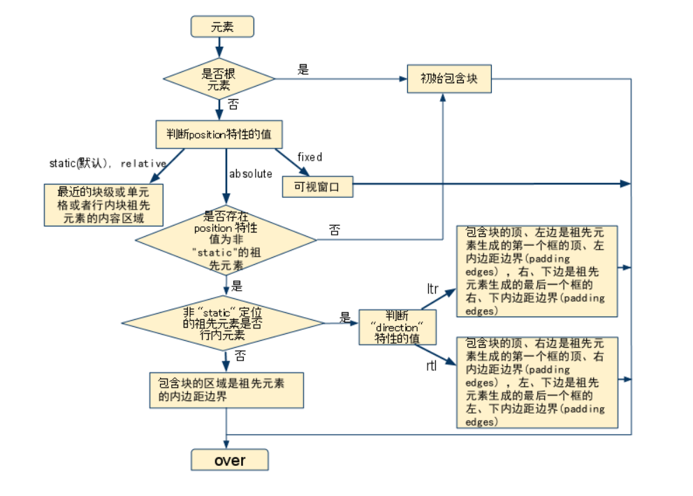

*注: 本篇内容存在大量未修正的内容, 不建议参考*


一个注意点, CSS 属性其实是作用在盒子(box)上而不是作用在元素上, 尽管我们是通过 CSS 选择器选择的是元素并为它设置样式. 什么意思呢? 即 CSS 会根据某个元素是不是某种盒子来决定哪些属性是有效的, 比如 `column-count` 不仅仅是对 `<table>` 元素无效, 而是对 `display: table;` 的元素都是无效的. 又或者一个 `<div>` 是一个 inline-box, 那 `margin-top` 对它就是无效的了. 所以之后的文章中使用块级元素这个词的时候可能并不准确, 如果有必要请替换成块级盒子.


#### 视觉格式化模型

https://developer.mozilla.org/en-US/docs/Web/CSS/Visual_formatting_model

https://www.w3.org/TR/CSS21/visudet.html


#### 视口(viewport)

CSS 标准文档中的视口应该是指浏览器可以看见的页面区域的大小, 即不包含滚动条以及可滚动的部分.

https://www.w3.org/TR/CSS21/visuren.html#viewport


#### 包含块(Containing blocks)

**元素的位置和大小是相对于称为包含块的矩形框的边缘计算的**, 也就是元素的定位区域. 一般来说, 我们说元素的包含块是指元素所在的包含块而不是元素生成的包含块. 注意这里还没有说明包含块是一个元素的 content-box 还是 padding-box 或 border-box等.

每个元素相对于其包含块定位, 但是它不被这个包含块所限制, 它可以溢出包含块.

包含块的具体定义如下:

1. 根元素所在的矩形区域被称为**初始包含块(initial containing block)**, 它具有和视口相同的尺寸. 初始包含块的 `direction` 属性和根元素相同.
2. 对于其他元素, 如果元素的定位方式是 `relative` 或 `static`, 则它的包含块是最近的块级祖先元素(父元素)的内容区边缘.
3. 如果元素定位方式是 `position: fixed;`, 则它的包含块是视口.
4. 如果元素定位方式是 `position: absolute;`, 则它的包含块由最近的 `absolute` `relative` `fixed` 定位的元素的 padding-box.(其实不完全是, 不过大部分时候这么认为也没毛病)

具体可以总结为如下流程:



在 CSS3 之后需要考虑 `transform` 和 `perspective` 对包含块的影响, 具体参考 [定位相关的一些细节](./定位相关的一些细节.md)

参考:

- https://www.w3.org/TR/CSS21/visudet.html#containing-block-details
- http://w3help.org/zh-cn/kb/008/
- https://developer.mozilla.org/en-US/docs/Web/CSS/All_About_The_Containing_Block


#### 块级元素

块级元素(`display` 的计算值为 block/inline-block 的元素)可以设置 `width` `height`, 且 `width` 的百分比值相对于包含块的宽度, 注意是包含块的宽度, 不是包含块所在元素的 `width`.

块级元素的 `margin` `padding` 不论是垂直方向还是水平方向, 百分比值都是相对于包含块的宽度.

块级元素的 `border` 会忽略百分比单位.


#### 行内元素

正常流中的行内元素设置 `width` `height` 是无效的, float 或者脱离正常流(eg.absolute)的行内元素可以设置 `width` `height`, 是因为 `float` 使得 `display` 的计算值为 block 了, 按照块级元素处理, 同理 absolute.

正常流中的非替换行内元素设置 `padding`, 无论是水平方向还是垂直方向, 都是有效的, 但是垂直方向的 `padding` 不会挤压(就像垂直方向不存在 `padding` 那样)周围元素, 而是会被周围元素覆盖, 水平方向的 `padding` 会挤压周围元素. 行内元素设置了百分比的 `padding`, 无论水平方向还是垂直方向,  都是相对于包含块的宽度, 无论行内元素是否脱离文档流, 因为脱离文档流的都被当作块级元素计算了,  也是相对于包含块的宽度.

正常流中的行内元素设置 `margin`, 水平方向是有效的, 垂直方向是无效的. 行内元素设置了百分比的 `margin`, 无论水平方向还是垂直方向,  都是相对于包含块的宽度, 无论行内元素是否脱离文档流, 因为脱离文档流的都被当作块级元素计算了,  也是相对于包含块的宽度.

以上均指非替换元素. 对于替换元素:

正常流中的行内替换元素设置 `width` `height` `margin` `padding` 都是有效的.

非替换元素的行内框的高度是由 `line-height` 决定的, 替换元素的行内框的高度是 `height` `border` `padding` `margin` 的总和

`vertical-align` 是根据行内框进行对齐的.

以下内容重要但是还未整理

> 当inline-level box的宽度大于containing block，且达到内容换行条件时，会将inline-level拆散为多个inline-level box并分布到多行中，然后当属性direction为ltr时，margin/border/padding-left将作用于第一个的inline-level box，margin/border/padding-right将作用于最后一个的inline-level box;若属性direction为rtl时，margin/border/padding-right将作用于第一个的inline-level box，margin/border/padding-left将作用于最后一个的inline-level box

参考 https://www.cnblogs.com/fsjohnhuang/p/5259121.html


#### margin

外边距合并就不多说了, 两个块级元素垂直方向的外边距部分重叠, 水平方向的外边距不重叠. 对于正常流的子元素和父元素, 默认情况下子元素的垂直方向的外边距和父元素外边距重叠(子元素外边距溢出父元素内容区), 子元素水平方向外边距不会溢出父元素内容区. 对于父元素有 border/padding 的情况, 子元素的外边距(无论水平还是垂直)都不会溢出父元素内容区.

具体参考 https://www.w3.org/TR/CSS21/box.html#collapsing-margins


#### BFC

创建块格式化上下文的方式:

* 根元素或者包含它的元素
* `float` 不为 none 的元素
* `position` 为 absolute 或 fixed 的元素
* `display: inline-block;` 的元素
* `display: table-cell;` 的元素
* `display: table-caption;` 的元素
* `overflow` 不为 visible 的元素
* `display: flow-root;` 的元素
* `contain` 为 layout, content, strict 的元素
* `display: flex;` 或 `display: inline-flex;` 元素的子元素
* `display: grid;` 或 `display: inline-grid;` 元素的子元素
* `column-count` 或 `column-width` 不为 auto 的元素
* `column-span: all;` 的元素

定位和清除浮动的样式规则只适用于处于同一块格式化上下文内的元素。浮动不会影响其它块格式化上下文中元素的布局，并且清除浮动只能清除同一块格式化上下文中在它前面的元素的浮动。外边距合并也只适用于同一块格式化上下文的块级元素之间.

如果浏览器兼容的话可以采用 flow-root 来创建 BFC, 这个值就是为创建 BFC 而设的.

其他相关的参考 https://www.w3.org/TR/CSS21/visuren.html#block-formatting


#### IFC

https://www.w3.org/TR/CSS21/visuren.html#inline-formatting


#### 匿名行内元素

任何直接包含在块容器元素(不在行内元素中)的文本都会被视为匿名行内元素. eg.

```html
<p>One <span>Two</span> Three</p>
```

其中 One 和 Three 都被视为匿名行内元素.

https://www.w3.org/TR/CSS21/visuren.html#anonymous


#### 其他参考资料

* https://segmentfault.com/a/1190000013372963