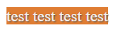

在一些博客上看见了类似这样的样式



好奇是怎么实现的, 隐约想起有个 `::selection` 伪元素, 估摸着应该就是它了. 查了下果然, 顺手记录一下.

伪元素支持以下属性:

* `color`
* `background-color`
* `cursor`
* `caret-color`
* `outline`
* `text-decoration`
* `text-emphasis-color`
* `text-shadow`

eg.

```css
.main::selection {
    color: #f00;
    background-color: green;
    cursor: pointer;
    outline: 1px solid blue;
    text-decoration: underline;
    text-shadow: 1px 1px 1px #555;
}
```

参考 [demo](https://github.com/ta7sudan/front-end-demo/blob/master/css/selection/demo0.html)


#### 参考资料

* https://developer.mozilla.org/en-US/docs/Web/CSS/::selection