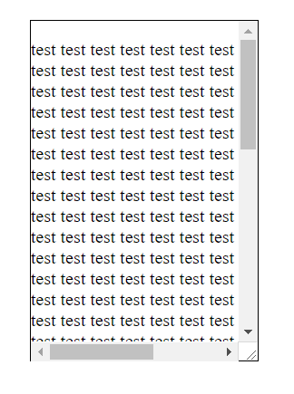
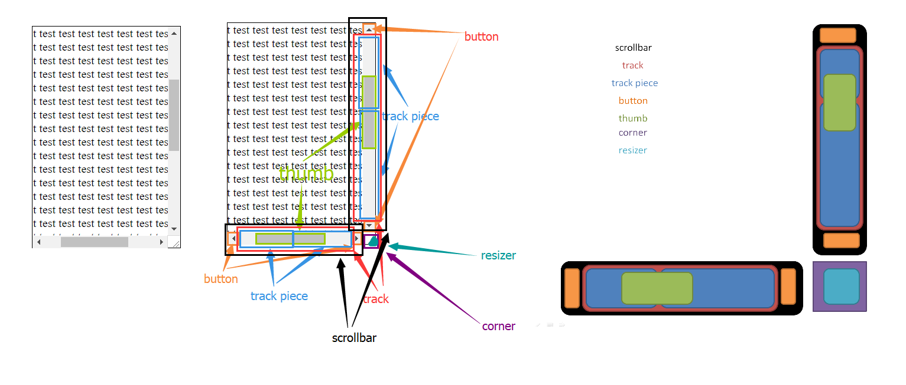

可能我们见到过有些页面的滚动条和默认的滚动条不太一样, 比如这样的.


而默认滚动条长这样



那到底要怎么实现自定义滚动条的样式呢? 也不是很难, 通过几个伪元素和几个伪类(这里主要讨论给 Webkit 的浏览器定制滚动条).

#### 伪元素

* `::-webkit-scrollbar`
* `::-webkit-scrollbar-track`
* `::-webkit-scrollbar-track-piece`
* `::-webkit-scrollbar-button`
* `::-webkit-scrollbar-thumb`
* `::-webkit-scrollbar-corner`
* `::-webkit-scrollbar-resizer`

浏览器把滚动条的各个部分映射到这几个伪元素, 既然是元素, 它们就像是普通 DOM 元素那样可以被设置样式了. 映射关系可以参考下图.



滚动条由 button(按钮) 和 track(轨道) 组成, track 又可以分成两部分 -- track piece(轨道片段) 和 thumb(滑块). 垂直滚动条和水平滚动条之间留出的矩形区域(右下角)则是 corner, 假如一个元素可以缩放的话, 那 corner 里面还会包含一个 resizer(调整器, 即那个三角). 这些部分都可以通过这些伪元素选中从而为它们设置样式.

`::-webkit-scrollbar` 代表了整个滚动条, 是层叠关系的最底层, 不要理解为其他伪元素的祖先元素.

`::-webkit-scrollbar-track` 和 `::-webkit-scrollbar-button` 位于同一层级, 不要当作是 `::-webkit-scrollbar` 的直系子元素, 而是它们刚好叠在 `::-webkit-scrollbar` 上面.

`::-webkit-scrollbar-track` 中又包含了 `::-webkit-scrollbar-track-piece` 和 `::-webkit-scrollbar-thumb`, 其中 thumb 的层级在 track piece 之上, 并且 track 被 thumb 的中线分成了两块 track piece.

其中 `::-webkit-scrollbar` 可以设置 `width` `height`, 设置宽高意味着分别设置垂直滚动条的宽度和水平滚动条的高度, 宽高也可以用百分比单位, 相对于 viewport(实测下来百分比单位只能给 `<body>` 的滚动条用). 还可以设置 `border` `border-radius` `background` `box-shadow`, 另外 scrollbar 的 box-sizing 是 border-box 的.

`::-webkit-scrollbar-track` 不能设置宽高, 它的宽高和 `::-webkit-scrollbar` 保持一致, 也是 border-box 模型. 可以设置 `border` `border-radius` `background` `box-shadow`. 因为层叠关系, 所以它会覆盖在 `::-webkit-scrollbar` 上方.

`::-webkit-scrollbar-track-piece` 也不能设置宽高, 它的宽高和 `::-webkit-scrollbar` 保持一致, 也是 border-box 模型. 可以设置 `border` `border-radius` `background` `box-shadow`. 因为层叠关系, 所以它会覆盖在 `::-webkit-scrollbar-track` 上方.

`::-webkit-scrollbar-button` 可以设置 `width` `height`, 设置宽高意味着分别设置水平滚动条中 button 的宽和垂直滚动条中 button 的高. 剩下一部分的大小和对应滚动条保持一致, 也是 border-box 模型. 可以设置 `border` `border-radius` `background` `box-shadow`. 因为层叠关系, 所以它会覆盖在 `::-webkit-scrollbar` 上方, 并挤压掉 track 一部分空间, 但是如果没有给 button 设置样式, 则默认没有 button.

`::-webkit-scrollbar-thumb` 不能设置宽高, (对于垂直滚动条)宽度和滚动条保证一致, 高度浏览器会根据内容计算比例. border-box 模型. 可以设置 `border` `border-radius` `background` `box-shadow`. 因为层叠关系, 所以它会覆盖在 `::-webkit-scrollbar-track-piece` 上方.

`::-webkit-scrollbar-corner` 不能设置宽高, 宽高由垂直和水平滚动条决定. border-box 模型. 可以设置 `border` `border-radius` `background` `box-shadow`.

`::-webkit-scrollbar-resizer` 不能设置宽高, 宽高由垂直和水平滚动条决定. border-box 模型. 可以设置 `border` `border-radius` `background` `box-shadow`. 这个伪元素不仅可以给可滚动元素设置调整器的样式, 也可以给 `<textarea>` 等设置调整器样式.


给页面滚动条设置样式

```css
::-webkit-scrollbar {
    background: #f00;
}
```


给某个可滚动元素设置滚动条样式

```css
.main::-webkit-scrollbar {
    background: #f00;
}
```


#### 伪类

* `:horizontal` 选中水平方向的滚动条. eg. `.main::-webkit-scrollbar-button:horizontal` 选中水平滚动条的 button
* `:vertical` 选中垂直方向的滚动条
* `:decrement` 作用于 button 或 track piece, 选中点击就会导致高度减少的 button 或 track piece(比如垂直滚动条上半个 track piece 和水平滚动条左边的 track piece)
* `:increment` 作用于 button 或 track piece, 选中点击就会导致高度增加的 button 或 track piece
* `:start` 作用于 button 或 track piece, 选中 thumb 之前的 button 或 track piece(垂直滚动条是上面的 track piece, 水平滚动条是左边的 track piece)
* `:end` 作用于 button 或 track piece, 选中 thumb 之后的 button 或 track piece
* `:double-button` 作用于 button 或 track piece, 对于 button, 是选中属于双 button 的 button, 对于 track piece, 是选中与双 button 相邻的 track piece
* `:single-button` 作用于 button 或 track piece, 对于 button, 是选中属于单 button 的 button, 对于 track piece, 是选中与单 button 相邻的 track piece
* `:no-button` 作用于 track piece, 选中没有 button 与之相邻的 track piece
* `corner-present` 待测试
* `:window-inactive` 待测试
* `:enabled`
* `:disabled`
* `:hover`
* `:active`

如无特别说明, 以上这些伪类都可以作用在除 scrollbar 的伪元素上.

[示例代码](https://github.com/ta7sudan/front-end-demo/blob/master/css/scrollbar/demo0.html)

再附一个个人比较喜欢的[样式](https://github.com/ta7sudan/front-end-demo/blob/master/css/scrollbar/demo1.html).

至于 IE 和 FF 的滚动条样式要怎么修改就不贴了, 可操作性不大, 有兴趣的看参考资料吧.


#### 参考资料

* https://developer.mozilla.org/en-US/docs/Web/CSS/::-webkit-scrollbar
* https://webkit.org/blog/363/styling-scrollbars/
* https://www.lyblog.net/detail/314.html
* https://www.qianduan.net/css-custom-scroll-bar-style/
* http://www.xuanfengge.com/css3-webkit-scrollbar.html
* https://blog.csdn.net/hardgirls/article/details/76991665