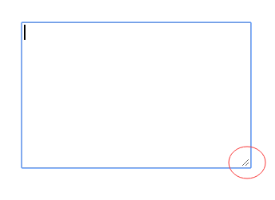
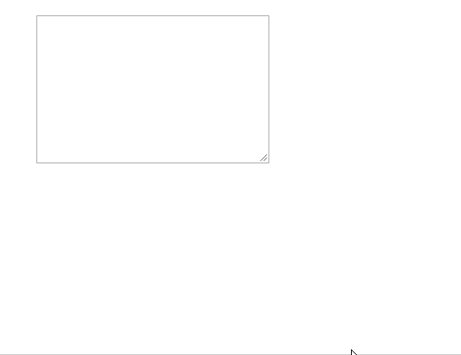
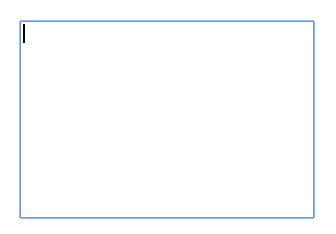

我们经常会看到 `<textarea>` 有这么一个东西. 也有时候有需求去掉它. so, 这到底是个什么?

它可以帮助我们通过拖动来缩放 `<textarea>`.

而 `resize` 就是帮助我们控制是否可以缩放某个元素, 以及如何缩放的.

#### resize

作用于 `overflow` 不为 `visible` 的元素, 以及 `` `video` `iframe` 等元素. 用于控制元素是否可以缩放以及如何进行缩放. 属性比较简单, 就几个值.

* `none` 默认值, 无法通过拖动进行缩放(实际测下来 `both` 才是默认值, 可能 MDN 写错了也可能浏览器没遵守)
* `both` 可以通过拖动进行水平方向和垂直方向的缩放
* `horizontal` 只能通过拖动进行水平方向的缩放
* `vertical` 只能通过拖动进行垂直方向的缩放
* `block` 支持度不高
* `inline` 支持度不高

所以为了去掉这个拖动块, 我们只需要设置 `resize: none;` 就 OK.

[示例代码](https://github.com/ta7sudan/front-end-demo/blob/master/css/resize/demo0.html)

#### 参考资料

* https://developer.mozilla.org/en-US/docs/Web/CSS/resize