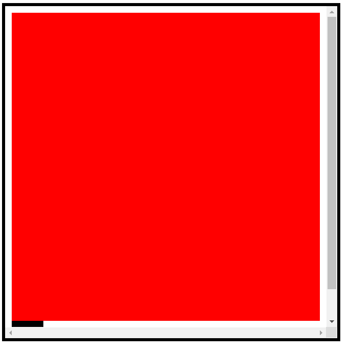
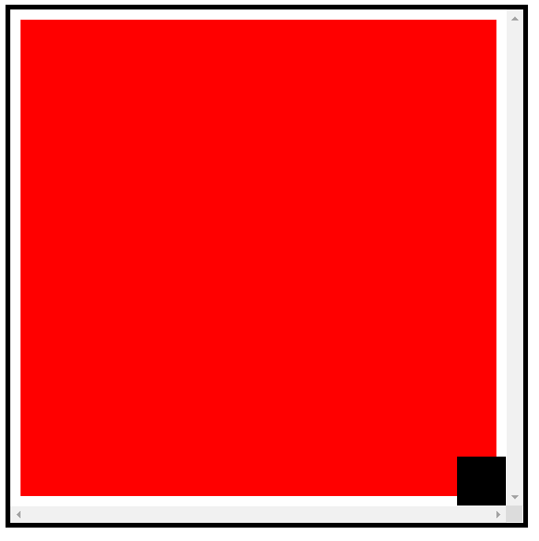
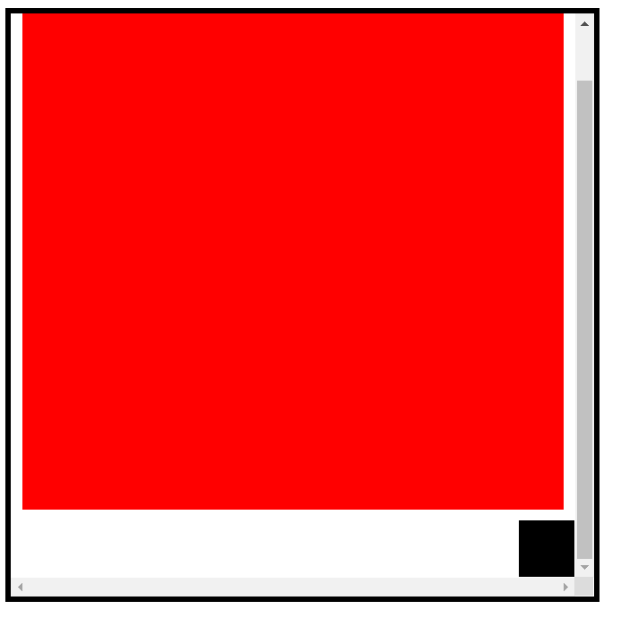

首先我们来思考一个问题, 什么时候会出现滚动条(变得可滚动)? 毫无疑问, 像下面这样大家都知道会出现滚动条.

```html
<div class="container">
	<div class="main"></div>
	<div class="cube"></div>
</div>
```

```css
.container {
	width: 500px;
	height: 500px;
	padding: 10px;
	border: 5px solid #000;
	overflow: scroll;
	position: relative;
}
.main {
	width: 100%;
	height: 100%;
	background: red;
}
.cube {
	width: 50px;
	height: 50px;
	background: black;
}
```



而下面这样大家也肯定知道不会出现滚动条.

```css
.container {
	width: 500px;
	height: 500px;
	padding: 10px;
	border: 5px solid #000;
	overflow: scroll;
	position: relative;
}
.main {
	width: 100%;
	height: 100%;
	background: red;
}
.cube {
	width: 50px;
	height: 50px;
	background: black;
	position: absolute;
	bottom: 0;
	right: 0;
}
```



那这样呢?

```css
.container {
	width: 500px;
	height: 500px;
	padding: 10px;
	border: 5px solid #000;
	overflow: scroll;
	position: relative;
}
.main {
	width: 100%;
	height: 100%;
	background: red;
}
.cube {
	width: 50px;
	height: 50px;
	background: black;
	position: absolute;
	bottom: -50px;
	right: 0;
}
```



嗯? 出现滚动条了? 可能和很多人的设想不符, 毕竟 `absolute` 可是脱离了文档流不占据空间的. 又或者这样.

```css
.container {
	width: 500px;
	height: 500px;
	padding: 10px;
	border: 5px solid #000;
	overflow: scroll;
	position: relative;
}
.main {
	width: 100%;
	height: 100%;
	background: red;
}
.cube {
	width: 50px;
	height: 50px;
	background: black;
	position: absolute;
	bottom: 0;
	right: 0;
	transform: translate(0, 50px);
}
```

嗯? `transform` 也会出现滚动条?

其实准确来说, **如果一个元素是包含块所处的元素, 并且该元素是 `overflow: scroll` 的, 只要其内部元素实际渲染时向下或向右溢出了包含块, 则该元素就会出现滚动条.** 注意是实际渲染时溢出, 其实这东西我也不知道怎么定义, 因为严格来说溢出包含块应该是内容的总宽高大于了包含块, 但是因为 `absolute` 和 `transform` 并不会导致总宽高增加, 所以从这个角度来说其实并没有溢出包含块, 但是实际渲染来说, 确实是溢出了包含块的. 关于一个可滚动的元素作为包含块, 这个包含块其实是可见视口(不包含滚动条)的区域, 既不是 padding-box 也不是 content-box 或 border-box. 这里具体参考 [盒模型](./盒模型.md).


但是很多时候这并不是我们期望的效果, 比如有时候我们希望一个元素能够从底部弹出, 这必然会用到 `transform`, 然而其所处的包含块元素又是可滚动的, 所以要怎么解决呢? 再套一层 `div` 然后 `overflow: hidden` 当然是可以的. 这里给一个个人的解决方案.

```html
<div class="container">
	<div class="main"></div>
	<div class="cube"></div>
</div>
```

```css
.container {
	width: 500px;
	height: 500px;
	padding: 10px;
	border: 5px solid #000;
	overflow: scroll;
	position: relative;
	transform: translate(0, 0);
}
.main {
	width: 100%;
	height: 100%;
	background: red;
}
.cube {
	width: 50px;
	height: 50px;
	background: black;
	position: fixed;
	bottom: 0;
	right: 0;
	transform: translate(0, 50px);
}
```

我们知道 `fixed` 定位的特点是总是相对可见视口定位的, 而可见视口的大小总是固定的, 并不会随内容增加而变大, 因而可以利用这一点, 但是我们都知道, 通常来说 `fixed` 定位是相对于浏览器的可见视口, 但是这里我们希望相对于元素的可见视口, 所以我们给 `.container` 加了一个 `transform` 提升为了 `fixed` 的包含块.

其实上面这个例子的需求比较少见, 更多时候我们是希望整个页面可滚动, 但是底部的 `transform` 元素不要增大可滚动区域的高度.

更多时候是这样的例子.

```html
<!DOCTYPE html>
<html lang="en">
<head>
	<meta charset="UTF-8">
	<meta name="viewport" content="width=device-width, initial-scale=1.0">
	<meta http-equiv="X-UA-Compatible" content="ie=edge">
	<title>Document</title>
	<style>
		html, body {
			height: 100%;
			margin: 0;
			padding: 0;
		}
		.main {
			width: 300px;
			height: 110%;
			background: red;
		}
		.cube {
			width: 50px;
			height: 50px;
			background: black;
			position: fixed;
			bottom: -50px;
			left: 0;
			transition: transform 0.5s ease;
		}
		.main:hover + .cube {
			transform: translate(0, -50px);
		}
	</style>
</head>
<body>
	<div class="main"></div>
	<div class="cube"></div>
</body>
</html>
```

