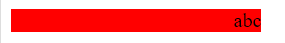
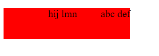
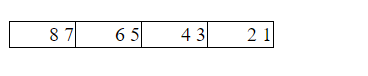
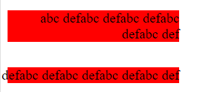

根据 MDN 的定义, 这个属性用来控制一个元素内部的文本, 表格列的排列方向和水平方向溢出的方向. 这个属性的兼容性非常好, 几乎所有浏览器都兼容. 不过是说, 控制文本的排列方向一般是用 HTML 的全局属性 [dir](https://developer.mozilla.org/en-US/docs/Web/HTML/Global_attributes/dir).

该属性有两个值:

* `ltr` 默认值, 即 left to right, 从左往右
* `rtl` 即 right to left, 从右往左

**该属性可以作用在任何元素上, 并且可以继承.** 但是对于表格, 单元格可以从 `<table>` `<tbody>` `<tr>` 等继承该属性, 却不能从 `<col>` `<colgroup>` 继承, 因为 CSS 的继承是遵循 DOM 树的, `<td>` 不是 `<col>` 的子元素, 所以不能继承.

> Unlike the `dir` attribute in HTML, the `direction` property is not inherited from table columns into table cells, since CSS inheritance follows the document tree, and table cells are inside of rows but not inside of columns.


接下来看几个 [demo](https://github.com/ta7sudan/front-end-demo/blob/master/css/direction/demo0.html) 吧.

```html
<div class="demo">abc</div>
```

```css
.demo {
	direction: rtl;
}
```

结果是这样的



而不是这样


说好的文本排列的方向改变呢? 怎么好像只是文本对齐方式改变了? 稍后解释.

再看

```html
<div class="demo">abc def</div>
```

还是如此


那如果这样

```html
<div class="demo"><span>abc</span> <span>def</span></div>
```

还是一样


怎么就不是这样的呢


是不是我们已经可以得出结论: `direction` 只改变行内元素/文字的左右对齐方式, 而不会改变行内元素/文字之间的相对位置?

那再看这个例子

```html
<div class="demo">
	<div class="child">
		<span>abc</span>
		<span>def</span>
	</div>
	<div class="child">
		<span>hij</span>
		<span>lmn</span>
	</div>
</div>
```

```css
div {
	width: 200px;
	margin-bottom:  30px;
	background: red;
}
.demo {
	direction: rtl;
}
.child {
	width: 80px;
	display: inline-block;
}
```



WTF? 第一个 child 和第二个 child 的相对位置变了?  然而 child 继承了 `direction: rtl;`, child 里面的 `<span>` 的相对位置却没有变.

那再看看表格中的情况

```html
<table>
	<tr>
		<td>
			<span>1</span>
			<span>2</span>
		</td>
		<td>
			<span>3</span>
			<span>4</span>
		</td>
		<td>
			<span>5</span>
			<span>6</span>
		</td>
		<td>
			<span>7</span>
			<span>8</span>
		</td>
	</tr>
</table>
```

```css
table, td {
	border: 1px solid #000;
}
table {
	border-collapse: collapse;
	direction: rtl;
}
td {
	width: 50px;
}
```



emmm...表格中不仅列的排列方向变了, 单元格中的行内元素的相对位置也变了...

最后我们再看看换行和溢出时的情况




于是我们现在可以修正一下之前的结论:

 **`direction` 只改变行内非替换元素/文字的左右对齐方式, 而不会改变行内非替换元素/文字之间的相对位置, 而对于替换元素, 不仅改变左右对齐方式, 也改变行内替换元素之间的相对位置, 对于表格, 会改变列的排列方式(即原本 1234 列从左往右排列, 变成 4321 排列), 对于单元格, 子元素的对齐方式和相对位置都会改变.**

其实到这里应该已经差不多了, 毕竟这个结论没啥毛病了, 不过作为一个严谨的人, 总觉得通过实验得出结论这个路子有点野. 对于想要了解本质的人来说, 最好还是去看 W3C 的文档吧, 估计会扯到 `unicode-bidi` `writing-mode` 和 HTML 全局属性 dir 等等吧, 如果有人看了标准文档麻烦告诉我下...


#### 参考资料

* https://developer.mozilla.org/en-US/docs/Web/CSS/direction
* https://developer.mozilla.org/en-US/docs/Web/HTML/Global_attributes/dir
* http://www.zhangxinxu.com/wordpress/2016/03/css-direction-introduction-apply/
* https://developer.mozilla.org/en-US/docs/Web/CSS/CSS_Grid_Layout/CSS_Grid,_Logical_Values_and_Writing_Modes