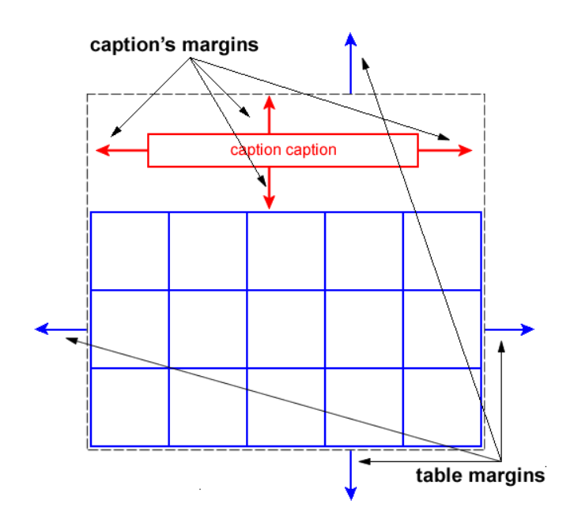
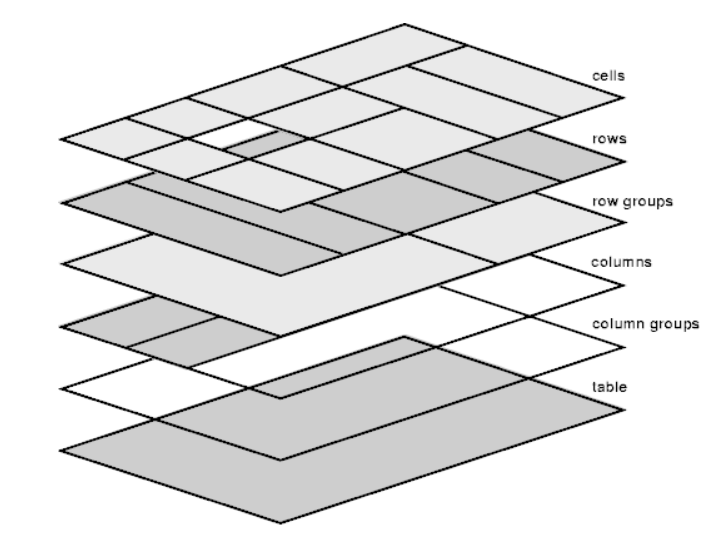
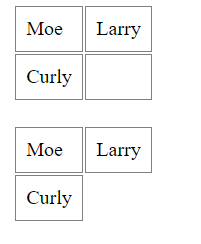
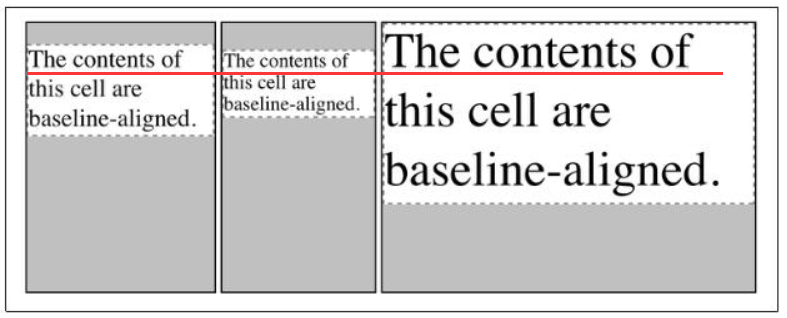

#### CSS table model

我们知道 CSS 设计之处的目标就不仅仅是希望只用于 HTML, 而是适用于更多的标记语言(如 XML), 也因此 CSS model 是与标记语义无关的, 控制一个标签是哪种 model 是通过 `display` 属性来完成的. 对于 table, 有这些 `display` 的值:

* table
* inline-table
* table-row
* table-row-group
* table-header-group
* table-footer-group
* table-column
* table-column-group
* table-cell
* table-caption

即假如我们对一个 `<div>` 设置 `display: table;`, 那这个 `<div>` 就有了 `<table>` 的一些性质. 对于 `<table>` 也只不过是浏览器预先定义了 `display: table;` 的默认样式. 那到底有哪些元素被默认定义为上面这些值呢? 可以参考:

> table    { display: table }
> tr       { display: table-row }
> thead    { display: table-header-group }
> tbody    { display: table-row-group }
> tfoot    { display: table-footer-group }
> col      { display: table-column }
> colgroup { display: table-column-group }
> td, th   { display: table-cell }
> caption  { display: table-caption }

其中, `display: table-column;` 和 `display: table-column-group;` 的元素虽然不会被渲染, 但是它们具有和 `<col>` `<colgroup>` 一样的性质, 即它们的样式会作用在它们对应的列上.


##### 匿名表格对象(Anonymous table objects)

对于非 HTML 的标记语言, 它们可能不包含 CSS table model 中的所有元素(比如只有 `<table>` 没有 `<thead>`). 这种情况下, 浏览器必须假定这些缺少的元素存在, 使得表格模型正常工作. 所以任何的表格元素(`<tr>` `<td>` 等等)都会自动生成一个匿名的表格对象包裹它们, 使得最终由至少三种表格对象组成(`table/inline-table` `table-row` `table-cell`). 根据以下规则来生成匿名的表格对象. 在应用规则的时候, 对于非正常流中的元素, 视为 0 宽 0 高的内联元素, 然后对它们的父元素应用规则. 我们先定义以下术语:

* row group box(RGB), 对应 `table-row-group` `table-header-group` `table-footer-group` 的元素
* proper table child(PTC), 对应 `table-row` `table-column` `table-column-group` `table-caption` RGB 的元素
* proper table row parent(PTRP), 对应 `table` `inline-table` RGB 的元素
* internal table box(ITB), 对应 `table-cell` `table-row` `table-column` `table-column-group` RGB 的元素
* tabular container(TC), 对应 `table-row` PTRP 的元素
* consecutive(连续), 指两个兄弟元素之间没有其他元素. 注意连续意味着由传递性: A 和 B 连续, B 和 C 连续, 意味着 A 和 C 连续.

生成匿名表格对象的规则如下:

1. 移除不相干的元素
   1. 具有 `display: table-column;` 的元素的所有子元素都被视为 `display: none;`
   2. 具有 `display: table-column-group;` 的元素的子元素如果不是 `display: table-column;` 则该子元素视为 `display: none;`
   3. 如果一个 TC 元素 P 的子元素 C 是只包含空格的匿名内联元素, 并且它前后的兄弟元素是合法的 table 子元素或者 `table-caption` 或者 ITB 元素, 则 C 被视为 `display: none;`
   4. 如果一个元素 B 是一个只包含空格的匿名内联元素, 并且它相邻的元素是 ITB 或 `table-caption` 则 B 被视为 `display: none;`
2. 生成子元素缺少的包裹块
   1. 如果 `table` 或 `inline-table` 的一个子元素 C 不是一个 PTC, 就生成一个匿名的 `table-row` 元素包裹 C 以及和 C 连续的且不是 PTC 的兄弟元素.
   2. 如果一个 RGB 元素的一个子元素 C 不是一个 `table-row` 的元素, 则生成一个匿名的 `table-row` 元素包裹 C 以及和 C 连续的且不是 `table-row` 的兄弟元素.
   3. 如果一个 `table-row` 元素的一个子元素 C 不是一个 `table-cell` 元素, 则生成一个匿名的 `table-cell` 元素包裹 C 以及和 C 连续的且不是 `table-cell` 的兄弟元素.
3. 生成缺少的父元素
   1. 对于一个由连续的 ITB 和 `table-caption` 元素组成的序列, 对序列中每个 `table-cell` 元素 C, 如果 C 的父元素不是 `table-row` 则生成一个匿名的 `table-row` 元素包裹 C 以及和 C 连续的 `table-cell` 元素.
   2. 对于一个由连续的 PTC 元素组成的序列, 对序列中每个 PTC 元素 C, 如果 C 是 misparented 的话, 则生成一个匿名的 `table` 或 `inline-table` 元素包裹 C 以及和 C 连续的 PTC 元素(如果 C 的父元素是内联元素, 则生成 `inline-table`, 否则生成 `table`). misparented 的解释如下
      * 一个 `table-row` 元素 misparented 是指, 它的父元素既不是 RGB 元素也不是 `table` 或 `inline-table` 元素.
      * 一个 `table-column` 元素 misparented 是指, 它的父元素既不是 `table-column-group` 也不是 `table` 或 `inline-table` 元素.
      * 一个 RGB 或 `table-column-group` 或 `table-caption` 元素 misparented 是指, 它的父元素既不是 `table` 也不是 `inline-table` 元素.

翻译成人话的话, 可以参考 [表格布局那些事](https://x-front-team.github.io/2016/10/12/%E8%A1%A8%E6%A0%BC%E5%B8%83%E5%B1%80%E9%82%A3%E4%BA%9B%E4%BA%8B/), [深入理解 HTML 表格](https://www.cnblogs.com/xiaohuochai/p/5008466.html)


#### 视觉格式化模型中的 table

先来了解几个基本概念, 下图中虚线框我们把他叫做 *table wrapper box*, 简称 TWB 好了. 蓝色框我们叫做 *table box*, 简称 TB 好了. 蓝色框也就是我们通常见到的 `<table>` 的表格主体部分了.



通常, 表格可以表现为块级元素, 也可以表现为行内元素. 分别对应了 `display: table;` 和 `display: inline-table;`, 其中 `inline-table` 就像 `inline-block` 那样. 但不管是哪种形式, 都会生成一个 TWB, 包含了 TB 和 caption 部分. 在 TWB 中, TB 始终表现为一个块级元素, caption 也表现为一个块级元素. 当 `display: table;` 的时候, TWB 是一个块级元素, 当 `display: inline-table;` 时, TWB 是一个行内元素. 本质上 TWB 创建了一个 BFC, 这也是为什么 `display: table` 可以用来创建 BFC 的原因. TWB 的宽度是 TB 的 border 边缘的距离, 但是给 `<table>` 设置百分比的宽高是相对于 `<table>` 的包含块的, 而不是相对于 TWB 的. 而给 `<table>` 设置 `position` `float` `margin` `top` 等属性时, 这些属性是作用在 TWB 上而不是 TB 上. 所有的非继承属性都是作用在 TB 上而不是作用在 TWB 上.

表格的子孙元素(ITB)都可以有 border, 但是不能有 margin. 单元格(cell) 可以有 padding.


#### 表格的 6 层结构

浏览器会为表格生成 6 个图层, 默认它们的背景都是透明的.



最上层的是 cells, 也就是所有 `<td>` `<th>` 所在的图层, 依次是 `<tr>` 所在的 rows 层, `<thead>` `<tbody.` `<tfoot>` 所在的 row groups 层, `<col>` 所在的 columns 层, `<colgroup>` 所在的 column groups 层, 最后是 `<table>` 的 table 层. 离人眼的距离也是从上往下越来越远.

从这里也可以看出对这些元素设置样式时的优先级, 比如对 `<thead>` 设置的样式优先级大于对 `<col>` 设置的样式.

需要注意的是, 虽然可以对 `<col>` `<colgroup>` 设置样式, 但不是所有的样式都会作用在单元格上, 其实它们只支持 4 个属性: `background` `border` `width` `visibility`.


#### table 相关的 CSS 属性

扯了这么多概念, 来看看具体有哪些 CSS 属性可以用来设置 table 样式吧.

* `border-collapse`
* `border-spacing`
* `table-layout`
* `caption-side`
* `empty-cells`
* `vertical-align`


#### border-collapse

用来控制 table 及其子元素的 border 是否合并, 作用于 `display: table;` 或 `display: inline-table;` 的元素. 有以下两个值:

* `separate` 默认值, 不合并 border
* `collapse` 合并 border

看上去很简单, 没什么好说的. 不过考虑一种情况是, 有两个相邻的单元格 A B, A 的 border 宽度为 4px, B 的 border 宽度为 2px, 那么合并以后的 border 是多少呢?  这里引用一下合并的优先级规则好了

> 1. 某个边框的 `border-style` 为 hidden, 它会优先所有其他的边框, 即最终合并的结果是边框隐藏
> 2. 某个边框的 `border-style` 为 none, 它的优先级最低
> 3. 宽边框优先窄边框
> 4. 若 `border-width` 相同, 则 `border-style` 的优先级按照 double/solid/dashed/dotted/ridge/outset/groove/inset 优先级逐渐降低
> 5. 若 `border-width` 和 `border-style` 都相同, 则 `border-color` 的优先级按照 cell/row/row group/column/column group/table 优先级逐渐降低, 即 `display: cell` 元素的边框优先于 `display: table-row` 元素的边框
> 6. 若 `border-width` 和 `border-style` 都相同且同种元素都定义了 `border-color`, 则位置靠左和靠上的元素优先

具体的合并规则参考标准文档 https://www.w3.org/TR/CSS21/tables.html#collapsing-borders


#### border-spacing

用来控制单元格 border 之间的距离, 作用于 `display: table;` 或 `display: inline-table;` 的元素. 仅当 `border-collapse: collapse;` 时有效. eg.

```css
table {
  border-spacing: 2px 2px;
}

table {
  border-spacing: 2px;
}
```

一个值表示 x y 方向的距离一样, 两个值分别设置 x y 方向的间距.


#### table-layout

参考 [简述 table-layout](./简述table-layout.md)


#### caption-side

控制 `<caption>` 放置的位置, 作用于 `<caption>`, 有两个值:

* `top` 默认值, `<caption>` 放在 TB 上面
* `bottom` `<caption>` 放在 TB 下面


#### empty-cells

控制空的单元格是否渲染(eg. `<td></td>`), 作用于 table-cell 元素, 不过因为可以继承, 我们一般给 `<table>` 设置该属性. 两个值:

* `show` 默认值, 显示空的单元格
* `hide` 不显示空的单元格

效果如下




#### vertical-align

`vertical-align` 只能作用于行内元素和 table-cell 元素, 但是作用于 table-cell 元素时略有不同. 对于 table-cell 元素, 是控制单元格中的内容在单元格中的位置. 其他就不说了, 主要说下基线(baseline)对齐的时候吧. 区分两个概念:

* 单元格的基线(baseline of cell), 即单元格中内容的第一行的基线
* 行的基线(baseline of row), 即一个 `<tr>` 的基线

行的基线由单元格的基线确定, 行的基线是该行所有单元格的基线到单元格顶部距离最大的那个基线. 所以当单元格 `vertical-align: baseline;` 时, 是指单元格的基线对齐到行的基线.




#### 参考资料

* https://www.w3.org/TR/CSS21/tables.html
* https://www.cnblogs.com/xiaohuochai/p/5008466.html
* https://x-front-team.github.io/2016/10/12/%E8%A1%A8%E6%A0%BC%E5%B8%83%E5%B1%80%E9%82%A3%E4%BA%9B%E4%BA%8B/


