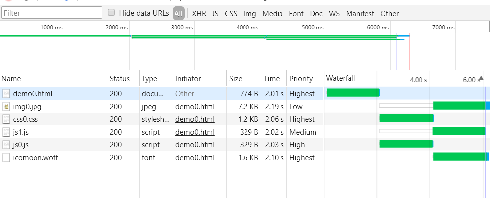
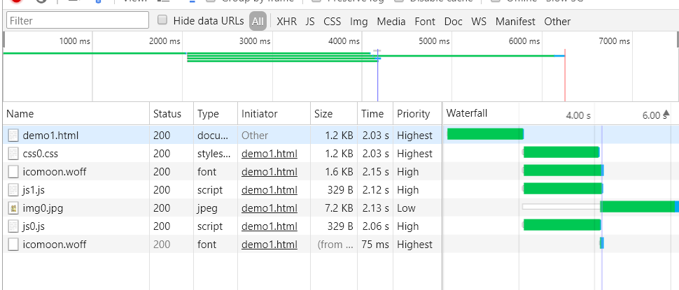

早在之前我们就已经了解过 `<link>` 的 `rel` 属性具有这么几个值:

* `prefetch`
* `preload`
* `preconnect`
* `dns-prefetch`

但是它们到底有什么用呢? 这里我们就来具体了解一下.

*注: 本文假设读者已经了解同源策略和浏览器加载资源的优先级. 本文中可能混用网络优先级和调试工具的优先级这样的词汇, 对于网络优先级统一用全大写, 如 HIGH, 对于调试工具优先级, 统一用首字母大写, 如 High.*


#### prefetch

prefetch 是一种浏览器机制, 利用浏览器**空闲时间**下载用户**未来可能访问**的资源. 它可以提示浏览器, 使得浏览器在加载完页面之后默默获取这些资源并将它们缓存起来, 这样当用户访问该资源的时候就可以直接从缓存获取.

prefetch 支持 HTTPS 的资源.

通常我们有两种使用方式, 一种是通过 `<link>`, 一种是通过 HTTP 头. eg.

```html
<link rel="prefetch" href="https://xxx.com/xxx.jpg">
<link rel="prefetch alternate stylesheet" title="Designed for Mozilla" href="mozspecific.css">
```

```http
Link: <https://xxx.com/xxx.jpg>;rel=prefetch
```

关于 Link 头的具体语法可以参考 [RFC5988](https://tools.ietf.org/html/rfc5988#section-5).

##### prefetch 的限制

我们注意到, 对 prefetch 下载的时机是浏览器的空闲时间, 那怎样定义空闲时间? 简单来讲, 在 `window.onload` 之后. 如果一个子 `<iframe>` 也包含 prefetch 的资源, 则等到 `<iframe>` 的 prefetch 资源获取完之后.

> In the current implementation (Mozilla 1.2), idle time is determined using the `nsIWebProgressListener` API. We attach a listener to the toplevel `nsIWebProgress`object ("@[mozilla.org/docloaderservice;1](http://mozilla.org/docloaderservice;1)"). From this, we receive document start & stop notifications, and we approximate idle time as the period between the last document stop and the next document start. The last document stop notification occurs roughly when the onLoad handler would fire for the toplevel document. This is when we kick off prefetch requests. If a subframe contains prefetching hints, prefetching will not begin until the top-most frame and all its "child" frames finish loading. 

另外, 我们之前还提到未来可能访问, 什么是未来可能访问? 其实 MDN 这里并没有具体说明, 我们可以从 [W3C 的文档](https://w3c.github.io/resource-hints/#prefetch)中看到, prefetch 其实是用来标识下一个导航可能用到的资源(**即 prefetch 获取的资源应当是下一页面用到的资源, 而不是当前页面需要用到的资源**), 并且用户代理(浏览器)**必须获取它**.

用户代理不应该对资源进行预处理, 也不应该自动执行或应用到当前页面上下文. 什么意思呢? 就是如果你 prefetch 一个 JS 脚本, 那这个 JS 不应该被执行, 如果你获取一个 CSS, 那这个 CSS 不应该被应用到当前页面.

目前只能对 HTTP 和 HTTPS 的资源使用 prefetch, 其他协议还没有足够的支持, 猜测主要原因是缓存(这个之后会提到).

**prefetch 不受同源策略限制**. 但是这是说, 你可以通过 prefetch 发出请求并且缓存到本地, 不代表你可以用 JS 去读取资源的内容, 如果之后你的 JS 确实需要使用资源, 那还是应当加上 `crossorigin` 的.

```html
<link rel="prefetch" href="//example.com/next-page.html" as="document" crossorigin="use-credentials">
```

这里重点说下 `as`, 之前关于 `<link>` 的内容已经提到过, 它是配合 prefetch 和之后的 preload 使用的, 用来指示资源的用途. 但是并没有说这会有什么实际影响. 这里说下, **`as` 加上之后, 浏览器可以为资源的请求设置合适的请求头, 对资源下载设置合适的网络优先级**.

> The as attribute can be used by the application to communicate the resource destination context, such that the user agent can optimize the fetching process - e.g. set appropriate request headers, transport priority, and so on.

> - The `as` attribute is an *OPTIONAL* attribute that must conform to requirements defined in [[PRELOAD](https://w3c.github.io/resource-hints/#bib-PRELOAD)].

另外, `as` 对于 prefetch 来说是可选的.

关于 `as` 支持的值, 可以参考 [这里](https://fetch.spec.whatwg.org/#concept-request-destination) 和 [这里](https://w3c.github.io/preload/#as-attribute). 下面列举一些常见的值:

* `audio` 音频文件
* `document` HTML 文档, 通常用于嵌入 `<iframe>`
* `embed` 嵌入 `<embed>` 的资源
* `fetch` fetch 或 XHR 请求的资源
* `font` 字体文件
* `image` 图片文件
* `object` 同 `embed`
* `script` JS 文件
* `style` CSS 文件
* `track` 字幕文件
* `worker` 一个 webworker 或 sharedworker
* `video` 视频文件


**prefetch 发出的请求是包含 `Referer` 头的**.

如果在获取 prefetch 的资源时, 用户点击链接或触发了任何类型的页面加载(即页面跳转, 页面刷新等), 则获取 prefetch 资源立即停止, 还未开始的 prefetch 也不会开始下载. 如果已经下载了部分内容, 且服务器发送了 `Accept-Ranges: bytes` 的头部, 则这部分内容将被缓存(否则丢弃), 下次获取剩余部分资源时将继续获取.


##### 服务端如何判断 prefetch 发出的请求

FF 的 prefetch 请求中会带有以下头

```http
X-moz: prefetch
```

Chrome 的 prefetch 请求中会带有

```http
X-Purpose: prefetch
// 或
Purpose: prefetch
```

这里的内容有待测试.


##### 资源缓存的位置

看到缓存这个词, 一个很自然的想到的问题是, prefetch 的资源应该是作为 HTTP 缓存的, 但是不对, 如果 prefetch 的资源没有设置 HTTP 缓存的话, 那 prefetch 的资源依然会被浏览器缓存吗? 按理来说应该是会的, 不然 prefetch 的意义就很小了, 还得服务端去设置 HTTP 缓存. 那如果会, 说明 prefetch 的资源不是作为 HTTP 缓存的, 那是缓存在哪里?

> We mentioned before that the HTTP Cache respects HTTP semantics. That’s almost entirely true. There is one exception to that, when the HTTP cache stores resources for a limited amount of time. Browsers have the ability to prefetch resources for the next navigation. That can be done with explicit hints (`<link rel=prefetch>` or with the browser’s internal heuristics. Those prefetched resources need to be kept around until next navigation, even if they are not cacheable. So when such a prefetched resource arrives at the HTTP cache, it is cached (and served without revalidation) for a period of 5 minutes. 

> [Chrome 有四种缓存](https://link.juejin.im?target=https%3A%2F%2Fcalendar.perfplanet.com%2F2016%2Fa-tale-of-four-caches%2F): HTTP 缓存，内存缓存，Service Worker 缓存和 Push 缓存。preload 和 prefetch 都被存储在 **HTTP 缓存中**。
>
> 当一个资源被 **preload 或者 prefetch** 获取后，它可以从 HTTP 缓存移动至渲染器的内存缓存中。如果资源可以被缓存（比如说存在有效的[cache-control](https://link.juejin.im?target=https%3A%2F%2Fdeveloper.mozilla.org%2Fen-US%2Fdocs%2FWeb%2FHTTP%2FHeaders%2FCache-Control) 和 max-age），它被存储在 HTTP 缓存中可以被**现在或将来的任务使用**，如果资源不能被缓存在 HTTP 缓存中，作为代替，它被放在内存缓存中直到被使用。

所以呢, 最终资源还是作为 HTTP 缓存, 如果它自己本身没有设置 HTTP 缓存, 浏览器会将它缓存 5 分钟(其实这事情应该和具体浏览器实现有关). 另一方面是, 既然是作为 HTTP 缓存, 那其他协议要怎么办呢? 大概这也是为什么 prefetch 只支持 HTTP/HTTPS 的原因吧.


总结一下 prefetch.

* prefetch 的作用是预获取下一页所需的资源
* prefetch 的资源一定会被获取(除非获取之前用户刷新页面或跳转)
* prefetch 对资源的下载是在浏览器空闲时进行的, 而不是立即开始下载
* 浏览器不会在当前页面使用 prefetch 的资源, 比如 CSS 不会被应用, JS 不会被执行
* prefetch 只支持 HTTP/HTTPS 的资源
* prefetch 不受同源策略影响, 但是也可以配合 `crossorigin` 使用
* prefetch 会改变资源的网络优先级, 通常来说 prefetch 的资源优先级都比较低
* prefetch 可以和 `as` 配合(`as` 是可选的), `as` 会使浏览器请求资源时添加合适的头部, 以及根据资源类型调整资源的网络优先级(具体什么规则不清楚, 最好通过调试工具观察下以确保 prefetch 的行为符合预期, 按理来说 prefetch 的资源网络优先级都是最低的)
* prefetch 可以缓存那些未设置 HTTP 缓存的资源(此时如果一直没被使用的话将只缓存 5 分钟), 作为 HTTP 缓存. 如果设置了 HTTP 缓存应该可以缓存更久
* prefetch 发出的请求包含 `Referer` 头
* prefetch 不阻塞 `window.onload` 也不阻塞渲染


##### 最佳实践

最后, 建议 prefetch 都加上 `as`, 如果之后需要 JS 使用资源, 则也建议加上 `crossorigin`

```html
<link rel="prefetch" as="script" href="//xxx.com/xxx.js">
<link rel="prefetch" as="script" crossorigin="anonymous" href="//xxx.com/xxx.js">
```


#### Preload

##### 与 prefetch 的区别与共同点

preload 和 prefetch 类似, 也是提示浏览器预加载资源, 但是 preload 是用来获取当前页面所需的资源, 而 prefetch 是用来获取下一个页面所需的资源. preload 的资源优先级较高(high priority), prefetch 的资源优先级较低(low priority). 对于 prefetch, `as` 属性是可选的, 对于 preload, `as` 是必需的. 相同点, 浏览器必须下载 preload 的资源, preload 的资源也不会在当前页面被执行或使用(应该说 `<link>` 本身不会使用或执行资源, 但如果有其他标签, 资源还是可能会被使用或执行的). 并且浏览器视只有 preload/prefetch 的资源为不会阻塞渲染的(比如如果一个 JS 有 prelaod, 又有 `<script>`, 这个 JS 的执行当然还是会阻塞渲染, 不过下载不会阻塞渲染, 因为下载是由 preload 发起的, 执行是因为遇到 `<script>`).

##### 基本用法

```html
<link rel="preload" href="//xxx.com/xxx.woff" as="font" type="font/woff" crossorigin="anonymous">
<link rel="preload" href="//xxx.com/xxx.css" as="style" type="text/css" crossorigin="anonymous">
```

当然, 也可以通过 HTTP 的 `Link` 头来完成.

```http
Link: </app/script.js>; rel=preload; as=script
```

`as` 对于 preload 来说是必需的, 至于为什么? 因为规范就是这么定的. 但其实不加也可以, 不会出什么问题, 只是不符合规范.

> [HTML](https://w3c.github.io/preload/#bib-HTML) [defines](https://html.spec.whatwg.org/#attr-link-as) the `as` content and IDL attributes. The attribute is necessary to guarantee correct prioritization, request matching, application of the correct [[CSP3](https://w3c.github.io/preload/#bib-CSP3)] policy, and setting of the appropriate `Accept` request header. 

`as` 用来保证对资源设置合适的优先级, 应用合适的 CSP 策略和设置合适的 `Accept` 头. 支持的值同样可以参考之前 prefetch.


##### 下载资源的时机

通常来说 preload 的资源都会尽快被下载, 不过实际情况还是根据资源的网络优先级和浏览器调度算法来决定, preload 只是改变资源的网络优先级.

需要注意的是, 当 preload 的 `<link>` 的 `href` (通过 JS)被修改/删除或者设置成空字符串时, 浏览器必须停止当前 preload 的请求, 并且重新发起对新资源的请求.

获取 preload 的资源是不会阻塞 `window.onload` 的, 并且也不阻塞 DOM 树的构建, 所以也不阻塞渲染. 所以也可能存在着 `window.onload` 触发了

> Obtaining the resource given by a [preload link](https://w3c.github.io/preload/#dfn-preload-link) element *MUST NOT* [delay the load event](https://html.spec.whatwg.org/multipage/#delay-the-load-event) of the element's [node document](https://dom.spec.whatwg.org/#concept-node-document). 

一个很自然的问题是, preload 的资源是不阻塞 `window.onload` 的, 那 preload 的 JS 呢? 考虑下面这种情况

```html
<head>
    <link rel="preload" as="script" href="preload.js">
    <script>
        window.onload = function () {
            console.log('onload')
        }
    </script>
</head>
<body>
    ...
    <!-- preload-delay-3000.js will print 'preload' -->
    <script src="preload-delay-3000.js"></script>
</body>
```

打印的结果是

```shell
preload
onload
```

这不是还是阻塞了 `window.onload` 吗? 当然, 其实这句话应该翻译成只通过 preload 加载的资源是不会阻塞 `window.onload` 的, 不阻塞 DOM 树构建也不会阻塞渲染. 这里既有 preload 又有 `<script>` 那当然还是按照 `<script>` 来了.(面试题: `window.onload` 意味着所有资源都加载完成了吗? 答案当然是不一定)


##### 资源的网络优先级

除了字体和 CSS 加上 preload 之后会从 HIGHEST 降为 MEDIUM. 其他资源加上 preload 之后, 优先级都会变为 MEDIUM, 即便是 async/defer 的 JS 也一样. 参考 [浏览器的资源加载机制](../browser/浏览器的资源加载机制.md). 至于 `as` 会对优先级产生什么影响有待测试(有说 `as="style"` 比 `as="script"` 优先级高, 且 `type` 和 `as` 有相同的效果. 从浏览器的加载机制上来说说得过去, 不过我没找到规范中有具体的说明).

*补充: 实际测试下来 `as="style"` 的 CSS 和普通 CSS 一样, 网络优先级都是 HIGHEST, `as="font"` 的字体优先级则会被拉到 MEDIUM,`as="script"` 会把 JS 的优先级拉到 MEDIUM(把页面较后的或者 async/defer 的 JS 都拉到 MEDIUM), `as="image"` 的图片则保持图片原有的优先级, 即在视口中的还是 MEDIUM, 不在视口中的还是 LOWEST. 具体可以参考 [demo](https://github.com/ta7sudan/front-end-demo/blob/master/js/preload/demo2.html).*

**都没有 preload 的情况**



**都有 preload 的情况**



其中图片因为不在视口中, 即使加上了 preload 和 `as="image"` 它的优先级还是 Low. 而优先级为 High 的字体是 preload 发起的, 而优先级 Highest 的字体是 CSS 中发起的. 但是为什么字体会发起两次请求? 原因是 `<link>` 没有加上 `crossorigin`. 具体细节参考后文.

所以 preload 并不是万能的, 并非给每个资源加上就有性能提升.

* 对于 CSS 大部分时候应该是没必要的, 加和不加优先级都一样, 意义不大, 除非 HTML 非常大并且 CSS 又很靠后, 需要通过 preload 来节省这一点解析时间. 或者浏览器不支持预测加载并且 CSS 前面又有 JS 阻塞时, 建议加上 preload.
* 对于字体, 加了 preload 的话会降低字体原有的优先级. 如果没有超过同域名限制和页面最大并行请求的限制, 那应该还是有帮助的, 毕竟虽然字体优先级最高, 但是字体发起请求的时机较晚, 通过 preload 可以提前发起请求, 还是会有帮助的. 但是如果高优先级资源较多, 超出了浏览器限制, preload 导致 MEDIUM 优先级的字体在排队, 那可能做了负优化. 建议在控制好第一批 in flight 的资源数量的情况下, 给字体加上 preload.
* 对于 JS, 如果是页面较前的 JS 则加和不加优先级都一样. 如果是页面较后的 JS 或者 async/defer 的 JS, 加了的话可以提升优先级. 同 CSS 类似, 当 HTML 较大且 JS 较后时建议加 preload, 或者期望 async/defer 的 JS 并行下载也建议加上, 或者浏览器不支持预测加载时建议加上.
* 对于图片, 大部分时候也没太大必要, 加不加的优先级都一样. 但是对于特定条件下才会下载的图片(如 CSS 中 `:hover` 时的背景图), 又希望它能尽早被下载的话, 建议加上 preload.
* 我很怀疑那些没有预测加载的浏览器会支持 preload...所以上面的某些情况可能永远不存在.


##### 配合 MIME type 和媒体查询使用

```html
<link rel="preload" href="//xxx.com/xxx.woff" as="font" type="font/woff" crossorigin="anonymous">
<link rel="preload" href="//xxx.com/xxx.woff" as="font" media="(max-width: 600px)" type="font/woff" crossorigin="anonymous">
```

通过 `type` 指定了 MIME type, 这使得浏览器可以在发现自己不支持该类型文件的时候就不会进行下载. 同样地, 媒体查询不匹配的资源也不会下载. 建议使用的时候都加上 MIME type.


##### 资源缓存的位置

同 prefetch 一样.


##### 重复请求

这块内容有些没有实际测试, 测试了会做说明.

* 对一个资源同时使用 prefetch preload 可能导致重复请求
* 没有 `crossorigin` 的 preload 的字体会重复请求(实测), 另外规范也是这么要求的(Preload links for CORS enabled resources, such as fonts or images with a `crossorigin` attribute, must also include a `crossorigin` attribute, in order for the resource to be properly used.)
* 存在 `integrity` 的资源使用 preload 也会重复请求


##### 一些细节

preload 发出的请求也会带 `Referer` 头(实测).

如果说 prefetch 只支持 HTTP/HTTPS 的原因是因为 prefetch 的资源被作为 HTTP 缓存, 那理论上说, preload 也只支持 HTTP/HTTPS, 个人猜测.

总结:

* preload 是用来预加载当前页面所需资源的
* preload 的资源一定会被获取(除非修改/删除 `href`)
* 只通过 preload 加载的资源默认也不会在当前页面被使用被执行(除非有其他标签使用了该资源)
* 使用 preload 时, `as` 是必需的
* 通常来说 preload 的资源都会尽快被下载, 不过实际情况还是根据资源的网络优先级和浏览器调度算法来决定, preload 只是改变资源的网络优先级
* 只通过 preload 获取的资源的加载是不会阻塞 `window.onload` 的, 也不会阻塞 DOM 树构建和浏览器渲染
* preload 对 async/defer 的 JS 和页面较后的 JS 的优先级有提升. 不是给每个资源都加上 preload 就好, 对 CSS 的优先级没有提升, 对字体的优先级有降低, 对图片的优先级没有提升. 但是建议给字体, 期望并行下载的 async/defer 的 JS, 特定情况才会下载的图片加上 preload
* 建议使用 MIME type 配合 preload, 这样浏览器对自己不支持的类型就不会发起请求下载
* 建议 preload 的字体加 `crossorigin`, 否则会出现重复请求. 不要对一个资源同时使用 prefetch preload, 也可能出现重复请求
* preload 可以缓存那些未设置 HTTP 缓存的资源
* preload 的请求会带 `Referer` 头
* preload 可能也只支持 HTTP/HTTPS 的资源
* 通常来讲, 对于 preload/prefetch, 使用 `Link` 头会更快一点点, 不过我还是更喜欢写在 HTML 中


##### 最佳实践

`as` 是一定要加的, 所有资源都建议加上 MIME type, 对于字体或需要用于 Canvas 的图片做 preload 的话, 都建议加上 `crossorigin`.

```html
<link rel="preload" href="//xxx.com/xxx.css" as="style" type="text/css">
<link rel="preload" href="//xxx.com/xxx.woff" as="font" type="font/woff" crossorigin="anonymous">
```


#### preconnect

这个比较简单, 用来提示浏览器尽快与主机建立连接. 使用方式如下:

```html
<link rel="preconnect" href="//example.com">
<link rel="preconnect" href="//cdn.example.com" crossorigin>
```

可以看到主要是协议头和域名两部分, 域名标识主机, 协议头做什么用呢? 因为 preconnect 会完成 DNS 查找, TCP 握手, 如果是 HTTPS 的话, 还会完成 TLS 握手, 所以协议头也是必要的. preconnect 不负责获取资源, 而是只负责完成获取资源之前的必要步骤.

`crossorigin` 在这里的意义猜测是通过该连接发出的请求都会带上 CORS 相关的头部, 有待测试.

不确定页面跳转的话连接是否会维持, 有待测试. 暂时也没想出有什么好的应用场景.


#### dns-prefetch

这个也比较简单, 用来提示浏览器尽快完成 DNS 查找, 其实之前的 preconnect 也应该包含了这步. 使用方式:

```html
<link rel="dns-prefetch" href="//example.com">
```

同样由协议头和域名组成, 域名标识主机. 但是这里协议头有什么用我也不是很能 get, 毕竟 DNS 查找应该只需要域名才是.

另外据说 `<a>` 中 `href` 如果有域名, Chrome 和 Firefox 默认会进行 DNS prefetch, 但是 HTTPS 下默认不启用该功能.

应用场景还是有的, 比如未来(比如下个页面)需要获取资源的域名可以通过它先完成 DNS 查找, 这样本机或者相关路由都可以提前缓存 DNS. 如果页面中存在许多域名, 或自己的域名不是什么知名域名没被 DNS 缓存的话, 这个 `dns-prefetch` 的作用还是比较明显的.


#### 参考资料

* https://developer.mozilla.org/en-US/docs/Web/HTML/Element/link
* https://developer.mozilla.org/en-US/docs/Web/HTML/Link_types
* https://developer.mozilla.org/en-US/docs/Web/HTTP/Link_prefetching_FAQ
* https://tools.ietf.org/html/rfc5988#section-5
* https://w3c.github.io/resource-hints/
* https://calendar.perfplanet.com/2016/a-tale-of-four-caches/
* https://w3c.github.io/preload/#x2.link-type-preload
* https://html.spec.whatwg.org/multipage/parsing.html#the-end
* https://developer.mozilla.org/en-US/docs/Web/HTML/Preloading_content
* https://juejin.im/post/58e8acf10ce46300585a7a42
* https://juejin.im/post/5a7fb09bf265da4e8e785c38
* https://juejin.im/entry/59c3a866f265da066e17382b
* https://developer.mozilla.org/en-US/docs/Web/HTTP/Headers/X-DNS-Prefetch-Control
* https://segmentfault.com/a/1190000004618719