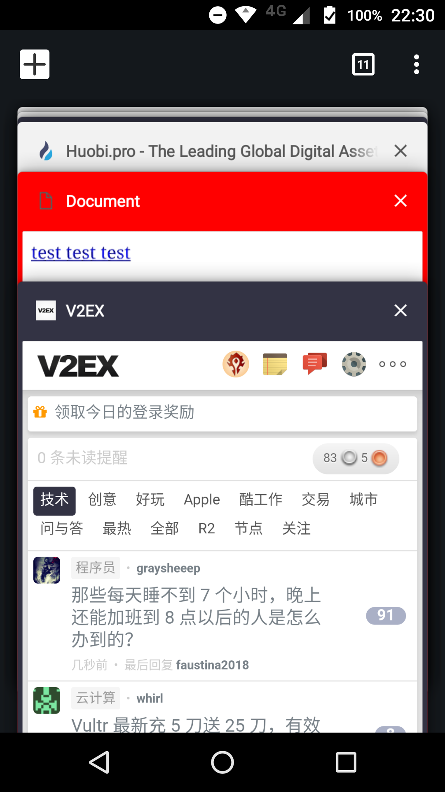

逛 v2ex 时发现在 Chrome for Android 上的 Tab 是黑色的, 和其他网站的页面不大一样.



比较好奇怎么实现的, 于是顺手查了下. 非常简单. 只需要一个 `<meta>`.

eg.

```html
<meta name="theme-color" content="#ff0000">
```

通过 `theme-color` 这个值, 设置你想要的颜色就行. 不过该属性只对 Chrome for Android 有效.


#### 参考资料

* https://developers.google.com/web/updates/2014/11/Support-for-theme-color-in-Chrome-39-for-Android