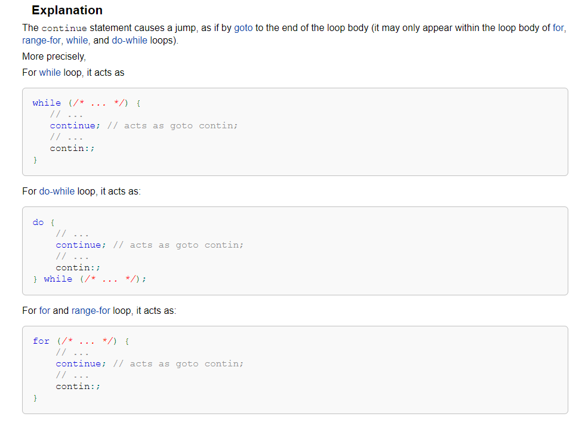

标题起这么个名字, 这么简单的东西, 照理是没什么值得写的, 不过回想起学 C 的时候, 发现了一些盲点, 自然也好奇 JS 中是否也是如此.

如果有人问, `while` 和 `for` 有什么区别, 我想大多数人也是不屑. 考虑下面一段代码.

```javascript
var i = 0, n = 5;
while (n--) {
	if (i < 3) {
		break;
	}
	++i;
}
console.log(i);

n = 5;
for (i = 0; n--; ++i) {
	if (i < 3) {
		break;
	}
}
console.log(i);
```

毫无疑问, 两个输出都是 0. 那让我们把 `break` 换成 `continue`.

```javascript
var i = 0, n = 5;
while (n--) {
	if (i < 3) {
		continue;
	}
	++i;
}
console.log(i);

n = 5;
for (i = 0; n--; ++i) {
	if (i < 3) {
		continue;
	}
}
console.log(i);
// 0
// 5
```

嗯, 输出 0 和 5? 难道 `while` 和 `for` 真的有区别? 当然不是. 其实这是 `continue` 的作用.

[MDN](https://developer.mozilla.org/en-US/docs/Web/JavaScript/Reference/Statements/continue) 上说, `continue` 在 `while` 中会直接跳到判断条件, 在 `for` 中则是跳到更新表达式(++i), 这个解释当然没什么问题, 也能够说明这个现象, 不过我还是更喜欢 [cppreference](http://en.cppreference.com/w/cpp/language/continue) 的解释:



非常直观, `continue` 只是 `goto` 的一个语法糖, 而 `goto` 对应的 `label` 则是如图所示, 也因为如此导致 `continue` 在 `while` 和 `for` 中的表现不相同. 其实类 C 语言对 `continue` 的处理基本上都是如此, 当然 JS 中是没有 `goto` 的, 不过 JS 中有 `label` 勉强可以用来做一些跳转.


#### label

`label` 可以和 `break` `continue` 搭配使用, 其实也只能和它们搭配使用. 熟悉 `goto` 的话自然知道该怎么用了. 这里也就简单介绍下.

`label` 后面必须跟一个包含 `break` 或 `continue` 的 JS 语句:

```
label: statement
```

**即 `break` 或 `continue` 在 statement 中. 对于 `break`, statement 可以是块语句, 循环语句, `switch` 等, 对于 `continue`, statement 只能是循环语句**.

```javascript
top: {
    console.log('start');
    break top;
    console.log('end');
}
// start
```

最后 end 不会被输出, 不过这事没多大意义, 通常我们肯定是用 `if` 来实现. `label` 的应用场景主要还是跳出多重循环.

```javascript
top:
for (var i = 0; i < 5; ++i) {
	for (var j = 0; j < 3; ++j) {
		if (i === 2 && j === 1) {
			break top;
		}
	}
}
console.log(i, "&", j);
// 2 '&' 1
```

等价于

```javascript
for (var i = 0; i < 5; ++i) {
	for (var j = 0; j < 3; ++j) {
		if (i === 2 && j === 1) {
			break;
		}
	}
	if (i === 2) {
		break;
	}
}
console.log(i, "&", j);
// 或者
for (var i = 0; i < 5; ++i) {
	for (var j = 0, flag = false; j < 3; ++j) {
		if (flag = (i === 2 && j === 1)) {
			break;
		}
	}
	if (flag) {
		break;
	}
}
console.log(i, "&", j);
```

而对于 `continue`

```javascript
top:
for (var i = 0; i < 5; ++i) {
	for (var j = 0; j < 3; ++j) {
		if (i === 2 && j === 1) {
			continue top;
		}
	}
}
console.log(i, "&", j);
// 5 '&' 3
```

好像并不能看出有什么效果. 我们换一种形式.

```javascript
top:
for (var i = 0, c0 = 0, c1 = 0; i < 5; ++i) {
	for (var j = 0; j < 3; ++j) {
		if (i === 2 && j === 1) {
			continue top;
		}
		++c0;
	}
	++c1;
}
console.log(c0, "&", c1);
// 13 '&' 4
```

为什么 c0 是 13, c1 是 4? 其实这等价于

```c
#include <stdio.h>
int main() {
	int i = 0, j = 0, c0 = 0, c1 = 0;
	for (i = 0; i< 5; ++i) {
		for (j = 0; j < 3; ++j) {
			if (i == 2 && j == 1) {
				goto top;
			}
			++c0;
		}
		if (i == 2) {
			goto top;
		}
		++c1;
		top:;
	}
	printf("%d %d %d %d", c0, c1, i, j);
	return 0;
}
```

因为 JS 没有 `goto`, 就用 C 来替代下吧...不过其实对于 `continue` 来说, `label` 的应用场景比较少吧.

另一方面是, JS 中 `label` 这样的语法, 下面这样很容易让人产生错觉, 觉得代码的执行跳转到 `for` 的上面去了, 于是又会重新执行 `for` 语句, 变成死循环. 其实不是, 而是跳到 `for` 外面的下面, 所以个人还是更喜欢 `goto` 这样的形式, 看起来更清晰一点.

```javascript
top:
for (var i = 0; i < 5; ++i) {
	for (var j = 0; j < 3; ++j) {
		if (i === 2 && j === 1) {
			break top;
		}
	}
}
console.log(i, "&", j);
```


#### 参考资料

* http://en.cppreference.com/w/cpp/language/continue
* http://en.cppreference.com/w/cpp/language/break
* https://developer.mozilla.org/en-US/docs/Web/JavaScript/Reference/Statements/continue
* https://developer.mozilla.org/en-US/docs/Web/JavaScript/Reference/Statements/break
* https://developer.mozilla.org/en-US/docs/Web/JavaScript/Reference/Statements/label
* https://www.ecma-international.org/ecma-262/6.0/#sec-continue-statement
* https://www.ecma-international.org/ecma-262/6.0/#sec-break-statement