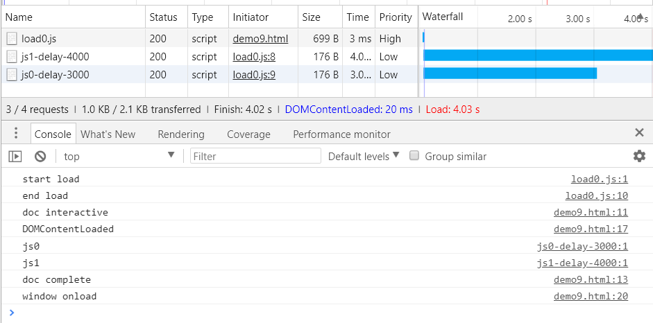
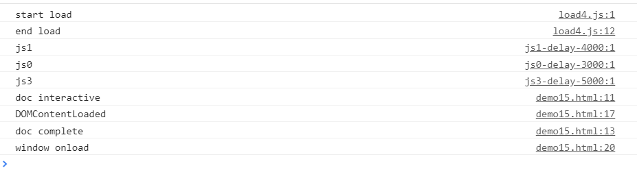

*注: 本文存在诸多待修正内容.*

`<script>` 应该是大家都很熟悉的东西了, 每个学 JS 的人都会用.

```html
<script src="demo.js"></script>
```

引入一个 JS 就好了嘛. 当然如果我只是为了说这些, 那就没必要写这么一篇了.

`<script>` 支持的属性可能很多人都已经熟悉了, 但不管怎么说, 还是先从俗套的属性介绍开始吧.


#### 支持的属性

* `async`, 异步加载脚本, 布尔值, 需要注意的是, **动态插入的脚本默认是 `async` 的, 也就意味着动态插入的脚本执行是异步的(等当前脚本执行完再执行)**. 如果希望同步执行, 则建议设置 `script.async = false`. 对于没有 `src` 的脚本无效. 以下例子都是等价的.

  ```html
  <script src="demo.js" async></script>
  <script src="demo.js" async="async"></script>
  <script src="demo.js" async=""></script>
  ```

* `crossorigin`, 跨域支持, 有两个值, `anonymous` 和 `use-credentials`.

* `defer`, 延迟执行脚本, 布尔值, **脚本会在 `DOMContentLoaded` 事件触发之前执行**. 同样 JS 侧可以通过 `script.defer = false` 设置它的值, 动态插入的脚本 `defer` 默认 false. 对于没有 `src` 的脚本无效. 以下例子都是等价的.

  ```html
  <script src="demo.js" defer></script>
  <script src="demo.js" defer="defer"></script>
  <script src="demo.js" defer=""></script>
  ```

* `integrity`, 浏览器安全策略的一环, 可以设置一个 hash 用作校验, 对于文件 hash 校验通过的脚本或 CSS, 浏览器拒绝执行或使用.

  ```html
  <script src="demo.js" integrity="sha384-oqVuAfXRKap7fdgcCY5uykM6+R9GqQ8K/uxy9rx7HNQlGYl1kPzQho1wx4JwY8wC"></script>
  ```

* `type` 常见的值是 MIME type, 但是现在支持 ES6 模块了, 所以有了新值 `module` 用来提示浏览器这是一个 ES6 模块. 除了这两个, 还支持其他自定义的值, 浏览器不会执行这些 `<script>`, 而是视它们为数据块, 此时 `src` 属性会被忽略.

还有其他一些属性, 不过目前来说不是很重要就不列了.


#### type

其实浏览器对 MIME type 挺宽松的, [这些类型](https://mimesniff.spec.whatwg.org/#javascript-mime-type)的都是合法的. 省略 `type` 属性, 则意味着 `<script>` 是一个经典脚本([classic script](https://html.spec.whatwg.org/multipage/webappapis.html#classic-script), 与之对应的是模块脚本([module script](https://html.spec.whatwg.org/multipage/webappapis.html#module-script)), 之后还会提到).

之前提到可以自定义 `type` 的值, 但是其实这个值也**必须是一个合法的 MIME type**, 即 `text/html` 这样的字符串. 浏览器会视一个不匹配 JS MIME type 的 MIME type 为数据块(比如你可能见过 `text/template` 这样的). **作为数据块的时候, 数据必须内联, 并且此时浏览器会忽略 `src` `async` `nomodule` `defer` `crossorigin` `integrity` 属性**.

> When used to include [data blocks](https://html.spec.whatwg.org/multipage/scripting.html#data-block), the data must be embedded inline, the format of the data must be given using the `type` attribute, and the contents of the `script` element must conform to the requirements defined for the format used. The `src`, `async`, `nomodule`, `defer`, `crossorigin`, and `integrity` attributes must not be specified. 

除此之外, **浏览器会对一些 MIME type 的 `<script>` 报错并拒绝执行(当然还是会下载的)**, 比如 `image/*` `video/*` `audio/*` `text/csv`, 此时会触发 `<script>` 的 `error` 事件, 否则触发 `load` 事件.


#### ES6 模块

之前已经提了, `type="module"` 的 `<script>` 会被视为 ES6 模块. 它会影响很多方面, 比如 `<script>` 的资源优先级, 脚本执行的时机等等. 这里不会具体说明, 因为现在的应用还不是很广泛, 另外我也没仔细看...之后有关于 ES6 模块的内容也会顺带提一下, 有空再补齐这部分内容.


#### crossorigin

照理来说, 我们都已经知道 `<script>` 是可以跨域的, 那这个属性的意义是什么? 做过异常监控的朋友可能会更熟悉它.

从网络请求的角度来说, 没有 `crossorigin` 的 `<script>` 在发起请求的时候不会带有 `Origin` 头, 而加了 `crossorigin` 的 `<script>` 在发起请求的时候会带 `Origin` 头, 如果是 `use-credentials` 则还会带一些其他内容, 比如 cookie 等凭据.

##### 不带 crossorigin


##### crossorigin="anonymous"


从浏览器角度来说, 为了安全, 如果域 A 的脚本报错, 能够被域 B 的脚本通过 `window.onerror` 给捕获到的话, 这违背了同源策略. 这也是该属性主要的应用场景.

##### 不带 crossorigin


通过 `window.onerror` 我们只能知道脚本发生了错误, 但不能知道具体发生了什么错误.

##### crossorigin="anonymous"


加上 `crossorigin` 之后, 我们已经可以知道具体的错误了. 具体参考 [demo2](https://github.com/ta7sudan/front-end-demo/blob/master/js/script-loading/demo2.html) 和 [demo3](https://github.com/ta7sudan/front-end-demo/blob/master/js/script-loading/demo3.html).

那有人会说, 既然这样我们无脑加上 `crossorigin` 就好了, 这样就可以捕获到具体错误了. **不可以!!! 不要无脑加 `crossorigin`, 一定要后端同时配置好 CORS!!! 否则脚本会因为 CORS 校验不匹配而导致跨域无法执行!!!**


总结:

* 对于 classic script, `crossorigin` 控制从其他域获取的脚本是否暴露错误, 对于 module script, 它控制获取资源的跨域请求的 [credentials mode](https://fetch.spec.whatwg.org/#concept-request-credentials-mode)(For [classic scripts](https://html.spec.whatwg.org/multipage/webappapis.html#classic-script), it controls whether error information will be exposed, when the script is obtained from other [origins](https://html.spec.whatwg.org/multipage/origin.html#concept-origin). For [module scripts](https://html.spec.whatwg.org/multipage/webappapis.html#module-script), it controls the [credentials mode](https://fetch.spec.whatwg.org/#concept-request-credentials-mode) used for cross-origin requests)
* 对于 module script, 如果是从其他域获取的, 则必须通过 CORS 才能执行(Unlike [classic scripts](https://html.spec.whatwg.org/multipage/webappapis.html#classic-script), [module scripts](https://html.spec.whatwg.org/multipage/webappapis.html#module-script) require the use of the [CORS protocol](https://fetch.spec.whatwg.org/#http-cors-protocol) for cross-origin fetching.)
* `crossorigin` 会使得获取资源的请求带上 `Origin` 头, 可能还有其他凭据
* 不要无脑加 `crossorigin`, 一定要后端同时配置好 CORS!!! 否则脚本会因为 CORS 校验不匹配而导致跨域无法执行!!!


#### async/defer

关于这两个属性, 很多地方都会放这张图来说明.


当然是对的. 不过现在我们可以有个更完整的图, 来更好地说明它们的区别.


关于 `async`/`defer`, 根据规范中的描述是:

对于 classic script, 如果只有 `async`, 则脚本的获取过程会和 HTML 解析的过程并行, 并且当它可用的时候会尽快执行(可能在 HTML 解析完成前就执行). 如果只有 `defer`, 则脚本的获取过程会和 HTML 解析的过程并行, 但执行是在 HTML 解析完成之后. 如果两者都没有, 则脚本立即获取并执行, 会阻塞 HTML 的解析, 直到执行完.(问 JS 阻塞 HTML 解析是从下载时开始阻塞还是执行时开始阻塞? 当然是下载时)

> For [classic scripts](https://html.spec.whatwg.org/multipage/webappapis.html#classic-script), if the `async` attribute is present, then the classic script will be fetched [in parallel](https://html.spec.whatwg.org/multipage/infrastructure.html#in-parallel) to parsing and evaluated as soon as it is available (potentially before parsing completes). If the `async` attribute is not present but the `defer` attribute is present, then the classic script will be fetched [in parallel](https://html.spec.whatwg.org/multipage/infrastructure.html#in-parallel) and evaluated when the page has finished parsing. If neither attribute is present, then the script is fetched and evaluated immediately, blocking parsing until these are both complete. 

对于 module script, 如果有 `async`, 则脚本及其依赖的脚本的获取过程会和 HTML 解析过程并行, 并且当它可用的时候会尽快执行(可能在 HTML 解析完成之前执行), 否则脚本及其依赖的获取过程会和 HTMl 解析过程并行, 并且在解析完成之后执行(其实和 `defer` 一样). **module script 不受 `defer` 影响**.

关于这一点, 其实规范中也有具体说明:

**classic script 只有在有 `src` 的时候才会受 `async` 和 `defer` 的影响**

> Classic scripts are affected by the `async` and `defer` attributes, but only when the `src` attribute is set 

**module script 不受 `defer` 的影响, 但是可以受 `async` 影响(不论是否有 `src`)**

> Module scripts are not affected by the `defer` attribute, but are affected by the `async` attribute (regardless of the state of the `src` attribute) 

而对于 classic script, 如果同时设置了 `async` 和 `defer`, 可能导致一些浏览器回退到 `defer` 的行为(就像没有 `async` 一样).

**其中 `defer` 的脚本会阻塞 `DOMContentLoaded` 事件, 即脚本会在 `DOMContentLoaded` 事件触发之前执行.**

关于 `async`/`defer` 的执行顺序, 这里并没有具体的说明, 同样也会留给之后的讨论. 可能有人会说, 图中已经很明显了, `async` 就是不保证顺序. `defer` 我也知道, 高程说了, 规范中要求 `defer` 按照 DOM 先后顺序执行, 实际不一定按顺序执行, 也不一定在 `DOMContentLoaded` 之前执行. 当然, 这些都基本正确, 不过我想这些内容我们还可以再深入一些.


#### 脚本的几种类型

脚本有哪些类型? 我知道, 脚本有 `async`/`defer`, 有外部脚本, 有内联脚本...真是优秀! 不过这里我们讨论的脚本类型是规范中划分的几类, 当然, 它们也和 `async` 等因素相关.

规范中给脚本定义了几个标记(都是布尔值):

* `already started` 初始值是 false. 字面意义理解为脚本已经开始执行, 个人理解为实际上脚本不一定执行了, 这个标记更像是一个锁, 在脚本执行前上锁. 
* `parser-inserted` 初始值是 false. 该值的意义应该是脚本是否是由 parser 插入的, 即脚本是否是动态创建的, 对于动态创建的脚本, 该值应该是 false. 当 parser 遇到 `<script>` 的起始标签时会将该值置为 true.
* `non-blocking` 初始值是 true. 意义是脚本是否是非阻塞的, 可能有人会奇怪, 难道脚本默认都是非阻塞的? 其实 parser 在遇到 `<script>` 起始标签时会把这个值置为 false 的, 还有一些其他操作可能会把它置为 false. 这个属性和 `async` 关系比较大.
* `ready to be parser-executed` 初始值是 false. 如它字面意义, 标志着脚本可以被执行了
* `the script's type` 只有 `classic` 和 `module` 两个值, 显然用来区分是 ES6 模块还是经典脚本, 和 `type` 有关
* `from an external file` 是否是外部脚本, 和 `src` 有关. **如果一个脚本是外部脚本, 则它执行完后一定会触发脚本的 `load` 事件(参考[规范](https://html.spec.whatwg.org/multipage/scripting.html#execute-the-script-block))**
* `the script's script` 字面意义脚本的脚本, 看上去给人感觉是脚本动态生成的脚本, 难道是用来表示该脚本是否是由其他脚本生成的? 不过实际上并不是这个意思, 而应该就是指脚本本身
* `the script is ready` 初始值 false(规范中并没有说明, 不过从上下文可以推断). 通常是在外部脚本下载完成, 或内联脚本解析完成时被标记为 true. 在这之后, `ready to be paresr-executed` 才会被标记为 true. 需要注意的是, **该标记置为 true 之前, 会阻塞脚本的 `load` 事件(也意味着会进一步阻塞 `window.onload`)**(The user agent must [delay the load event](https://html.spec.whatwg.org/multipage/parsing.html#delay-the-load-event) of the element's [node document](https://dom.spec.whatwg.org/#concept-node-document) until [the script is ready](https://html.spec.whatwg.org/multipage/scripting.html#the-script-is-ready).)
* `connected` 准确说这并不是规范定义的几个标记, 不过它也是脚本的一种状态, 基本可以理解为脚本是否被添加到 DOM 树中, 无论是动态创建的脚本还是首屏就存在的脚本, 它们都会经历这一步

接着会根据脚本的这些标记来准备(prepare)一个脚本, 在三种情况下脚本会被 prepare:

* 脚本将要 connected
* 脚本已经是 connected, 但是 `<script></script>` 之间新增了内容(在其他脚本插入到页面之后)
* 脚本已经是 connected, 但是之前没有 `src` 后来新增了 `src`

通常来说我们不需要关心这么细节的东西, 大部分情况就是 parser 遇到 `<script>` 就会 prepare 这个脚本.

那什么是 prepare 一个脚本? prepare 一个脚本的步骤比较复杂, 基本上是包含了判断脚本的类型('classic' 还是 'module'), 确定脚本的编码(charset), 配置脚本的 CORS 设置, 对脚本执行 CSP 策略检查, 下载脚本, 划分脚本类型, 可能执行脚本等等工作.

这里我们主要关心划分的脚本类型. 

* `list of scripts that will execute when the document has finished parsing` 当 HTML parsing 结束之后要执行的脚本列表, 之后简写成 LEFP 列表吧.
* `list of scripts that will execute as soon as possible` 应当尽快执行的脚本列表, 之后简写成 LESP 列表.
* `set of scripts that will execute as soon as possible` 应当尽快执行的脚本集合, 之后简写成 SESP 集合.
* `pending parsing-blocking script` 等待 parser 阻塞的脚本, 它就只是一个脚本, 不是列表也不是集合.
* `execute the script block immediately` 应当立即执行的脚本, **即使有其他脚本正在执行, 它也必须立即执行**.

**以上的列表意味着按顺序执行, 集合意味着执行顺序是可以无序的.**

它们和 `async`/`defer` 这些属性, 以及是内部脚本还是外部脚本之间到底是什么关系? 可以列几个表来说明.

##### LEFP 列表

| type      | 有 `src`? | 有 `defer`?                  | 有 `async`? | 其他条件                  |
| --------- | --------- | ---------------------------- | ----------- | ------------------------- |
| 'classic' | yes       | yes                          | no          | `parser-inserted` 为 true |
| 'module'  | yes or no | `defer` 对 'module' 脚本无效 | no          | `parser-inserted` 为 true |

yes or no 意味着该属性对结果没有影响. 通常我们的 `defer` 脚本都会被划分到这个列表中, 这也表明**规范中定义了 `defer` 脚本应当是按照出现的顺序执行的**. 另一方面是, **ES6 模块的默认执行顺序和加了 `defer` 的经典脚本是一样的**. 顾名思义, **这类脚本需要等 HTML parsing 结束后才会被执行.**

对于目前只用 classic script 的我们来说, **非动态创建的 `defer` 的外部脚本(`defer` 脚本本来就只可能是外部脚本, `defer` 对内联脚本无效, 不过还是强调下)都是属于 LEFP 列表**.


##### LESP 列表

| type      | 有 `src`? | 有 `defer`?                  | 有 `async`? | 其他条件                |
| --------- | --------- | ---------------------------- | ----------- | ----------------------- |
| 'classic' | yes       | yes or no                    | no          | `non-blocking` 为 false |
| 'module'  | yes or no | `defer` 对 'module' 脚本无效 | no          | `non-blocking` 为 false |

其实这里隐含了一个条件是 `parser-inserted` 为 false, 通常来说, **动态创建的非 `async` 外部脚本(无论是否 `defer`)都是属于这个列表(这里的非 `async` 不仅仅指 HTML 标签中没有 `async` 属性, 也指 JS 对象中的 async 属性为 false, 因为动态创建的脚本默认 async 属性为 true, 尽管在 HTML 标签中没体现出来)**. **这类脚本也要在 HTML parsing 结束后才会被执行(因为是在 [The end](https://html.spec.whatwg.org/multipage/parsing.html#the-end) 步骤中被执行).**


##### SESP 集合

| type      | 有 `src`? | 有 `defer`?                  | 有 `async`? |
| --------- | --------- | ---------------------------- | ----------- |
| 'classic' | yes       | yes or no                    | yes or no   |
| 'module'  | yes or no | `defer` 对 'module' 脚本无效 | yes or no   |

通常来说, **动态创建的 `script.async` 为 true 的外部脚本(无论是否有 `defer`)都属于这个集合**. **这类脚本也要在 HTML parsing 结束后才会被执行(因为是在 [The end](https://html.spec.whatwg.org/multipage/parsing.html#the-end) 步骤中被执行).**


##### 等待 parser 阻塞的脚本

| type                  | 有 `src`? | 有 `defer`? | 有 `async`? | 其他条件                                                     |
| --------------------- | --------- | ----------- | ----------- | ------------------------------------------------------------ |
| 'classic'             | yes       | no          | no          | `parser-inserted` 为 true                                    |
| 'classic' or 'module' | no        | yes or no   | yes or no   | `parser-inserted` 为 true 并且(创建脚本的 parser 是一个 XML parser 或者是一个 script nesting level <= 1 的 HTML parser)并且有一个阻塞脚本的 CSS |

通常来说是**非动态插入的非 `async`/`defer` 的外部脚本, 或者是非动态插入的被 CSS 阻塞的内联脚本(同样, 内联脚本也不可能是 `defer`/`async` 的, 所以这里是 yes or no)**. 大部分情况下(script nesting level <= 1), 这个脚本会稍稍等待一下然后很快被执行(**不需要等 HTML parsing 结束, 因为执行是在遇到 `</script>` 之后触发的**), 对于外部脚本, 等待的过程通常是等待下载, 即等待 `ready to be parser-executed` 为 true, 对于内联脚本, 通常是等待 CSSOM 构建. **同一时间只会有一个脚本被标记为 `pending parsing-blocking script`.**

这里需要简单提一下 script nesting level(脚本嵌套层级), 当 parser 遇到 `</script>` 时, 嵌套层级会 +1, 之后会 prepare 脚本, prepare 完毕后, 嵌套层级 -1, 对于从来不用 `document.write()` 的来说, 嵌套层级最多就是 1 了. 但是之前提到过, prepare 过程中可能执行脚本, 假如脚本中有 `document.write()`, 则又会触发 Tokenizer, Tree Construction 的一些操作, 进而导致层级大于 1. 下面这幅图很好地描述了这一过程.


而阻塞脚本的 CSS, 了解浏览器渲染的话就很清楚这一点了, 这里不多做说明, 下图比较好地反映了这点.


##### 立即执行的脚本

不满足上面所有条件的脚本都会立即执行, 通常来说, **内联脚本, 动态添加的内联脚本, 非动态插入的 `async` 的外部脚本(不是很确定)属于这类脚本**, **即使有其他脚本已经在执行了, 它也需要被立即执行.** 同样, **它不需要等 HTML parsing 结束后才执行.**

现在你可能会问, 为什么我需要知道这些东西? 有什么意义?


#### 脚本的执行顺序

其实这部分内容分布在一些零散的位置, 并不是很好整理...不过看了规范以后, 大致流程应该是这样

1. 首先当然是按顺序出现的等待 parser 阻塞的脚本或立即执行的脚本, 也就是非动态创建的内联脚本(无论是否被 CSS 阻塞), 非动态创建的无特殊属性的外部脚本(无论是否被 CSS 阻塞)按照它们出现的先后顺序依次执行
2. 非动态创建的 `async` 外部脚本(如果它在 HTML parsing 之前下载完成的话)等它前面的(DOM 顺序)同步脚本执行完才按照下载完成顺序执行(即必须比它前面的同步脚本后执行, 但也可能比它后面的同步脚本后执行, 根据它和其他脚本下载完成的时间决定)
3. HTML parsing 结束
4. 设置 `document.readyState` 为 `interactive`
5. 启动 event loop, 执行 LEFP 列表中的脚本, 直到 LEFP 列表为空, 即按顺序执行非动态创建的 `defer` 的外部脚本
6. 触发 `DOMContentLoaded` 事件
7. 启动 event loop, 执行 SESP 集合和 LESP 列表中脚本, 即随机执行动态创建的 `script.async` 为 true 的外部脚本, 和按顺序执行动态创建的非 `async` 外部脚本(无论是否 `defer`)
8. 设置 `document.readyState` 为 `complete`
9. 触发 `window.onload`

**以上执行顺序都应当假设浏览器不存在预测加载机制!!!**


#### 一些例子

##### async 的脚本之间的执行顺序是先到先执行

```html
<script src="http://127.0.0.1:3000/js1-delay-4000" onload="console.log('js1 loaded')" async></script>
<script src="http://127.0.0.1:3000/js0-delay-3000" onload="console.log('js0 loaded')" async></script>
```


可以看到, 尽管 DOM 顺序是 js1 在 js0 前面, 但 js0 先下载完成, 所以 js0 比 js1 先执行. 参考 [demo](https://github.com/ta7sudan/front-end-demo/blob/master/js/script-loading/demo4.html).


##### defer 的脚本之间是按顺序执行的

```html
<script src="http://127.0.0.1:3000/js1-delay-4000" onload="console.log('js1 loaded')" defer></script>
<script src="http://127.0.0.1:3000/js0-delay-3000" onload="console.log('js0 loaded')" defer></script>
```


可以看到, 尽管 js0 先下载完成, 但是因为 `defer` 是属于 LEFP 列表的, 所以是按顺序执行的. 但是, 如高程所说, 部分浏览器没有按照规范实现, 所以 `defer` 的脚本不一定按顺序执行, 也不一定会在 `DOMContentLoaded` 之前执行. 不过现代浏览器都是按规范实现的, 所以这个问题已经不再是问题(兼容 IE? 不存在的).

参考 [demo](https://github.com/ta7sudan/front-end-demo/blob/master/js/script-loading/demo5.html).


##### defer 和 async 的脚本之间先到先执行

```html
<script src="http://127.0.0.1:3000/js1-delay-4000" onload="console.log('js1 loaded')" defer></script>
<script src="http://127.0.0.1:3000/js0-delay-3000" onload="console.log('js0 loaded')" async></script>
```


可以看到, 还是先下载完成的 js0 先执行(如果 js0 在 SESP 集合中, 这说不过去). 参考 [demo](https://github.com/ta7sudan/front-end-demo/blob/master/js/script-loading/demo6.html)


##### defer 脚本都必须等 HTML parsing 结束后才执行, 不能根据 async 脚本下载完成的时间来确定 async 脚本开始执行的时间

```html
<script src="http://127.0.0.1:3000/js1-delay-4000" onload="console.log('js1 loaded')"></script>
<script src="http://127.0.0.1:3000/js0-delay-3000" onload="console.log('js0 loaded')" async></script>
<script src="resources/js2.js" onload="console.log('js2 loaded')" defer></script>
```


这里可能和大多数人的认知不符, 明明 js0 是 `async` 的且比 js1 先下载好, 但却是 js1 先执行, 说好 `async` 下载完成就立即执行呢?

原因是这里 js0 虽然是 `async` 的, 并且先下载完成, 但是这个下载是浏览器预测加载导致的, 预测加载是浏览器的优化机制而非规范要求, 所以考虑一个没有预测加载机制的浏览器, js0 本应该是在 js1 之后才下载然后才执行, 浏览器必须确保它和其他没有预测加载的浏览器行为一致, 所以 js0 应当在 js1 之后执行. 而这里如果交换 js0 和 js1 的位置, 则还是 js0 比 js1 先执行, 因为 js0 前面没有阻塞 parsing 的脚本了.

那 js2 呢? 又是怎么回事? 因为 js2 是 `defer` 的, 从执行顺序来说, `defer` 脚本必须在 HTML parsing 之后执行, 所以 js2 在 js1 之后执行. 而另一方面, js0 是 `async`, 即便是在没有预测加载的浏览器中也是不阻塞 HTML parsing 的, 所以相当于 js2 前面没有 js0 一样, 于是 js1 执行完就到了 parsing 结束, 开始 The End 步骤, 执行 js2, 之后再执行 js0(如果 js0 不在 SESP 集合中的话, 还是不能很好解释为什么是先 js2 再 js0). 而如果 js2 不是在 4s 之前下载完成, 而是在 4s 之后下载完成, 则在不考虑预测加载情况下, 是 js0 先下载完成, 此时 js0 会在 js2 之前执行(相当于还是先到先执行, 可以把 js2 换成注释中延迟的 js2 试试). 而从网络请求来说, 由于浏览器的资源优先级, js0 和 js2 的优先级都是 Low, 但是浏览器可以允许一个 Low 的资源和 js1 并行下载, 也就是 js0, 于是 js2 就必须等待 js0 下载完成才开始下载, 而即便 js2 比 js1 先下载完成, 因为 `defer` 的缘故还是要等 js1 先执行. 于是最终表现为 4s 时所有内容一瞬间打印出来.

**这说明我们应当区分开始下载的顺序, 下载完成的顺序和脚本执行的顺序, 它们之间没有必然的联系, 不能够根据网络请求完成的时间来确定 `async` 脚本的执行时间, 更不能默认浏览器存在预测加载机制, 而应该假设浏览器不存在预测加载, 才比较好判断执行顺序**.

参考 [demo](https://github.com/ta7sudan/front-end-demo/blob/master/js/script-loading/demo7.html)


##### defer 阻塞 DOMContentLoaded, async 不阻塞 DOMContentLoaded, 它们都阻塞 window.onload 和 complete

```html
<script>
	document.addEventListener('readystatechange', function (e) {
		if (document.readyState === 'interactive') {
			console.log('doc interactive');
		} else if (document.readyState === 'complete') {
			console.log('doc complete');
		}
	});
	window.addEventListener('DOMContentLoaded', function (e) {
		console.log('DOMContentLoaded');
	});
	window.addEventListener('load', function (e) {
		console.log('window onload');
	});
</script>
<script src="http://127.0.0.1:3000/js1-delay-4000" onload="console.log('js1 loaded')"></script>
<script src="http://127.0.0.1:3000/js0-delay-3000" onload="console.log('js0 loaded')" async></script>
<script>
	console.log('inline');
</script>
<script src="http://127.0.0.1:3000/js2-delay-3000" onload="console.log('js2 loaded')" defer></script>
<script src="http://127.0.0.1:3000/js3-delay-5000" onload="console.log('js3 loaded')" async></script>
```


值得注意的是 inline, inline 在 js0 之前执行, 是因为 js0 不阻塞 parsing, 就好像 js0 不存在.

参考 [demo](https://github.com/ta7sudan/front-end-demo/blob/master/js/script-loading/demo8.html)

从上面几个例子可以看到, **非动态创建的 `async`/`defer` 的脚本就好像它们在 HTML 中不存在一样, 因为它们不阻塞 parsing, 而非动态创建的 `async` 脚本的执行时间则是在没有预测加载情况下, 它下载完成时立即开始执行**.


#### 动态加载脚本

由于历史原因, 我们可以通过很多种方式实现动态地往页面中插入一段脚本的操作, 比如 `document.write()`, 比如 `document.createElement()`, 比如 `innerHTML`. 我们还可以通过这些方式插入外部脚本, 插入内部脚本, 插入 `async`/`defer` 的脚本. 让我们来考虑一些问题, 在使用不同的方式加载不同的脚本, 它们之间的执行顺序是怎样的? 是当前脚本(执行插入操作的脚本)停止执行, 开始执行新的脚本? 还是先执行当前脚本, 等当前脚本执行完再执行新的脚本?

首先我们来看一些 MDN 总结的细节:

* 动态插入的脚本(当然是外部脚本, 内联脚本 `async` 不生效)默认是 `async` 的, 也就意味着动态插入的脚本执行是异步的(等当前脚本执行完再执行). 如果希望同步执行, 则建议设置 `script.async = false`
* 动态插入的脚本 `defer` 默认是 false, 可以通过 `script.defer = true` 修改
* 动态创建的脚本设置 `src` 时是不会开始下载的, 必须等到添加到 DOM 中才开始下载(补充下 Image 是在设置 `src` 时就开始下载图片)

现在来看一些 demo 好了.

##### 动态创建的外部脚本默认是异步的

```javascript
console.log('start load');
var js0 = document.createElement('script');
js0.src = 'http://127.0.0.1:3000/js0-delay-3000';
js0.defer = true;
var js1 = document.createElement('script');
js1.src = 'http://127.0.0.1:3000/js1-delay-4000';
js1.defer = true;
document.body.insertBefore(js1, document.currentScript);
document.body.insertBefore(js0, document.currentScript);
console.log('end load');
```



可以看到, 尽管 js1 比 js0 先添加到 DOM, 并且没有设置 `async`, 但是依然是 js0 比 js1 先执行, 因为动态创建的 JS 默认是 `async` 的. **并且它们都不阻塞 `DOMContentLoaded` 事件, 但是阻塞 `complete` 和 `window.onload`**.

参考 [demo](https://github.com/ta7sudan/front-end-demo/blob/master/js/script-loading/demo9.html)


#####动态创建的非 `async` 外部脚本按照添加到 DOM 的顺序执行(不是 DOM 中的顺序), 动态创建的任意外部脚本(无论是否 `async`/`defer`)都是在当前脚本执行完之后执行, 而不会中断当前脚本的执行, 即异步执行(可能在后面的非动态创建脚本之前执行, 也可能在后面的非动态创建脚本之后执行, 但一定在当前脚本之后执行), 并且它们都不会阻塞 `DOMContentLoaded`, 但是阻塞 `complete` 和 `window.onload`. 

```javascript
console.log('start load');
var js0 = document.createElement('script');
js0.src = 'http://127.0.0.1:3000/js0-delay-3000';
js0.async = false;
var js1 = document.createElement('script');
js1.src = 'http://127.0.0.1:3000/js1-delay-4000';
js1.async = false;
document.body.appendChild(js1);
document.body.insertBefore(js0, document.currentScript);
console.log('end load');
```


可以看到, 这里**动态创建的非 `async` 脚本之间是按照它们添加到 DOM 的顺序执行的, 而不是按照它们在 DOM 中的顺序执行的**, 并且它们都是在当前脚本执行完之后才执行, 也不阻塞 `DOMContentLoaded`, 但是阻塞了 `complete` 和 `window.onload`.

参考 [demo](https://github.com/ta7sudan/front-end-demo/blob/master/js/script-loading/demo10.html)

```javascript
console.log('start load');
var js0 = document.createElement('script');
js0.src = 'http://127.0.0.1:3000/js0-delay-3000';
js0.async = false;
js0.defer = true;
var js1 = document.createElement('script');
js1.src = 'http://127.0.0.1:3000/js1-delay-4000';
js1.async = false;
js1.defer = true;
document.body.appendChild(js1);
document.body.insertBefore(js0, document.currentScript);
console.log('end load');
```


这里在之前的基础上加上了 `defer`, 但是结果和 `defer` 为 false 是一样的(`defer` 默认为 false), 从这三个例子可以看出, 动态创建的任意外部脚本(无论是否 `async`/`defer`)都不阻塞 `DOMContentLoaded`, 但是阻塞 `complete` 和 `window.onload`, 并且它们都是在当前脚本执行完之后执行, 而不会中断当前脚本的执行.

另一方面是, **对于动态创建的外部脚本, 加不加 `defer` 似乎都没什么影响**, 可能对动态创建 `<iframe>` 并为 `<iframe>` 创建 `<script>` 时有用吧. 

参考 [demo](https://github.com/ta7sudan/front-end-demo/blob/master/js/script-loading/demo11.html)

再来看一个情况.

```html
<script src="resources/load4.js"></script>
<script src="http://127.0.0.1:3000/js2-delay-3000"></script>
<!-- <script src="http://127.0.0.1:3000/js3-delay-5000"></script> -->
```

```javascript
console.log('start load');
var js0 = document.createElement('script');
js0.src = 'http://127.0.0.1:3000/js0-delay-3000';
js0.async = false;
js0.defer = false;
var js1 = document.createElement('script');
js1.src = 'http://127.0.0.1:3000/js1-delay-4000';
js1.async = false;
js1.defer = false;
document.body.appendChild(js1);
document.body.insertBefore(js0, document.currentScript);
console.log('end load');
```

这里我们动态创建的脚本既不是 `async` 也不是 `defer`. 根据之前的经验, 毫无疑问, js1 会比 js0 先执行, 但是 HTML 中还有一个 js2, 那执行顺序是 js2 js1 js0 还是 js1 js0 js2, 又或者是 js1 js2 js0? 猜测只可能是前两种, 因为 js1 js0 都在 LESP 列表中, 它们一定是相邻执行的(但这样的话后面的 `DOMContentLoaded,` `complete` 和 `window.onload` 的时机说不过去).


所以同步脚本 js2 一定会比 js1 和 js0 先执行吗? 现在我们把 js2 换成 js3.



所以其实**设置 `async` 为 false 也只能确保动态创建的脚本之间是按顺序执行的, 而不能确保动态创建的脚本和非动态创建的脚本之间的执行顺序**. 其实这行为有点类似这样一个例子.

```html
<script src="A.js"></script>
<script src="B.js"></script>
```

A.js

```javascript
console.log('A.js');
setTimeout(function () {
    console.log('C.js');
}, 0);
```

B.js

```javascript
console.log('B.js');
```

其实 C 和 B 的执行顺序是没法保证的, 这取决于 B 下载完成的时机. 但是这给了我们一点启示.

参考 [demo](https://github.com/ta7sudan/front-end-demo/blob/master/js/script-loading/demo15.html)


##### 一个比较诡异的例子

```html
<script src="resources/load2.js"></script>
<script src="http://127.0.0.1:3000/js3-delay-5000" defer></script>
```

```javascript
console.log('start load');
var js0 = document.createElement('script');
js0.src = 'http://127.0.0.1:3000/js0-delay-3000';
js0.async = false;
js0.defer = true;
var js1 = document.createElement('script');
js1.src = 'http://127.0.0.1:3000/js1-delay-4000';
js1.async = false;
js1.defer = true;
document.body.appendChild(js1);
document.body.insertBefore(js0, document.currentScript);
console.log('end load');
```


其实就是在前面的 demo 的基础上加了一个非动态创建的 `defer` 脚本. 其实这个结果也还算正常, 但是按照之前几类脚本的划分, `defer` 的 js3 应当是在 js0 和 js1 之前执行才是, 这里不知道怎么解释...

参考 [demo](https://github.com/ta7sudan/front-end-demo/blob/master/js/script-loading/demo12.html)


##### 动态创建的内联脚本会中断当前脚本的执行

```javascript
console.log('start load');
var js0 = document.createElement('script');
js0.textContent = 'console.log("js0")';
var js1 = document.createElement('script');
js1.textContent = `
console.log('js1 start');
var js2 = document.createElement('script');
js2.textContent = 'console.log("js2")';
document.body.appendChild(js2);
console.log('js1 end');
`;
document.body.appendChild(js1);
document.body.insertBefore(js0, document.currentScript);
console.log('end load');
```


可以看到, 动态创建内联脚本是会中断当前脚本执行的. 因为 `async`/`defer` 对内联脚本无效, 所以也没必要测了.

参考 [demo](https://github.com/ta7sudan/front-end-demo/blob/master/js/script-loading/demo13.html)


##### innerHTML 创建的脚本都不会被执行(无论内联还是外部脚本)

这个比较简单, 因为 innerHTML 创建的无论什么脚本都不会被执行, 但是这不代表 innerHTML 不能用来执行 JS!!! 如 XSS 常用的通过各种事件触发来执行 JS, 在 innerHTML 中也是可以的! innerHTML 只是不能用来执行 `<script>` 的 JS.

```html
<script>
	var target = document.getElementById('target');
	target.innerHTML = '<script>console.log("insert")<\/script>';
	// target.innerHTML = '<script src="resources/js0.js"><\/script>';
	// target.innerHTML = ' ';
</script>
```

这里前两种都不会被执行, 但是第三种是可以执行的. 另外, innerHTML 设置 `<script>` 的内容是可以执行 `<script>` 的. 比如

```javascript
var script = document.createElement('script');
script.innerHTML = 'console.log("hello")';
document.body.appendChild(script);
```

这样是可以执行的.

参考 [demo](https://github.com/ta7sudan/front-end-demo/blob/master/js/script-loading/demo14.html)


##### 万恶之源 `document.write()`

严格来说, 它并不是用来做创建元素这种事情的. 如果说前面几个动态创建脚本的方式都是修改 DOM 树的话, 那 `document.write()` 修改的则是文档本身的输入流, 也正因为如此, 让它显得与众不同...

从学前端的第一天起, 各种资料就告诉我不要使用 `document.write()`, 当然我也很好地遵循着这一点, 不过不使用它不代表不应该去了解它, 毕竟很多人拿着它搞事情呢...

太晚了, 改天再写...这里先放一些相关资料

* https://html.spec.whatwg.org/multipage/dynamic-markup-insertion.html#dynamic-markup-insertion
* https://html.spec.whatwg.org/multipage/parsing.html#parsing-main-inhead:parser-inserted
* https://html.spec.whatwg.org/multipage/parsing.html#overview-of-the-parsing-model
* https://developer.mozilla.org/en-US/docs/Web/API/Document/write
* https://developer.mozilla.org/en-US/docs/Web/API/Document/close
* https://developer.mozilla.org/en-US/docs/Web/API/Document/writeln
* https://developer.mozilla.org/en-US/docs/Web/API/Document/open

**永远不要在 `async` 脚本中调用 `document.write()`!**

> Never call `document.write()` from an async script. In Firefox 3.6, calling `document.write()` has an unpredictable effect. In Firefox 4, calling `document.write()` from an async script has no effect (other than printing a warning to the error console). 


##### `document.write()` 的应用场景

可以用来按需加载一些脚本. 当然很多人会说, 按需加载谁不会. 那我们考虑这样一个场景.

```html
<script src="A.js"></script>
<script src="B.js"></script>
```

现在 B 需要一个 Promise, 于是我们可以把一个 Promise 的 polyfill 打包到 A 中, 但是这样 A 的体积有点大, 我们希望按需加载这个 polyfill, 于是我们可以在 A 中动态创建一个 polyfill 的脚本加载进来. 但是从前面的例子中也知道, 在 B 加载完成的时候, 这个动态创建的 polyfill 不一定加载完成, 它们的执行顺序是不能确定的, so, 这时候只能通过在 B 中使用 polyfill 的 `load` 事件来实现这样的依赖了. 但是我们可以通过 `document.write()` 来实现一个同步方式按需加载这个 polyfill 的操作.


##### 最后

如果我们希望抹平动态创建的内联脚本和动态创建的外部脚本之间的差异, 可以通过给内联脚本和外部脚本的插入操作都使用 `setTimeout(()=>{}, 0)` 来确保它们的行为一致, 但是这和浏览器默认的动态加载行为不一致, 默认动态加载外部脚本是会阻塞 `window.onload` 的, 而这样做却不会阻塞(这也是为什么只给动态创建内联脚本的插入操作加 `setTimeout` 是不够的, 这样做并不能抹平两者行为的差异).

如果我们希望动态创建的外部脚本执行顺序可以预测, 感觉这事没法做到, 即便是设置 `async` 为 false, 也只能确保动态创建的外部脚本之间的执行顺序, 而不能确保动态创建的外部脚本和之后的非动态创建的外部脚本之间有确定的执行顺序. 所以如果非动态创建的外部脚本依赖了动态创建的外部脚本, 这可能是件危险的事情...不过可以考虑通过暴露 `load` 接口来让其他脚本依赖动态创建的外部脚本.


#### 一些资源加载相关的情况

尽管规范中说获取 `async`/`defer` 的脚本是可以和 HTML 解析过程并行的, 想象中, 我们可以利用这两个属性实现多个脚本的并行下载, 然而事实情况却是, 只有在都是 `async`/`defer` 的脚本时, 它们才会并行下载, 大部分时候, 因为浏览器加载资源的优先级的原因, `async`/`defer` 的脚本通常需要排队等待其他更高优先级的资源(比如没有 `async`/`defer` 的脚本)下载完成之后才开始下载, 所以**为了实现并行下载, 通常我们还是需要借助 preload**.


#### 其他细节

* 动态地改变 `<script>` 的 `src` `type` `nomodule` `async` `defer` `crossorigin` `integrity` 属性不会有什么直接影响, 只会在特定时机产生影响.(简而言之, 这些属性只会在需要它们的时候产生影响, 其他时候修改它们也不会有什么影响, 但是什么是需要它们的时候? 这事情就比较复杂了...)
* **当通过 `document.write()` 插入脚本的时候, 脚本通常会执行, 并阻塞 HTML 解析和其他脚本执行(TODO, 待测试).**


#### TODO

难道因为 event loop 的关系, 所以 LEFP 列表, LESP 列表, SESP 集合之间是先下载完的先执行?


#### 参考资料

* https://developer.mozilla.org/en-US/docs/Web/HTML/Element/script
* https://html.spec.whatwg.org/multipage/scripting.html
* https://www.w3.org/TR/html5/semantics-scripting.html#the-script-element
* https://developer.mozilla.org/en-US/docs/Web/HTML/CORS_settings_attributes
* https://www.w3.org/TR/cors/#user-credentials
* https://developer.mozilla.org/en-US/docs/Web/Security/Subresource_Integrity
* https://www.zhihu.com/question/55333208/answer/206988970
* https://www.zhihu.com/question/61309490
* https://html.spec.whatwg.org/multipage/webappapis.html#fetch-a-classic-script
* https://html.spec.whatwg.org/multipage/webappapis.html#fetch-a-module-script-tree
* https://html.spec.whatwg.org/multipage/parsing.html#script-nesting-level
* https://html.spec.whatwg.org/multipage/parsing.html#parsing-main-inhead:parser-inserted
* https://html.spec.whatwg.org/multipage/parsing.html#parsing-main-incdata:pending-parsing-blocking-script
* https://html.spec.whatwg.org/multipage/parsing.html#the-end
* https://www.w3.org/TR/html5/semantics-scripting.html#list-of-scripts-that-will-execute-when-the-document-has-finished-parsing
* https://html.spec.whatwg.org/multipage/dynamic-markup-insertion.html#dynamic-markup-insertion
* https://html.spec.whatwg.org/multipage/dynamic-markup-insertion.html#dom-document-write
* https://www.zhihu.com/question/268363126/answer/340524067
* https://developer.mozilla.org/en-US/docs/Web/API/Document/write
* https://developer.mozilla.org/en-US/docs/Web/API/Document/open
* https://developer.mozilla.org/en-US/docs/Web/API/Document/writeln
* https://developer.mozilla.org/en-US/docs/Web/API/Document/close
* https://html.spec.whatwg.org/multipage/scripting.html#execute-the-script-block
* http://hao.jser.com/archive/14309/
* https://harttle.land/2017/01/16/dynamic-script-insertion.html
* https://harttle.land/2016/11/26/dynamic-dom-render-blocking.html