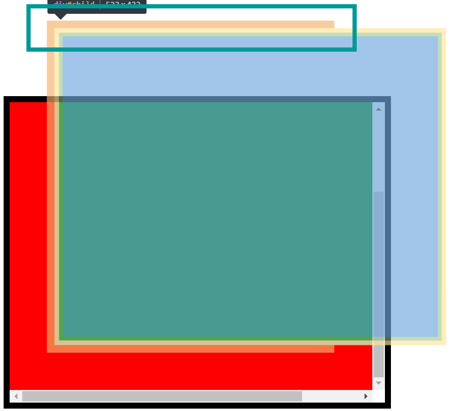

之前在获取元素宽高滚动的时候, 都是通过库来操作, 毕竟能很好地处理掉各种兼容性问题, 不过随着项目越来越大, 在现代框架的环境下, 一些 DOM 操作库显得不那么合时宜了, 增大了打包体积, 所以还是自己整理下相关操作吧.

*注: 这里不讨论 IE8 以下的浏览器.*

* `window.innerWidth` 在 PC 端, 是浏览器可见视口包含了滚动条的宽度, 移动端这个值不怎么靠谱, IE9+, 单位 CSS 像素, PC 端受用户缩放影响

* `window.innerHeight` 高度同上

* `window.outerWidth` PC 端是整个浏览器窗口的宽度, 移动端这个值不怎么靠谱, 单位 CSS 像素, PC 端不受用户缩放影响

* `window.outerHeight` 高度同上

* `document.documentElement.clientWidth` `<html>` 的 `clientWidth`, 至于什么是 `clientWidth`, 参考后文, 单位 CSS 像素, PC 端受用户缩放影响, 移动端受 `viewport` 缩放影响但不受用户缩放影响

* `document.documentElement.clientHeight`, 高度同上

* `document.documentElement.offsetWidth` `<html>` 的 `offsetWidth`, 具体说明见后文, 单位 CSS 像素, PC 端受用户缩放影响, 移动端受 `viewport` 缩放影响但不受用户缩放影响

* `document.documentElement.offsetHeight` 高度同上, PC 端移动端都不受用户缩放影响, 也不受 `viewport` 缩放影响

* `document.body.clientWidth` `<body>` 的 `clientWidth`, 具体说明见后文, 单位 CSS 像素, PC 端受用户缩放影响, 移动端受 `viewport` 缩放影响但不受用户缩放影响

* `document.body.clientHeight` 高度同上, PC 端移动端都不受用户缩放影响, 也不受 `viewport` 缩放影响

* `document.body.offsetWidth` `<body>` 的 `offsetWidth`, 具体说明见后文, 单位 CSS 像素, PC 端受用户缩放影响, 移动端受 `viewport` 缩放影响但不受用户缩放影响

* `document.body.offsetHeight` 高度同上, PC 端移动端都不受用户缩放影响, 也不受 `viewport` 缩放影响

* `elem.offsetWidth` 元素 border-box 的宽度(不论 `box-sizing` 是什么, 这个值都是 border-box 宽度, 不论是否包含滚动条, 都不影响这个值的大小, 因为滚动条不会让元素变大, 只会让元素内容区变小). 如果 `display: none` 的话, 则该值是 0, 单位 CSS 像素, PC 端不受用户缩放影响, 移动端不受 `viewport` 缩放影响也不受用户缩放影响

* `elem.offsetHeight` 高度同上

* `elem.offsetLeft` 元素 border-box 左上角相对于包含块 padding-box 左边缘的距离, 即比如元素 `margin: 10px`, `position: absolute; left: 100px;` 则该值是 110, 单位 CSS 像素

* `elem.offsetTop` 元素 border-box 左上角相对于包含块 padding-box 上边缘的距离, 单位 CSS 像素

* `elem.offsetParent` 元素的包含块元素, 虽然这东西和宽高无关, 不过之后会用到

* `elem.clientWidth` 元素 padding-box 的宽度 - 滚动条宽度(即如果没有滚动条, 它就是 padding-box 宽度, 不论 `box-sizing` 是什么, 这个值都是 padding-box 宽度减去滚动条宽度), 我们把这块区域叫做 可视区域好了, **所以我们不应该把它当作是 content-box 或是 padding-box 的宽度**, 单位 CSS 像素, PC 端不受用户缩放影响, 移动端不受 `viewport` 缩放影响也不受用户缩放影响

* `elem.clientHeight` 高度同上

* `elem.clientLeft` 可视区域和 border-box 的间距, 其实就是 border 的宽度, 单位 CSS 像素

* `elem.clientTop` 高度同上

* `elem.scrollWidth` 这个值就比较诡异了, 在没有滚动条并且内部元素不溢出的情况下, 它的值是和 `clientWidth` 一样的, 即 padding-box 的宽度, 在内部元素溢出的情况下, 不论是否有滚动条(即始终假设它内部可以滚动), 它的值是可视区域的宽度, 那么什么算可视区域? 为什么又是这个值? 参考后文. 单位 CSS 像素, PC 端不受用户缩放影响, 移动端不受 `viewport` 缩放影响也不受用户缩放影响

* `elem.scrollHeight` 高度同上

* `elem.scrollLeft` 元素内部水平方向滚动的距离,设置该值可以滚动到指定位置. 注意, Chrome 60+ 的某些个版本该值总是返回 0, 并且无法设置, 单位 CSS 像素

* `elem.scrollTop` 元素内部垂直方向滚动的距离, 设置该值可以滚动到指定位置, 单位 CSS 像素

* `window.getComputedStyle(elem[, pseudoElt])` 这绝逼是功能最强最完善的一个 API 了, 因为它可以获取到一个元素所有的 CSS 计算值, 精确到小数, 并且有个可选参数是伪元素, eg. `getComputedStyle(p, '::before')`. 它可以返回一个**实时的** `CSSStyleDeclaration` 对象(这说明对于同一个元素我们只需要获取一次就好, 另一方面也意味着, 如果只是需要某一时刻计算值的快照, 建议缓存下来避免之后的计算查找), 即和 `elem.style` 一样, 不过它是**只读的**, 并且它返回的值可以精确到小数. 它也有一些小坑, 那就是在动画运动的时候, FF 上返回的是初始状态的值, 而 Webkit 的浏览器上返回的是终止状态的值, IE9+, 单位 CSS 像素, PC 端对于 `<html>` `<body>` 受用户缩放影响, 对于其他不受用户缩放影响, 移动端对于 `<html>` `<body>` 受 `viewport` 缩放影响, 对于其他不受 `viewport` 缩放影响, 并且不受用户缩放影响

* `elem.getBoundingClientRect()` 对于现代浏览器而言, 它返回一个 `DOMRect` 对象(不是实时的), 包含了以下属性:

  * `x` border-box 左上角相对于可见视口左边缘的距离, 意味着滚动会影响该值的大小
  * `y` border-box 左上角相对于可见视口上边缘的距离
  * `width` border-box 的宽度
  * `height` border-box 的高度
  * `top` 基本上和 `y` 一样, 如果 `height` 是负值, 则它相当于 `y` + `height`, 不过我不知道什么时候 `height` 会是负值
  * `bottom` border-box 底部边缘到可见视口上边缘的距离, 即 `y` + `height`, 如果 `height` 是负值, 则相当于 `y`
  * `left` 同 `top`
  * `right` border-box 右边缘到可见视口左边缘的距离, 即 `x` + `width`, 如果 `width` 是负值, 则相当于 `x`

  它们都精确到小数, 对于旧浏览器而言, 其实并不返回一个 `DOMRect` 对象, 而是一个只包含了 `top`/`bottom`/`left`/`right` 的对象, `width`/`height` 要 IE9 支持, `x`/`y` IE9 和 Edge 都不支持. 另外需要注意的是, `getBoundingClientRect()` 和 `offsetWidth` 等的区别是, **`getBoundingClientRect()` 取得的是实际渲染的大小和位置, 即 `scale()` `translate()` 这些会影响 `getBoundingClientRect()` 的值, 而 `offsetWidth` 这些不受 `transform` 的影响, 它取得的是盒子的大小**, 单位 CSS 像素, PC 端对于 `<html>` `<body>` 受用户缩放影响, 对于其他不受用户缩放影响, 移动端对于 `<html>` `<body>` 受 `viewport` 缩放影响, 对于其他不受 `viewport` 缩放影响, 并且不受用户缩放影响

* `elem.getClientRects()` 这个主要是给行内元素用的, 它返回一个元素的所有 `DOMRect` 的集合, 一个元素怎么会有很多个 `DOMRect` ? 比如一个跨越多行的 `<span>` 就有多个, 集合中每个元素都是 `DOMRect` 对象. 总的来说这个不是很常用, 兼容性也一般, 单位 CSS 像素, PC 端对于 `<html>` `<body>` 受用户缩放影响, 对于其他不受用户缩放影响, 移动端对于 `<html>` `<body>` 受 `viewport` 缩放影响, 对于其他不受 `viewport` 缩放影响, 并且不受用户缩放影响

* `window.scrollX` 整个页面在水平方向上滚动的距离, IE 不支持, 只读, 感觉这东西和 `document.documentElement.scrollLeft`/`document.body.scrollLeft` 有些重合, 单位 CSS 像素

* `window.scrollY` 垂直方向同上

* `window.pageXOffset` 等价于 `window.scrollX`, 不过 IE9 支持, 单位 CSS 像素

* `window.pageYOffset` 同上

* `screen.width` 获取屏幕/显示器的宽度, 单位是设备像素, 在 PC 端它会受到操作系统的缩放影响(不是浏览器的缩放), 即如果不是高分屏, 那它就代表了屏幕的物理像素的宽度, 但是如果是高分屏, win10 下面通常会有 1.25 倍的放大, 于是我们拿到某个屏幕的宽度是 1536 设备像素, 然而实际上的宽度应该是 1536 x 1.25 = 1920 个物理像素, 但是不受用户缩放影响. 在移动端它的值固定, 不受任何缩放影响

* `screen.height` 高度同上

以上这些涉及元素宽高的值都是会被取整的, 如果需要精确到小数, 使用 `getComputedStyle()` 或 `getBoundingClientRect()`.


##### 鼠标事件的一些坐标

* `clientX` 鼠标位置距离可见视口左边缘的距离, 也即以可见视口左上角为原点的 X 轴坐标
* `clientY` Y 轴同上
* `pageX` 鼠标位置距离布局视口左边缘的距离, 也即以布局视口左上角为原点的 X 轴坐标, IE9+
* `pageY` Y 轴同上
* `offsetX` 鼠标位置相对于 `target` 元素的 padding-box 左边缘的距离
* `offsetY` Y 轴同上
* `screenX` 鼠标位置距离整个屏幕左边缘的距离, 也即以屏幕左上角为原点的 X 轴坐标
* `screenY` Y 轴同上
* `movementX` 鼠标位置相对于上一次 `mousemove` 事件中的鼠标位置在 X 方向上的偏移, 即 `movementX` = `currentEvent.screenX` - `previousEvent.screenX`, IE 不支持
* `movementY` Y 轴同上

如无特别说明, 以上属性的单位都是 CSS 像素.


##### touch 事件的一些坐标

touch 事件需要先通过一些属性获取到 `Touch` 对象, 一个 `Touch` 对象可以理解为一个触摸点, 包含了该触摸点的位置等信息. touch 主要有以下三个属性获取 `Touch` 对象.

* `targetTouches` 一个 `Touch` 对象的集合, 表示 `touchstart` 事件发生在 `target` 元素内的所有正在接触中的触摸点, 即该集合内的所有点都是处于接触状态, 并且它们的 `touchstart` 事件都发生在 `target` 元素内, 尽管之后它们可能不在元素内了
* `touches` 一个 `Touch` 对象的集合, 表示当前所有接触状态中的触摸点, 不论它们最开始的 `touchstart` 发生在哪个元素中, 也即当前屏幕上所有接触中的触摸点
* `changedTouches` 一个 `Touch` 对象的集合, 对于不同事件, 它的含义不同
  * 对于 `touchstart`, 它表示那些新接触屏幕的触摸点, 比如以及有一个手指 A 触摸在屏幕上, 此时手指 B 开始触摸屏幕, 则 B 触发了 `touchstart`, `changedTouches` 中只会有 B 的触摸点, 不会有 A 的触摸点
  * 对于 `touchmove`, 它表示那些相对于上一次 `touch` 事件发生改变的触摸点, 比如一开始有 A B 两个触摸点, 其中 A 移动了, B 没动, 则该元素的 `touchmove` 事件中, `changedTouches` 中只包含 A
  * 对于 `touchend`, 它表示那些已经离开屏幕的触摸点, 即这些点实际上已经没有被触摸了, 但是手指是从这些点的位置离开的

对于 `Touch` 对象本身, 就比较简单了, 它也有鼠标事件中的 `screenX`/`clientX`/`pageX` 以及对应 Y 轴的相关属性, 并且含义和之前是一样的.

如无特别说明, 以上属性的单位都是 CSS 像素.


#### 可视区域和滚动条

之前我从来没有想过, 滚动条是怎样一种存在? 它应该被放在哪里? 放在 padding-box 中? 或是 border-box 中? 换句话说, 如果一个元素内部是可滚动的, 那究竟哪些部分是可以滚动的? 滚动条是否又会占据 padding-box 或 border-box 的大小? 是否会引起元素大小变化?

所以我们还是直接看一个例子.

```html
<div id="parent">
	<div id="child"></div>
</div>
```

```css
#parent {
	width: 400px;
	height: 300px;
	padding: 50px;
	background: red;
	border: 8px solid #000;
	margin: 10px;
	overflow: scroll;
}
#child {
	width: 500px;
	height: 400px;
	background: green;
	padding: 5px;
	border: 6px solid #888;
	margin: 10px;
}
```

##### 滚动条出现在哪里?

可以很显然地看到, 滚动条出现在 padding-box 中, 滚动条的右边缘贴着 padding-box 的右边缘. 而不会盖在 border 上面. 所以, **对于一个 `overflow: scroll` 的元素来说, 它的整个 padding-box 都是可以滚动的**.

##### 滚动条是否影响元素的大小?

通过切换 `overflow`, 也可以很清楚地看到, 滚动条不影响元素的大小, 即元素不会因为有滚动条, border-box 就变大一些.

##### 滚动条是否会挤压 padding-box 的大小?

既然滚动条不会让 border-box 变大, 那滚动条是否会让 padding-box 变小? 通过调试工具加切换 `overflow` 可以看到, 滚动条也不会挤压 padding-box 的大小, 事实上, 滚动条像是 `outline` 一样, 不占据空间, 而是一个更高的图层叠在 padding-box 之上, 所以它既不会撑开 border-box, 也不会挤压 padding-box.

##### 什么算可视区域?

可视区域是元素 padding-box 的大小? 或是所有内容加起来的大小? 应该说, 都不是.


从左边来看似乎并没有什么问题, 让我们来看看滚动条拉到右边.


嗯? 我们 `div#parent` 的 `padding-bottom` 正常, `div#child` 的 `margin-bottom` 也正常, 然而 `div#parent` 的 `padding-right` 和 `div#child` 的 `margin-right` 不见了. 有人会说, 是被滚动条盖住了, 然而滚动条只有 16px - 18px, 事实上, 在滚动情况下, `div#child` 的 border 边缘一定会紧贴着滚动条, 而不会隔着 `div#parent` 的 `padding` 或是自身的 `margin`, 至于为什么, 大概规范如此.



事实上, 通过调试工具我们可以更加清楚地看到, `div#child` 的 margin-box 会被限制在 `div#parent` 的 content-box 内, 这也是为什么到了右边 `div#child` 的 `margin-right` 就不见了的原因. 而 `div#parent` 的 `padding-right` 其实也是存在的, 只不过是失去了意义.

所以最终, 这里可视区域的宽度应该是 `div#child` 的 padding-box 宽度(522) + `div#child` 的 `margin-left` 宽度(10) + `div#parent` 的 `padding-left` 宽度(50) = 582, 即 `div#parent` 的 `scrollWidth` 值. 而可视区域的高度则是 `div#child` 的 padding-box 高度(422) + `div#child` 的 `margin-top` (10) + `div#child` 的 `margin-bottom` (10) + `div#parent` 的 `padding-top` (50) + `div#parent` 的 `padding-bottom` (50) = 542, 即 `div#parent` 的 `scrollHeight` 值.


#### 标准模式和怪异模式下的可见视口大小

这里我们只讨论标准模式和怪异模式下可见视口大小的差异, 其他区别不做讨论. 那么什么是标准模式? 标准模式即带有 `<!DOCTYPE html>` 声明时, 浏览器的渲染模式, 怪异模式, 或者说兼容模式, 即不带该声明时浏览器的渲染情况.

这里我们主要关心的是视口大小, 那么这两种模式下到底有什么区别呢? 标准模式下, 可以认为是 `<body>` 在 `<html>` 中滚动, 即如果页面带有滚动条, 则相当于 `<html>` 是 `overflow: scroll` 的, 我们看到的滚动条属于 `<html>`, 而怪异模式下, 可以认为是其他内容在 `<body>` 中滚动, 或者和前面相反, 是 `<html>` 在 `<body>` 中滚动, 即滚动条是属于 `<body>` 的. 但有人会问, `<html>` 怎么可能会在 `<body>` 中滚动? 的确, 从 DOM 结构上来说是不可能, 不过我们就当这是个特例好了, 毕竟 HTML 规范还要求 `<body>` 外面的内容相当于放在 `<body>` 中呢, 不然怎么叫怪异模式呢.

OK, 现在先让我们看看 PC 端标准模式下不包含滚动条的可见视口大小. 有了前面的知识, 我们可以知道, 有好几个东西可以表示不包含滚动条的视口宽度.

1. `document.documentElement.clientWidth` 毫无疑问, 这个是最准确的
2. 在 `<html>` 没有 `margin` 的情况下, `document.documentElement.offsetWidth` 虽说这个属性应当是 `<html>` 的 border-box 宽度, 但是 `<html>` 比较特殊, 它的 border-box 也会在滚动条范围内, 而不像其他元素是滚动条在 padding-box 内, 不然它的 `border` 就失去了意义(在滚动条外看不到 border 那设置 `border` 还有什么意义). 所以没有 `margin` 时, 该属性也可以用来表示不包含滚动条的可见视口宽度
3. 在 `<html>` 没有 `padding` `margin` `border` 的情况下, `document.body.offsetWidth` 也是不包含滚动条的可见视口宽度
4. 在 `<html>` 没有 `padding` `margin` `border` 并且 `<body>` 没有 `margin` `border` 的情况下, `document.body.clientWidth` 也是不包含滚动条的可见视口宽度
5. 在页面没有横向滚动条的情况下, `document.documentElement.scrollWidth` 也是不包含滚动条的可见视口宽度
6. 在页面没有横向滚动条的并且 `<body>` 没有 `margin` `border` 的情况下, `document.body.scrollWidth` 也是不包含滚动条的可见视口宽度
7. `window.innerWidth` 减去垂直滚动条的宽度(PC 端始终存在等式 `document.documentElement.clientWidth` + 滚动条宽度 = `window.innerWidth`), 不过滚动条的宽度如何计算呢?

最终, 标准模式下不包含滚动条的可见视口的宽度是 `document.documentElement.clientWidth` 或者 `window.innerWidth` 减去滚动条宽度.

这里给个**PC 端没有自定义滚动条**情况下, 获取滚动条宽度的方法(注意, **不适用于移动端**).

```javascript
function getBarSizeOnPC() {
	var p = document.createElement('div'),
			c = document.createElement('div');
	p.style.cssText = 'width:30px;height:30px;visibility:hidden;position:absolute;z-index:-1;bottom:0;left:-3000px;overflow:scroll;';
	c.style.cssText = 'width:50px;height:50px';
	p.appendChild(c);
	document.body.appendChild(p);
	return {
		horizontal: p.offsetWidth - p.clientWidth,
		vertical: p.offsetHeight - p.clientHeight
	};
}
```

为了确保准确, 我们可以取水平方向和垂直方向滚动条宽度的最大值.

```javascript
const {horizontal, vertical} = getBarSize();
const barSize = Math.max(horizontal, vertical);
```

再来看看标准模式下不包含滚动条的可见视口高度.

1. `document.documentElement.clientHeight` 毫无疑问, 这个是最准确的
2. `window.innerHeight` 减去横向滚动条的宽度

为什么这里 `document.documentElement.offsetHeight` 不可以? 记得之前说 `<html>` 比较特殊, 它的 border 都在滚动条范围内, 所以它有可能超出可见视口而不能代表可见视口的高度.

所以最终标准模式下不包含滚动条的可见视口高度是 `document.documentElement.clientHeight` 或 `window.innerHeight` 减去横向滚动条的宽度.

再看下怪异模式下的情况, 对于宽度

1. `document.body.clientWidth` 因为是在 `<body>` 中滚动, 所以这个肯定没问题
2. 在 `<html>` 没有 `margin` 情况下, `document.documentElement.offsetWidth` 可以
3. 在 `<html>` 没有 `margin` `border` 情况下, `document.documentElement.clientWidth` 可以
4. 在 `<html>` 没有 `margin` `padding` `border` 的情况下, `document.body.offsetWidth` 可以
5. 在页面没有横向滚动条的情况下, `document.body.scrollWidth` 可以
6. 在页面没有横向滚动条并且 `<html>` 没有 `margin` `border` 的情况下, `document.documentElement.scrollWidth` 可以
7. `window.innerWidth` 减去垂直滚动条的宽度

最终, 怪异模式下不包含滚动条的可见视口的宽度是 `document.body.clientWidth` 或者 `window.innerWidth` 减去滚动条宽度.

需要注意的是, 尽管 `document.body.clientWidth` 和 `document.documentElement.clientWidth` 是表示 `<body>` `<html>` 的 `clientWidth`, 但是其实它并不会因为 `<body>` `<html>` 的宽度改变而改变(只要它是滚动的主体的话), 因为从来就没人说过 `clientWidth` 是表示 padding-box 或 border-box 的, 它表示的就是某个元素的可视区域宽度. 对于整个窗口而言, 滚动条一定是在窗口边缘的, 所以它们的 `clientWidth` 一定是不包含滚动条的可见视口的宽度. 也就是说, 假如原本可见视口宽度是 1000px, 即使把 `<body>` 和 `<html>` 宽度设置为 500px, 它们的 `clientWidth` 还是 1000px, 而它们的其他属性则不一定了, 所以 `clientWidth` 是最为可靠的. 然而不论是 PC 端还是移动端, `<html>` 和 `<body>` 的 `clientWidth` 都会受到缩放的影响, 所以其实也不是那么可靠, 不过这个缩放比例我们也是可以计算的, 另一方面是这种情况几乎没有, 如果用户自己缩放那也是他自己的责任, 所以下面这个函数是相对可靠的.

##### 没有用户缩放时, 获取 PC 端不包含滚动条的可见视口的大小(CSS 像素)

有用户缩放时, 获取到的也是可见视口的大小, 只不过因为 CSS 像素大小因为缩放改变了, 所以原本可见视口宽度为 1000px, 可能因为缩放变成只需要 500px 就行.

```javascript
function getViewportSizeWidthWithoutBar() {
	var doc = document.documentElement,
			body = document.body;
	return document.compatMode === 'CSS1Compat' ? {
		width: doc.clientWidth,
		height: doc.clientHeight
	} : {
		width: body.clientWidth,
		height: body.clientHeight
	};
}
```

对于移动端的一些浏览器, 也会区分标准模式和怪异模式, 只不过 `window.innerWidth` 等获取的值在不同浏览器上差异较大, 而上面的方法获取的则不再是可见视口的大小了, 而是布局视口的大小.

##### `viewport` 缩放比例为 1 时, 获取移动端布局视口的大小(CSS 像素)

其实和上面是一样的. 当 `viewport` 缩放比例不为 1 时, 获取到的也还是布局视口的大小, 只不过和缩放比例为 1 时的值不一样, 原因和上面是一样的.

```javascript
function getViewportSizeWidthWithoutBar() {
	var doc = document.documentElement,
			body = document.body;
	return document.compatMode === 'CSS1Compat' ? {
		width: doc.clientWidth,
		height: doc.clientHeight
	} : {
		width: body.clientWidth,
		height: body.clientHeight
	};
}
```

#####获取移动端可见视口的宽度

其实移动端可见视口宽高因为浏览器兼容性原因, 感觉都不是很可靠, 所以这里只说个特定情况下的可见视口宽度获取吧.

在设置 `viewport` 宽度为设备宽度, 缩放比例为 1 的情况下, 即

```html
<meta name="viewport" content="width=device-width, initial-scale=1, shrink-to-fit=no">
```

获取可见视口宽度

```javascript
screen.width
```

##### 获取整个页面的大小(CSS 像素)

在 PC 端和移动端都适用.

```javascript
function getPageSize() {
	var doc = document.documentElement,
			body = document.body;
	return document.compatMode === 'CSS1Compat' ? {
		width: Math.max(doc.scrollWidth, doc.clientWidth),
		height: Math.max(doc.scrollHeight, doc.clientHeight)
	} : {
		width: Math.max(body.scrollWidth, body.clientWidth),
		height: Math.max(body.scrollHeight, body.clientHeight)
	};
}
```


#### 其他

##### 在没有自定义滚动条的情况下, 获取 PC 端滚动条宽度(CSS 像素)

不适用于移动端, 移动端滚动条宽度

```javascript
function getBarSizeOnPC() {
	var p = document.createElement('div'),
			c = document.createElement('div');
	p.style.cssText = 'width:30px;height:30px;visibility:hidden;position:absolute;z-index:-1;bottom:0;left:-3000px;overflow:scroll;';
	c.style.cssText = 'width:50px;height:50px';
	p.appendChild(c);
	document.body.appendChild(p);
	return {
		horizontal: p.offsetWidth - p.clientWidth,
		vertical: p.offsetHeight - p.clientHeight
	};
}
```

##### 获取 PC 端窗口滚动条的宽度(CSS 像素)

垂直滚动条宽度

```javascript
window.innerWidth - getViewportSizeWidthWithoutBar().width
```

横向滚动条宽度

```javascript
window.innerHeight - getViewportSizeWidthWithoutBar().height
```

好处是自定义滚动条也能够获取, 缺点是只能支持到 IE9+.

##### 获取某个元素的滚动条宽度(CSS 像素)

前提是元素几个方向的 border 宽度都一致.

垂直滚动条

```javascript
elem.offsetWidth - elem.clientWidth - elem.clientLeft * 2
```

横向滚动条

```javascript
elem.offsetHeight - elem.clientHeight - elem.clientTop * 2
```

##### 获取页面滚动的偏移量(CSS 像素)

`window.pageXOffset` 只能支持到 IE9, 而 `window.scrollX` 则所有 IE 都不支持, 所以为了保持兼容性, 应当是这样获取.

水平方向滚动偏移.

```javascript
var x = (window.pageXOffset !== undefined) ? window.pageXOffset : (document.documentElement || document.body.parentNode || document.body).scrollLeft;
```

垂直方向滚动偏移

```javascript
var y = (window.pageYOffset !== undefined) ? window.pageYOffset : (document.documentElement || document.body.parentNode || document.body).scrollTop;
```

##### `getBoundingClientrect()` 的 IE8 polyfill

只支持基本的功能, 即返回一个包含 `top` `bottom` `left` `right` 的对象, 而且对象的类型也不是 `DOMRect`.

```javascript
var getBoundingClientRect = function () {
	var offset = null;
	return function (e) {
		if (typeof offset !== 'number') {
			var scrollTop = window.pageYOffset || document.documentElement.scrollTop || document.body.scrollTop || 0;
			var temp = document.createElement('div');
			temp.style.cssText = 'visibility:hidden;position:absolute;left:0;top:0;z-index:-1;';
			document.body.appendChild(temp);
			offset = -temp.getBoundingClientRect().top - scrollTop;
			setTimeout(function () {
				document.body.removeChild(temp);
			}, 0);
		}
		var rect = e.getBoundingClientRect();
		return {
			left: rect.left + offset,
			right: rect.right + offset,
			top: rect.top + offset,
			bottom: rect.bottom + offset
		};
	}
}();
```

##### 获取整个页面垂直方向滚动的距离(CSS 像素)

```javascript
var scrollTop = window.pageYOffset || document.documentElement.scrollTop || document.body.scrollTop || 0;
```

同理水平方向.

##### 获取某个元素 border-box 左上角相对于整个页面左上角的位置(CSS 像素)

一般来说主流的方式有两种, 一种不借助 `getBoundingClientRect()`, 一种借助 `getBoundingClient()`. 先说第一种, 如下.

```javascript
function getElementPos(e) {
	var left = e.offsetLeft,
			top = e.offsetTop,
			current = e.offsetParent;
	while (current !== null) {
		left += current.offsetLeft;
		top += current.offsetTop;
		current = current.offsetParent;
	}
	return {
		top: top,
		left: left
	};
}
```

即通过层层查找包含块, 累加在包含块中的位置来得到元素在整个页面中的位置.

第二种如下.

```javascript
function getElementPos(e) {
	var rect = getBoundingClientRect(e),
			top = rect.top,
			left = rect.left,
			scrollTop = window.pageYOffset || document.documentElement.scrollTop || document.body.scrollTop || 0,
			scrollLeft = window.pageXOffset || document.documentElement.scrollLeft || document.body.scrollLeft || 0;
	return {
		top: top + scrollTop,
		left: left + scrollLeft
	};
}
```

元素在页面中的位置其实就是元素在可见视口中的位置加上对应方向的滚动距离, 所以这种方式实现起来更简单也更准确一点, 不过总的来说两者的计算误差一般在一个像素以内.

但是两者也还是有区别的, 因为 `getBoundingClientRect()` 取得的是实际渲染的大小和位置, 所以如果元素有 `transfrom` 变换则只能用第二种, 而如果想要取得的只是盒子在页面中的位置而不是实际渲染的位置, 那只能用第一种.

##### 获取元素 border-box 左上角相对于可见视口左上角的位置

其实就是 `getBoundingClientRect()` 的 `top` 和 `left`.  如果希望不借助 `getBoundingClientRect()` 来取得这个位置, 我们也可以通过前面的第一种方式取得了元素在页面中的位置, 再根据页面滚动的距离来计算, 这里就不做实现了.

##### 获取元素 border-box 上边缘距离可见视口下边缘的距离

```javascript
function getDistanceToViewportBottom(e) {
	return getBoundingClientRect(e).top - getViewportSizeWidthWithoutBar().height
}
```

其实就是 `getBoundingClientRect()` 的 `top` 减去了可见视口的高度, 所以对于左边缘到右边缘, 或其他情况, 也是类似思路.

##### 判定元素上边缘是否出现在可见视口中

其实就是上面函数的返回值小于 0 时, 并且 `getBoundingClientRect()` 的 `top` 大于 0, 就算出现在视口中.

```javascript
return getDistanceToViewportBottom(e) < 0 && getBoundingClientRect(e).top > 0;
```

对于其他方向也是类似思路.

##### IE8 的事件对象 `pageX` `pageY` 修正

IE8 不支持事件对象的 `pageX` `pageY` 属性, 不过可以计算出来.

```javascript
var pageX = e.pageX || e.clientX + (window.pageXOffset || document.documentElement.scrollLeft || document.body.scrollLeft || 0);
var pageY = e.pageY || e.clientY + (window.pageYOffset || document.documentElement.scrollTop || document.body.scrollTop || 0)
```


#### 注意

以上这些获取宽高位置的属性或方法或多或少都有些性能开销, 可能引起不必要的重排/重绘, 所以如果不是特别必要, 应当获取以后缓存起来, 而不是频繁获取. 据说以下的都会引起重排.

* `clientWidth`, `clientHeight`, `clientTop`, `clientLeft`
* `offsetWidth`, `offsetHeight`, `offsetTop`, `offsetLeft`
* `scrollWidth`, `scrollHeight`, `scrollTop`, `scrollLeft`
* `getComputedStyle()`
* `getBoundingClientRect()`

不过这些都是国内博客互相抄来抄去的, 到底会不会引起重排我也不清楚, 没找到可靠来源. 不过从一些已有资料的认知来讲, 个人觉得应该还是会的, 至少大部分是会触发重排或重绘的, 不过也说不定浏览器有什么黑科技优化就是了, 总之保守使用.


#### 参考资料

* https://developer.mozilla.org/en-US/docs/Web/API/Window/innerWidth
* https://developer.mozilla.org/en-US/docs/Web/API/Element/clientWidth
* https://developer.mozilla.org/en-US/docs/Web/API/HTMLElement/offsetWidth
* https://developer.mozilla.org/en-US/docs/Web/API/Element/scrollWidth
* https://developer.mozilla.org/en-US/docs/Web/API/Window/getComputedStyle
* https://developer.mozilla.org/en-US/docs/Web/API/Element/getBoundingClientRect
* https://developer.mozilla.org/en-US/docs/Web/API/Element/getClientRects
* https://developer.mozilla.org/en-US/docs/Web/API/CSS_Object_Model/Determining_the_dimensions_of_elements
* https://developer.mozilla.org/en-US/docs/Web/API/DOMRect
* https://developer.mozilla.org/en-US/docs/Web/API/Window/scrollX
* https://developer.mozilla.org/en-US/docs/Web/API/Window/pageXOffset
* https://developer.mozilla.org/en-US/docs/Web/API/MouseEvent
* https://developer.mozilla.org/en-US/docs/Web/API/TouchEvent
* https://stackoverflow.com/questions/21064101/understanding-offsetwidth-clientwidth-scrollwidth-and-height-respectively
* https://stackoverflow.com/questions/19618545/body-scrolltop-vs-documentelement-scrolltop-vs-window-pageyoffset-vs-window-scro