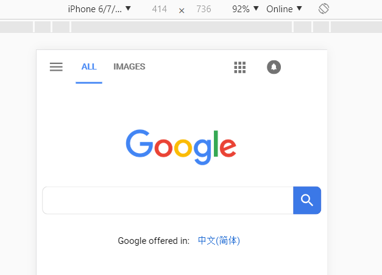

移动端的适配总是件比较麻烦的事情, 这里整理下以前的知识点备忘.

我们总是可以看见这样的



或者这样


又或者有人告诉你 iPhone7 Plus 上的视口宽度为 980px. 所以这里的 414x736, 1920x1080, 980 都是指什么呢? 在很多人眼中, 它们都叫像素. 

#### 基本概念

##### 绝对长度单位

通常来说, 是我们的物理单位, 即 cm, mm, in 等, 另外 pt, pc 也是绝对长度单位, 在印刷排版中比较常用. 绝对长度单位的特点是, 它们的长度看起来都是固定的, 即 1cm 在 A 手机上看起来是这么长, 1cm 在 B 手机上看起来也是一样长.


##### 相对长度单位

通常来说是一个逻辑单位, 比如 CSS 像素, em, rem 等, 它们的特点是长度不固定, 即 1 个 CSS 像素在 A 手机上看起来可能是 1mm, 在 B 手机上看起来可能是 2mm.


##### 物理像素

物理像素即我们前面图中 IP7+ 的屏幕分辨率的单位了, 即 1920x1080 个物理像素. 一个屏幕的物理像素个数在液晶面板出厂时就确定了, 之所以叫物理, 也就是不会因为我们的代码而改变了. 不过虽然它叫做物理像素, 但是它的大小也不一定固定, 即有可能 A 厂的液晶面板一个物理像素是 1mm, 而 B 厂的液晶面板一个物理像素是 2mm(不然为什么会有同样大小一块屏却不同分辨率呢...).


##### CSS 像素

这是我们最常用, 也最关心的一个单位, 因为我们的布局排版都依赖于它. 同样, 它的大小也是不固定的, 即一个 CSS 像素在 A 手机上可能是 1mm, 在 B 手机上可能是 2mm, 并且它还受到用户缩放的影响, 即原本 1 CSS 像素是 1mm, 在放大了 2 倍以后, 1 CSS 像素变成了 2mm. 本文中之后出现的 px 单位, 都特指浏览器中的 CSS 像素.


##### 设备像素

其实很多文章里都把物理像素也叫做设备像素, 不过个人觉得这里还是区分一下, 具体原因后文再说. 所以本文中的设备像素可能和其他文章中的设备像素不一样. 并且, 它的大小也不固定.


##### dp, dip

Density Independent Pixels, 设备无关像素, 也有很多文章把它叫做设备像素, 不过本文中设备像素有其他含义, 所以本文中 dp 特指 Android 开发中的单位. 它的大小是固定的, 即 1dp 在不同 Android 机上看起来长度都一样(应该说基本上一样), 如果 1dp 在高分屏上是 1cm, 那它在低分屏上看起来也会是 1cm. 尽管它是一个相对长度单位, 但它某种意义上说也是一个物理单位.


##### sp

Android 开发中用来设置文字大小的单位, 在本文中不是很重要.


##### 屏幕像素密度

即对角线上的物理像素个数 / 屏幕尺寸 = 对角线上物理像素个数 / 屏幕对角线长度, 即 ppi. 而 dpi 这个词和 ppi 是一样的, Android 习惯叫 dpi, iOS 习惯叫 ppi, 知道是一样的就行. 后文统一用 dpi.


##### ldpi, mdpi, hdpi, xdpi, xxdpi

Google 官方的区分标准, 如下表

| 名称    | 像素密度范围      |
| ------- | ----------------- |
| ldpi    | < 120 dpi         |
| mdpi    | 120 dpi - 160 dpi |
| hdpi    | 160 dpi - 240 dpi |
| xhdp    | 240 dpi - 320 dpi |
| xxhdpi  | 320 dpi - 480 dpi |
| xxxhdpi | 480 dpi - 640 dpi |

Andriod 中, 以 160dpi为基准, 1dp = 1物理像素，如果是 320dpi 的屏幕, 则 1dp = 2物理像素, 以此类推.


#### 可见视口和布局视口

这个概念比较简单, 很多文章已经写得够多了, 所以这里只盗一幅图来说明好了.


左边的整个页面我们叫布局视口, 右边的屏幕窗口我们叫可见视口.

但是!!! 和很多文章不一样的是, 本文中对布局视口的定义可能并不一样. 首先我们先确定一下, 布局视口是整个页面的大小吗? 个人觉得并不是, 那么问题来了, 你说布局视口不是整个页面, 但明显也不是屏幕窗口, 那它是什么? 个人更愿意定义 `<meta name="viewport">` 定义的区域. 具体原因后文说明, 故后文提到的布局视口均是以该定义为准.

另外, 很多文章也提到了 PPK 的三个视口理论, 即还存在一个理想视口或者完美视口, 个人觉得这个不是很有必要, 有兴趣的可以参考相关资料.


#### 一些历史

在最早的 iPhone 诞生的时候, 手机宽度只有 320 个物理像素, 并且 CSS 像素和物理像素是 1:1 的, 即一个 CSS 像素对应一个物理像素, 然而那时候也并没有多少专门为移动端适配的页面, 而 PC 端的页面都是为 PC 适配的, 意味着宽度通常在 1000 个 CSS 像素左右. 水果觉得这不行啊, 现有的网站在 PC 上都好好的, 到我手机上就崩掉了. 那怎么办呢? 于是水果搞出一个布局视口, 默认是 980 个 CSS 像素, 这样大部分网站在手机上也能全部正常显示出来.

不过这还是有问题, 屏幕只有 320 个物理像素, 并且物理像素和 CSS 像素是 1:1 的, 那就意味着 980 个 CSS 像素的布局视口在手机上会出现滚动条. 另一方面是, 随着 iPhone 的更新, 屏幕变成了 640 个物理像素宽, 而之前也有越来越多网站适配了 320 CSS 像素(也是物理像素)宽度的屏幕, 如果物理像素和 CSS 像素还是按照 1:1 的话, 那意味着那些之前适配过 320 的网站都要崩掉. 水果觉得这还是不行, 又有了设备像素, 这样, 设备像素和 CSS 像素还是 1:1 的, 整个 640 物理像素的屏幕的可见视口在设备像素层面看来还是 320 个设备像素, 也是 320 个 CSS 像素, 过去适配过的网站也不会因此崩掉.

这样就完美了吗? 当然不是, 对于那些专门为移动端适配过的网站来说, 他们当然也希望能够利用好更高分辨率的屏幕, 如果可见视口只有 320 个 CSS 像素的宽度, 这意味着物理像素和设备像素的比例为 2:1, 物理像素和 CSS 像素的比例也是 2:1, 即一个 CSS 像素宽度对应两个物理像素宽度, 也意味着很多地方都不能设计得更加精细, 明明有这么多物理像素, 你却不给我用, 那这屏幕分辨率变高了有什么意义? 所以水果还替我们设计了 `<meta name="viewport">`, 关于这个的用途, 后文也会有详细讨论.

OK, 到这里我们明确了什么是设备像素, 或者说为什么本文中要给出这么一个定义. 回到文章最开始, 我们看到 IP7+ 的物理像素是 1920x1080, 而 Chrome Devtools 给出的却是 414x736, 这里的 414 即设备像素而不是物理像素. 我们可以通过 `screen.width` 来获取屏幕在设备像素层面的宽度.


#### 几个单位之间的关系

有了以上的基本概念, 我们可以得到下面的关系:

屏幕(物理尺寸, 比如 8cm 宽) - (按照某种比例等分为)物理像素 - (按照某个比例系数映射为)设备像素 - (按照某个比例系数映射为)CSS像素

另一个关系是:

屏幕(物理尺寸, 比如 8cm 宽) - (按照某种比例等分为)物理像素 - (按照某个比例系数映射为)dp

以上这些关系都不考虑用户缩放. 作为前端开发, 我们关心的是第一条关系, 后面的留给移动端的开发去关心. 这里面需要注意的是, 物理像素的大小是不确定的(即屏幕等分为物理像素的比例是不一样的), 物理像素到设备像素的比例也是不确定的, 设备像素到 CSS 像素的比例也是不确定的, 所以一个 CSS 像素对应到物理像素的比例是不确定的, 一个 CSS 像素的大小也是不确定的.

而另一边的 dp, 尽管屏幕划分物理像素的比例不确定, 但是系统将物理像素和 dp 的比例补回来了, 所以确保了 dp 的物理长度是固定的(基本上固定).

为什么 CSS 像素不这样做, 也让它大小固定下来? 我也不知道...可能是系统通常是厂商定制的, 厂商知道屏幕的参数吧, 而 CSS 像素只能靠浏览器调整比例, 浏览器和屏幕之间还隔着一个系统.

可以看出, CSS 像素和 dp 其实都是设备无关的单位, 只不过 dp 会保证物理尺寸一样, 而 CSS 像素不能保证这一点. 另外用户缩放和 `<meta name="viewport">` 也会影响 CSS 像素和物理像素的比例, 所以最终, 一个 CSS 像素的物理长度是受物理像素的大小, 物理像素和设备像素的比例, 设备像素和 CSS 像素的比例, 用户缩放, `<meta>` 等几个方面因素共同影响的.

其实我个人喜欢把这些单位划分为物理大小固定和不固定两类, 因为它们的物理大小是否固定决定了我们之后会遇到什么样的问题. 所以根据这样的划分, 我们知道, 物理像素大小不固定, 设备像素大小不固定(由物理像素导致), CSS 像素大小不固定(由设备像素和用户缩放导致), dp/sp 相对固定, 不过这两个我们不是很关心.


#### devicePixelRatio, dpr

`devicePixelRatio` 是 `window` 的一个属性, 即 `window.devicePixelRatio`, 这是一个比例系数, 很多文章都说它是水平方向物理像素总数 / 水平方向 CSS 像素总数, 即 `devicePixelRatio` = 水平方向物理像素总数 / 水平方向 CSS 像素总数, 比如, `devicePixelRatio` 为 2, 则意味着一个 CSS 像素对应两个物理像素, MDN 也是这么说. 不过个人觉得它应该是水平方向物理像素总数 / 水平方向设备像素总数, 即 `devicePixelRatio` = 水平方向物理像素总数 / 水平方向设备像素总数.

为什么这么说? 因为如果是 CSS 像素, 则整个逻辑就不自洽了. 因为在某些 Android 机上, 标准模式且没有设置任何 `<meta name="viewport">` 的情况下, 不出现横向滚动条(意味着可见视口和布局视口都刚好是整个屏幕), `devicePixelRatio` 为 3, `screen.width` 为 360 个设备像素, `document.documentElement.clientWidth` 为 980 个 CSS 像素, 而它的实际物理像素宽度只有 1080, 这意味着如果 `devicePixelRatio` 是物理像素和 CSS 像素之比的话, 那手机的屏幕宽度就有 2940 个物理像素了, 然而这屌丝机怎么可能有这么高清的屏幕(没错, 就是笔者自己的手机...). 而如果是设备像素, 这就很合理了, `screen.width` * `devicePixelRatio` = 1080, 刚好是屏幕物理像素宽度.

当然, 有人会说, 我这里测了, 它就是物理像素和 CSS 像素之比啊. 事实上, **对于大部分手机, `devicePixelRatio` 应该都是物理像素和 CSS 像素之比**, 但是这只能说明设备像素和 CSS 像素刚好是 1:1 的, 那意味着物理像素和 CSS 像素之间相当于不存在设备像素这一概念, 这样的话, `screen.width` 的单位也可以解释为 CSS 像素. 但个人还是倾向于再引入设备像素这一概念来应对一些特殊情况, 毕竟在这一概念下, 原有的理论也能够解释得通, 而如果不引入设备像素, 则一些特殊情况无法解释. 补充一下, iPhone 的设备像素和 CSS 像素都是 1:1 的.

还有一些原因是**移动端 `devicePixelRatio` 是固定不变的, 即它不会随着用户缩放而改变, 也不受 `<meta name="viewport" content="initial-scale=2">` 这样的缩放影响.** 比如, 一个原本 50x50(CSS 像素) 的 `<div>`, 在放大 1 倍以后看上去像是 100x100, 但是我们获取它的 `offsetWidth` 等可以发现, 它的 CSS 像素还是 50x50, 如果原本 `devicePixelRatio` 为 2 的话, 那么放大之后一个 CSS 像素应该对应 4 个物理像素, 则 `devicePixelRatio` 会变成 4, 然而其实并不会. 所以**在移动端, `screen.width` * `devicePixelRatio` 总是是屏幕的物理像素宽度**, 而如果 `devicePixelRatio` 是物理像素和 CSS 像素之比的话, 在缩放的情况下, 可能出现某个元素看上去刚好一屏宽, 但它的 `offsetWidth` * `devicePixelRatio` 却不是屏幕的物理像素宽度.

而**在 PC 上, `devicePixelRatio` 会受到用户缩放和系统缩放的影响**, 而 `screen.width` 的单位还是设备像素, 当然也可以说是 CSS 像素, 因为 PC 上设备像素和 CSS 像素之比是 1:1. 比如一个 1920 物理像素宽的屏幕, 在 win10 下, 由于有 1.25 的系统缩放, 所以 `devicePixelRatio` 是 1.25, 而 `screen.width` 是 1536, 所以屏幕的物理像素宽度是 1536 * 1.25 = 1920. 而如果存在用户缩放, 则 `devicePixelRatio` 会跟着改变, 而 `screen.width` 不会改变, 所以 PC 端存在用户缩放时, 我们没法计算屏幕的物理像素宽度了.

总结一下就是以下几点:

* `devicePixelRatio` = 水平方向物理像素总数 / 水平方向设备像素总数
* 对于大部分手机, `devicePixelRatio` 应该都是物理像素和 CSS 像素之比, 此时可以理解为设备像素 : CSS 像素 = 1:1
* iPhone 的设备像素和 CSS 像素之比总是 1:1, 所以也可以认为其实不存在设备像素这一概念
* 移动端 `devicePixelRatio` 是固定不变的, 即它不会随着用户缩放而改变, 也不受 `<meta name="viewport" content="initial-scale=2">` 这样的缩放影响
* PC 端, `devicePixelRatio` 会受到用户缩放和系统缩放(win10 高分屏的 1.25 倍)的影响
* `screen.width` 的单位是设备像素, 如果设备像素: CSS 像素 = 1:1, 那也可以认为单位是 CSS 像素, 移动端它的值总是固定的, 不会随着各种缩放改变, PC端它受系统缩放影响
* PC 端设备像素和 CSS 像素之比为 1:1
* 在没有用户缩放和 `viewport` 缩放的情况下, 移动端和 PC 端的屏幕物理像素宽度 = `screen.width` * `devicePixelRatio`, 在有用户缩放的情况下, 移动端屏幕物理像素宽度 = `screen.width` * `devicePixelRatio`, PC 端无法计算

##### dpr 和 dpi 什么关系

雷锋和雷峰塔的关系...并没有什么卵关系, 假设存在一个设备 A, 它的一个物理像素的尺寸是 0.1mm, dpi 是 320, 另一个设备 B 的物理像素尺寸是 0.2mm, dpi 是 160, 那么它们的屏幕尺寸是一样的, 如果他们的 dpr 都等于 1(假设设备像素和 CSS 像素之比为 1:1), 那一个 100 CSS 像素的元素, 前者是 0.1mm x 1 x 100 的宽度, 后者是 0.2mm x 1 x 100 的宽度, 它们的物理大小不一样, 而如果前者 dpr 是 2, 后者 dpr 是 1, 那就看起来又一样了. 最终, **一个元素在不同设备上的物理大小是否一样是由物理像素的大小, dpr, 设备像素和 CSS 像素的比例, 以及 CSS 像素的个数这几个因素共同决定的**.


#### meta -- viewport

我们总是会见到移动端页面会有这样的 `<meta>`.

```html
<meta name="viewport" content="width=device-width, initial-scale=1">
```

简单来说, 这是设置了 `viewport`(废话). 本文不会介绍 `<meta>` 的细节, 有兴趣的可以参考其他资料或[meta的作用](../html/meta的作用.md). 那么什么是 `viewport`?

前面我们已经提到布局视口了, 并且说布局视口不是整个页面. 我们也知道可见视口就是屏幕的大小, 那布局视口不是整个页面, 又不是屏幕大小的区域, 那是什么? 我们可以把布局视口想象成一个画布, 页面是在这个画布上渲染的, 但是页面也可以溢出这个画布. 而 `<meta name="viewport">` 就是用来调整这个画布大小的, 单位是 CSS 像素.

我们也可以换个角度来理解, 类比 PC. PC 上, 我们有屏幕, 屏幕大小是固定的, 不能调整. 屏幕上有一个浏览器窗口, 我们可以调整浏览器窗口的大小, 也就是调整了可见视口的大小, 页面的大小可以超出可见视口. 而移动端, 我们有屏幕, 同样屏幕大小是固定的, 不能调整. 但是可见视口的大小也没法调整, 因为移动端浏览器通常都无法随意调整窗口大小. 虽然我们不能调整可见视口的大小, 但是我们有了布局视口, 我们也可以通过 `<meta name="viewport">` 调整布局视口的大小, 就像是调整 PC 端的浏览器窗口(可见视口)那样, 而页面也可以溢出布局视口, 就像页面可以溢出 PC 端的可见视口一样.

在 PC 端, 我们通过下面的方法获取可见视口的大小(不包含滚动条, 不考虑用户缩放).

```javascript
function getViewportSizeWidthWithoutBar() {
	var doc = document.documentElement,
			body = document.body;
	return document.compatMode === 'CSS1Compat' ? {
		width: doc.clientWidth,
		height: doc.clientHeight
	} : {
		width: body.clientWidth,
		height: body.clientHeight
	};
}
```

而这个方法在移动端, 则是获取 `viewport` 的大小, 即布局视口的大小, CSS 像素单位.


这里简单介绍几个比较常用的 `viewport` 字段.

##### width

一个正整数, 或者字符串 `device-width` 用来设置布局视口的宽度, 或者说设置布局视口的宽度刚好是多少个 CSS 像素, 即

```html
<meta name="viewport" content="width=device-width">
<meta name="viewport" content="width=500">
```

即我们可以设置布局视口宽度为 500 CSS 像素, 整个布局视口水平方向被分成 500 份, 每份一个像素宽. 也可以设置布局视口大小为设备宽度. 那什么是设备宽度? 设备宽度即屏幕在设备像素层面的宽度, 也即屏幕宽度的设备像素总数. 所以设置 `viewport` 为 `device-width` 其实就是设置了布局视口宽度的 CSS 像素总数和屏幕宽度的设备像素总数之比为 1:1. 比如屏幕宽度以设备像素为单位的话是 360 个设备像素, 那设置了 `width=device-width` 后就意味着布局视口的宽度以 CSS 像素为单位的话是 360 个 CSS 像素, 即一个 CSS 像素对应一个设备像素. 但是需要注意的是, 一个 CSS 像素对应一个设备像素并不意味着一个 CSS 像素的大小就等于一个设备像素的大小, 因为布局视口并不是固定的, 而是可以超出屏幕的, 所以即使布局视口的宽度的 CSS 像素总数等于屏幕宽度的设备像素总数, 也不意味着布局视口就刚好是一屏的大小.

然而当我们设置了 `width=device-width` 时, 我们会发现布局视口刚好是一屏的大小, 没有横向滚动条. 所以这里我们发现这个 `width` 有两个作用, 一个作用是设置布局视口宽度的 CSS 像素总数, 这种时候布局视口的大小可能超出可见视口, 也可能不超出可见视口.

比如如果设备像素大小和 CSS 像素大小为 1:1, 原本 `screen.width` 为 360 个设备像素宽, 而我们设置了 `viewport` 为 500 CSS 像素, 则布局视口大于可见视口, 会出现横向滚动条. 而当设备像素大小和 CSS 像素大小为 1:2 时, 那布局视口小于可见视口, 不会出现横向滚动条. 注意前面我们提到了很多次比例, 没有特别强调是总数比还是大小比, 像 `devicePixelRatio` 是一个总数比, 刚刚我们说的是大小比, 注意区分.

而另一个作用, 当 `width=device-width` 时, 隐式地确定了设备像素大小和 CSS 像素大小的比例系数为 1:1. 我们之前说了, 即使布局视口的宽度的 CSS 像素总数等于屏幕宽度的设备像素总数, 也不意味着布局视口就刚好是一屏的大小, 但是当 `width=device-width` 时, 布局视口刚好是一屏大小, 意味着不仅仅布局视口的宽度的 CSS 像素总数和屏幕宽度的设备像素总数之比为 1:1, 而 CSS 像素的大小和设备像素的大小之比也为 1:1.


##### initial-scale

顾名思义, 它是一个缩放比例, 但是是什么相对于什么缩放的比例? 答案是 CSS 像素大小与设备像素大小的比例. 即假如原本设备像素大小和 CSS 像素大小之比为 1:1, 下面这个 `<meta>` 会使得这个比例变为 1:2, 即一个 CSS 像素会是两个设备像素的宽度, 并且出现横向滚动条.

```html
<meta name="viewport" content="initial-scale=2.0">
```

而反过来, 利用布局视口的宽度和屏幕的设备像素宽度 `screen.width`, 我们也可以求出这个比例.

```javascript
screen.width / getViewportSizeWidthWithoutBar().width // 2
```

其实我们会发现, 上面这个只是计算了屏幕宽度的设备像素总数和布局视口宽度的 CSS 像素总数之比, 而不是 CSS 像素的大小和设备像素的大小之比, 那为什么它刚好是 2? 我们再看看如果是这样.

```html
<meta name="viewport" content="initial-scale=3.0">
```

会发现上面的方式计算结果也是 3, 是巧合? 当然不是. 其实这里也隐藏了一件事情, 那就是如果只设置了 `initial-scale` 的话, 它会根据相反的比例确定布局视口宽度的 CSS 总数, 即假如屏幕宽度为 360 个设备像素, 如果只设置了 `initial-scale=1.0` 没有设置 `width` 的话, 那布局视口的宽度的 CSS 像素总数和屏幕宽度的设备像素总数之比为 1:1, 即布局视口刚好是 360 个 CSS 像素, 并且 CSS 像素的大小和设备像素大小也为 1:1, 所以布局视口刚好一屏. 而如果只设置 `initial-scale=2.0` 没有设置 `width` 的话, 则布局视口宽度为 180 CSS 像素, 而 CSS 像素大小和设备像素大小之比为 2: 1.

所以 `width=device-width` 和 `initial-scale=1.0` 都能设置布局视口宽度刚好为一屏, 但是它们的原理其实是不一样的. 而没有设置 `width` 和 `initial-scale` 的默认情况下, `viewport` 宽度是 980 CSS 像素, 但 CSS 像素的大小和设备像素大小之比我们却无法计算.

再来看几个例子, 考虑一个屏幕宽度为 360 设备像素的机器.

```html
<meta name="viewport" content="width=device-width, initial-scale=2.0">
```

上面这个会导致 `viewport` 的宽度为 360 CSS 像素, 但是屏幕出现滚动条, 并且刚好是两屏宽度, 因为 CSS 像素总数和设备像素总数是一样的, 而一个 CSS 像素的大小是一个设备像素的两倍大.

```html
<meta name="viewport" content="width=180, initial-scale=2.0">
```

而如果我们设置 `viewport` 宽度刚好为设备像素总数的一半即 180 个 CSS 像素, 则尽管一个 CSS 像素是设备像素大小的 2 倍, 但是因为 CSS 像素总数少了一半, 所以布局视口还是刚好一屏.


##### user-scalable

这个比较简单, 即是否允许用户缩放页面, 两个值 `yes` `no`

```html
<meta name="viewport" content="user-scalable=no">
```


OK, 到这里, 我们还发现一个事情, 那就是 `width` 可以用来设置设备像素和 CSS 像素的比例, `initail-scale` 也能用来设置这个比例, 在特定情况下, 它们的作用是等价的.

```html
<meta name="viewport" content="width=device-width, initial-scale=2.0">
```

事实上, 这也是我们为了兼容浏览器时, 最常用的 `viewport` 设置了, 两个都写上, 就不会有什么问题.


##### shrink-to-fit

本来到这里, 关于 `viewport` 的话题就应该结束了, 不过后来某天我在看 Google 的页面时, 发现他的 `viewport` 出现了一个这个属性, 这是干什么用的呢? 据说是 iOS9 修改了 `initial-scale` 的用途, 如果希望 `initial-scale` 还是像以前一样, 就需要设置 `shrink-to-fit=no`, 但是因为我手里没有 iOS9 的机器, 所以并不能测出个具体来, 而新的 iOS 上, 似乎有没有它都一样, 可能是后来又改回去了吧. 所以总的来说, 如果我们希望设置一个刚好占满整个屏幕, 并且 CSS 像素和设备像素是 1:1 的布局视口的话, 则需要以下 `<meta>`

```html
<meta name="viewport" content="width=device-width, initial-scale=1, shrink-to-fit=no">
```

而 `user-scalable=no` 不是必需的, 根据情况决定是否需要. 另外, `viewport` 也可以通过动态添加 `<meta>` 来进行设置, 这也给了我们通过 js 计算来动态设置 `viewport` 的能力.


##### 为什么说布局视口/`viewport` 不是整个页面?

前面我们已经说过, 不要把布局视口/`viewport` 当作是整个页面的大小, 为什么呢? 考虑下面的例子.

```html
<!DOCTYPE html>
<html lang="en">
<head>
	<meta charset="UTF-8">
	<meta name="viewport" content="width=device-width, initial-scale=1.0">
	<meta http-equiv="X-UA-Compatible" content="ie=edge">
	<title>Document</title>
	<style>
		body {
			margin: 0;
			padding: 0;
		}
		.test {
			width: 2000px;
			height: 100px;
			background: red;
		}
	</style>
</head>
<body>
	<div class="test"></div>
</body>
</html>
```

毫无疑问, `viewport` 的宽度是无论如何也不会到 2000px 的, 并且它刚好是一整屏宽, 我们可以通过 `getViewportSizeWidthWithoutBar()` 验证这一点, 然而事实上是还是会出现滚动条, 因为页面超出了布局视口/`viewport`, 所以布局视口并不是整个页面, 页面是可以比布局视口更大的.


#### 我们关心的是什么

##### 屏幕在 CSS 像素层面的宽度

毫无疑问, 我们其实只关心 CSS 像素这一层面的东西, 毕竟我们的布局排版都依赖于它. 而我们期望的是什么呢? 当然是**想要知道整个屏幕在不出现横向滚动条的情况下, 屏幕的宽度是多少个 CSS 像素**. 所以本文都会围绕着这一目标来讨论, 这是我们最关心的东西, 就像一个画家在作画前需要知道他有多大的纸可用. 至于一个屏幕到底有多少物理像素宽, 或是有多少设备像素宽(当然, 它会和我们关心的东西有那么些关系).


##### CSS 像素的问题

在 CSS 中使用 px 的时候, PC 端不会有什么问题, 因为 PC 端屏幕尺寸就这么几种, 并且物理像素 - 设备像素 - CSS 像素基本上是 1:1:1 的(为什么说基本上?). 虽然现在又高分屏, 但是像 win10 也会帮你把内容缩放(还记得它总是会在询问你是否要缩放为 125% 吗?), 本质上就像 dp 做的那样, 系统帮你把原本一个物理像素大的内容放大到了 1.25 个物理像素大小, 或者说物理像素大小 : 设备像素大小 : CSS 像素大小 = 1:1.25:1.25, 即一个设备像素/CSS 像素相对于 1.25 个物理像素的大小. 即原本低分屏上 10 个物理像素有 1cm, 现在高分屏一个物理像素是 0.08cm, 10 个物理像素只有 0.8cm, 但是好在系统帮你缩放了, 于是你一个 CSS 像素是 0.1cm, 10 个 CSS 像素还是 1cm, 这样你的页面在高分屏和低分屏上**看起来物理尺寸都差不多**, 而那些没被缩放的引用, 在 win10 高分屏上看起来就很操蛋了.

然而上面说的是 win10, 在移动端, 系统不会帮你把 CSS 像素做缩放的. 那就会出现这样的问题, 比如你在同尺寸不同 dpi 的设备上, 一个是 160dpi 的设备, 一个是 320dpi 的设备, 设置一个宽 100 CSS 像素的元素, 前者看上去宽度只有后者一半, 屏幕尺寸一样, 然而看上去却相差一倍, 这意味着什么不用多说. 所以**有时候我们希望一个元素在不同设备上看起来物理尺寸尽可能一样大**.


##### 物理尺寸一样大的问题

如果一个元素的物理尺寸在不同设备上看起来一样大, 这样就完美吗? 让我们考虑一下, 假如 A, B 两个设备, A 屏幕宽 5cm, B 屏幕宽 6cm, 一个元素在 A, B 上显示都是 1cm, 那意味着它在 A 屏幕上的比例是 1/5, 在 B 屏幕上的比例是 1/6, 假如 5 个这样的元素刚好在 A 上排满, 那意味着在 B 上的**比例看起来不一样**, 就会留出空白, 那这空白要怎么处理呢? 所以**有时候我们又希望一个元素在不同设备上占的比例尽可能一样**.


##### 比例一样的问题

假如我们有什么黑魔法, 能够使得一个元素在不同设备上占据的比例一样了, 这又是我们想要的吗? 让我们再考虑一下, 一个元素在 iPhone4 的 3.5 英寸屏幕上占了 1/3 的宽度, 那它的物理尺寸大约是 1.2cm 宽, 而这个在 iPhone X 上也占了 1/3 的宽度, 那它的物理尺寸大约是 2cm 宽, 后者上面这个元素大约是前者的 2 倍, 如果这是个文字呢? 所以我们拿着一个 iPhone X 像是拿着一个老人机? 哦, 天呐(瓦莉拉语). 所以我们还是希望它们的物理尺寸尽可能一样, 或者 iPhone X 上可以允许它大一点, 但不要大太多, 剩下的空间可用放些其他东西. 即在小的屏幕上放下较少的内容, 在大的屏幕上放下较多的内容, 而不仅仅是简单地缩放内容. 比如我们在小屏幕上水平方向上能够放下 4 个 1.5cm 的块, 在大屏幕上如果还是放 4 个块的话, 那每个块可能变成 2cm, 就很丑了, 也很浪费, 而如果大屏幕上能够放下 5 个 1.5cm 的块, 则是再好不过了. 于是又回到了原点.


总结:

* 不论什么时候, 我们都希望确定多少个 CSS 像素刚好是一屏的宽度
* 有时候, 我们希望一个单位或一个元素就能在不同设备上显示的物理尺寸尽可能一样, 就像 dp 那样
* 有时候, 我们又希望一个单位或一个元素在不同设备上所占的比例尽可能一样
* 有时候, 我们还希望能够在较小屏幕上放下较少内容, 在较大屏幕上放下较多内容, 而不是简单地对内容进行缩放, 当然我们也能够接受它们的物理尺寸不一样, 但是不要相差太大

这些问题都是移动端适配所关心的问题, 当然这篇文章不会具体地讲怎么做移动端适配, 其实到这里差不多该结束了, 不过对于一些简单问题还是可以解决的.


#### 我们能够获取到什么

OK, 从前面的内容中, 我们已经知道可以获取到很多有用的信息了. 以下仅限于移动端.

##### 获取屏幕设备像素层面的宽度

```javascript
screen.width
```


##### 获取屏幕物理像素层面的宽度

```javascript
screen.width * devicePixelRatio
```


##### 获取布局视口/`viewport` 的 CSS 像素层面的大小

```javascript
function getViewportSizeWidthWithoutBar() {
	return document.compatMode === 'CSS1Compat' ? {
		width: document.documentElement.clientWidth,
		height: document.documentElement.clientHeight
	} : {
		width: document.body.clientWidth,
		height: document.body.clientHeight
	};
}
```


##### 在没有设置 `width` 时, 计算 CSS 像素大小和设备像素大小比例

```javascript
screen.width / getViewportSizeWidthWithoutBar().width
```


##### 设置一个刚好占满整个屏幕, 并且 CSS 像素和设备像素是 1:1 的布局视口

```html
<meta name="viewport" content="width=device-width, initial-scale=1, shrink-to-fit=no">
```


好了, 现在有了这些能力, 我们再来看看前面的问题. 第一个问题是, 怎么获取屏幕在 CSS 像素层面的宽度?

有人会说, 那让我们把 `viewport` 固定下来就好了, 比如我们设置 `viewport` 为 500 个 CSS 像素, 那我们就能够知道布局视口总宽度是 500 CSS 像素了, 并且一个 CSS 像素宽度总是布局视口的 1/500. 然而布局视口是屏幕吗? 并不是, 所以假如我们固定了 `viewport` 宽度, 那意味着可能会出现横向滚动条, 这显然不是我们所期望的.

那再让我们设置 `viewport` 的宽度为 `width=device-width` 好了, 这样布局视口就刚好是整个屏幕的宽度了, 可是现在你知道 `device-width` 是多少吗? 你只能在 js 运行时才能够知道, 而 js 的运行, 已经是发生在用户端的事情了, 在开发阶段我们并没有办法知道刚好一屏的 CSS 像素是多少个, 也就没办法决定我们的元素该占据多少 CSS 像素. 并且一个 100 CSS 像素的元素, 在 `device-width` 为 300 CSS 像素时占据 1/3 宽度, 在 `device-width` 为 400 CSS 像素时, 元素占据 1/4 宽度, 这有悖于我们期望比例一样. 注意, 比例不一样并不意味着物理尺寸就一样, 也完全有可能物理尺寸不一样, 比例也不一样, 这两者之间既不是充分条件也不是必要条件.

注意前面始终强调了两点, 看上去实际长度(物理尺寸)一样和看上去比例一样. 注意这两个的区别, 像 dp 是使得看上去的实际长度一样了, 而固定 `viewport` 是使得 CSS 像素在布局视口的比例一样, 比例一样不代表实际长度一样, 比如一个 4 英寸屏幕的 1/3 和一个 5 英寸屏幕的 1/3 显然物理尺寸不可能一样.

所以, **定死了 `viewport` 的值的话, 则在不同设备上 CSS 像素占据布局视口的比例都是一致的, 也就意味着我们的元素占据布局视口的比例是确定的. 但定死 `viewport` 会导致不同设备可能出现横向滚动条. 如果不定死 `viewport` 而是用 `device-width`, 则不会出现横向滚动条, 但是不能保证在不同设备上 CSS 像素占布局视口的比例一致了**.


##### 什么时候我们需要关心 dpi, 什么时候需要关心 dpr, 什么时候需要关心 `viewport`?

如之前所说, dpi 和 dpr 没有什么必然联系, 所以我们基本不需要关系 dpi. 而 `viewport` 确定了的话, 则元素用 CSS 像素布局占布局视口的比例也就确定了, 和 dpr 没什么关系了. 但比例一样也有些问题, 就是对于很大的屏幕和很小的屏幕, 它们呈现内容的比例都一样, 但元素的物理尺寸却不一样, 这就导致大屏不能发挥优势显示更多内容, 而且可能元素过大也不好看. 这种时候我们希望大屏展现更多内容而不是按小屏的比例放大内容, 所以实际上我们这时候需要的是元素的尺寸一样(或者至少不是按比例缩放而是稍稍放大一点), 这种时候就需要 dpr 了.

**结论: 当我们关心比例是否一样的时候, 我们需要关心 viewport. 当我们需要关心物理尺寸是否一样的时候, 我们需要关心 dpr, 而 dpi 大部分时候我们都不需要关心.**


#### The end

最后, 我们还是没能解决之前提到的问题, 不过我们做出了一些尝试, 而这些尝试并非完全没有意义, 在之后的内容中, 它们或多或少会给我们带来一些启发或帮助. 而这些问题之间的矛盾, 有些是无法调和的, 最终我们需要根据场景做出一些取舍, 借助 js 也能够帮助我们更好地解决这些问题. 最后这些问题我们会留给下一篇更仔细地讨论, 毕竟这篇的主要内容是 `viewport`.

好了, 还是让我们在移动端页面上加上如下 `<meta>`, 把令人讨厌的横向滚动条给去掉吧.

```html
<meta name="viewport" content="width=device-width, initial-scale=1, shrink-to-fit=no">
```


#### 媒体查询

补充一下媒体查询的细节, 媒体查询中, `width` `height` `max-width` `max-height` `min-width` `min-height` 都是指的 `viewport` 的大小, 意味着它们中的 px 都是指 CSS 像素. 还有几个 `device-width` `device-height`, 不过这些已经废弃了, 所以我们也不用太关心它们.


#### Canvas

再补充一下, 由于不同设备的 dpr 可能不一样, 而 Canvas 如果设置的尺寸太小, 则在高分屏上显示会比较模糊, 如果 Canvas 尺寸太大, 又会占据更多内存, 带来性能开销. 所以最好是根据 dpr 动态设置 Canvas 的大小. 这里直接引用 MDN 的代码吧.

```javascript
var canvas = document.getElementById('canvas');
var ctx = canvas.getContext('2d');

// Set display size (css pixels).
var size = 200;
canvas.style.width = size + "px";
canvas.style.height = size + "px";

// Set actual size in memory (scaled to account for extra pixel density).
var scale = window.devicePixelRatio; // <--- Change to 1 on retina screens to see blurry canvas.
canvas.width = size * scale;
canvas.height = size * scale;

// Normalize coordinate system to use css pixels.
ctx.scale(scale, scale);

ctx.fillStyle = "#bada55";
ctx.fillRect(10, 10, 300, 300);
ctx.fillStyle = "#ffffff";
ctx.font = '18px Arial';
ctx.textAlign = 'center';
ctx.textBaseline = 'middle';

var x = size / 2;
var y = size / 2;

var textString = "I love MDN";
ctx.fillText(textString, x, y);
```


#### 参考资料

* https://www.quirksmode.org/mobile/viewports.html
* https://www.quirksmode.org/mobile/viewports2.html
* https://www.quirksmode.org/blog/archives/2012/06/devicepixelrati.html
* https://www.quirksmode.org/blog/archives/2012/07/more_about_devi.html
* https://developer.mozilla.org/en-US/docs/Web/API/Window/devicePixelRatio
* https://developer.mozilla.org/en-US/docs/Web/CSS/Media_Queries/Using_media_queries
* https://developer.mozilla.org/en-US/docs/Web/HTML/Element/meta
* https://stackoverflow.com/questions/33767533/what-does-the-shrink-to-fit-viewport-meta-attribute-do
* http://www.w3cplus.com/css/A-pixel-is-not-a-pixel-is-not-a-pixel.html
* https://www.cnblogs.com/2050/p/3877280.html
* https://segmentfault.com/a/1190000005047320
* http://tgideas.qq.com/webplat/info/news_version3/804/7104/7106/m5723/201509/376281.shtml
* http://colachan.com/post/3435
* https://github.com/jawil/blog/issues/21

