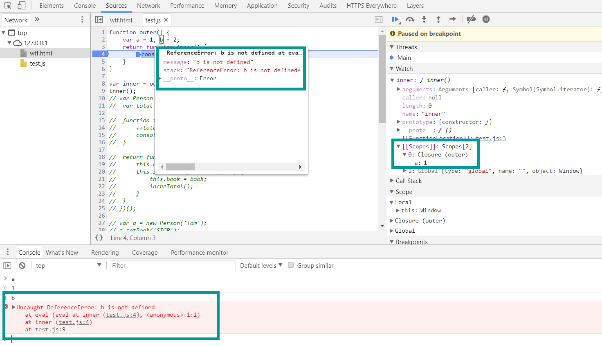
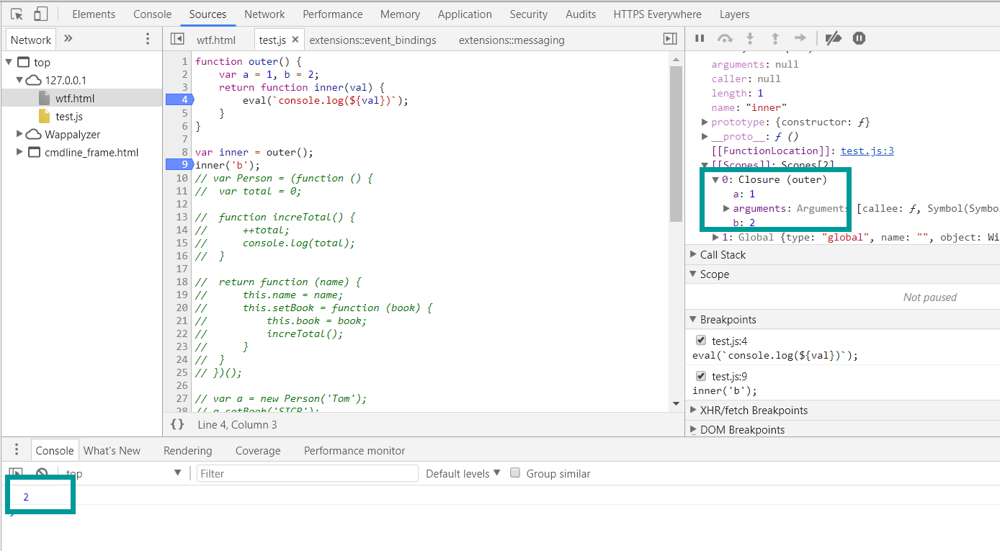
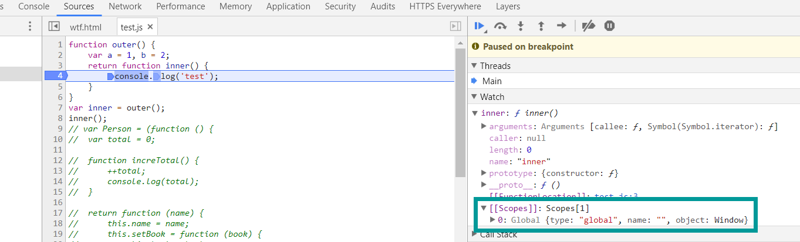
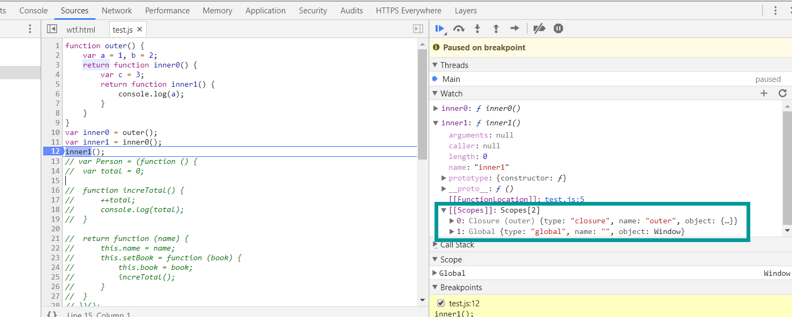
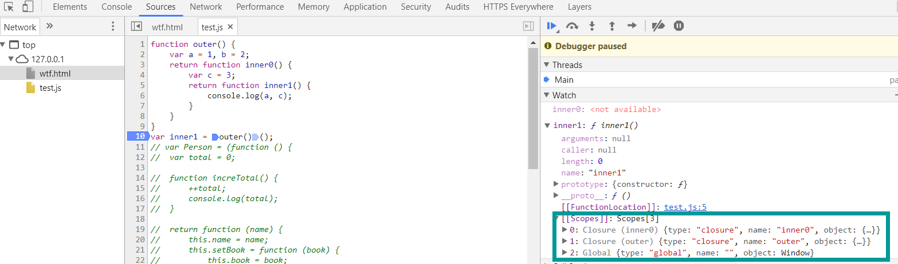
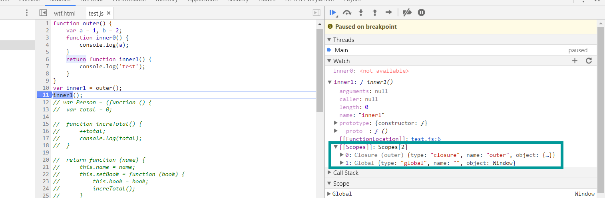
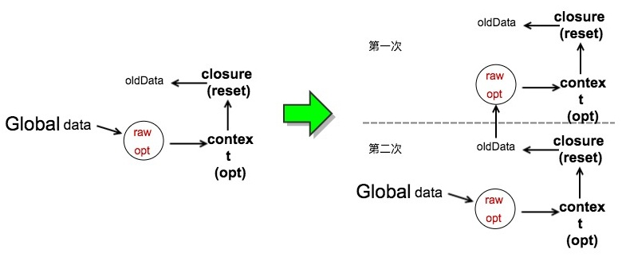

闭包并不是什么很难的东西, 也用了很久了, 不过还是有些细节需要说明.

首先, 什么是闭包? 有人会说闭包是一个函数, 也有人说闭包是一个匿名函数. 根据维基上的定义

> **闭包**（英语：Closure），又称**词法闭包**（Lexical Closure）或**函数闭包**（function closures），是引用了自由变量的函数。这个被引用的自由变量将和这个函数一同存在，即使已经离开了创造它的环境也不例外 

不过感觉中文的解释不是很好, 根据英文维基的解释, 一个闭包记录了一个函数和一个词法环境, 词法环境和这个函数的一个自由变量相关联. 从这个意义上讲, 闭包更像是一个函数和一个词法环境构成的二元组, 描述了一种关系.

而根据 @Belleve 和 @hax 大大的说法

> 不引用外部变量的 lambda 表达式是「封闭的」（Closed），那么把「开放的」表达式「封闭住」的东西，就是 Closure 了 

> 意思其实就是closed expression。即lambda表达式中本来open的bindings（即free variables）被close后的结果 

也比较好理解, 更符合 V8 中的对象关系. 我个人也更喜欢这样的解释, 即可以表述为函数 A 是函数 B 的一个闭包. 之后的内容也就统一采用这样的说法.


#### 创建闭包

在这之前, 我们先来看一个简单的例子.

```javascript
function outer() {
	var a = 1, b = 2;
	return function inner() {
		console.log(a);
	}
}

var inner = outer();
inner();
```

现在问 inner 中是否能够获取到 b 的值? 当然有人会说, 这有什么不能的, inner 中输出 b 看看不就行了. 当然, 这肯定是可以的, 不过现在我们从调试工具中看一看.



可以看到, 我们并不能拿到 b 的值, 闭包中也没有保存 b 的值. So, 其实我们的 inner 中只能拿到它引用的变量 a, 其余的未被引用的对象会被释放掉. 当然这里并不是很清楚是 V8 的优化措施还是规范要求, 所以也不用觉得所有环境下都是如此, 还是要考虑可能带来的内存问题. 另一方面是, 这里如果通过输出 b 来验证是否可以获取到 b, 那是没有意义的, 因为已经引用了 b, 观测本身即导致了引用, 所以只能通过调试工具.

当然我们还有另一种方式进行观测, `eval()`

```javascript
function outer() {
	var a = 1, b = 2;
	return function inner(val) {
		eval(`console.log(${val})`);
	}
}

var inner = outer();
inner('b');
```

现在 V8 不知道我们会引用哪个变量.



于是我们看到闭包中有了 b. 不过其实这也不能说明什么, 因为 `eval()` 是一个阻止 V8 优化的东西, 所以这个结果并不具有什么参考价值.

在前面这两个例子中, 我们都看到了, outer 是 inner 的一个闭包. 那么问题来了, 下面的例子中, outer 还会是 inner 的闭包吗?

```javascript
function outer() {
	var a = 1, b = 2;
	return function inner() {
		console.log('test');
	}
}
var inner = outer();
inner();
```

inner 中并没有任何的自由变量.



所以很显然, 这里 outer 并不是 inner 的闭包. 根据之前的定义其实也会发现这点, **引用了非全局的外部变量的函数会创建一个闭包**. 那没有引用非全局的外部变量的函数就不会创建闭包咯? 这个问题之后讨论.

再看一个例子.

```javascript
function outer() {
	var a = 1, b = 2;
	return function inner0() {
		var c = 3;
		return function inner1() {
			console.log(a);
		}
	}
}
var inner0 = outer();
var inner1 = inner0();
inner1();
```

现在 outer 是 inner1 的闭包吗? inner0 是 inner1 的闭包吗?



可以看到, outer 是 inner1 的闭包, 但 inner0 不是 inner1 的闭包, 因为 inner1 没有引用 inner0 中的变量. 所以也如同之前英文维基的定义, **一个函数和一个词法环境通过一个自由变量建立起了关系, 也就是我们的闭包**. inner0 和 inner1 并没有建立起这样的关系. 即**当一个函数 outer 内的变量被一个内部函数 inner 引用的时候, outer 就会是 inner 的闭包(注意是"就会是", 我可没说"才会是"), 不论内部函数嵌套多深**.

再看下面的例子.

```javascript
function outer() {
	var a = 1, b = 2;
	function inner() {
		console.log(a);
	}
	inner();
	return 'test';
}
outer();
```

这里 outer 是 inner 的闭包吗? 毫无疑问, 当然是. 那么这样呢?

```javascript
function outer() {
	var a = 1, b = 2;
	function inner() {
		console.log(a);
	}
	return 'test';
}
outer();
```

inner 并没有执行. outer 还是 inner 的闭包吗? 根据定义来说, 应该是的. 不过更准确地说, 应该是**一旦外部函数 outer 执行, 一个闭包就形成了, 而不需要内部函数 inner 执行才创建闭包**.

再来一个例子.

```javascript
function outer() {
	var a = 1, b = 2;
	return function inner0() {
		var c = 3;
		return function inner1() {
			console.log(a, c);
		}
	}
}
var inner1 = outer()();
```

inner1 创建了几个闭包?



当然是两个了. 因为 inner1 中有两个不同词法环境中的变量 a 和 c, 于是创建了两个闭包, 即**一个函数可以有多个闭包**.

现在我们再来解决一下之前的问题, 如果一个函数 inner 没有引用外部函数 outer 的变量, 就不会创建闭包了吗? 从更广义的定义来说, 并没有约束是否应当创建闭包. 而从之前的例子中.

```javascript
function outer() {
	var a = 1, b = 2;
	return function inner() {
		console.log('test');
	}
}
var inner = outer();
inner();
```

这里 outer 并不是 inner 的闭包, 那么我们是否可以说, 如果一个函数 inner 没有引用外部函数 outer 的变量, 就不会创建闭包? 按理来说应当是这样. 但是, 居然还是有但是.

```javascript
function outer() {
	var a = 1, b = 2;
	function inner0() {
		console.log(a);
	}
	return function inner1() {
		console.log('test');
	}
}
var inner1 = outer();
inner1();
```

毫无疑问, 这里 inner0 创建了一个闭包, 因为 inner0 引用了外部变量 a, 于是 outer 是 inner0 的闭包. 那么 inner1 呢? outer 是 inner1 的闭包吗? 根据之前的经验来说, outer 应该不是 inner1 的闭包, 毕竟 inner1 没有引用 outer 的变量. 然而.



outer 还是 inner 的闭包. WTF? 事实上, 如果我们注释掉 inner0, 那 outer 就不再是 inner1 的闭包了. 但是这要怎么解释呢?

> In V8, once there is any closure in the context, the context will be attached to every function 

可以这么理解, **在 V8 中, 一旦一个外部函数 outer 成为了某个内部函数的闭包, 则 outer 会成为所有内部函数的闭包**. 目前尚不清楚究竟是 V8 自己是这样实现的, 还是规范要求. 但是这值得我们注意, 因为它可能会带来一些问题.


#### 内存泄漏

这里引用一个例子.

```javascript
var data=null
function reset(){
    var oldData=data;//关联节点，指向上一次作用域的对象
    function idle(){
        console.log(oldData)//引用外部oldData生成闭包
    }
    //引用了全局变量，为函数上下文关联创造条件
    data={
        raw:new Array(1000000).join('!'),
        opt:function(x){
            console.log(x)//闭包共享，关联到oldData
        }
    }
}
setInterval(reset, 1000);
```

这段代码会造成内存泄漏, 有了前面的知识点, 原因也很好理解了. idle 和 reset 形成了一个闭包, 导致 data 字面量对象的 opt 也持有 reset 的闭包, 尽管 opt 并没有引用 reset 中的任何变量. 于是整个过程如图所示.



形成了一条链, 链上的对象都不会被释放掉. 这也提醒我们关注在一个函数内的存在多个内部函数的情形, 尽管单独看某个内部函数并不会创建闭包引起内存泄漏, 但是由于其他内部函数的存在, 仍然可能发生内存泄漏的情况. 以及不要把内部的变量赋给外部的引用, 除非你很清楚这样做的结果, 另一方面也是副作用并不是好的实践. 有人会说, 这个情况比较极端, 业务中没人会这么写. 其实这个情况并不少见. 比如下面这样.

```javascript
var Person = (function () {
	var total = 0;

	function increTotal() {
		++total;
		console.log(total);
	}

	return function (name) {
		this.name = name;
		this.setBook = function (book) {
			this.book = book;
			increTotal();
		}
	}
})();

var a = new Person('Tom');
a.setBook('SICP');
console.log(a.name, a.book);
var b = new Person('Jarry');
b.setBook('CSAPP');
console.log(b.name, b.book);
```

常见的模块模式, 存在着一个类变量 total, increTotal 方法我们并不希望暴露, 然而它又被每个实例所使用, 这里已经出现多个内部函数, 稍不小心就可能转变成内存泄漏的情况.


#### 参考资料

* https://zh.wikipedia.org/wiki/%E9%97%AD%E5%8C%85_(%E8%AE%A1%E7%AE%97%E6%9C%BA%E7%A7%91%E5%AD%A6)
* https://en.wikipedia.org/wiki/Closure_(computer_programming)
* https://www.zhihu.com/question/20504785
* https://www.zhihu.com/question/35177512
* https://segmentfault.com/a/1190000000534251
* https://zhuanlan.zhihu.com/p/25296587
* https://zhuanlan.zhihu.com/p/25400241

