#### 幂运算

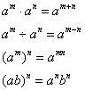

#### 根式运算

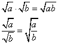

#### 平方和

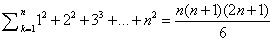

#### 平方差

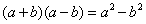

#### 完全平方

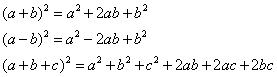

#### 立方和/差

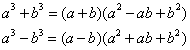

#### 完全立方

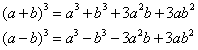

#### ....

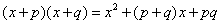

#### 二次方程的根

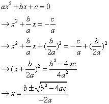

#### 二次方程的韦达定理

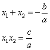

#### 二次函数顶点坐标推导

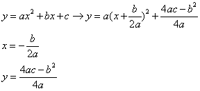

#### 对数函数的性质

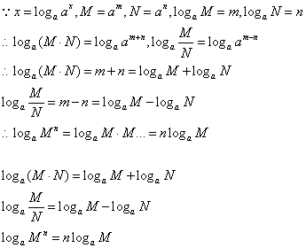

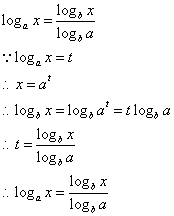

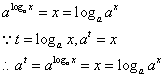

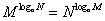

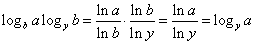

#### [常用三角恒等式](https://zh.wikipedia.org/wiki/%E4%B8%89%E8%A7%92%E6%81%92%E7%AD%89%E5%BC%8F)

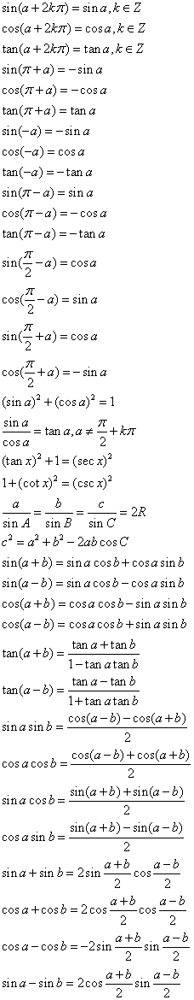

#### 三角形面积

* 海伦公式, 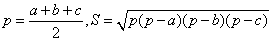

