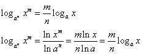

#### 幂运算

#### 根式运算

#### 平方和

#### 平方差

#### 完全平方

#### 立方和/差

#### 完全立方

#### ....

#### 二次方程的根

#### 二次方程的韦达定理

#### 二次函数顶点坐标推导

#### 对数函数的性质

#### [常用三角恒等式](https://zh.wikipedia.org/wiki/%E4%B8%89%E8%A7%92%E6%81%92%E7%AD%89%E5%BC%8F)

#### 三角形面积

* 海伦公式, 

