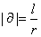
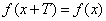
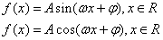
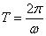
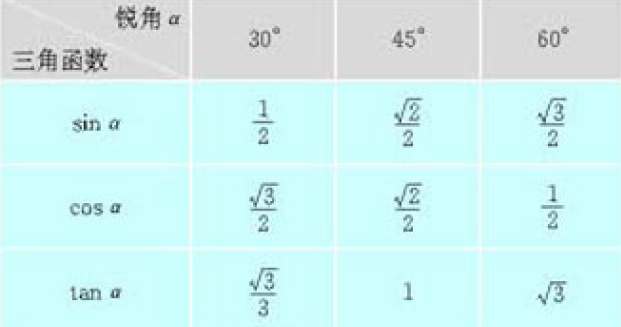

#### 弧度制

关于为什么要有弧度制, 可以参考 https://www.zhihu.com/question/21480398, 个人理解是为了把 60 进制的角度转换成实数方便计算

弧长 l, 半径r, 定义弧度 ɑ 为

 

 

#### 周期函数

对于函数 f(x), 如果存在一个非零常数 T, 使得当 x 取满足定义域的任意值时, 都有

对于函数

其周期为

其中 ω 理解为角速度

#### [常用三角恒等式](https://zh.wikipedia.org/wiki/%E4%B8%89%E8%A7%92%E6%81%92%E7%AD%89%E5%BC%8F)

#### 常见三角函数的值

