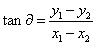
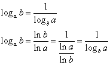

### [函数](https://zh.wikipedia.org/wiki/%E5%87%BD%E6%95%B0)

#### 高中定义

设 A, B 是非空的**数集**, 按照某种确定的对应关系 f, 使得对于集合 A 中的任意一个数 x, 在集合 B 中都有**唯一确定**的数 f(x) 和它对应, 那么就称 f 为从集合 A 到集合 B 的一个函数

#### wiki 定义

从输入值集合 X 到可能的输出值集合 Y 的函数 f (记作 f: X -> Y) 是 X 与 Y 的关系, 满足如下条件:

1. f 是完全的: 对集合 X 中任意元素 x 都有集合 Y 中的元素 y 满足xfy (x 与 y 是 f 相关的), 即对于每一个输入值, y 中都有与之对应的输出值
2. f 是多对一的: 若 f(x) = y 且 f(x) = z, 则 y = z, 即多个输入可以映射到同一个输出, 但一个输入不能映射到多个输出

注意: 高中课本上函数定义限于实数集, 而映射才是任意集合, wiki 上映射等同于函数

#### [单射](https://zh.wikipedia.org/wiki/%E5%8D%95%E5%B0%84)

简单来说就是, 若 f(a) = f(b), 则 a = b, 也即不存在多个 x 对应到同一个 y, 比如二次函数就不是单射, 因为存在两个 x 对应一个 y

#### [满射](https://zh.wikipedia.org/wiki/%E6%BB%A1%E5%B0%84)

简单来说就是, 集合 Y 中的每个 y 都有 x 与之对应

注意: 函数定义中并没有限制集合 Y 中的每个 y 都要有 x 对应, 所以函数的值域是集合 Y 的子集

#### [双射](https://zh.wikipedia.org/wiki/%E5%8F%8C%E5%B0%84)

简单来说就是既是单射又是满射的函数, 或者说是一一对应

#### [奇函数和偶函数](https://zh.wikipedia.org/wiki/%E5%A5%87%E5%87%BD%E6%95%B8%E8%88%87%E5%81%B6%E5%87%BD%E6%95%B8)

##### 奇函数

关于原点对称

f(x) = -f(-x)

##### 偶函数

关于 y 轴对称, 偶函数不可能是双射映射

f(x) = f(-x)

#### [反函数](https://zh.wikipedia.org/wiki/%E5%8F%8D%E5%87%BD%E6%95%B8)

原函数与其反函数关于 y = x 对称

#### 一次函数

首先我们考虑 k 是什么, 我们从坐标系中取两点 (x1, y1), (x2, y2), 两点所在直线与 x 轴夹角为 ɑ, , 对于这条直线上的任意一点, 都有 y=tanɑ*x+b, 所以 k = tanɑ

b是函数与 y 轴交点的 y 坐标

两直线垂直的话 k1*k2=-1, 原因

##### [直线的方程](https://zh.wikipedia.org/wiki/%E7%9B%B4%E7%BA%BF)

参考[解析几何](./解析几何.md)

#### 二次函数

顶点坐标的推导:

#### 指数函数

a > 1 时, 函数单调递增

a < 1 时, 函数单调递减

x = 0 时, y = 1

#### [对数函数](https://zh.wikipedia.org/wiki/%E5%AF%B9%E6%95%B0)

性质:

负数和 0 没有对数

a > 1 时, 单调递增

a < 1 时, 单调递减

