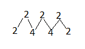

为什么会有这么个东西呢? 大概是我太闲了, 翻出小时候的数学书, 发现这些东西差不多都忘光了...当然, 忘光了的东西还有很多, 犯不着来做这么无聊的事情, 只不过觉得好像...有些还挺有用的...帮助我口算下坐标系之类, 毕竟连这种事情都要按计算器感觉自己很智障啊...不过为了这东西也要写篇博客, 好像也很智障...

##### 乘以/除以 2 的幂, 分割成乘以/除以多个 2

eg. 243x4=243x2x2=486x2=972, 好像没什么卵用, 大概计算较大的幂有用吧(那我还是用计算器吧...)

##### 乘以 5 可以看作 /2x10

eg. 222x5=222/2x10=1110, 除以 2 补 0 就好, 好像有点卵用

##### 乘以 11, 两头一拉, 中间相加

eg. 222x11

虽然我记得, 不过好像这就该是这样吧, 也没必要什么口诀...

##### 乘以 1.5x10^n, 加半添 0

eg. 24x15=(24+12)x10=360, 其实就是乘以3/2啦

##### 两个 10-20 以内的数的乘法

个位加个位再加十, 乘以十 --- 1

个位乘个位 --- 2

1, 2 的结果相加.

eg. 13x14

(3+4+10)x10=170

3x4=12

170+12=182

##### 十位相同, 个位之和为 10 的两个两位数相乘

取一个十位加一, 乘以另一个十位, 个位乘个位, 连起来

十位为 a, 个位为b, 即 (a+1)xa, bxb, 连在一起

eg. 68x62=4216

6+1=7

7x6=42

8x2=16

4216

##### 个位相同, 十位之和为 10 的两个两位数相乘

十位为 a, 个位为b, 即 axa+b, bxb, 连在一起, bxb不满 10 前面补 0

eg.72x32=2304

7x3+2=23

2x2=04

2304

先这些, 有空再补. 感觉自己仿佛重新读过小学...