### [概率论](https://zh.wikipedia.org/wiki/%E6%A6%82%E7%8E%87%E8%AE%BA)

#### 事件

在一次随机试验中可能发生的不能再细分的结果被称为**基本事件**, 或称为**单位事件**.

#### 事件空间

在随机试验中可能发生的所有单位事件的集合称为事件空间, 用 S 表示.

#### 必然事件

我们把**在条件 S 下**一定会发生的事件叫做**相对于条件 S** 的必然事件

#### 不可能事件

我们把**在条件 S 下**一定不会发生的事件叫做**相对于条件 S** 的不可能事件

#### 确定事件

必然事件和不可能事件统称为相对于条件 C 的确定事件

#### 随机事件

在条件 C 下可能发生也可能不发生的事件, 叫做相对于条件 C 的随机事件, 随机事件是事件空间 S 的子集

关键词: 条件 C, 相对于, 我们在描述概率的时候总是相对于一个条件, 已知的条件不一样, 得到的概率不一样. 举个例子:

有 50 个红球, 50 个黑球, A, B 两人摸球, 求 B 摸到红球的概率

情况1: A 先摸, B 后摸, B 知道 A 摸了什么, 也知道自己后摸, 也知道有放回

情况2: A 先摸, B 后摸, B 不知道自己后摸, 不知道 A 摸了什么, 知道无放回

情况3: A先摸, B 后摸, B 知道自己后摸, 但不知道 A 摸了什么, 知道无放回

这三种情况显然 B 摸到红球的概率是不一样的

#### 事件的运算

因为事件是基于集合定义的, 通常我们说一个事件 A, 应该不是指某一个事件空间中的元素, 而是指 A 是事件空间的一个子集, 即 A 是一个集合. 虽然前面事件的定义表明事件这个词应当是一个元素, 但大部分场景下说的事件都应该是指一个集合, 就像随机事件也是指一个集合而不是某个事件空间中的元素, 这里注意区分一下.

对于事件 A 和事件 B, 如果事件 A 发生, 则事件 B 一定发生, 称事件 B 包含事件 A, 记作 A⊆B

如果事件 A 发生, 则事件 B 一定发生, 反过来事件 B 发生, 则事件 A 一定发生, 称这两个事件相等, 记作 A = B

若某事件发生当且仅当事件 A 发生或事件 B 发生, 则称此事件为事件 A 和事件 B 的并事件, 记作 A ∪ B

若某事件发生当且仅当事件 A 发生且事件 B 发生, 则称此事件为事件 A 和事件 B 的交事件, 记作 A ∩ B 

若 A ∩ B 为不可能事件(A ∩ B=Ø), 则称事件 A 与事件 B **互斥**, 即 A 和 B在一次试验中不会同时发生

若 A ∩ B 为不可能事件, A ∪ B 为必然事件, 则称 A 与 B 互为对立事件, 即事件 A 与事件 B 在任何一次试验中有且仅有一个发生, 或者 A B 必然发生一个但不同时发生.

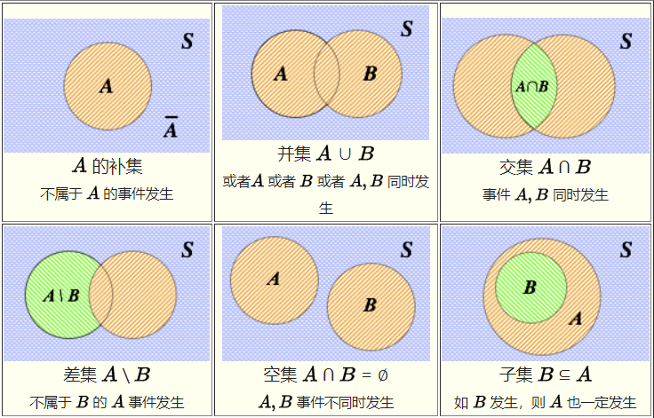

#### 古典概率

事件 A 在事件空间 S 中的概率 P(A) 为:

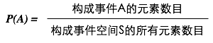

#### 概率公理

如果一个函数 P 表示指定给每一个事件空间 S 中的事件 A 一个实数 P(A), 并且其满足下面三个公理, 那么函数 P 叫做**概率函数**, P(A) 叫做事件 A 的概率

* 公理1: 0 <= P(A) <= 1
* 公理2: P(S) = 1
* 公理3: P(A ∪ B) = P(A) + P(B), A ∩ B=Ø

大概的理解: 概率 P 是一个事件空间 S 的子集的集合(S 的幂集)到实数集的一个函数/映射, 即定义域是一个集合的集合, 二阶的集合, S 的幂集, 值域是实数集. 为什么定义域是集合的集合? 因为 P 是一个函数, 函数的输入是 A, A 是一个随机事件, 随机事件是一个集合, A 是一个集合, 但函数 P 不止有 A 一个输入值, 也可以有 B, C 等等, 它们都是集合, 那 A, B, C 都属于定义域, 这个定义域就是一个高阶的集合.

#### 其他定理

##### 定理 1

与 A 互补事件的概率是

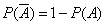

##### 定理 2

不可能事件的概率为 0

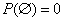

##### 定理 3

如果若干事件 A1, A2 ... An 两两之间是空集关系, 那么

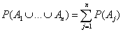

##### 定理 4

如果事件 A, B 是差集关系, 则

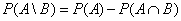

##### 定理 5

对于任意两个事件 A 和 B, 有

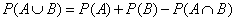

##### 定理 6

事件 A, B 同时发生的概率是

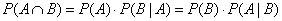

其中 P(A|B) 是指在 B 条件下 A 发生的概率, 注意这里没有限制 A 和 B 是没有关联的, 即 A 和 B 是可以有关联的

##### 定理 7

两个**不相关联(独立)**的事件 A, B 同时发生的概率是

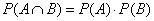

这个定理事件上是定理 6 的特殊情况,  如果事件 A 和 B 没有关联, 则 P(A|B) = P(A), 以及 P(B|A)=P(B)

##### 独立性

当且仅当两个随机事件 A 和 B 满足定理 7 时, 它们才是统计独立的

##### 贝叶斯定理

根据定理 6 可以导出

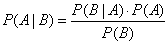

 

##### [条件概率](https://zh.wikipedia.org/wiki/%E6%9D%A1%E4%BB%B6%E6%A6%82%E7%8E%87)

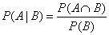

即在事件 A 发生的范围内, 考虑 A B 同时发生的概率

如果事件 B C 互斥, 则

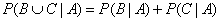

#### [随机变量](https://zh.wikipedia.org/wiki/%E9%9A%8F%E6%9C%BA%E5%8F%98%E9%87%8F)

随机变量是事件空间 S 到实数 R 的一个映射(MMP...那为什么要叫变量)

**注意**, 随机变量是函数! 以及注意它和概率 P 的区别!

比如, 我们随机扔两个骰子, 两个骰子的取值(一个基本事件)分别为 i, j, 准确说, i 代表了**骰子取到 i 这个值**的事件, 可以定义一个随机变量 X 为两骰子点数之和

X(i, j) = i + j

X(i, j) 的i, j 应该代表一个事件, i + j 的 i, j 应该代表一个实数

对于扔一个骰子取值小于 3的概率, 我们可以表示为 P(X(i) < 3)

##### 离散型随机变量

如果随机变量 X 的取值是有限的或者无限但可数的, 则称 X 为**离散随机变量**, 简单讲就是 X 的值域是一个可数集

##### 独立重复试验与二项分布

在**相同条件下**重复做 n 次试验称为 n 次**独立重复试验**

在 n 次独立重复试验中, X 表示事件 A 发生的次数, 设每次试验中事件 A 发生的概率为 p, 则

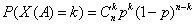

称随机变量 X 服从**二项分布**

#### 期望&均值

若离散型随机变量 X 分布为

| X    | x1   | x2   | ...  | xn   |
| ---- | ---- | ---- | ---- | ---- |
| P    | p1   | p2   | ...  | pn   |

则称 E(x) 为随机变量 X 的**数学期望**或**均值**

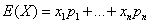

若 Y = aX + b, 则

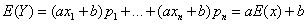

若 X 服从二项分布 B(n, p), 则

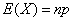

#### 方差

##### 离散型随机变量的方差

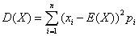

若 X 服从两点分布, 则

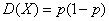

若 X 服从二项分布, 则

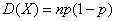

若 Y = aX + b, 则

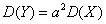

#### 标准差

**TODO**

#### [正态分布](https://zh.wikipedia.org/wiki/%E6%AD%A3%E6%80%81%E5%88%86%E5%B8%83)

