#### [导数](https://zh.wikipedia.org/wiki/%E5%AF%BC%E6%95%B0)

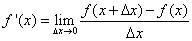

由定义可知, 导数是一个 tan 值, 也即函数 f(x) 在某处的切线的斜率, 也是导数的几何意义

##### 初等函数的导数

| 函数                                     | 导数                                     |
| -------------------------------------- | -------------------------------------- |
| 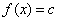   | 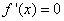   |
| 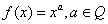   | 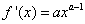   |
| 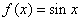   | 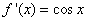   |
| 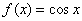   | 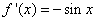   |
| 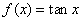 | 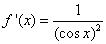 |
| 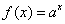   | 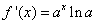 |
| 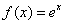 | 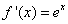 |
| 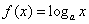 | 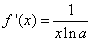 |
| 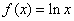 | 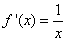 |

##### [求导法则](https://zh.wikipedia.org/wiki/%E5%AF%BC%E6%95%B0%E5%88%97%E8%A1%A8)

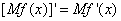

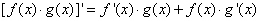

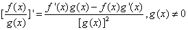

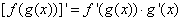

##### 导数与函数的关系

###### 单调性

在某个区间 (a, b) 内

f'(x) > 0, f(x) 单调递增

f'(x) < 0, f(x) 单调递减

f'(x) = 0, f(x) 在此处有极值点.(但不代表有极值点导数就为 0)

#### 定积分

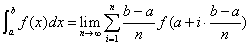

##### 定积分的性质

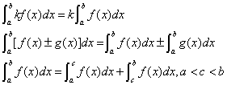

##### [微积分基本定理](https://zh.wikipedia.org/wiki/%E7%A7%AF%E5%88%86#%E5%BE%AE%E7%A7%AF%E5%88%86%E5%9F%BA%E6%9C%AC%E5%AE%9A%E7%90%86)

设有在闭区间 [a, b] 上连续的可积函数 f. 考虑积分上限函数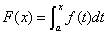, 则 F 在闭区间 [a, b] 上连续, 在开区间 (a, b) 上可导, 并且对开区间 (a, b) 中的任意 x 有

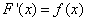

微积分基本定理的一个实用的直接推论，也被称为微积分第二基本定理:

设有在闭区间 [a, b] 上连续的可积函数 f. 考虑它的一个原函数 F(x), 即

则 f 在区间 [a, b] 上的定积分满足

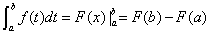

