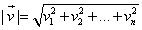

#### [向量](https://zh.wikipedia.org/wiki/%E5%90%91%E9%87%8F)

##### 平行向量

方向相同或相反的非零向量叫平行向量

##### 零向量

零向量的方向不定, 规定零向量与任意向量平行

##### 向量的模

向量的大小也叫范数或模长, 对于一个 n 维向量

**TODO**

##### 数量积

数量积也叫点积, 内积, 其结果是一个标量, 如两向量夹角为 θ

向量的数量积也满足交换律和分配律, 但是不满足结合律((ab)c!=a(bc))

两个向量的数量积等于它们对应坐标的乘积的和

由此可得两向量夹角

##### 向量积

向量积也叫叉积, 外积, 其结果是一个向量

##### 向量的加法与减法

向量的加法满足交换律和结合律

坐标表示

##### 向量与实数的运算

##### 向量共线的坐标表示

