### [组合数学](https://zh.wikipedia.org/wiki/%E7%BB%84%E5%90%88%E6%95%B0%E5%AD%A6)

#### 分类加法计数原理

完成一件事有两类不同方案(两类不同方案中的方法互不相同, 即无交集), 在第一类方案中有 m 种不同的方法, 在第二类方案中有 n 种不同方法, 那么完成这件事共有 **N=m+n** 种不同方法

#### 分步乘法计数原理

完成一件事有两个步骤, 做第一步有 m 中不同方法, 做第二步有 n 种不同方法, 那么完成这件事共有 **N=m*n** 种不同方法

可以看出分类加法计数原理强调的是分类, 其中各种方法相互独立, 其中任何一个方法都可以完成这件事; 分步乘法计数原理强调因操作的先后顺序不同而导致方案的不同, 各个步骤种的方法相互依赖, 只有每个步骤做完才算完成这件事. 在分析具体问题的时候注意是否存在操作的先后顺序不同导致方案不同, 简而言之, 分类要做的**不重不漏**, 分步要做到**步骤完整**.

#### 排列

一般地, 从 n 个不同元素中取出 m 个元素, 按照**一定顺序**排成一列, 叫做从 n 个不同元素中取出 m 个元素的一个**排列**, 记作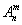

因为排列对元素的顺序有要求, 所以我们可以把从 n 个不同元素中取出 m 个元素排列分解成多步:

1. 从 n 个元素从取 1 个放到位置 1, 有 n 种取法
2. 从剩下 n - 1 个元素中取 1 个放到位置 2, 有 n - 1 种取法
3. ...
4. 从剩下的 n - (m - 1) 个元素种取一个放到位置 m, 有 n - m + 1种取法

所以本质上排列也是一个满足分步乘法计数原理的问题

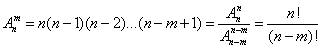

另外规定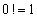

**注意**, 排列除了对顺序由要求, 还要求每个位置的元素都要互不相同, 对于那些有顺序要求, 但是每一步的元素可以与之前步骤的元素重复的问题, 不符合排列的定义, 还是老老实实用分步乘法计数.

#### 组合

一般地, 从 n 个不同元素中取 m 个元素合成一组, 叫做从 n 个不同元素中取出 m 个元素的一个**组合**, 记作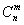

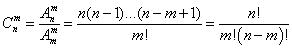

推导参考 [一些证明推导](./一些证明推导.md)

另外规定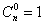

##### 组合数的性质

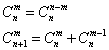

#### 二项式定理

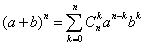

展开后共 n + 1 项, 其中通项为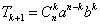

##### 二项式系数的和

对于下式可知

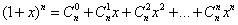

将 x = 1 带入, 可得

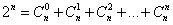

