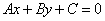
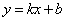
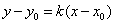
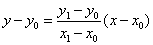
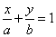
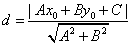
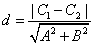
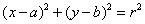
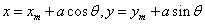

#### [直线的方程](https://zh.wikipedia.org/wiki/%E7%9B%B4%E7%BA%BF)

##### 一般式

这种形势下, 直线的斜率为 -A/B, x 轴截距为 -C/A, y 轴截距为 -C/B, 当 A 为 0 时, 意味着 y 与 x 无关, 即 x 为任意值时, y 的值都不变, 也即直线平行于 x 轴, 同理 B 为 0 时, 直线平行于 y 轴

##### 斜截式

也即一次函数一般形式, 通常用于已知斜率和 y 轴截距

##### 点斜式

通常用于已知斜率和直线上一点的坐标

##### 两点式

通常用于已知直线上两点的坐标

##### 截距式

通常用于已知直线在 x 轴的截距为 a, 在 y 轴的截距为 b

##### 点到直线的距离

已知一点 (x0, y0) 和直线 Ax+By+C=0, 求点到直线的距离

##### 两平行直线之间的距离

已知直线 Ax+By+C1=0, Ax+By+C2=0, 求两平行直线之间的距离

​	

#### [圆的方程](https://zh.wikipedia.org/wiki/%E5%9C%86)

##### 标准形式

其中 (a, b) 为圆心, r 为半径

##### 参数方程

#### 极坐标方程

