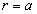
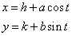

#### 曲线与方程

在直角坐标系中, 如果某曲线 C 上的点与一个方程 f(x, y) = 0 的实数解建立了如下关系:

* 曲线上的点都是这个方程的解
* 以这个方程的解为坐标的点都是曲线上的点

即曲线上的点与方程的解一一对应, 则方程叫做曲线的方程

#### [直线的方程](https://zh.wikipedia.org/wiki/%E7%9B%B4%E7%BA%BF)

##### 一般式

这种形势下, 直线的斜率为 -A/B, x 轴截距为 -C/A, y 轴截距为 -C/B, 当 A 为 0 时, 意味着 y 与 x 无关, 即 x 为任意值时, y 的值都不变, 也即直线平行于 x 轴, 同理 B 为 0 时, 直线平行于 y 轴

##### 斜截式

也即一次函数一般形式, 通常用于已知斜率和 y 轴截距

##### 点斜式

通常用于已知斜率和直线上一点的坐标

##### 两点式

通常用于已知直线上两点的坐标

##### 截距式

通常用于已知直线在 x 轴的截距为 a, 在 y 轴的截距为 b

##### 点到直线的距离

已知一点 (x0, y0) 和直线 Ax+By+C=0, 求点到直线的距离

##### 两平行直线之间的距离

已知直线 Ax+By+C1=0, Ax+By+C2=0, 求两平行直线之间的距离

​	

#### [圆的方程](https://zh.wikipedia.org/wiki/%E5%9C%86)

##### 标准形式

其中 (a, b) 为圆心, r 为半径

##### 参数方程

#### 极坐标方程

#### [椭圆的方程](https://zh.wikipedia.org/wiki/%E6%A4%AD%E5%9C%86)

设椭圆的焦距为 2c, 半长轴为 a, 半短轴为 b, 焦点为 F1, F2, 椭圆上任意一点 M 满足

|MF1|+|MF2|=2a>|F1F2|=2c

且易知

##### 标准方程

适用于已知半长轴和半短轴

适用于已知半长轴和焦距

对于中心点为 (h, k) 的任意椭圆, 有

##### 参数方程

这个参数方程揭示了两个方向互相垂直的简谐运动合成了椭圆的周期运动

##### 离心率 e

因为 a>c>0, 所以 0<e<1, e 越接近 1, 椭圆越扁(水平方向), e 越接近 1, 椭圆越尖(垂直方向), c 越接近 0, 椭圆越接近圆

#### [双曲线](https://zh.wikipedia.org/wiki/双曲线)

设双曲线的焦距为 2c, 点 M 为双曲线上一点, F1, F2 为双曲线的焦点, 有

|MF1|-|MF2|=2a

其中 a 的几何意义为双曲线顶点到对称中心的距离(代入 y=0 易得, 也易知 x 的取值范围是 x>=a, x <= -a), 也叫半实轴长(两顶点连线即实轴), 也可知 c > a, 当 a = c 时,

|MF1|=|MF2|=|F1F2|

此时图像是两条射线

令

b 是半虚轴长

##### 标准方程

左右开口, 焦点位于 x 轴

上下开口, 焦点位于 y 轴

左右开口, 中心为 (h, k)

上下开口, 中心为 (h, k)

##### 离心率 e

e > 1, e 越大, 双曲线开口越大, e 越小, 双曲线开口越小

##### 渐近线方程

这里包含了两条渐近线, 也有写作

焦点在 x 轴的双曲线的渐近线

焦点在 y 轴的双曲线的渐近线

渐近线恰好是虚轴围成的矩形的对角线所在的直线

##### 准线

双曲线上的点到焦点的距离 m 比上到准线的距离 n 为离心率 e

左右开口的双曲线的准线方程是

#### [抛物线](https://zh.wikipedia.org/wiki/%E6%8A%9B%E7%89%A9%E7%BA%BF)

抛物线是一种圆锥曲线。在一个平面内，抛物线的每一点Pi，其与一个固定点F之间的距离等于其与一条不经过此点F的固定直线L之间的距离。这固定点F叫做抛物线的“焦点”，固定直线L叫做抛物线的“准线.

设焦点 F 坐标为 (p/2, 0), 抛物线上的点 M 到直线 l 的距离为 d, 则有

##### 标准方程

##### 准线

##### 离心率

抛物线上的点到焦点的距离 m 比上到准线的距离 n 为离心率 e

#### [圆锥曲线之间的关系](https://zh.wikipedia.org/wiki/%E5%9C%86%E9%94%A5%E6%9B%B2%E7%BA%BF)

平面上到一个定点 F 的距离和它到一条定直线 l 的距离之比是一个常数 e 的点的轨迹是圆锥曲线

* 0<e<1 时, 轨迹是椭圆
* e>1 时, 轨迹是双曲线
* e=1 时, 轨迹是抛物线

设直线 l 为 x=-p, 点 F 为 (0, 0), 则

是圆锥曲线的统一方程

#### [平面](https://zh.wikipedia.org/wiki/%E5%B9%B3%E9%9D%A2)

TODO

点到平面的距离https://www.cnblogs.com/graphics/archive/2010/07/10/1774809.html