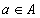
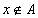

## [集合](https://zh.wikipedia.org/wiki/%E9%9B%86%E5%90%88_(%E6%95%B0%E5%AD%A6))

#### 集合的定义

简单来说，所谓的一个集合，就是将数个对象归类而分成为一个或数个形态各异的大小整体。 一般来讲，集合是**具有某种特性**的事物的整体，或是一些确认对象的汇集。构成集合的事物或对象称作[元素](https://zh.wikipedia.org/wiki/%E5%85%83%E7%B4%A0_(%E6%95%B8%E5%AD%B8))或是成员。集合的元素可以是任何事物，可以是人，可以是物，也可以是字母或数字等。

如果 a 是集合 A 的元素, 就说 a 属于集合 A, 记作

如果 a 不是集合 A 的元素, 就说 a 不属于集合 A, 记作

通常我们把集合 A 写作或者或者这样的形式

#### 集合的特性

给定一个集合,那么任何一个元素在不在这个集合中就确定了, 比如字母 A, B, C 可以构成一个集合, 但是"身材较高的人"不能构成集合, 因为组成它的元素是不确定的.

一个给定集合中的元素是互不相同的. 也就是说, 集合中的元素是不重复出现的.

因此, 集合具有以下特性:

* 确定性: 给定一个集合，任给一个元素，该元素或者属于或者不属于该集合，二者必居其一，不允许有模棱两可的情况出现。
* 互异性: 一个集合中，任何两个元素都认为是不相同的，即每个元素只能出现一次。
* 无序性: 一个集合中，每个元素的地位都是相同的，元素之间是无序的。

#### 集合之间的关系

一般地, 对于两个集合 A, B, 如果集合 A 中任意一个元素都是集合 B 中的元素, 则称集合 A 为集合 B 的子集, 记作, 读作 A 含于 B 或者 B 包含 A

严格定义: 集合A，B，若∀a∈A，有a∈B∴A⊆B。则称A是B的**子集**，亦称A**包含于**B，或B**包含**A，记作A⊆B。

包含关系的性质:

* **自反性**：∀集合S，S⊆S；（任何集合都是其本身的子集）
* **反对称性**：A⊆B且B⊆A ⇔ A=B；（这是证明两集合相等的常用手段之一）
* **传递性**：A⊆B且B⊆C ⇒ A⊆C

如果集合, 但存在元素, 且, 则称集合 A 是集合 B 的真子集, 记作

严格定义: 若A⊆B，且A≠B，则称A是B的**真子集**，亦称A**真包含于**B，或B**真包含**A，记作A⊂B。

真包含关系的性质:

* **反自反性**：∀集合S，S⊂S都不成立
* **非对称性**：A⊂B ⇒ B⊂A不成立；反之亦然
* **传递性**：A⊂B且B⊂C ⇒ A⊂C

如果集合 A 是集合 B 的子集(), 且集合 B 是集合 A 的子集(), 则集合 A 与集合 B 相等, 记作 A=B

#### 空集

我们把不含任何元素的集合叫做空集, 记作, 并规定: 空集是任何集合的子集

#### 集合的运算

##### 并

由所有属于集合 A 或属于集合 B 的元素组成的集合, 称为集合 A 与 B 的并集, 记作

##### 基本性质

* 交换律: A∪B = B∪A
* 结合律: (A∪B)∪C = A∪(B∪C)
* 幂等律: A∪A = A
* 幺元: 对于任意集合 A, A 与空集的并集都等于 A, 空集是并运算的幺元
* 

##### 交

由属于集合 A 且属于集合 B 的所有元素组成的集合, 称为 A 与 B 的交集, 记作

##### 基本性质

* 交换律: A∩B = B∩A
* 结合律: (A∩B)∩C = A∩(B∩C)
* 幂等律: A∩A = A
* 空集合: 对于任意集合 A, A 与空集的交集都为空集
* 

##### 差

由属于集合 A 但不属于 集合 B 的所有元素组成的集合, 称为 A 与 B 的差集, 记作 A - B

