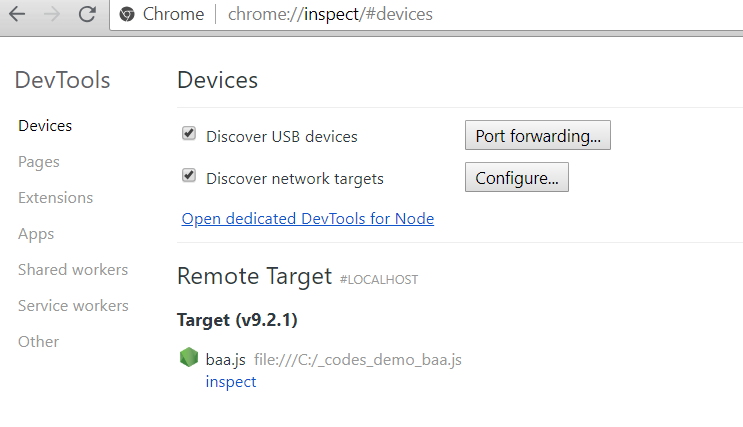
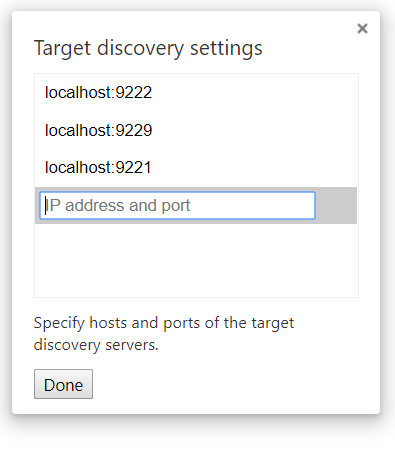
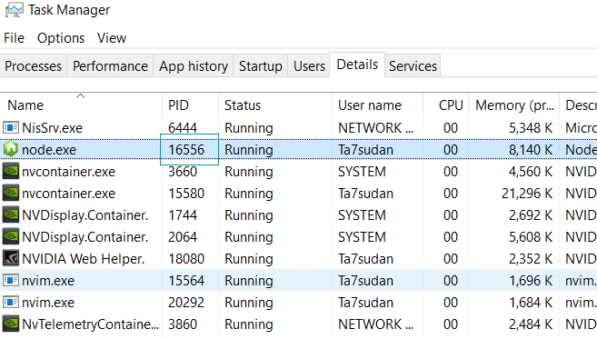

Node 的调试器是一个 C/S 架构, 通过命令行选项开启调试模式, 此时 Node 会默认监听 `127.0.0.1:9229`, 启动一个 WebSocket 服务, 为每个进程分配一个 UUID 如 `0f2c936f-b1cd-4ac9-aab3-f63b0f33d55e`, 客户端必须知道 WebSocket 的 URL 才能连上服务端进行调试, 如 `ws://127.0.0.1:9229/0f2c936f-b1cd-4ac9-aab3-f63b0f33d55e`.

调试相关的命令行选项主要有以下.

* `node --inspect demo.js` 启动时不断点, 默认监听 `127.0.0.1:9229`
* `node --inspect=127.0.0.1:9229 demo.js` 启动时不断点, 手动指定主机和端口
* `node --inspect-brk demo.js` 启动时断点, 默认监听 `127.0.0.1:9229`
* `node --inspect-brk=127.0.0.1:9229 demo.js` 启动时断点, 手动指定主机和端口
* `node inspect demo.js` 启动一个类似 gdb 的命令行调试器
* `node inspect --port=9229 demo.js` 启动一个类似 gdb 的命令行调试器, 手动指定端口

通常我们是用 `--inspect-brk`. 通过 `--inspect-brk` 启动服务端后, 除了 WebSocket 服务, 还会有个 HTTP 服务, 如 `http://127.0.0.1:9229/json/list`. 访问 HTTP 服务会得到一个 JSON.

```json

[ {
  "description": "node.js instance",
  "devtoolsFrontendUrl": "chrome-devtools://devtools/bundled/inspector.html?experiments=true&v8only=true&ws=127.0.0.1:9229/65d4c8d4-9771-47eb-8e5d-e1ad27f2599e",
  "faviconUrl": "https://nodejs.org/static/favicon.ico",
  "id": "65d4c8d4-9771-47eb-8e5d-e1ad27f2599e",
  "title": "baa.js",
  "type": "node",
  "url": "file://C:_codes_demo_baa.js",
  "webSocketDebuggerUrl": "ws://127.0.0.1:9229/65d4c8d4-9771-47eb-8e5d-e1ad27f2599e"
} ]
```

方便查看完整的 WebSocket URL 和 UUID 之类的.

启动服务之后, 对于不同客户端有不同操作, 这里以 Chrome Devtools 为例. 打开 `chrome://inspect` 可用看到我们要调试的脚本.



选择 `inspect` 就可以调试了. 如果服务端不是默认的主机和端口, 也可以选择 Discover network targets -> Configure, 手动指定主机端口, 这样客户端就可以找到调试器的服务端了.



除了 Chrome DevTools, 常用的调试客户端还有 VSCode, 以及新出来的 ndb.


#### 远程调试

当要调试服务器上的应用时, 虽然我们可以将调试器服务端 IP 绑定为公网 IP, 不过这样不安全, 所以不建议. 官方给出的建议是通过 SSH 端口映射来做, 当然也可以用其他端口映射方案, 只要确保只有自己能够访问就行.

所以我们先在服务器上

```shell
ta7sudan@FUCKGFW:~$ node --inspect-brk test.js
```

然后本地

```shell
ssh -L 9221:localhost:9229 -p 23333 ubuntu@233.233.233.233
```

DevTools 里配置为本地 9221 端口即可.


#### 调试一个已经启动的 Node 进程

通常我们调试的时候都是有入口文件, 我们可以自己启动入口文件进行调试. 但也有时候我们想要调试一个入口文件不受我们控制的 Node 进程, 比如一些 CLI 或某些框架. 给一个一开始没有通过 `--inspect` 等选项启动的 Node 进程发送 `SIGUSR1` 信号也能激活调试模式. 这个事情用 VSCode 或 ndb 做起来比较方便, 这里以 VSCode 为例.

先打开 VSCode 调试面板, 创建一个配置文件.

```json
{
	// Use IntelliSense to learn about possible attributes.
	// Hover to view descriptions of existing attributes.
	// For more information, visit: https://go.microsoft.com/fwlink/?linkid=830387
	"version": "0.2.0",
	"configurations": [
		{
			"type": "node",
			"request": "attach",
			"name": "Launch Program",
			"processId": "11996"
		}
	]
}
```

主要就是三个字段比较关键, `type` 毫无疑问是 node 了. 调试已启动的进程需要我们将调试器 attach 到进程, 所以需要配置 `request` 为 attach, 默认是 launch, 即通过启动入口文件进行调试. `processId` 即我们要调试的进程 PID 了, Windows 下可以在任务管理器看到.



不过更好的做法是配置为

```json
{
	// Use IntelliSense to learn about possible attributes.
	// Hover to view descriptions of existing attributes.
	// For more information, visit: https://go.microsoft.com/fwlink/?linkid=830387
	"version": "0.2.0",
	"configurations": [
		{
			"type": "node",
			"request": "attach",
			"name": "Launch Program",
			"processId": "${command:PickProcess}"
		}
	]
}
```

`${command:PickProcess}` 可以省去我们自己去看 PID, 而是直接在 VSCode 面板中选择已启动的 Node 进程进行调试. 接下来在对应脚本中断点就好了.


#### 简单的性能分析

为了进行一些简单的性能分析, 我们先写这样一段代码.

```javascript
for (var i = 0, sum = 0; i < 100000; ++i) {
	sum += i;
}
console.log(sum);
```

然后运行

```shell
$ node --prof test.js
```

得到一个 isolate-0000026896B61F60-v8.log 文件, 接着

```shell
$ node --prof-process isolate-0000026896B61F60-v8.log > log.txt
```

得到一个 log.txt 文件, 打开它, 我们可以看到.

```
Statistical profiling result from isolate-0000026896B61F60-v8.log, (73 ticks, 1 unaccounted, 0 excluded).

 [Shared libraries]:
   ticks  total  nonlib   name
     38   52.1%          C:\Devtools\Nodejs\node.exe
     26   35.6%          C:\WINDOWS\SYSTEM32\ntdll.dll
      8   11.0%          C:\WINDOWS\System32\KERNEL32.DLL

 [JavaScript]:
   ticks  total  nonlib   name

 [C++]:
   ticks  total  nonlib   name

 [Summary]:
   ticks  total  nonlib   name
      0    0.0%    0.0%  JavaScript
      0    0.0%    0.0%  C++
      0    0.0%    0.0%  GC
     72   98.6%          Shared libraries
      1    1.4%          Unaccounted

 [C++ entry points]:
   ticks    cpp   total   name

 [Bottom up (heavy) profile]:
  Note: percentage shows a share of a particular caller in the total
  amount of its parent calls.
  Callers occupying less than 1.0% are not shown.

   ticks parent  name
     38   52.1%  C:\Devtools\Nodejs\node.exe
     33   86.8%    C:\Devtools\Nodejs\node.exe
     14   42.4%      LazyCompile: ~runInThisContext bootstrap_node.js:503:28
     14  100.0%        LazyCompile: ~NativeModule.compile bootstrap_node.js:589:44
     14  100.0%          LazyCompile: ~NativeModule.require bootstrap_node.js:521:34
      3   21.4%            Script: ~<anonymous> module.js:1:11
      2   14.3%            Script: ~<anonymous> util.js:1:11
      2   14.3%            LazyCompile: ~setupGlobalConsole bootstrap_node.js:314:30
      1    7.1%            Script: ~<anonymous> tty.js:1:11
      1    7.1%            Script: ~<anonymous> stream.js:1:11
      1    7.1%            Script: ~<anonymous> readline.js:1:11
      1    7.1%            Script: ~<anonymous> internal/loader/ModuleRequest.js:1:11
      1    7.1%            Script: ~<anonymous> fs.js:1:11
      1    7.1%            LazyCompile: ~setupGlobalVariables bootstrap_node.js:255:32
      1    7.1%            LazyCompile: ~setupGlobalTimeouts bootstrap_node.js:304:31
      3    9.1%      LazyCompile: ~Resolver dns.js:250:14
      3  100.0%        Script: ~<anonymous> dns.js:1:11
      3  100.0%          LazyCompile: ~NativeModule.compile bootstrap_node.js:589:44
      3  100.0%            LazyCompile: ~NativeModule.require bootstrap_node.js:521:34
      2    6.1%      LazyCompile: ~startup bootstrap_node.js:13:19
      2  100.0%        Script: ~<anonymous> bootstrap_node.js:10:10
      1    3.0%      Script: ~<anonymous> internal/url.js:1:11
      1  100.0%        LazyCompile: ~NativeModule.compile bootstrap_node.js:589:44
      1  100.0%          LazyCompile: ~NativeModule.require bootstrap_node.js:521:34
      1  100.0%            Script: ~<anonymous> module.js:1:11
      1    3.0%      Script: ~<anonymous> internal/process/promises.js:1:11
      1  100.0%        LazyCompile: ~NativeModule.compile bootstrap_node.js:589:44
      1  100.0%          LazyCompile: ~NativeModule.require bootstrap_node.js:521:34
      1  100.0%            LazyCompile: ~setupNextTick internal/process/next_tick.js:49:23
      1    3.0%      Script: ~<anonymous> internal/encoding.js:1:11
      1  100.0%        LazyCompile: ~NativeModule.compile bootstrap_node.js:589:44
      1  100.0%          LazyCompile: ~NativeModule.require bootstrap_node.js:521:34
      1  100.0%            Script: ~<anonymous> util.js:1:11
      1    3.0%      Script: ~<anonymous> fs.js:1:11
      1  100.0%        LazyCompile: ~NativeModule.compile bootstrap_node.js:589:44
      1  100.0%          LazyCompile: ~NativeModule.require bootstrap_node.js:521:34
      1  100.0%            Script: ~<anonymous> module.js:1:11
      1    3.0%      Script: ~<anonymous> dns.js:1:11
      1  100.0%        LazyCompile: ~NativeModule.compile bootstrap_node.js:589:44
      1  100.0%          LazyCompile: ~NativeModule.require bootstrap_node.js:521:34
      1  100.0%            Script: ~<anonymous> net.js:1:11
      1    3.0%      Script: ~<anonymous> bootstrap_node.js:10:10
      1    3.0%      Script: ~<anonymous> C:\codes\demo\baa.js:1:11
      1  100.0%        LazyCompile: ~Module._compile module.js:598:37
      1  100.0%          LazyCompile: ~Module._extensions..js module.js:650:37
      1  100.0%            LazyCompile: ~Module.load module.js:551:33
      1    3.0%      LazyCompile: ~promisify internal/util.js:204:19
      1  100.0%        Script: ~<anonymous> internal/loader/ModuleRequest.js:1:11
      1  100.0%          LazyCompile: ~NativeModule.compile bootstrap_node.js:589:44
      1  100.0%            LazyCompile: ~NativeModule.require bootstrap_node.js:521:34
      1    3.0%      LazyCompile: ~nextTick internal/process/next_tick.js:245:20
      1  100.0%        LazyCompile: ~onwrite _stream_writable.js:423:17
      1  100.0%          LazyCompile: ~Socket._writeGeneric net.js:714:42
      1  100.0%            LazyCompile: ~Socket._write net.js:791:35
      1    3.0%      LazyCompile: ~inspect util.js:294:17
      1  100.0%        LazyCompile: ~format util.js:186:16
      1  100.0%          LazyCompile: ~log console.js:128:37
      1  100.0%            C:\Devtools\Nodejs\node.exe
      1    3.0%      LazyCompile: ~getOptions fs.js:76:20
      1  100.0%        LazyCompile: ~fs.readFileSync fs.js:565:27
      1  100.0%          LazyCompile: ~Module._extensions..js module.js:650:37
      1  100.0%            LazyCompile: ~Module.load module.js:551:33
      1    3.0%      LazyCompile: ~_onceWrap events.js:258:19
      1  100.0%        LazyCompile: ~once events.js:266:44
      1  100.0%          LazyCompile: ~Duplex _stream_duplex.js:44:16
      1  100.0%            LazyCompile: ~Socket net.js:179:16
      1    3.0%      LazyCompile: ~Module._resolveFilename module.js:512:35
      1  100.0%        LazyCompile: ~Module._load module.js:446:24
      1  100.0%          LazyCompile: ~Module.runMain module.js:680:26
      1  100.0%            LazyCompile: ~startup bootstrap_node.js:13:19
      1    3.0%      LazyCompile: ~Module._extensions..js module.js:650:37
      1  100.0%        LazyCompile: ~Module.load module.js:551:33
      1  100.0%          LazyCompile: ~tryModuleLoad module.js:500:23
      1  100.0%            LazyCompile: ~Module._load module.js:446:24

     26   35.6%  C:\WINDOWS\SYSTEM32\ntdll.dll
      1    3.8%    C:\Devtools\Nodejs\node.exe
      1  100.0%      LazyCompile: ~internalBinding perf_hooks.js:195:17
      1  100.0%        LazyCompile: ~Performance perf_hooks.js:316:14
      1  100.0%          Script: ~<anonymous> perf_hooks.js:1:11
      1  100.0%            LazyCompile: ~NativeModule.compile bootstrap_node.js:589:44

      8   11.0%  C:\WINDOWS\System32\KERNEL32.DLL

      1    1.4%  UNKNOWN
```

可以看到各个部分运行的在 CPU 时间的占比.


#### 参考资料

* https://nodejs.org/en/docs/guides/debugging-getting-started/
* https://nodejs.org/dist/latest-v10.x/docs/api/debugger.html
* https://chromedevtools.github.io/debugger-protocol-viewer/v8/
* https://chromedevtools.github.io/devtools-protocol/
* https://code.visualstudio.com/docs/nodejs/nodejs-debugging
* https://nodejs.org/en/docs/guides/simple-profiling/