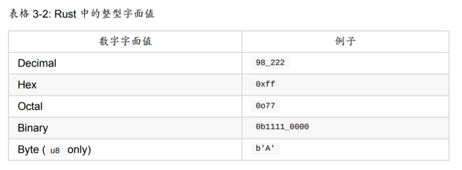

* `printLn!()` 是调用宏, 而不是调用函数, 不过目前还不知道宏是个什么东西...

* 默认情况下, Rust 只为每个程序的作用域提供少量的数据类型, 它们在 prelude 模块中, 即默认只提供 prelude 模块中的一些类型, 如果需要其他类型, 就要引入其他库

* `String` 是字符串类型, 是一个可增长的(应该是指字符串是可变的?) UTF-8 编码的文本, 创建字符串用 `let text = String::new();`, 这里 `new()` 是实例化字符串, 但是 `new` 不是一个关键字, 只是一个普通方法, `::` 表明这是一个静态方法或者说类方法

* `&mut guess` 这样的表达式取得 `guess` 的引用, 应该类似 C++ 的引用? 

* Rust 中对于整数字面量, 默认视为 `i32` 类型, 即有符号的 32 位整型, 除此之外还有 `u32`, `i64` 等类型, 即无符号 32 位整型, 有符号 64 位整型

* `let guess: u32` 表明 `guess` 是一个 32 位无符号整型, 通常不需要声明的时候指定类型, Rust 可以推断出类型

* Rust 的标识符基本上和其他语言差不多, 有一条需要注意就是单独的 `_` 不能作为标识符, 但是 `_a` 这样的是可以的. 如果需要调用 C 库中的函数, 比如 `match()`, 而 `match` 在 Rust 中又是关键字, 则可以使用原始标识符, 原始标识符以 `r#` 开头, `r#match()` 相当于调用了 C 库中的 `match()`

* 通过 `let` 来声明变量, 如 `let foo = 5`, Rust 中, 变量默认是不可变的, 应该是指绑定和值都不可变? 如果需要可变的变量, 需要在变量名之前加上 `mut` 关键字, `let mut foo = 5`

* 通过 `const` 来声明常量, eg. `const MAX_POINTS: u32 = 10000;`

* 一个问题是, 既然不可变变量都已经是不可变的了, 为什么还要叫变量? 又或者 `let a = 5` 和 `const a = 5` 有什么区别? 官方给出了一些[说明](https://doc.rust-lang.org/book/ch03-01-variables-and-mutability.html#differences-between-variables-and-constants)

  * 常量不能使用 `mut` 关键字, 即没有 `const mut a: u32 = 5` 这样的操作
  * 常量使用 `const` 声明而不是 `let`, 并且必须注明类型
  * 常量可以在任何作用域中声明(难道变量不可以?)
  * 常量的值只能是常量表达式(比如字面量这样的), 而不能是运行时计算得到的值, 比如函数调用的结果

  其中第四点最为重要, 它表明了常量是一个编译时计算得到的值, 而不可变变量可以是运行时计算得到的值, 参考[这里](https://www.zhihu.com/question/294321149)

* 隐藏, 可以多次使用 `let` 来声明同一个标识符, 后声明的会覆盖掉(应该也不能叫覆盖, 其实隐藏这个词是最准确的)前面声明的, eg. `let x = 5; let x = x + 1;` 最终 `x` 的值为 6, 不过如果在第一句和第二句之间打印 `x` 的值, 那还是 5. 即在第二个声明之后, 旧的 `x` 被新的 `x` 隐藏了, 有点类似于 JS 中对象属性的遮蔽. 可以认为虽然是同一个标识符, 但是前一个和后一个其实是两个完全不同的东西, 它们没有任何关系, 所以它们的类型不必相同, 所以虽然这看上去像是我们达到了一个修改不可变变量的目的, 但是实际上这是不一样的, 因为前后两个 `x` 的类型可以不一致. 而如果是修改一个可变变量, 则变量的类型始终应当一致


## 数据类型

* Rust 中没一个值都属于某一特定的数据类型, 主要有两类数据类型: 标量(scalar)和复合(compound), 也就是基本类型和复合类型两类

* 通常编译器可以根据值及使用方式自动推导出变量的类型, 但是如果多种类型均有可能的时候, 还是需要声明变量的类型, 即类似这样 `let a: u32 = "5".parse().expect("test")`

* Rust 中有四种标量类型: 整型, 浮点型, 布尔型, 字符型

* 整型有 `i8`, `u8`, `i16`, `u16`, `i32`, `u32`, `i64`, `u64`, `isize`, `usize` 等几种, 其中 `isize` 和 `usize` 和计算机架构有关, 即如果是 32bit 的那它们就是 32bit, 如果是 64bit 的那它们就是 64bit, 整型的字面量表示有以下

  

* 浮点数有 `f32` `f64` 两种类型, 对于字面量, 默认是 `f64`, Rust 是静态强类型的, 所以不能这样 `let a = 5 + 0.3`, 只能 `let a = 5.0 + 0.3`

* 字符, 字符字面量用单引号包裹, 字符串字面量用双引号包裹, 注意字符和字符串不是一个类型, 字符是 `char`, 这点和 C/C++ 类似, `char` 类型代表一个 Unicode 标量值, 一个 Unicode 标量值包含从 `U+0000` 到 `U+D7FF` 和 `U+E000` 到 `U+10FFF` 之间的值

* 布尔值是 `bool`

* Rust 中有两个原始的复合类型: 元组(Tuple)和数组(Array)

* 元组可以理解为一个向量吧, 每个分量的值可以是不同类型, eg. `let tup: (i32, f64, u8) = (500, 6.4, 1)`, 类型注解不是必需的, 获取元组中的值, 可以通过解构赋值 `let (x, y, z) = tup`, 也可以使用索引, `let a = tup.0` 取得第一个值, 索引从 0 开始

* 数组, `let arr = [1, 2, 3, 4]`, 数组在栈上分配空间, 是一块连续内存, 并且每个元素类型必须相同, 并且一旦定义了, 大小就固定了, 这和 C/C++ 一样, 不像 JS 的数组是个链表. 访问数组元素也是通过索引, 不过和元组稍有区别, `let elem = arr[0]`, 数组的类型注解是这样的 `let arr: [i32; 5] = [1, 2, 3, 4, 5]`. 对于访问数组越界, Rust 不会产生编译时错误, 但是会产生一个运行时错误并立即退出, 而不像 C/C++ 允许访问这些内存, 从而避免一些安全问题


## 函数

* Rust 不关心函数定义的位置, 不像 C89 那样

* 定义函数的时候, 函数签名必须声明每个参数的类型, eg. `fn test(a: i32, b: i32) {}`

* Rust 中特别区分语句和表达式, 语句不返回值(或者认为返回空元组 `()`), 表达式返回值. 函数定义是一个语句, 用 `let` 创建变量绑定值的变量声明也是一个语句, 宏调用也是一个表达式, 代码块(`{}`)是一个表达式, 当然, 带分号的肯定也是语句, 这点和其他语言一样. 所以 Rust 中没有连续赋值, 也可以见到如下代码

  ```:new:
  let y = {
      let x = 3;
      x + 1
  };
  // y == 4
  ```

  注意 `x + 1` 后面没有分号, 不然表达式就没有返回值了, 则编译不通过.

* 之所以要刻意强调语句和表达式, 这点在之后的控制流会看到更多

* Rust 中, 函数的返回值默认是函数体中最后一个表达式的值(如果有的话), 如果有返回值, 则函数签名也需要注明返回值的类型, eg. `fn test(arg: i32) -> i32 {5}`, 其中 `-> i32` 表明了返回值的类型. 如果函数没有返回值, 那就不要注明返回值类型, 否则编译不通过


## 控制流

* `if...else` 是一个表达式, 这点和很多语言不同, 也因此 Rust 没有 `a ? b : c` 这样的三元运算符, 你可以直接写 `let a = if n < 3 {0} else {1}` 这样的, 不过因为 Rust 是强类型的, 所以如果将一个 `if...else` 表达式赋值给一个变量, 需要确保 `if...else` 的每个分支返回的值类型都是相同的, Rust 必须在编译时就确定变量的类型

* 需要注意的是 `if...else` 的条件必须是 `bool`, 意味着不能像其他语言那样 `if (obj)` 这样来判断对象是否存在

* 无条件循环使用 `loop {...}`, 代码块中的表达式/语句会无限循环下去直到遇到一个 `break`, `loop {}` 也是一个表达式, 可以通过 `break` 返回该表达式的值. eg.

  ```rust
  let result = loop {
      counter += 1;
      if counter == 10 {
          break counter * 2;
      }
  }
  ```

  最终得到返回值 20

* `while condition {...}` 应该算是语句而不是表达式? 反正拿去赋值会编译错误

* 对于数组的遍历, 推荐使用 `for...in` 而不是 `while`.

  > 如果索引长度不正确，我们可能会导致程序出现 panic。这也使程序更慢，因为编译器添加了运行时代码对每次循环的每个元素执行条件检查。

  `for...in` 不是直接遍历数组, 而是通过迭代器.

  ```rust
  for e in a.iter() {
      ...
  }
  ```

* Rust 中没有三元运算符, 没有 `i++`, 没有连续赋值, 至于为什么这里设计? 参考[这里](https://zhuanlan.zhihu.com/p/21490678)


## 所有权

* Rust 永远也不会自动创建数据的"深拷贝"

* 在栈上的数据, 把一个变量赋值给另一个变量都是拷贝而不是移动, 堆上的数据默认是移动

* > Rust 有一个叫做 Copy trait 的特殊注解，可以用在类似整型这样的存储在栈上的类型上（第
  > 十章详细讲解 trait）。如果一个类型拥有 Copy trait，一个旧的变量在将其赋值给其他变量后
  > 仍然可用。Rust 不允许自身或其任何部分实现了 Drop trait 的类型使用 Copy trait。如果我
  > 们对其值离开作用域时需要特殊处理的类型使用 Copy 注解，将会出现一个编译时错误
  >
  > 那么什么类型是 Copy 的呢？可以查看给定类型的文档来确认，不过作为一个通用的规则，
  > 任何简单标量值的组合可以是 Copy 的，不需要分配内存或某种形式资源的类型是 Copy
  > 的。如下是一些 Copy 的类型：
  > 所有整数类型，比如 u32 。
  > 布尔类型， bool ，它的值是 true 和 false 。
  > 所有浮点数类型，比如 f64 。
  > 字符类型， char 。
  > 元组，当且仅当其包含的类型也都是 Copy 的时候。比如， (i32, i32) 是 Copy 的，
  > 但 (i32, String) 就不是。

* > 将值传递给函数在语义上与给变量赋值相似。向函数传递值可能会移动或者复制，就像赋值
  > 语句一样

* 所有权这部分内容还是需要多看一下...几句话说不清


## 命名约定

* 函数和变量名用下划线连接而不是驼峰命名